# 基于神经网络(PyTorch)的常见水果分类

> 原文：<https://towardsdatascience.com/classification-of-fruit-images-using-neural-networks-pytorch-1d34d49342c7?source=collection_archive---------32----------------------->

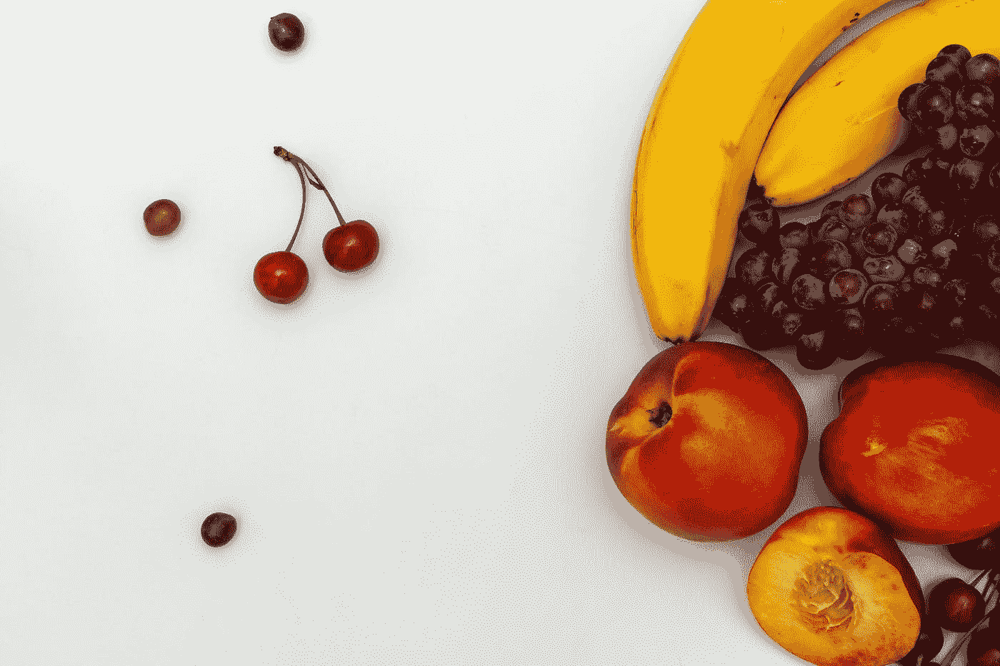

## 一本关于神经网络实现高准确率的易读指南

目的:寻找一种对水果 360 幅图像分类准确率最高的神经网络模型。

1.  深度前馈
2.  卷积神经网络
3.  残差神经网络(ResNet9)

数据来源:【https://www.kaggle.com/moltean/fruits 

全码笔记本:[https://jovian.ml/limyingying2000/fruitsfinal](https://jovian.ai/limyingying2000-qat/fruitsfinal)

# D 数据准备

**首先，让我们了解一下我们的数据集！**

Kaggle Fruits 360 数据集由 131 种不同类型的水果和蔬菜的 90483 张图像组成。

首先，我们导入数据和所需的库来运行我们的代码。

```
import torch
import os
import jovian
import torchvision
import numpy as np
import matplotlib.pyplot as plt
import torch.nn as nn
import torchvision.models as models
import torch.nn.functional as F
from torchvision.datasets import ImageFolder
from torchvision.transforms import ToTensor
from torchvision.utils import make_grid
from torch.utils.data.dataloader import DataLoader
from torch.utils.data import random_split
import torchvision.models as models
%matplotlib inline
```

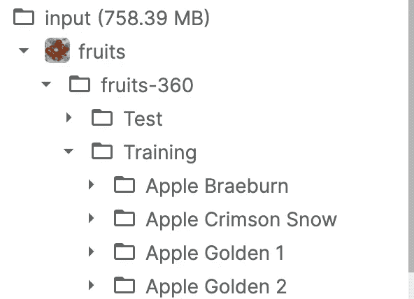

每种水果都有其独特的文件夹，由 jpg 图像组成。

使用 *matplotlib* 库显示彩色图像:

```
import matplotlib.pyplot as plt

def **show_example**(img, label):
    print('Label: ', dataset.classes[label], "("+str(label)+")")
    plt.imshow(img.permute(1, 2, 0))
```

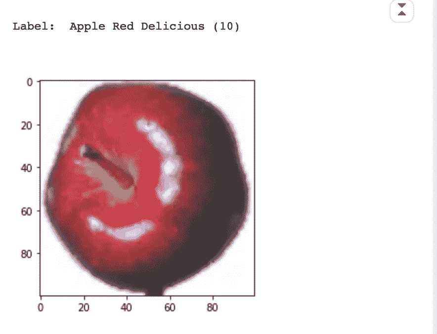

数据集[5000]是一个苹果蛇果

由于我们使用的是 *PyTorch* ，我们必须使用`ToTensor`将上面的像素图像转换成张量:

```
dataset = ImageFolder(data_dir + '/Training', transform=ToTensor())
img, label = dataset[0]
print(img.shape, label) 
img
```

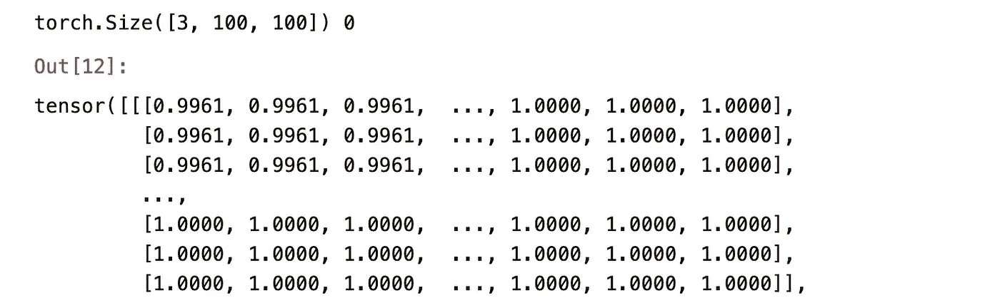

图像转换成张量的一个例子

有 3 个通道(红、绿、蓝)，100*100 图像尺寸。每个值代表相对于通道颜色的颜色强度。

**训练和验证数据集**

接下来，我们将随机分割数据以获得 3 组数据:

1.  训练集:训练模型
2.  验证集:评估模型
3.  测试集:报告模型的最终准确性

训练数据集的大小:57，692

验证数据集的大小:10，000

测试数据集的大小:22，688

**分批培训**

因为我们总共有 57，692 个训练图像，所以在使用`*DataLoader*`训练我们的模型之前，我们应该将我们的图像分成更小的批次。使用较小的数据集可以减少内存空间，从而提高训练速度。

对于我们的数据集，我们将使用 128 的批量大小。

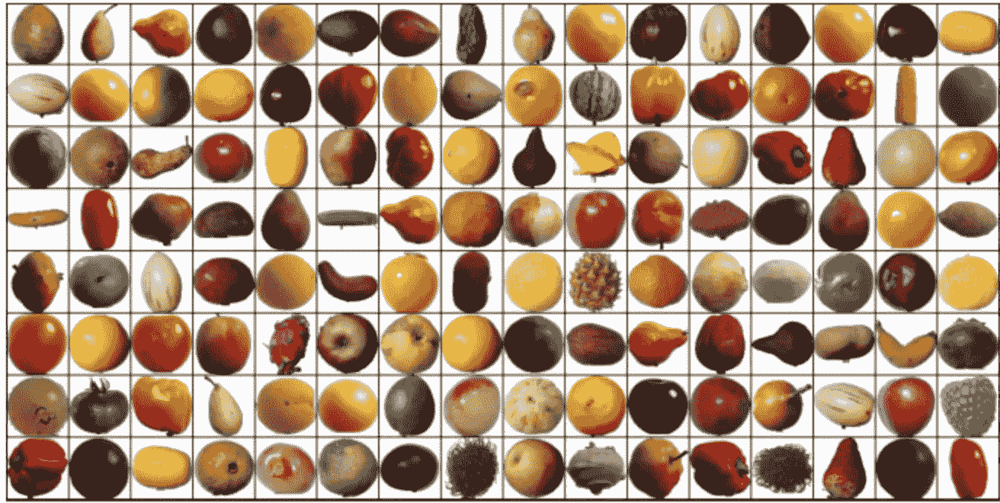

在训练批次中随机分配 128 个图像

现在，我们将开始设计我们的模型。

# 1.深度前馈

**超参数:**

架构:“5 层(2000，1000，500，250，131)”

学习率:[0.01，0.001]

历元数:[10，10]

优化函数:随机梯度下降(SGD)

**用 5 层架构训练模型:**

```
class **FruitsModelFF**(ImageClassificationBase):
    def **__init__**(self):
        super().__init__()
        self.linear1= nn.Linear(input_size, 2000)
        self.linear2= nn.Linear(2000, 1000)
        self.linear3= nn.Linear(1000,500)
        self.linear4= nn.Linear(500,250)
        self.linear5= nn.Linear(250, output_size)

    def **forward**(self, xb):
        *# Flatten images into vectors*
        out = xb.view(xb.size(0), -1)
        *# Apply layers & activation functions* 
        out= self.linear1(out)
        out=F.relu(out)  
        out=self.linear2(out)
        out=F.relu(out)  
        out=self.linear3(out)
        out=F.relu(out)  
        out=self.linear4(out)
        out=F.relu(out)  
        out=self.linear5(out)
        return out
```

训练前，验证准确率为: **0.52734%**

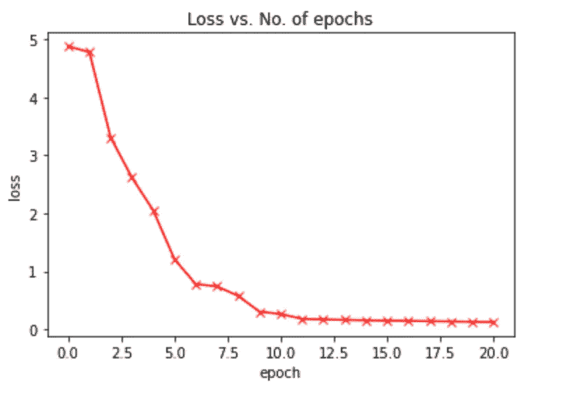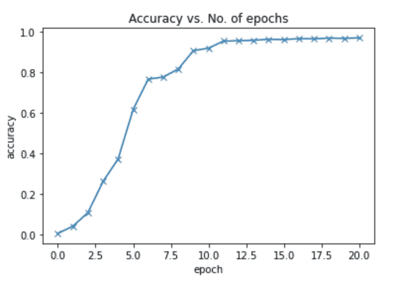

A 在以[0.01，0.001]的学习速率训练了总共 20 个周期后，验证准确率在大约 **96.84%** 处达到平稳状态。这与最初的 0.52734%相比是一个巨大的跳跃。

# 最后，让我们用测试数据集来测试我们训练好的模型！

```
img, label = test[8000]
plt.imshow(img.permute(1, 2, 0))
print('Label:', dataset.classes[label], ', Predicted:', predict_image(img, model))
```

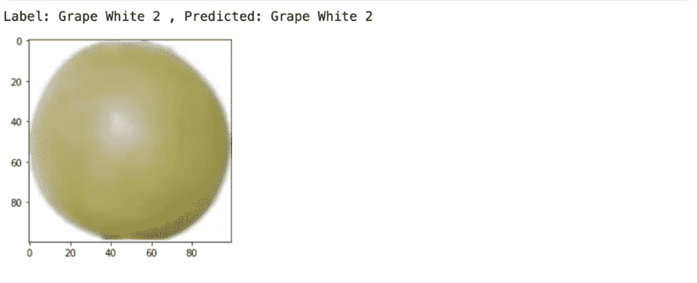

```
img, label = test[1002]
plt.imshow(img.permute(1, 2, 0))
print('Label:', dataset.classes[label], ', Predicted:', predict_image(img, model))
```

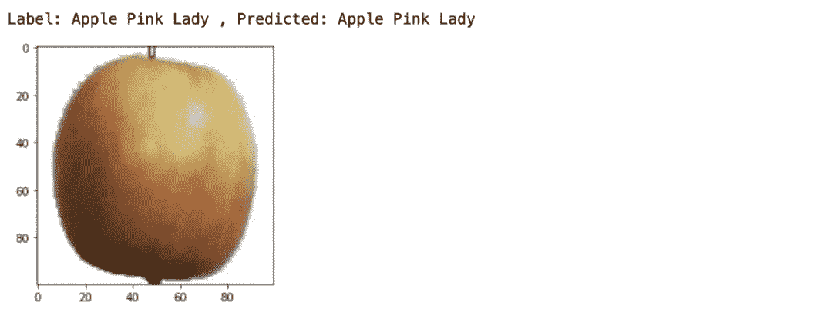

```
img, label = test[0]
plt.imshow(img.permute(1, 2, 0))
print('Label:', dataset.classes[label], ', Predicted:', predict_image(img, model))
```

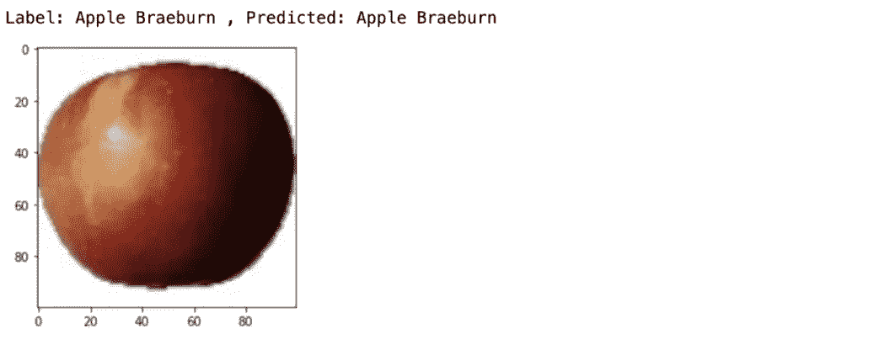

我们训练的模型正确地预测了上述所有结果。

```
**Final test accuracy: 86.209%**
```

为了进一步提高我们的测试精度，我们将使用卷积神经网络，它通常比前馈神经网络性能更好。

> 原因:
> 
> [通过应用相关过滤器，ConvNet 能够**成功捕捉图像中的空间和时间相关性**。由于所涉及的参数数量的减少和权重的可重用性，该架构对图像数据集执行更好的拟合。换句话说，可以训练网络更好地理解图像的复杂程度。](/a-comprehensive-guide-to-convolutional-neural-networks-the-eli5-way-3bd2b1164a53)

简而言之，CNN 非常适合计算密集型的大尺寸图像:

1.  需要更少的参数
2.  形成连接的稀疏性
3.  能够检测相似的模式，并在图像的不同部分应用学到的特征

# **2。简单卷积神经网络(CNN)**

**CNN 功能简介:**


[5*5 图像尺寸，3*3 内核尺寸，3*3 输出尺寸](/intuitively-understanding-convolutions-for-deep-learning-1f6f42faee1)

内核上的权重首先被随机初始化为:

`[0, 1, 2]
[2, 2, 0]
[0, 1, 2]`

我们的示例图像如下所示:

`[3, 3, 2, 1, 0]
[0, 0, 1, 3, 1]
[3, 1, 2, 2, 3]
[2, 0, 0, 2, 2]
[2, 0, 0, 0, 1]`

当我们对样本图像应用内核时，输出将是:

`[12., 12., 17.]
[10., 17., 19.]
[ 9., 6., 14.]`

**申请:**

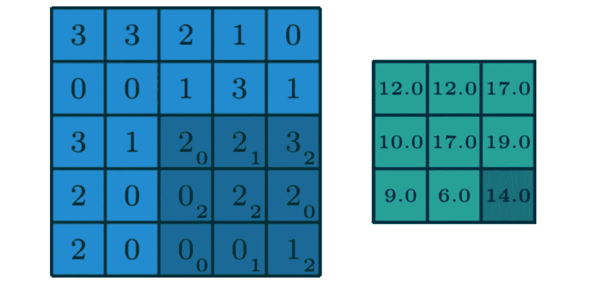

输出= 2 * 0+2 * 1+3 * 2+0 * 2+2 * 2+2 * 0+0 * 0+0 * 1+1 * 2 = 14

对样本图像上内核的每次移动重复计算输出，以获得新的输出大小。

```
def **apply_kernel**(image, kernel):
    ri, ci = image.shape       *# image dimensions*
    rk, ck = kernel.shape      *# kernel dimensions*
    ro, co = ri-rk+1, ci-ck+1  *# output dimensions*
    output = torch.zeros([ro, co])
    for i in range(ro): 
        for j in range(co):
            output[i,j] = torch.sum(image[i:i+rk,j:j+ck] * kernel)
    return output
```

此外，我们通过应用最大池层来逐渐减小每个卷积层的输出张量的大小。

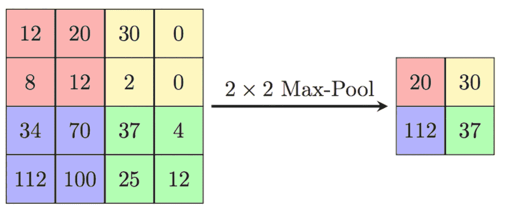

[最大池可视化](/intuitively-understanding-convolutions-for-deep-learning-1f6f42faee1)

如上所述，卷积层增加了通道，而最大池层减少了图像大小。

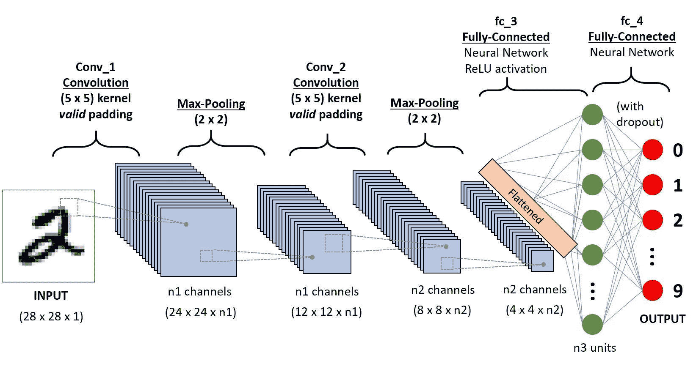

[具有卷积和最大池的 CNN 结构的例子](/a-comprehensive-guide-to-convolutional-neural-networks-the-eli5-way-3bd2b1164a53)

现在，让我们为同一个 Kaggle 水果数据集构建 CNN 模型。

**超参数:**

纪元数量:10

学习率:0.001

优化函数:亚当

```
class **FruitsModel**(ImageClassificationBase):
    def **__init__**(self):
        super().__init__()
        self.network = nn.Sequential(
            nn.Conv2d(3, 32, kernel_size=3, padding=1), *#3 channels to 32 channels*
            nn.ReLU(),
            nn.Conv2d(32, 64, kernel_size=3, stride=1, padding=1),
            nn.ReLU(),
            nn.MaxPool2d(2, 2), *# output: 64 channels x 50 x 50 image size - decrease*

            nn.Conv2d(64, 128, kernel_size=3, stride=1, padding=1),
            nn.ReLU(),
            nn.Conv2d(128, 128, kernel_size=3, stride=1, padding=1), *#can keep the same, increase power of model , go deeper as u add linearity to non-linearity*
            nn.ReLU(),
            nn.MaxPool2d(2, 2), *# output: 128 x 25 x 25*

            nn.Conv2d(128, 256, kernel_size=3, stride=1, padding=1),
            nn.ReLU(),
            nn.Conv2d(256, 256, kernel_size=3, stride=1, padding=1),
            nn.ReLU(),
            nn.MaxPool2d(5, 5), *# output: 256 x 5 x 5*

            nn.Flatten(), *#a single vector 256*5*5,*
            nn.Linear(256*5*5, 1024),
            nn.ReLU(),
            nn.Linear(1024, 512),
            nn.ReLU(),
            nn.Linear(512, 131))

    def **forward**(self, xb):
        return self.network(xb)
```

除了在我们的模型中的改变之外，我们使用 Adam 优化器函数，因为它是在分类问题中寻找最小成本函数的更有效的方式。

```
**Final test accuracy rate: 92.571%**
```

我们已经实现了非常高的最终测试准确率，大约比前馈神经网络高**6**。然而，让我们通过额外的残差块和对 CNN 模型的微小调整来进一步拓展边界。

# **3。**残差神经网络( **ResNet9)**

**超参数:**

最大学习率:0.01

纪元数量:10

优化函数:亚当

```
def **conv_block**(in_channels, out_channels, pool=False):
    layers = [nn.Conv2d(in_channels, out_channels, kernel_size=3, padding=1), 
              nn.BatchNorm2d(out_channels), 
              nn.ReLU(inplace=True)]
    if pool: layers.append(nn.MaxPool2d(2))
    return nn.Sequential(*layers)

class **ResNet9**(ImageClassificationBase):
    def **__init__**(self, in_channels, num_classes):
        super().__init__()

        self.conv1 = conv_block(in_channels, 64)
        self.conv2 = conv_block(64, 128, pool=True)
        self.res1 = nn.Sequential(conv_block(128, 128), conv_block(128, 128))

        self.conv3 = conv_block(128, 256, pool=True)
        self.conv4 = conv_block(256, 512, pool=True)
        self.res2 = nn.Sequential(conv_block(512, 512), conv_block(512, 512))

        self.classifier = nn.Sequential(nn.MaxPool2d(4), 
                                        nn.Flatten(), 
                                        nn.Linear(4608, num_classes))

    def **forward**(self, xb):
        out = self.conv1(xb)
        out = self.conv2(out)
        out = self.res1(out) + out
        out = self.conv3(out)
        out = self.conv4(out)
        out = self.res2(out) + out
        out = self.classifier(out)
        return out
```

除此之外，我们还将引入**“一个周期学习率策略”**，它会逐渐提高学习率，直至达到用户设定的最大学习率，然后逐渐降至极低的学习率。这种学习率的变化发生在每一批训练之后。

很难找到正确的学习速率，因为相对较高的学习速率会导致发散，而相对较低的学习速率会导致模型过拟合。

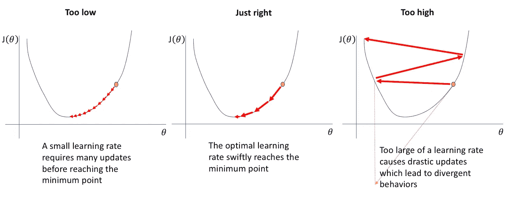

[学习率](https://www.jeremyjordan.me/nn-learning-rate/)

然而,“一个周期学习率策略”通过为我们的模型找到一个最佳学习率范围克服了这样的问题。

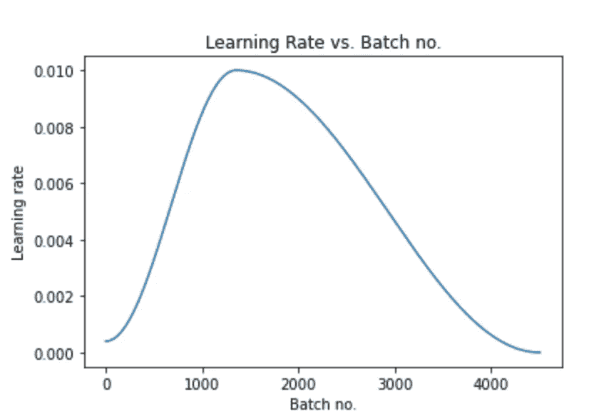

学习率在大约第 1200 批次时达到峰值 0.01

```
**Final test accuracy: 98.85%** 
```

经过一些修改，我们的最终测试精度又提高了**6%。**

# 总结:

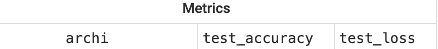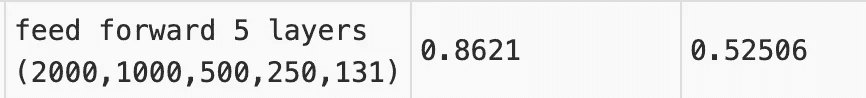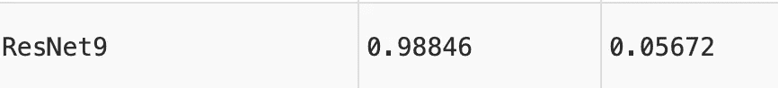

在这 3 个不同的模型中，ResNet9 的测试准确率最高，为 98.85%。

## **未来工作:**

1.  数据转换(数据扩充和标准化)
2.  高级迁移学习

## **演职员表:**

第一张水果照片由[侯塞因](https://unsplash.com/@hugerio?utm_source=medium&utm_medium=referral)在 [Unsplash](https://unsplash.com?utm_source=medium&utm_medium=referral) 上拍摄

第二张水果照片由[布鲁克·拉克](https://unsplash.com/@brookelark?utm_source=medium&utm_medium=referral)在 [Unsplash](https://unsplash.com?utm_source=medium&utm_medium=referral) 上拍摄

课程资料来自[深度学习用 py torch:Zero to GANs&freeCodeCamp](https://jovian.ml/forum/c/pytorch-zero-to-gans/18)

