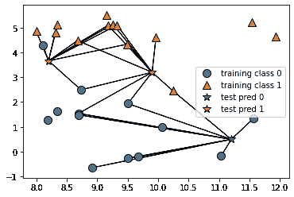

# 基于 KNN 和 SMOTE 的酒店取消分类

> 原文：<https://towardsdatascience.com/classification-of-hotel-cancellations-using-knn-and-smote-3290cc87e74d?source=collection_archive---------40----------------------->

## KNN(K-最近邻)是一种用于分类目的的常用方法。

在此特定示例中，KNN 算法用于根据取消风险对酒店预订进行分类(1 =模型预测客户将取消预订，0 =预测客户不会取消预订)。

假设该数据集是不平衡的，即 0(未消除)比 1(消除)多，则使用合成少数过采样技术(SMOTE)来平衡类，以便应用 KNN 算法。

# SMOTE 过采样技术

鉴于数据集的不均匀性，有必要对次要类进行过采样(1 =取消)，以确保 KNN 结果不会偏向主要类。

这可以通过 SMOTE 过采样技术来实现。

使用 MinMaxScaler 导入和缩放数据后，可以从 imblearn 库中导入 SMOTE。计数器是为了汇总类分布而导入的。

```
import imblearn
print(imblearn.__version__)
from imblearn.over_sampling import SMOTE
from collections import Counter
```

首先，调用训练-测试分割将数据分成训练和验证数据。

```
x1_train, x1_val, y1_train, y1_val = train_test_split(x_scaled, y1, random_state=0)
```

原班级分布由 **0** : 21672， **1** : 8373 组成。

```
>>> counter = Counter(y_train)
>>> print(counter)Counter({0: 21672, 1: 8373})
```

然而，在应用 SMOTE 过采样技术之后，我们现在看到每一类中的观察值的数量是相等的。

```
>>> oversample = SMOTE()
>>> x_train, y_train = oversample.fit_resample(x_train, y_train)
>>> counter = Counter(y_train)
>>> print(counter)Counter({1: 21672, 0: 21672})
```

# 模型性能

该模型配置如下:

```
# KNN
knn = KNeighborsClassifier(n_neighbors=10)
model=knn.fit(x1_train, y1_train)
pred = model.predict(x1_val)
pred
print("Training set score: {:.2f}".format(knn.score(x1_train, y1_train)))
print("Validation set score: {:.2f}".format(knn.score(x1_val, y1_val)))# KNN Plot
mglearn.plots.plot_knn_classification(n_neighbors=10)
plt.show()
```

生成训练和测试集分数:

```
Training set score: 0.88
Validation set score: 0.46
```

以下是 KNN 模型所示的训练课程与测试预测的对比图:



来源:Jupyter 笔记本

以下是根据混淆矩阵对模型性能进行的细分:

```
[[2286 4980]
 [ 440 2309]]
              precision    recall  f1-score   support 0       0.84      0.31      0.46      7266
           1       0.32      0.84      0.46      2749 accuracy                           0.46     10015
   macro avg       0.58      0.58      0.46     10015
weighted avg       0.70      0.46      0.46     10015
```

虽然总体准确率很低，只有 46%，但根据 f1 评分，召回率相当不错，为 84%。

# 精确度与召回率

当处理分类数据时，还必须注意精度与召回读数，而不是简单的整体精度。

```
- Precision = ((True Positive)/(True Positive + False Positive))- Recall = ((True Positive)/(True Positive + False Negative))
```

这两个读数经常相互矛盾，也就是说，通常不可能在不降低召回率的情况下提高精确度，反之亦然。

对理想指标的评估很大程度上取决于所分析的具体数据。例如，癌症检测筛查出现假阴性(即表明患者没有患癌症，而事实上他们患有癌症)是一大禁忌。在这种情况下，召回是理想的衡量标准。

然而，对于电子邮件，人们可能更喜欢避免误报，例如，将一封重要的电子邮件发送到垃圾邮件文件夹，而实际上它是合法的。

f1 分数在设计一个更通用的分数时考虑了精确度和召回率。

哪个因素对预测酒店取消更重要？

从酒店的角度来看，他们可能希望更准确地识别出最终会取消预订的客户，这使得酒店能够更好地分配房间和资源。确定不打算取消预订的客户不一定会增加酒店分析的价值，因为酒店知道，无论如何，很大一部分客户最终都会坚持预订。

# 测试数据

让我们看看当模型对 H2(测试集)进行预测时，结果是什么样的。

在这里，我们可以看到 f1 得分的准确性略微提高到了 52%。

```
[[12569 33659]
 [ 4591 28511]]
              precision    recall  f1-score   support 0       0.73      0.27      0.40     46228
           1       0.46      0.86      0.60     33102 accuracy                           0.52     79330
   macro avg       0.60      0.57      0.50     79330
weighted avg       0.62      0.52      0.48     79330
```

但是，取消类(1)的召回率为 86%。如前所述，精确度和召回率经常相互矛盾，仅仅是因为假阳性倾向于增加召回率，而假阴性倾向于增加精确度。

假设酒店希望最大化召回率(即容忍一定数量的误报，同时识别所有将取消预订的客户)，那么该模型符合该标准。

在所有取消预订的客户中，该模型正确识别了 86%的客户。

# 模型评估

虽然较高的召回率被认为是判断该模型的较好方式，但这不一定以较低的准确性为代价。

如果召回是惩罚假阴性，那么它也有利于假阳性——有太多的假阳性会破坏模型的目的——因为这本质上是假设所有客户都会取消，而事实并非如此。

在这方面，准确性和召回率将理想地最大化。例如，XGBoost 模型展示了 94%的召回率和 55%的 f1 分数准确度——两者都比这个例子中的略高。

# 结论

在本例中，我们研究了如何使用 KNN 作为分类算法，以及在判断模型性能时精确度和召回率的重要性。

非常感谢您的参与，这个例子的相关 GitHub 库可以在[这里](https://github.com/MGCodesandStats/hotel-modelling)找到。

*免责声明:本文是在“原样”的基础上编写的，没有担保。本文旨在提供数据科学概念的概述，不应以任何方式解释为专业建议。*

# 参考

*   [安东尼奥、阿尔梅迪亚和努内斯(2019)。酒店预订需求数据集](https://www.sciencedirect.com/science/article/pii/S2352340918315191)
*   [GitHub 仓库(Msanjayds):交叉验证计算](https://github.com/Msanjayds/Scikit-learn/blob/master/CrossValidation.ipynb)
*   [机器学习掌握:用 Python 对不平衡分类进行 SMOTE 过采样](https://machinelearningmastery.com/smote-oversampling-for-imbalanced-classification/)