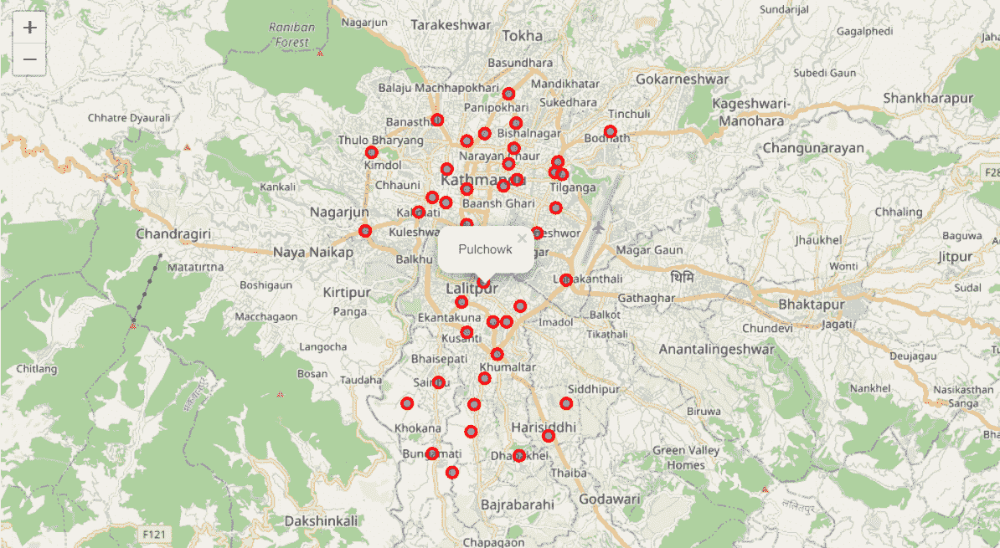
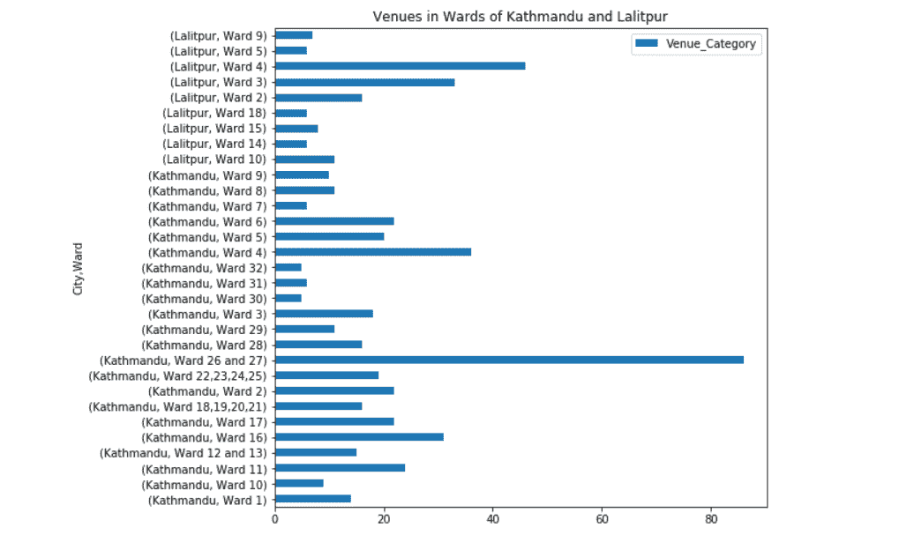
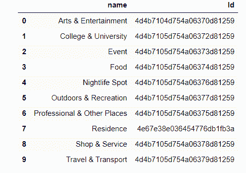
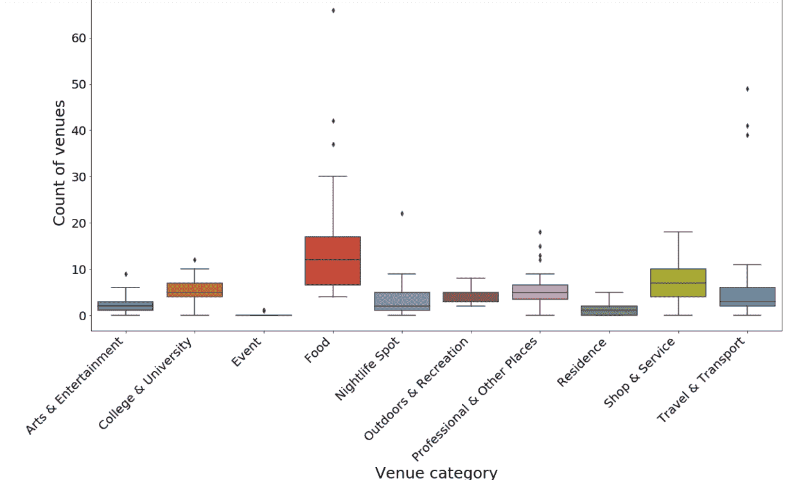
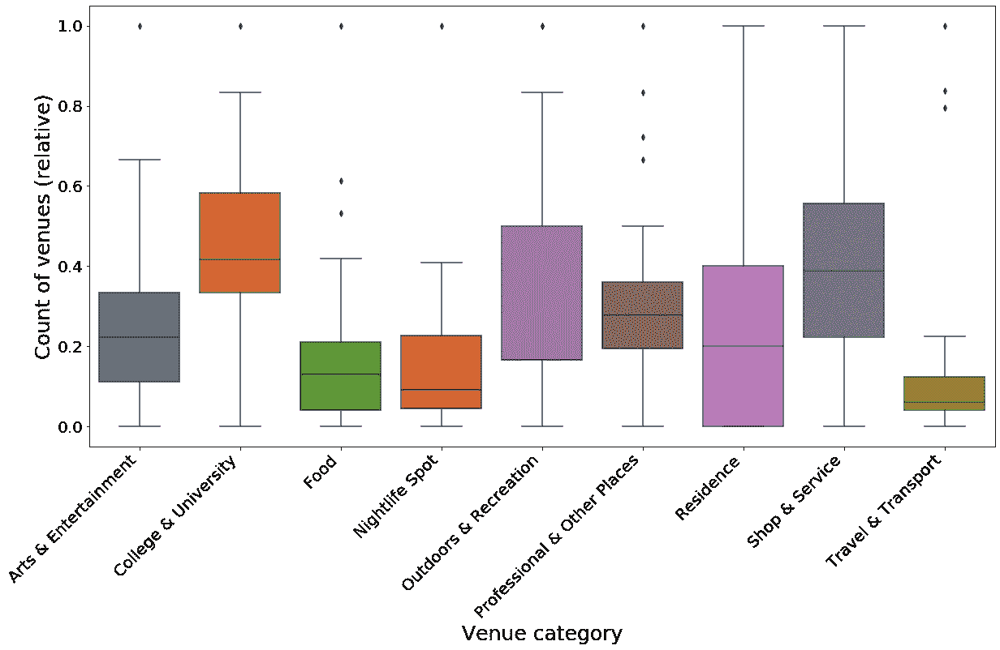
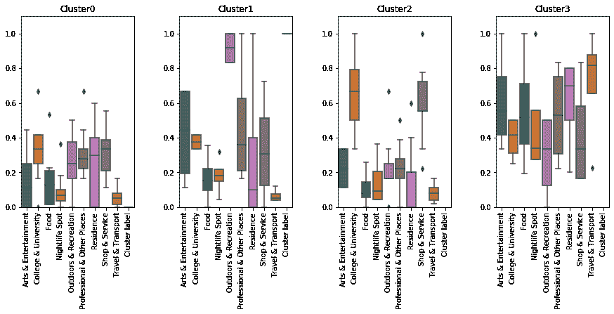
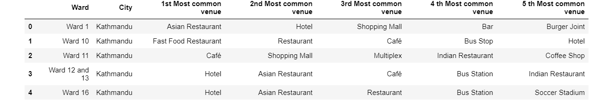
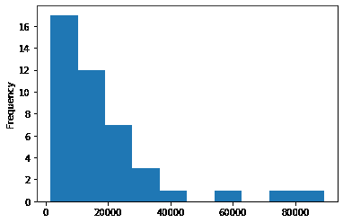
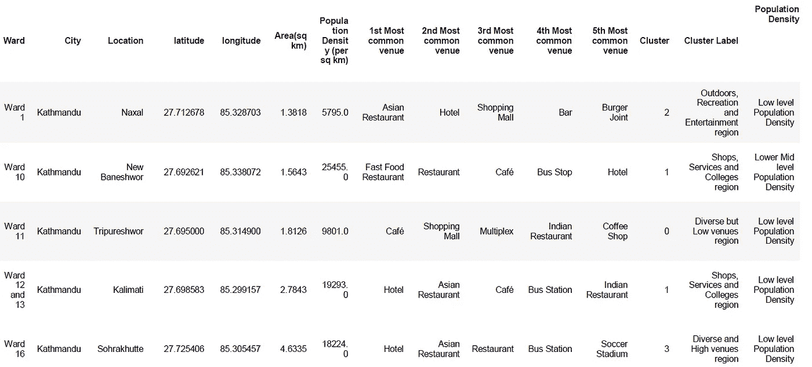
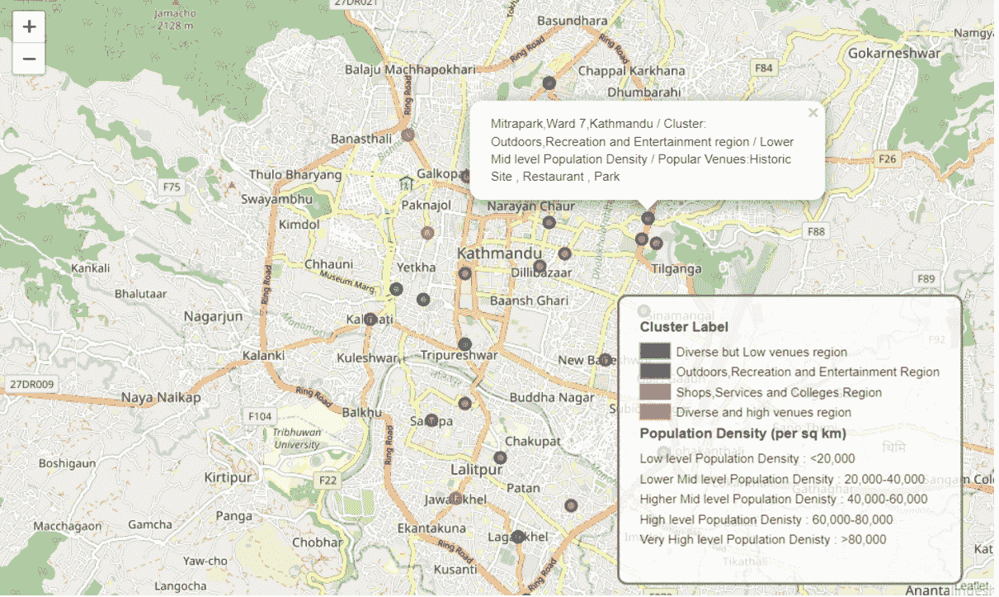

# 使用 Foursquare 数据对加德满都和 Lalitpur 病房进行分类

> 原文：<https://towardsdatascience.com/classification-of-kathmandu-and-lalitpur-wards-using-foursquare-data-60e5672e461e?source=collection_archive---------29----------------------->

# 介绍

加德满都大都市和拉利特普尔大都市是尼泊尔最大的两个城市。虽然是两个不同的城市，但对于这两个城市的居民来说，它们就像一个联合的大城市。每天都有成千上万的人往返于这两个城市之间，这是他们日常生活的一部分。

加德满都市区和拉利特普尔市区分别有 32 个市级选区和 29 个市级选区。对于这个项目，我们想根据病房中的场地对这两个城市的不同病房进行分类。我们的目标是将这两个城市作为一个单一的组合城市来研究，并找出这两个城市的相互反映或作为一个单一单位的选区。

由于人口密集的地区通常更加昂贵和嘈杂，我们也在研究每个病房的人口密度数据。这项研究对于那些想搬到或不得不搬到加德满都或拉利特普尔市的人来说，将是非常有见地的。这种分析将有助于他们根据对场地和人口密度的偏好缩小病房的范围。

# 数据收集

我们需要收集关于加德满都和拉利特普尔市的病房位置、人口密度和面积的数据。

由于我们正在收集两个城市的数据，我们将分别收集每个城市的数据，然后将它们合并为一个数据集。单个城市的数据被废弃，并从其各自的大都市网站提供的数据中收集。几乎所有关于选区、人口和位置的数据都是用尼泊尔语(梵文)提供的，所以我们必须使用谷歌翻译将数据翻译成英语，然后废弃这些数据。

两个城市的官方网站都提供了每个选区总部的位置。我们将使用地理编码器库使用这些位置数据来定位病房的纬度和经度。

使用纬度、经度数据和 four square API 可以获得每个区的场馆细节。

数据来源是:

1.  加德满都病房及其总部的详细信息列表从[1]中删除，各个病房的人口数据从[2]中收集。病房面积数据从本文中导入[3]。
2.  类似地，从[4]中删除了 Lalitpur 病房及其总部位置的列表，并从[5]中收集了各个病房的人口和面积数据。
3.  使用地理编码库获得基于其总部位置的病房的经度和纬度，并使用谷歌地图[6]手动放置缺失值。
4.  从 four square API [7]中收集关于场馆列表、类别、细节和每个病房的数量的数据。

# 方法学

# 数据准备

我们只选择了面积大于 0.5 平方米的病房。合并面积小于 0.5 平方公里的行政区。平方公里及其邻近的选区。这减少了病房的数量，而且如果病房很小的话，很多地点重叠的可能性很高，这可能会影响我们以后的研究。关于加德满都和拉利特普尔的病房位置、面积和人口密度的数据被合并，以获得最终的合并数据集，您可以在这个 [github 链接](https://github.com/jeniscodes/Kathmandu_Lalitpur_Wards/blob/master/Kathmandu%20and%20Lalitpur%20city%20full%20dataset.csv)上访问该数据集。

下面的地图是使用加德满都和拉利特普尔的病房的位置数据创建的。

加德满都和拉利特普尔的地图及其选区办公室位置

可以使用 four square API 收集为每个病房列出的场所，并且选择半径作为从各个病房的区域获得的半径。为了更好地进行分析和数据研究，我们只筛选出那些列出的场馆数量至少为五个的病房。

代表加德满都和拉利特普尔区场馆数量的条形图

大约有 94 个独特的场馆类别。因此，我们决定使用 four square API 提供的 10 个主要分类场馆，而不是子分类场馆。这 10 个分类场地及其各自的 id 是从下面列出的四个广场 API 中获得的。

主场馆类别及其 ID

从每个区的四个广场 API 中获得这十个类别的每个分类场所的数量。下面的方框图描述了这些类别在拉利特普尔和加德满都的分布情况。

代表加德满都和拉利特普尔病房分类场所的箱线图

我们可以观察到，食品在该类别中占主导地位，而商店和服务、户外活动和创作则排在食品之后。由于事件地点没有重要数据，我们删除了事件类别。

我们使用最小-最大比例(1:最高值，0:最低值)对数据进行标准化。这使数据正常化，并使我们更容易解释不同的场馆。缩放后的数据如下图所示。

使加德满都和拉利特普尔区的场馆类别数据正常化

# 使聚集

我们使用 k-means 聚类对加德满都和拉利特普尔的病房进行聚类，以每个病房的分级类别数据为基础。

不同组数(k)的初步结果可以解释如下:

1.k=2:场馆数量多和数量少的集群

2.k=3:学院数量多、场馆数量少的集群，第三个集群难以解释

3.k=4:具有高数量的学院、高数量的户外和娱乐场所的集群，其余两个被分类为高和低数量的场所

4.k=5:难以解释集群。

我们选择第四组的数字进行病房分析，因为它提供了比其他组更详细的见解。

聚类及其分类场所的盒图

我们可以从箱线图中观察到，当将数据分为四个簇时，我们得到以下簇。

1.  集群 0:多样但低的场馆集群
2.  集群 1:户外、创意、艺术和娱乐集群
3.  集群 2:学院、大学、商店和服务集群
4.  集群 3:多样化和高场馆集群

# 五大场馆

我们还对每个区的前五个子场馆类别进行了排名，列出了每个区最受欢迎的场馆。

每个选区的前五个场馆

**标注人口密度**

加德满都和拉利特普尔的人口密度分布

该直方图显示了加德满都和拉利特普尔选区的人口密度分布。

基于这个直方图，我们可以根据人口密度给每个病房贴上以下标签。

1.  > 20，000 =低水平人口密度
2.  20000–40000 =较低的中层 1 人口密度
3.  40，000–60，000=更高的中层 2 人口密度
4.  60，000–80，000 =高水平人口密度
5.  > 80，000 =非常高的人口密度

将我们获得的每个区的所有细节与人口密度标签和聚类标签合并，我们得到以下最终数据集。

加德满都和拉利特普尔的病房及其集群标签、人口密度标签和前五名场馆

最后，我们实现了以下加德满都和拉利特普尔城市的地图。这张地图是用两个城市的不同区标绘的，区标有各自的集群、前三个热门地点和人口密度的信息。

代表加德满都和拉利特普尔区集群、场馆和人口密度的地图

# 结果

根据现有场馆对加德满都和拉利特普尔的不同行政区进行聚类，并在地图上进行绘制，这向我们展示了大多数多样但低矮的场馆区域位于拉利特普尔和加德满都联合城市的郊区，而联合城市的中心以及两个城市的中心由高大的场馆和特定的场馆区域组成。我们可以观察到两个城市在许多镜像地理位置上相互镜像。人口密度让我们进一步了解所谓的住宅和市场情况。

# 讨论

four square 数据确实信息丰富，但并不全面，尤其是对于像尼泊尔这样数字平台使用和可访问性刚刚开始繁荣的国家。我们可以观察到，许多病房在四方 API 中列出的场馆数量很少，这肯定与这些病房中的实际场馆数量不一致。此外，四方场馆数据侧重于类别，不包括场馆的规模。与餐馆相比，公园无疑会吸引更多的人。)

# 结论

我们可以在更大的范围内部署这样的工具，提供更多的功能，如住房率、空气质量率，以更详细地研究我们的城市和其他地区。

不仅对于寻找他们最喜欢的社区的人来说，这种分析也可以极大地有益于城市管理和商业团体等团体。

# 参考

[1] [加德满都病房办公室位置](http://www.kathmandu.gov.np/ne/content/%E0%A4%B9%E0%A4%BE%E0%A4%AE%E0%A5%8D%E0%A4%B0%E0%A4%BE-%E0%A4%95%E0%A4%BE%E0%A4%B0%E0%A5%8D%E0%A4%AF%E0%A4%BE%E0%A4%B2%E0%A4%AF%E0%A4%B9%E0%A4%B0%E0%A5%81)

[2] [加德满都病房简介](http://www.kathmandu.gov.np/ne/ward-profile)

[3] Chhetri，Sachin & Kayastha，P… (2015 年)。尼泊尔加德满都大都市火灾潜在区划绘图的层次分析法(AHP)模型的表现。国际地理信息杂志。4.400–417.10.3390/ijgi4010400。

[4] [拉利特普尔病房办公室](http://lalitpurmun.gov.np/ne/node/82)

[5] [拉利普尔病房详情](http://lalitpurmun.gov.np/en/node/126)

[6] [谷歌地图](https://www.google.com/maps)

[7] [四个正方形](https://foursquare.com/developers/apps)

我想提一下 Stanislav Rogozhin 对莫斯科地铁站所做的类似分析，它给了我很大的帮助，让我清楚地知道如何处理和实施这种分析。你可以在下面的链接中找到关于他的分析的研究文章。

[https://towards data science . com/class ification-of-Moscow-metro-stations-using-four square-data-FB 8 aad 3 E0 e 4](/classification-of-moscow-metro-stations-using-foursquare-data-fb8aad3e0e4)