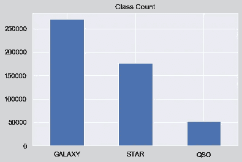
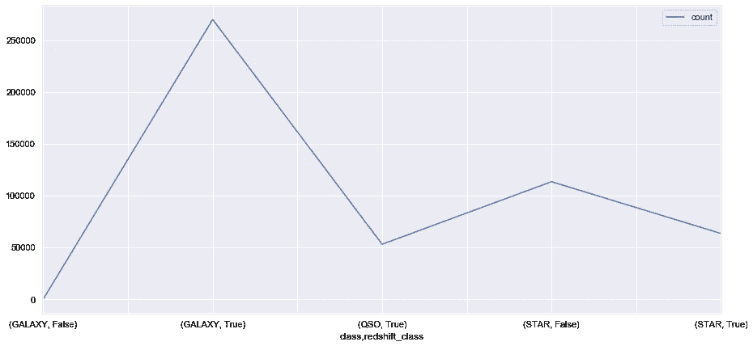
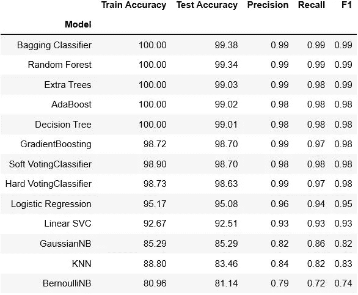
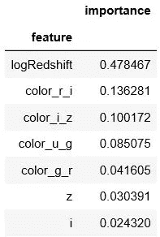
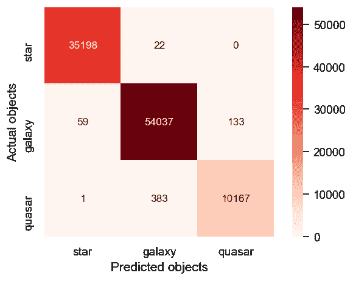

# 基于机器学习的天空物体分类

> 原文：<https://towardsdatascience.com/classification-of-sky-objects-with-machine-learning-be4b05816690?source=collection_archive---------49----------------------->


**图片鸣谢&版权:** [伊万·佩德雷蒂](http://www.thewildlifemoments.com/about/)

# 第一步:问题和背景

分类是你在数据科学领域可能面临的主要项目之一。因此，我们的导师要求我们为第三个个人项目执行一个分类项目。

自从我开始从事数据科学工作以来，我一直想从事天文数据方面的工作。因此，在做了一些研究后，我决定处理 [SDSS](https://www.sdss.org/) 的数据，其中包括关于天空物体及其各种特征的信息。

通过这个项目，我的目标是通过光谱和光度特征对天空物体如恒星、星系和类星体进行分类。SDSS 将这些特性保存在两个不同的表中，所以我不得不借助于一个 [SQL 命令](https://github.com/alpercakr/Classification-of-Astronomical-Objects/blob/master/sql.txt)来合并它们。合并之后，我将这个表添加到我的项目文件夹中。好了，我得到了我的数据，所以是时候研究这个项目的方法了。

# 第二步:数据知识

我之前说过，我的数据集是由两个表组成的；一个是光谱特征，一个是光度特征。

*   **光谱数据**:从物体光谱测得的各种量。例如它的光谱类型或红移。
*   **测光数据**:从物体图像测量的各种量。例如它的亮度、mag、通量或大小。

这个数据集由 22 列和 500000 行组成，没有缺失值。我在目标列中有三个独特的值:星系，恒星和类星体。



我的目标变量的三个等级之间的平衡是 54%星系，35.4%恒星，和 10.6%类星体。因此，我的数据集没有不平衡，在对数据进行一些基本的数据清理和可视化之后，我可以跳到特征工程部分。



目标值的红移情况-真表示红移，假表示蓝移

# 步骤 3:特征工程

我标记了 11 个对构建一个良好的分类模型非常重要的特性。因此，我专注于这些专栏来做特性工程。以下是我为本节选择的功能:

1.  电磁波谱:天体辐射的光的强度。观测波段范围:紫外线(u)、绿色(g)、红色(r)、红外线(I)和 z 波段。
2.  通量密度:从天体表面流出的能量比率。
3.  红移

我从异常值开始。在 I 波段和 z 波段有异常值，所以我用 pandas `clip`方法处理它们。其次，由于我的通量特征范围太广，我也做了一些单位转换。当我收集数据时，通量特征采用纳马吉单位，因此我将它们转换为扬斯基单位(光谱通量密度单位)，1 纳马吉= 3.631 * 10^-6 扬斯基。此外，我做了一个对数转换，以减少红移特性的离群值的影响。

在这些操作之后，我检查了我的特征来进行提取。在这种情况下，我受益于频谱特性来创建新的特性。嗯，有一个特征叫做颜色指数，它定义了天体的颜色。将这个特性添加到我的数据集中太简单了，因为它是由两个光谱范围之间的差异定义的。

```
# Colour Indexes-difference between the two spectrum range
df1['color_u_g'] = df1['u'] - df1['g']
df1['color_g_r'] = df1['g'] - df1['r']
df1['color_r_i'] = df1['r'] - df1['i']
df1['color_i_z'] = df1['i'] - df1['z']
```

因此，在简单的四行代码之后，我设法向我的数据集添加了四个新特性。最后一步，我为将要创建的分类模型编码了目标变量。

# 步骤 4:分类模型

我从探索基本模型开始这一步:KNN、逻辑回归、朴素贝叶斯、线性 SVC 和决策树。在这些模型初始化之后，我开始定义集合模型:

*   Bagging 算法:随机森林、额外树和 Bagging 分类器
*   增强算法:AdaBoost 和 GradientBoosting
*   投票分类器:软和硬

我的方法是，在运行完本节中的所有模型后，选择最佳模型进行优化。因此，我用默认参数运行了所有的模型，以查看结果。



这是我的分类模型的结果。我还在表中添加了测试准确度分数，以确保我的模型中没有过度拟合。可以看出，我定义了所有众所周知的算法来为这个项目的问题选择最合适的模型。

我必须明确指出，现实世界中没有最好的模型。正如乔治 E.P 博克斯曾经说过的:“所有的模型都是错的，但有些是有用的。”你只需要找到对你的问题最有用的模型&数据。



随机森林-特征重要性表:前七个特征

嗯，Bagging 分类器模型是我选择用于进一步工作的模型，因为测试准确度分数。有了 99.38%的准确率，它似乎是我的项目的最佳模型。

# 第五步:改进模型

我跳到了模型评估之后的优化部分。为此，我决定使用`GridSearch`。

```
#specify the parameters to be tested
n_est = [80, 100, 120, 140]
max_features_opt = [0.93, 0.95, 0.97]param_grid = dict(n_estimators = n_est, max_features=max_features_opt)
```

我们可以在确定将由`GridSearchCV`测试的参数后拟合模型。请注意，`GridSearchCV`本身包含了交叉验证，所以我也必须指定`KFold`的值。当拟合过程完成时，我可以检查最佳估计值。

```
kf=KFold(n_splits=10, shuffle=True, random_state=76)bag_grid = GridSearchCV(bag, param_grid, cv = kf, 	scoring='accuracy', n_jobs=-1)
bag_grid.fit(X_train, y_train)
```

并且，根据我从`GridSearch`得到的结果，我重新定义了 Bagging 分类器模型。

```
bag_opt = BaggingClassifier(base_estimator=dtree, n_estimators=120,  max_features=0.93, bootstrap=True, random_state=seed, n_jobs = -1)bag_opt_acc = round(cross_val_score(bag_opt, X_train, y_train, 																																																 cv=kf).mean())bag_opt_std = round(cross_val_score(bag_opt, X_train, y_train, cv=kf).std())
```

# 第六步:结果

在我的最后一步，我进行了保持测试，以查看优化的 Bagging 模型的准确性。我从优化后的模型中得到的结果是 99.44%，因此我实现了大约 0.06%的提高。这不是很多，但我的模型有一个很好的准确性评分。



混淆矩阵

最终结论:

*   从特征重要性表中可以看出，红移和颜色索引是我的分类问题中最有价值的特征。
*   我得到的最好的结果来自集合模型。在这个项目中，朴素贝叶斯和 KNN 模型的精度值相对较小。

好了，暂时就这些了。下一篇文章再见！

另外，如果你想了解更多，也可以看看我的 [Github](https://github.com/alpercakr) 简介！