# 多重测量分类——用更多证据建立信心

> 原文：<https://towardsdatascience.com/classification-with-multiple-measurements-building-confidence-with-more-evidence-779599f25ada?source=collection_archive---------34----------------------->

## 基于朴素贝叶斯假设的贝叶斯方法

如果您熟悉分类问题，那么您可能对训练模型的整个过程并不陌生:分割数据、训练模型、使用 ROC 分析调整模型，最后，将模型发布到现实世界中为您做出预测..

> 如果有超过 1 个数据点来自同一个对象，而你的分类器给你的结果是混合的，该怎么办？或者，即使你的分类器给你一致的结果，你应该对结果有多少信心，因为你的分类器不是 100%准确的(它从来不是，也永远不会是)？

例如，如果您正在构建一个准确率为 85%的 cat 分类器应用程序。一个用户刚刚上传了同一只猫的 5 张照片。

或者你正在为一个时间序列建立一个信号检测分类器。一些异常事件可能偶尔出现，如果不是连续出现的话。

当我们手中有越来越多的数据时，我们如何利用这些测量数据并**建立信心**？

在此之前，我们需要先回顾一些基础知识

# 概率链规则

让我们从两个变量 A 和 b 开始。贝叶斯定理指出

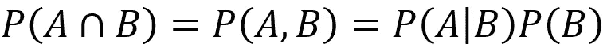

它可以简单地用文氏图表示出来。

然后我们可以再添加一个事件，事件 C:

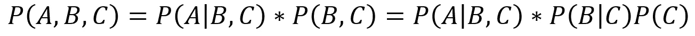

有了这个模式，我们可以将公式推广到 n 个事件:

# 朴素贝叶斯

假设我们要构建一个分类器

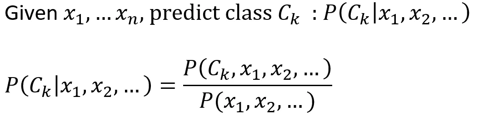

我们可以用链式法则展开右边的分子

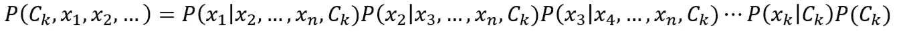

朴素贝叶斯假设条件独立性

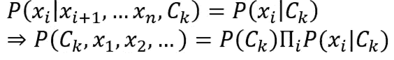

有了朴素贝叶斯假设，我们就有了继续前进所需的东西。

# 利用多个证据做出综合决策

假设我们有 n 个测量值，分类器的输出标记为

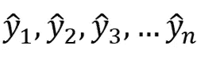

我们试图回答的是**给定 n 测量值**，真实类的概率等于 1。即

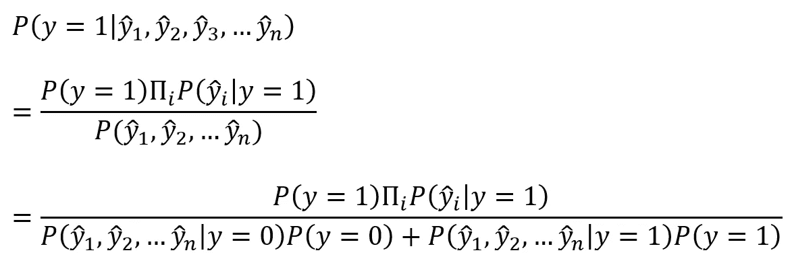

假设在 n 个测量值中，我们的分类器预测其中 n0 个是 0，n1 个是 1。这给了我们最后一个表达式:

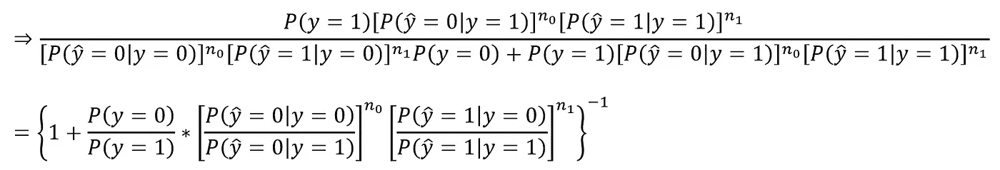

注意，这里出现的所有术语都可以从 ROC 分析中检索到，因此我们可以将这个公式集成到我们现有的监督学习过程中。

# 例子

让我们在公式中加入一些数字，看看它在实际中是如何工作的。以下是数字:

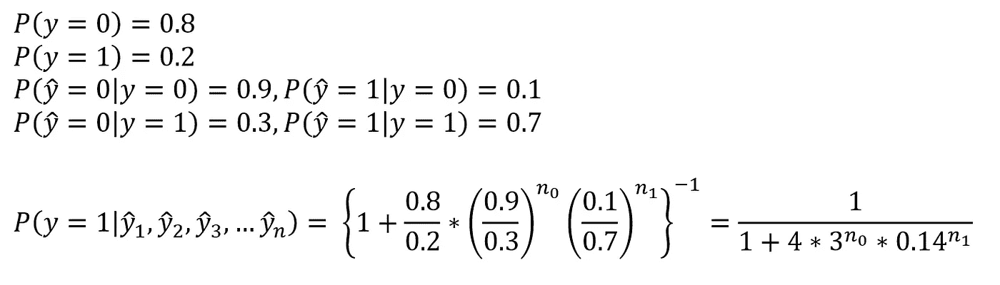

并且聚集预测相对于测量数量的曲线如下所示:

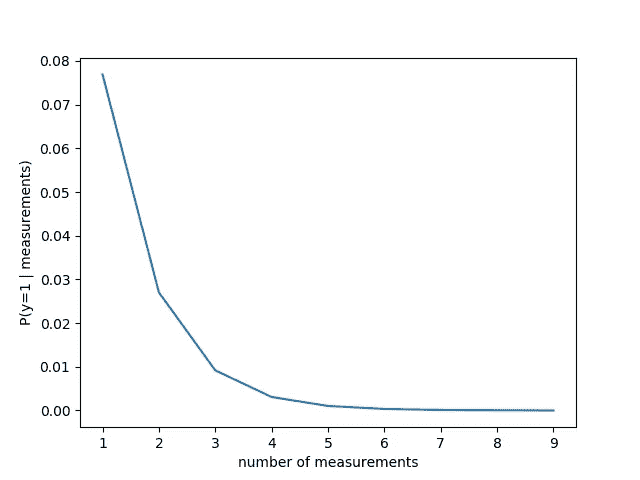

**真类 y=0**

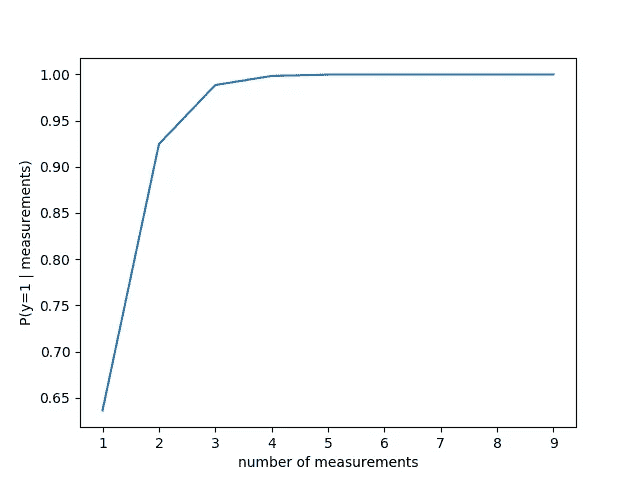

**真类 y=1**

您可以看到，聚合预测对测量结果建立了信心，并最终收敛到正确的预测。

另一个观察结果是，只有一个度量时的预测不如 ROC 度量。这是因为我们考虑了 P(y=0)/P(y=1)的比值。这取决于你的应用来证明这个定量的估计是否准确。然而，当测量的数量增加时，这个比率的影响变小，因为其余的项呈指数增长。