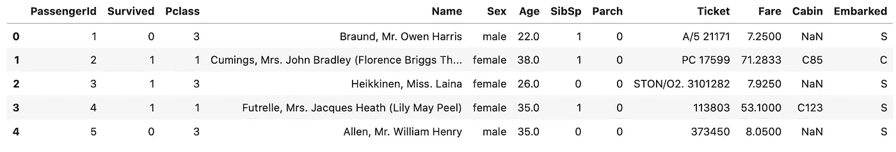
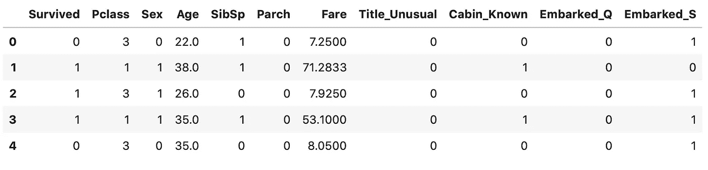
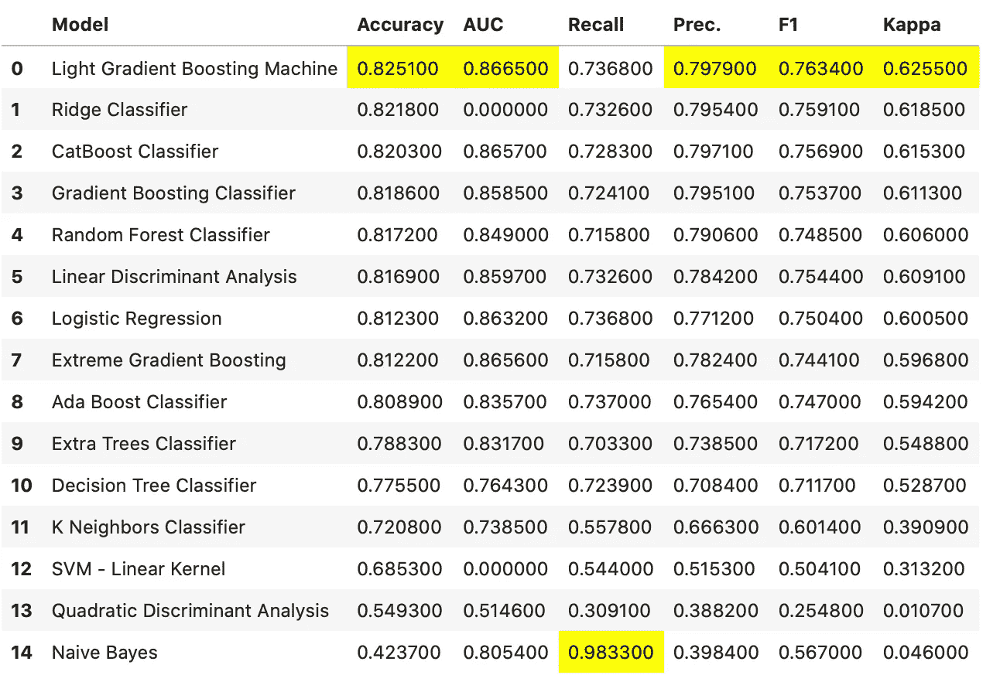
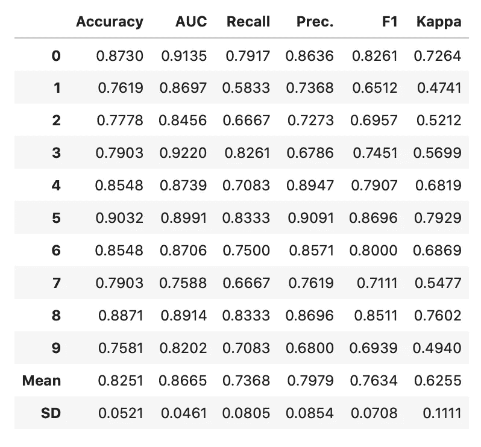
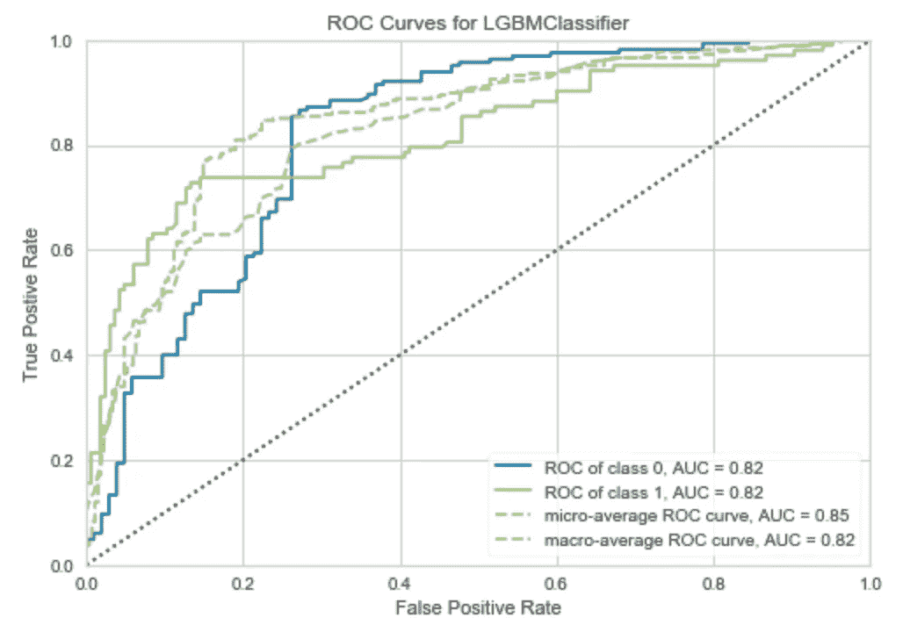
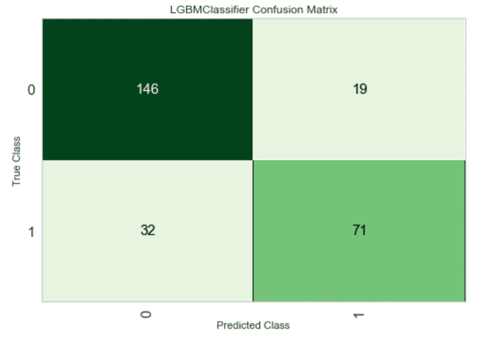
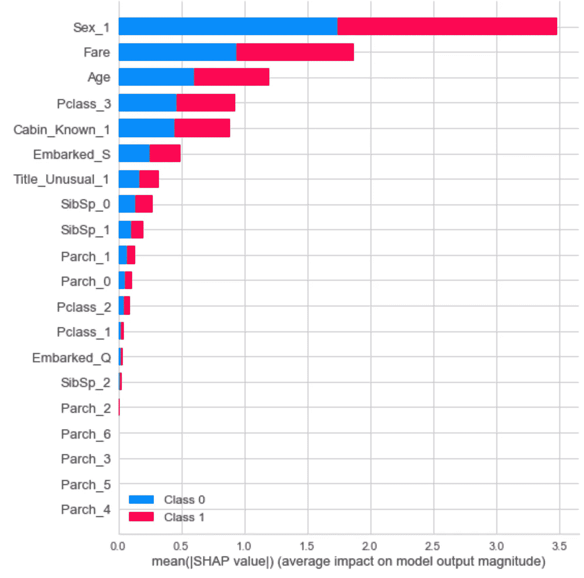
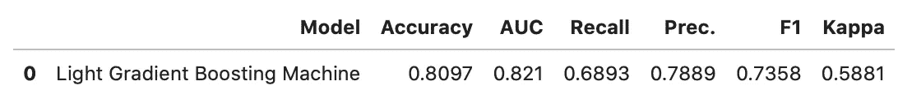

# PyCaret 分类:一个更好的机器学习库

> 原文：<https://towardsdatascience.com/classification-with-pycaret-a-better-machine-learning-library-cff07a10a28c?source=collection_archive---------16----------------------->

## 用 PyCaret 解决分类任务——比你想象的要简单。

几天前，我已经介绍了 PyCaret 库的[基础知识，以及如何使用它来处理](/pycaret-better-machine-learning-with-python-58b202806d1e)[回归任务](/regression-with-pycaret-a-better-machine-learning-library-e02762a0615c)。如果你是新来的， *PyCaret* 是一个低代码的机器学习库，可以为你做一切事情——从型号选择到部署。阅读前两篇文章不是先决条件，但是如果您以前没有使用过这个库，可以随意浏览它们。


奥斯曼·拉纳在 [Unsplash](https://unsplash.com?utm_source=medium&utm_medium=referral) 上拍摄的照片

分类问题是最常见的机器学习问题类型-信息是否是垃圾邮件，客户是否会离开，测试结果是肯定的还是否定的-仅举几个例子。出于这个原因，我们需要知道如何处理分类任务，以及如何轻松地这样做。

如果你更喜欢视频，或者只是想巩固你的知识，请随意观看我们关于这个主题的视频。[源代码](https://github.com/betterdatascience/YouTube/blob/master/0007_PyCaretClassification.ipynb)包括:

对于开发者来说， *PyCaret* 被认为比 *Scikit-Learn* 更好更友好。两者都很棒，不要误会我的意思，但是 *PyCaret* 将为您节省大量时间，否则这些时间将花费在型号选择和微调上。这是这份工作最无趣的部分。

本文假设您熟悉机器学习中的分类概念。您不必是专家，但前提是您知道如何使模型适合其他库中的数据。

这篇文章的结构如下:

1.  数据集概述和清理
2.  模型选择和培训
3.  模型可视化和解释
4.  预测和保存模型
5.  结论

事不宜迟，我们开始吧！

# 数据集概述和清理

在我的大多数基于分类的文章中，我喜欢使用[巨大的数据集](https://raw.githubusercontent.com/datasciencedojo/datasets/master/titanic.csv)。原因有很多，最明显的一个原因是它相当简单，但是对于数据清理和准备来说并不简单。

我们可以直接从 GitHub 加载到*熊猫*中:

```
data = pd.read_csv('https://raw.githubusercontent.com/datasciencedojo/datasets/master/titanic.csv') data.head()
```



现在，我们可以继续进行数据清理了。我想做的是:

*   删除无关栏目(*车票*和*乘客号*
*   将*性别*列重新映射为 0 和 1
*   检查一个乘客是否有一个独特的头衔(如医生)或更普通的头衔(如先生、小姐。)—可以从*名称列*中提取
*   检查舱室信息是否已知——如果*舱室*栏的值不是 *NaN*
*   从*开始的*列创建虚拟变量— 3 个选项
*   用简单平均值填充*年龄*值

这是代码:

```
data.drop(['Ticket', 'PassengerId'], axis=1, inplace=True) gender_mapper = {'male': 0, 'female': 1} 
data['Sex'].replace(gender_mapper, inplace=True) data['Title'] = data['Name'].apply(lambda x: x.split(',')[1].strip().split(' ')[0]) 
data['Title'] = [0 if x in ['Mr.', 'Miss.', 'Mrs.'] else 1 for x in data['Title']] 
data = data.rename(columns={'Title': 'Title_Unusual'}) 
data.drop('Name', axis=1, inplace=True) data['Cabin_Known'] = [0 if str(x) == 'nan' else 1 for x in data['Cabin']] 
data.drop('Cabin', axis=1, inplace=True) emb_dummies = pd.get_dummies(data['Embarked'], drop_first=True, prefix='Embarked') 
data = pd.concat([data, emb_dummies], axis=1) 
data.drop('Embarked', axis=1, inplace=True) data['Age'] = data['Age'].fillna(int(data['Age'].mean()))
```

我鼓励你只是复制代码，因为很容易出现拼写错误，而且你不是来练习数据准备的。数据集现在看起来是这样的:



这个看起来好多了。我们还可以做一些事情，但是今天就到此为止，继续建模吧。

# 模型选择和培训

首先，让我们从 *PyCaret* 库中导入分类模块，并执行一个基本设置:

```
from pycaret.classification import * clf = setup(data, target='Survived', session_id=42)
```

我已经将随机种子设置为 42，因此您可以重现结果。

几秒钟后，您会在屏幕上看到一条成功消息，旁边有一个表格，显示您的数据信息。如果你愿意，可以通读一遍。接下来，我们将比较各种机器学习模型的性能，看看哪种模型总体上做得最好:

```
compare_models()
```

是的，就像函数调用一样简单。执行时间从几秒钟到一分钟不等，因为几个算法都经过交叉验证训练。完成后，您应该会看到下表:



看起来**光梯度增强**方法总体上做得最好，所以我们可以用它来创建我们的模型:

```
model = create_model('lightgbm')
```



您可以通过 *tune_model()* 函数自由地执行额外的超参数调优，但是它并没有提高我的性能。

我们将在下一节进行一些可视化和解释。

# 模型可视化和解释

首先，让我们看看 *plot_model()* 函数提供了什么:

```
plot_model(model)
```



ROC(受试者操作特征)曲线下的面积告诉我们该模型在区分类别方面有多好——预测存活为存活，预测死亡为死亡。

如果这仍然不能像你希望的那样很好地解释，下面是绘制混淆矩阵的方法:

```
plot_model(model, 'confusion_matrix')
```



如果我们考虑到建造它的容易程度，这个模型实际上是相当不错的。接下来，让我们用 SHAP 值来解释我们的模型。

SHAP，或*沙普利附加解释，*是一种解释机器学习模型输出的方式。通过绘制每个样本的每个特征的 SHAP 值，我们可以使用它来查看哪些特征最重要。



太好了！现在让我们对测试集进行最终评估，并将模型保存到一个文件中。

# 预测和保存模型

一旦我们对模型的表现感到满意，我们就可以在测试集(以前看不到的数据)上对它进行评估:

```
predictions = predict_model(model)
```



当我们调用本文开头的 *setup()* 函数时， *PyCaret* 以 70:30 的比例执行了训练/测试拆分。当然，这个比例是可以改变的，但是我对默认值很满意。

测试集上的结果有点糟糕，但这是意料之中的。在将模型保存到文件之前，我们需要完成它:

```
finalize_model(model)
```

现在可以保存模型了:

```
save_model(model, 'titanic_lgbm')
```

模型现在保存在笔记本所在的文件夹中。要在以后加载它，您可以使用 *load_model()* 函数，并将文件路径作为参数。

# 结论

我希望您已经跟上了，在数据准备上花了更多的时间，并最终得到了一个更好的模型。PyCaret 确实为我们做了很多事情，所以我们可以把时间花在更重要的事情上。

还有更多的东西需要探索，而且很快就会到来。感谢阅读。

加入我的私人邮件列表，获取更多有用的见解。

*喜欢这篇文章吗？成为* [*中等会员*](https://medium.com/@radecicdario/membership) *继续无限制学习。如果你使用下面的链接，我会收到你的一部分会员费，不需要你额外付费。*

[](https://medium.com/@radecicdario/membership) [## 通过我的推荐链接加入 Medium-Dario rade ci

### 作为一个媒体会员，你的会员费的一部分会给你阅读的作家，你可以完全接触到每一个故事…

medium.com](https://medium.com/@radecicdario/membership) 

*原载于 2020 年 7 月 18 日 https://betterdatascience.com**T21*[。](https://betterdatascience.com/pycaret-classification/)