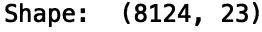
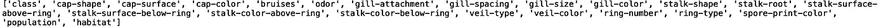
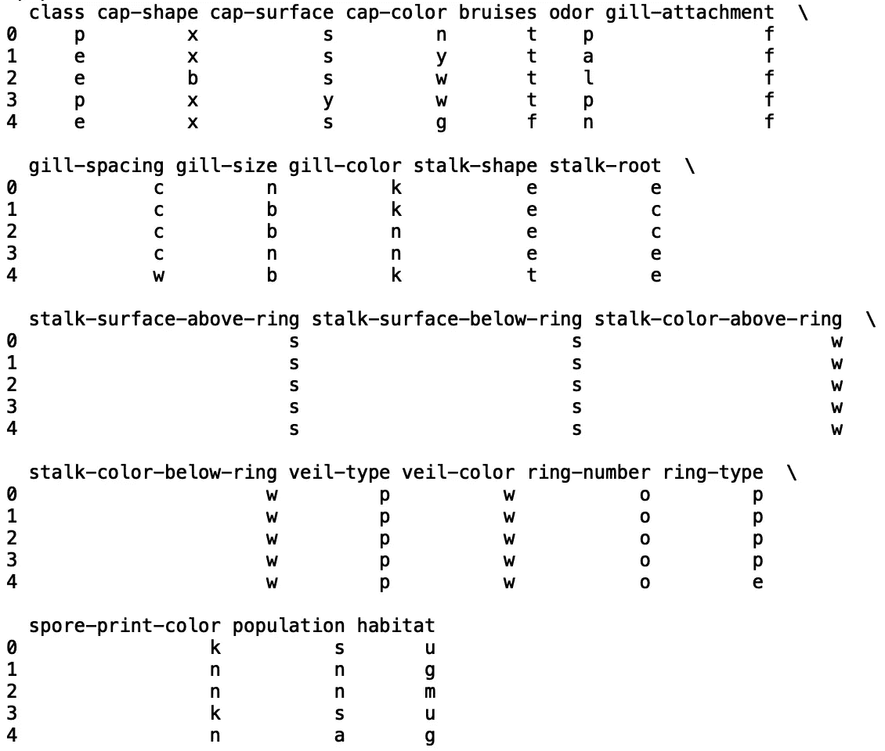
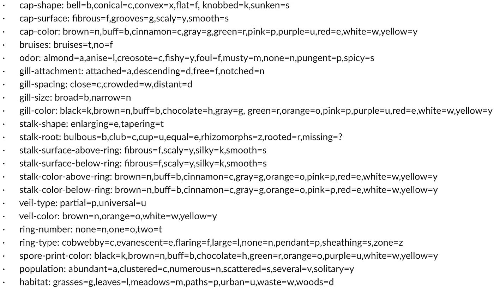
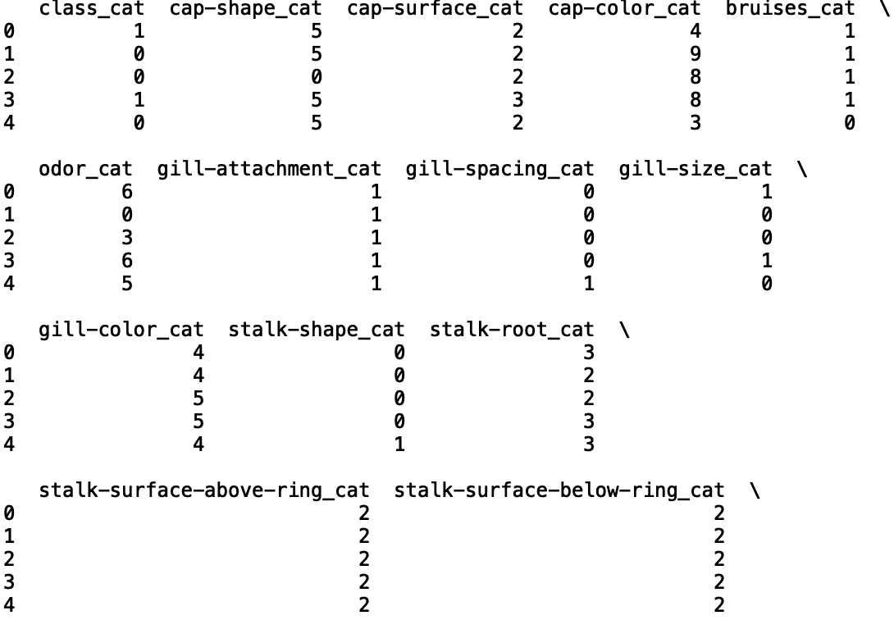
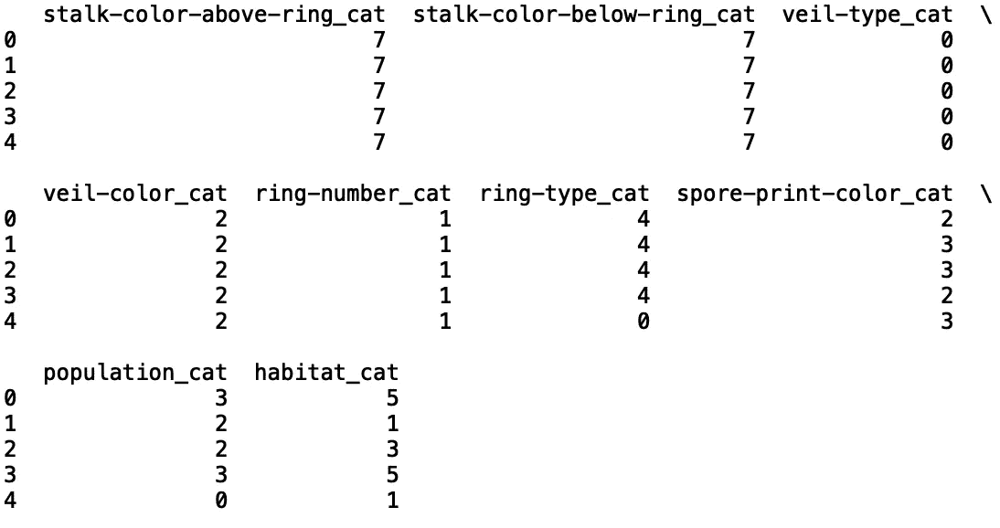
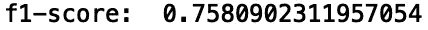
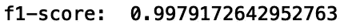

# Python 中的随机森林分类

> 原文：<https://towardsdatascience.com/classification-with-random-forests-in-python-29b8381680ed?source=collection_archive---------24----------------------->

## 随机森林分类模型


[来源](https://www.pexels.com/photo/nature-forest-trees-fog-4827/)

随机森林算法是一种机器学习方法，可用于监督学习任务，如分类和回归。该算法通过构建一组在随机特征子集上训练的决策树来工作。在分类的情况下，随机森林模型的输出是决策树中预测类的模式。在本帖中，我们将讨论如何在 python 中为分类任务构建随机森林模型。

我们开始吧！

## 随机森林分类

对于我们的分类任务，我们将使用*蘑菇分类*数据集，可以在[这里](https://www.kaggle.com/uciml/mushroom-classification)找到。我们将对一个二元目标进行预测，该目标指定蘑菇是有毒的还是可食用的。

首先，让我们导入 pandas 库并将我们的数据读入数据框:

```
import pandas as pd 
df = pd.read_csv("mushrooms.csv")
```

让我们打印数据框的形状:

```
print("Shape: ", df.shape)
```



接下来，让我们打印数据框中的列:

```
print(df.columns)
```



现在让我们也来看看前五行的数据。head()'方法:

```
print(df.head())
```



属性信息如下



[来源](https://www.kaggle.com/uciml/mushroom-classification)

我们将预测蘑菇的类别，其中可能的类别值为“e”表示可食用,“p”表示有毒。接下来我们将把每一列转换成机器可读的分类变量:

```
df_cat = pd.DataFrame()
for i in list(df.columns):
    df_cat['{}_cat'.format(i)] = df[i].astype('category').copy()
    df_cat['{}_cat'.format(i)] = df_cat['{}_cat'.format(i)].cat.codes
```

让我们打印结果数据框的前五行:

```
print(df_cat.head())
```



接下来，让我们定义我们的功能和目标:

```
X = df_cat.drop('class_cat', axis = 1)
y = df_cat['class_cat']
```

现在让我们从“sklearn”导入随机森林分类器:

```
from sklearn.ensemble import RandomForestClassifier
```

接下来，我们从‘sk learn’中的型号选择模块导入‘KFold’。我们将“折叠”以验证我们的模型。此外，我们将使用 f1 分数作为我们的准确度指标，它是准确度和召回率的调和平均值。让我们也用两次分割初始化“KFold”对象。最后，我们将初始化一个列表，我们将使用它来附加我们的 f1 分数:

```
from sklearn.model_selection import KFold
kf = KFold(n_splits=2, random_state = 42)
results = []
```

接下来，让我们迭代数据中的索引，并拆分数据用于训练和测试:

```
for train_index, test_index in kf.split(X):
     X_train, X_test = X[train_index], X[test_index]
     y_train, y_test = y[train_index], y[test_index]
```

在 for-loop 中，我们将定义随机森林模型对象，适合不同的训练数据折叠，预测相应的测试数据折叠，评估每次测试运行的 f1 分数，并将 f1 分数附加到我们的“结果”列表中。我们的模型将使用 100 个估计器，对应于 100 个决策树:

```
for train_index, test_index in kf.split(X):
     ...
     model = RandomForestClassifier(n_estimators = 100, random_state = 24)
     model.fit(X_train, y_train)
     y_pred = model.predict(X_test)
     results.append(f1_score(y_test, y_pred))
```

最后，让我们打印模型的平均性能:

```
print("Accuracy: ", np.mean(results))
```



如果我们将拆分数量增加到 5，则我们有:

```
kf = KFold(n_splits=3)
...
print("Accuracy: ", np.mean(results))
```



我就讲到这里，但是我鼓励你自己动手处理数据和编写代码。

## 结论

总之，在这篇文章中，我们讨论了如何用 python 训练一个随机森林分类模型。我们展示了如何将分类特征值转换成机器可读的分类值。此外，我们还展示了如何分割用于训练和测试的数据，初始化我们的随机森林模型对象，使其适合我们的训练数据，以及测量我们的模型的性能。我希望你觉得这篇文章有用/有趣。这篇文章中的代码可以在 [GitHub](https://github.com/spierre91/medium_code/blob/master/machine_learning/rf_classification.py) 上找到。感谢您的阅读！