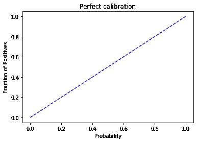
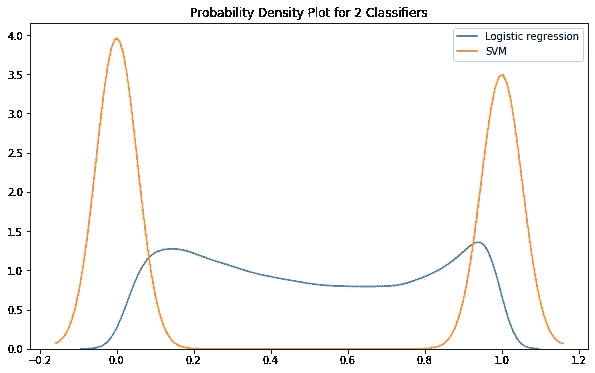
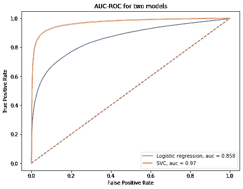
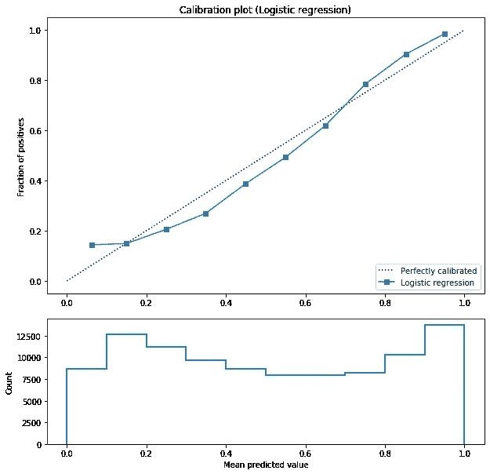
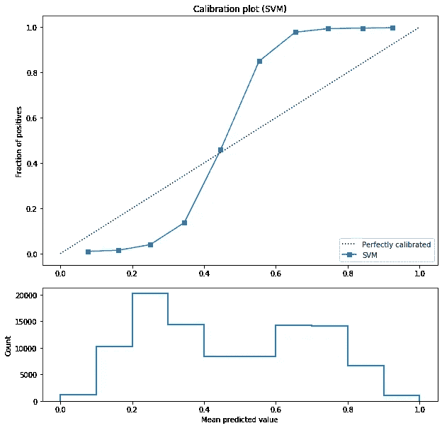
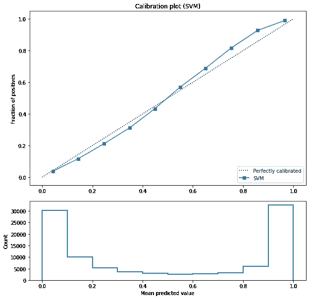
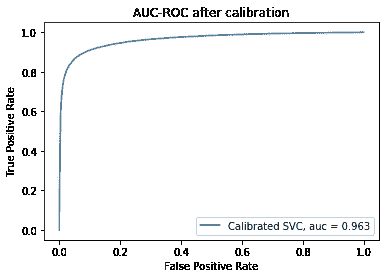

# 分类器校准

> 原文：<https://towardsdatascience.com/classifier-calibration-7d0be1e05452?source=collection_archive---------2----------------------->

## 分类任务模型校准的原因、时间和方式。

Christophe Hautier 在 [Unsplash](https://unsplash.com/s/photos/balance?utm_source=unsplash&utm_medium=referral&utm_content=creditCopyText) 上拍摄的照片

当处理分类问题时，仅收集测试集上的预测是远远不够的；我们通常会带着某种程度的自信来赞美他们。为此，我们利用关联概率，即由分类器计算的可能性，它指定了每个样本的类别。但这总是反映现实吗？如果不是，我们怎么知道？

> [学习率](https://www.dimpo.me/newsletter)是我每周给那些对 AI 和 MLOps 世界好奇的人发的简讯。你会在每周五收到我关于最新人工智能新闻、研究、回购和书籍的更新和想法。在这里订阅！

# 介绍

假设我们有两个二元分类器；型号`A`和型号`B`。模型`A`的每一次预测都有 85%的准确率和 0.86 的置信度。另一方面，模型`B`也有 85%的准确性，但对其每个预测的置信度为 0.99。你觉得哪个型号比较好？

在这个故事中，我会试着让你相信`A`模式更好。模型`A`认为自己在 86%的时间里都是精确的，事实上，差不多就是这样。相反，model `B`对自己的预测过于自信。这个玩具示例展示了概率和模型校准背后的直觉。

模型校准指的是这样一个过程，其中我们采用一个已经训练好的模型，并应用一个后处理操作，这改进了它的概率估计。**因此，如果我们以 0.85 的概率检查估计为阳性的样本，我们预计其中 85%实际上是阳性的。**

> 从形式上来说，如果对于任何概率值`p`，一个类的预测有信心`p`在 90%的时间里是正确的`100*p`，那么这个模型就是完美校准的。

现在，因为如果你试图将一幅图像可视化并绘制出`p`的每一个值，那么在从`0`到`1`的时间间隔内，一幅图像就抵得上千言万语，所以我们期望在计算出的概率和阳性分数之间得到一个完美的线性关系。

校准完美的分类器

在接下来的章节中，我们将了解校准分类器的原因、时间和方法。

# 为什么模型校准很重要？

只有当您关心模型计算的概率时，模型校准才是重要的。例如，假设您正在构建一个推荐引擎，它根据用户偏好对产品进行排序。如果您的模型估计用户`u`将以 0.9 的概率购买产品`a`，以 0.7 的概率购买商品`b`，那么您可以先提供产品`a`。不需要校准那个模型。

然而，如果您正在构建一个计算一个人生病的概率的关键任务应用程序，那么实际的概率值是非常重要的。例如，如果你的模型对一个特定的病人不那么有信心，人类医生当然应该知道这一点并采取相应的行动。

模型校准还有其他有用的情况:

*   *调试:*我们想知道什么时候我们的模型是高置信度错误的，或者把低概率分配给正确的类
*   *集合:*如果我们想要组合许多概率模型，拥有准确的预测是很重要的

# 如何检查你的模型

到目前为止，我们已经了解了什么是模型校准，以及为什么它在某些情况下很重要。但是我们如何检查我们的分类器是否被校准了呢？

最好的方法是用我们自己的眼睛去看。在这个实验中，我们使用 scikit-learn 提供的“make_classification”辅助方法创建了一个用于分类的随机数据集。

接下来，我们实例化两个分类器进行比较；一个简单的逻辑回归模型和一个由 scikit-learn 提供的支持向量机实现。

最后，我们将分类器拟合到我们的训练数据，并计算我们对测试数据集的预测。特别是对于 SVM，要获得正类的概率，我们需要知道决策函数如何分离测试样本，并将结果归一化为介于“0”和“1”之间。

现在让我们为两个分类器绘制`Kernel Density Estimation`。

逻辑回归 Vs SVM KDE 图

正如我们所料，我们从逻辑回归得到的结果是从`0`扩散到`1`，而 SVM 预测正好是`0`或`1`。接下来，让我们检查两个二元分类器的 AUC-ROC 曲线，但是这次使用我们为 SVM 计算的概率。

逻辑回归与 SVM 曲线

我们可以看到，SVM 在这个数据集上几乎是完美的。但是精度和校准完全是两码事。我们可以有一个完全精确的模型，根本没有校准，另一方面，一个不比随机模型好的模型，尽管如此，也是完全校准的。那么，我们如何检查呢？

第一步是获取所有预测并将它们分组到箱中。我们将根据模型做出的概率估计对它们进行分组。接下来，我们计算每个箱的阳性分数，最后计算每个箱的平均置信度，这就是属于该箱的样本的概率估计的平均值。如果我们将平均值与每个箱中阳性部分相对照，我们就得到可靠性图。我们希望该图类似于我们在开始时看到的线性图。

为了绘制每个分类器的校准曲线，我们定义了如下所示的效用函数。

我们现在准备绘制每个模型的校准曲线。让我们从逻辑回归开始。

逻辑回归的校准图

看起来相当不错。我们为 SVM 做同样的事情。

SVM 校准图

很明显，SVM 模型远未校准。当它预测样本不属于正类时，我们可以说它是信心不足，否则就是过于自信。那么，我们该如何解决这个问题呢？

# 校准模型

校准机器学习模型的两种最流行的方法是`isotonic`和`Platt's`方法。

`Scikit-learn`通过`CalibratedClassifierCV`类提供校准模型的基本估计器。对于这个例子，我们将使用`Platt's`方法，这相当于将类的构造函数中的`method`参数设置为`sigmoid`。如果你想使用`isotonic`方法，你可以传递它。

校准的 SVM 分类器

SVM 分类器的结果令人印象深刻地不同。现在我们有一个校准的 SVM 分类器。请注意，如果您在 SVM 分类器上调用`predict_proba`方法，结果已经通过`Platt's`方法进行了校准(参见此处的)。你可以自己试试。

此外，请记住，校准后模型的准确性可能会降低。例如，AUC-ROC 曲线现在是 0.963。因此，我们可以看到，在某些情况下，我们可能需要在精度和校准之间进行权衡。您也可以随时检查其他指标(如精确度、召回率、F1 分数等。).

校准后的 AUC-ROC 曲线

# 结论

在这个故事中，我们研究了什么是模型校准，为什么以及何时使用它，如何检查您的分类器是否校准，以及如果没有校准，如何潜在地修复它。

最后，我想给出一个经验法则，关于是否使用*普氏标度*的*等张回归*。等张回归不做 sigmoid 假设，因此，它可能更适合大量情况。另一方面，它更容易过度拟合。因此，如果我们有一个小数据集， *Platt 的缩放*可能会更好。

> **我叫 Dimitris Poulopoulos，是希腊比雷埃夫斯大学***[**BigDataStack**](https://bigdatastack.eu/)***的机器学习研究员和博士(c)。我曾为欧洲委员会、欧盟统计局、国际货币基金组织、欧洲中央银行、经合组织和宜家等主要客户设计和实施人工智能和软件解决方案。如果你有兴趣看更多关于机器学习、深度学习、数据科学的帖子，在 twitter 上关注我*** *[**中**](https://medium.com/@dpoulopoulos) **、**[**LinkedIn**](https://www.linkedin.com/in/dpoulopoulos/)**或**[**@ james2pl**](https://twitter.com/james2pl)**。****