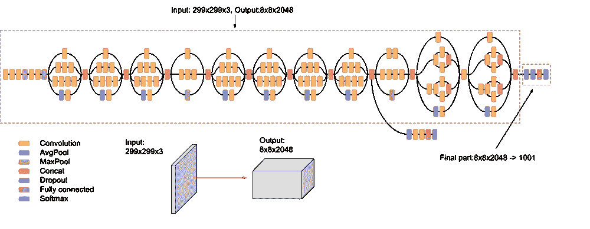
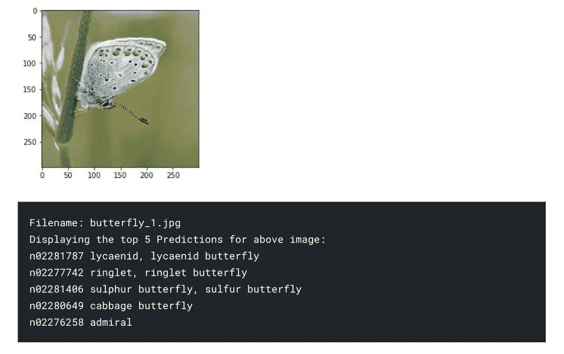
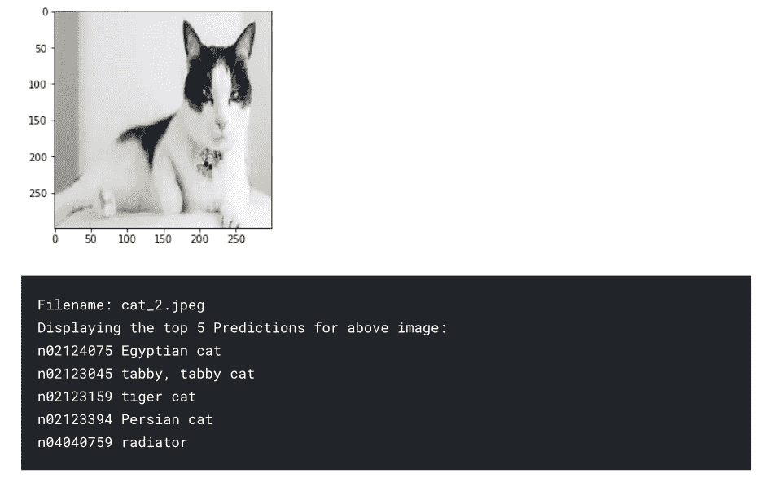
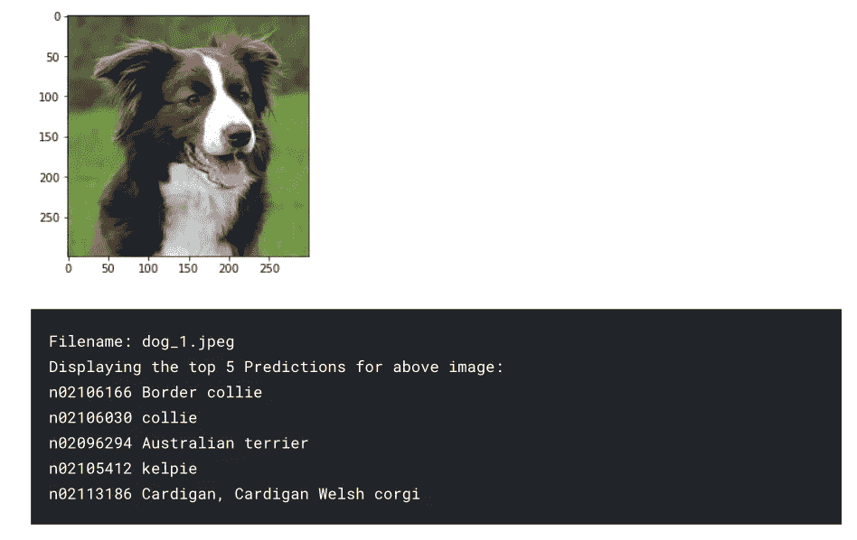
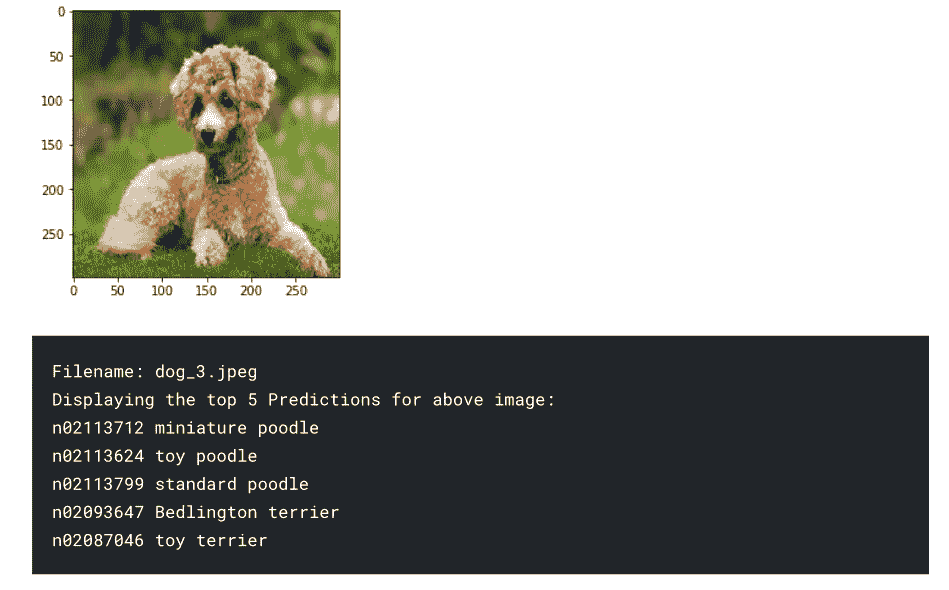
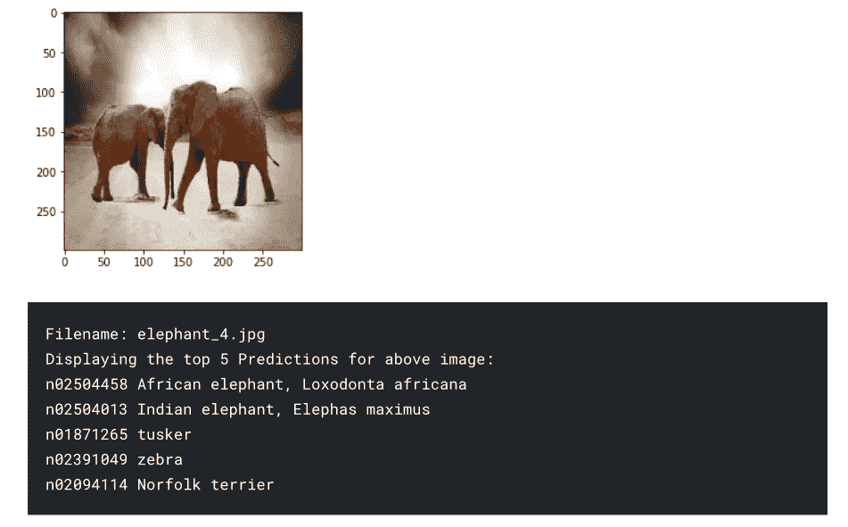
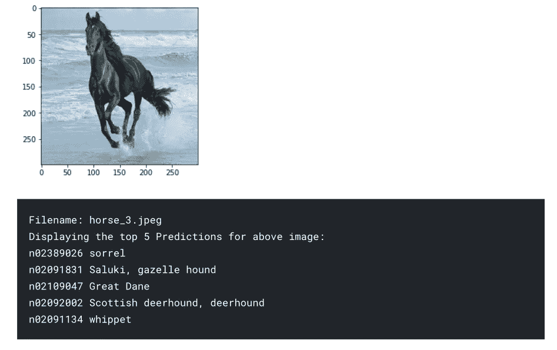

# 使用预先训练的 CNN 模型对任何对象进行分类

> 原文：<https://towardsdatascience.com/classify-any-object-using-pre-trained-cnn-model-77437d61e05f?source=collection_archive---------27----------------------->

## 现实世界中的 DS

## 使用预训练的 Inception v3 卷积神经网络模型的大规模图像分类


列宁·艾斯特拉达在 [Unsplash](https://unsplash.com?utm_source=medium&utm_medium=referral) 上的照片

今天，我们有了超级有效的技术**转移学习**，我们可以使用由**谷歌人工智能**预先训练的模型来对计算机视觉世界中任何已分类视觉对象的图像进行分类。

迁移学习是一种利用预训练神经网络的机器学习方法。这里，名为 Inception-v3 的*图像识别*模型由两部分组成:

*   **特征提取**部分采用卷积神经网络。
*   **分类**具有全连接和 softmax 层的零件。

> Inception-v3 是一个预训练的卷积神经网络模型，深度为 48 层。

这是一个已经在来自 [**ImageNet**](http://www.image-net.org) 数据库的 100 多万张图像上训练过的网络版本。这是谷歌的第三版 Inception CNN 模型，最初是在 **ImageNet 识别挑战**期间发起的。

> 这个预先训练好的网络可以将图像分为 1000 个对象类别，例如键盘、鼠标、铅笔和许多动物。因此，该网络已经学习了各种图像的丰富特征表示。网络的图像输入大小为 299 x 299。该模型在第一部分从输入图像中提取一般特征，并在第二部分基于这些特征对它们进行分类。



《盗梦空间 3 版》示意图——谷歌人工智能

***Inception v3*** 是一个广泛使用的图像识别模型，已被证明在 ImageNet 数据集上达到超过 78.1%的准确率，在前 5 名结果中达到大约 93.9%的准确率。该模型是过去几年多名研究人员提出的许多想法的结晶。它基于 Szegedy 等人的原始论文:“[重新思考计算机视觉的初始架构](https://arxiv.org/abs/1512.00567)”。艾尔。

更多关于初始架构的信息可以在这里找到。

> 在迁移学习中，当您构建一个新模型来对原始数据集进行分类时，您可以重复使用特征提取部分，并使用数据集重新训练分类部分。由于不需要训练特征提取部分(这是模型中最复杂的部分)，所以可以用更少的计算资源和训练时间来训练模型。

在本文中，我们将仅仅使用 Inception v3 模型来预测一些图像，并获取相同图像的前 5 个预测类。我们开始吧。

*我们用的是 Tensorflow v2.x*

# 输入数据

```
import os
import numpy as np
from PIL import Image
from imageio import imread
import tensorflow.compat.v1 as tf
tf.disable_v2_behavior()
import tf_slim as slim
from tf_slim.nets import inception
import tf_slim as slim
import cv2
import matplotlib.pyplot as plt
```

# 数据加载

用默认文件位置和各自的值设置所有初始变量。

```
ckpt_path = "/kaggle/input/inception_v3.ckpt"
images_path = "/kaggle/input/animals/*"
img_width = 299
img_height = 299
batch_size = 16
batch_shape = [batch_size, img_height, img_width, 3]
num_classes = 1001
predict_output = []
class_names_path = "/kaggle/input/imagenet_class_names.txt"
with open(class_names_path) as f:
    class_names = f.readlines()
```

# 创建 Inception v3 模型

```
X = tf.placeholder(tf.float32, shape=batch_shape)

with slim.arg_scope(inception.inception_v3_arg_scope()):
    logits, end_points = inception.inception_v3(
        X, num_classes=num_classes, is_training=False
    )

predictions = end_points["Predictions"]
saver = tf.train.Saver(slim.get_model_variables())
```

定义用于加载图像和调整大小的函数，以便以 RGB 模式发送到模型进行评估。

```
def load_images(input_dir):
    global batch_shape
    images = np.zeros(batch_shape)
    filenames = []
    idx = 0
    batch_size = batch_shape[0]
    files = tf.gfile.Glob(input_dir)[:20]
    files.sort()
    for filepath **in** files:
        with tf.gfile.Open(filepath, "rb") as f:
            imgRaw = np.array(Image.fromarray(imread(f, as_gray=False, pilmode="RGB")).resize((299, 299))).astype(np.float) / 255.0
        images[idx, :, :, :] = imgRaw * 2.0 - 1.0
        filenames.append(os.path.basename(filepath))
        idx += 1
        if idx == batch_size:
            yield filenames, images
            filenames = []
            images = np.zeros(batch_shape)
            idx = 0
    if idx > 0:
        yield filenames, images
```

# 加载预训练模型

```
session_creator = tf.train.ChiefSessionCreator(
        scaffold=tf.train.Scaffold(saver=saver),
        checkpoint_filename_with_path=ckpt_path,
        master='')
```

# 使用模型对图像进行分类

```
with tf.train.MonitoredSession(session_creator=session_creator) as sess:
    for filenames, images **in** load_images(images_path):
        labels = sess.run(predictions, feed_dict={X: images})
        for filename, label, image **in** zip(filenames, labels, images):
            predict_output.append([filename, label, image])
```

# 预言

我们将使用来自 kaggle 的[动物-10](https://www.kaggle.com/alessiocorrado99/animals10) 数据集的一些图像来声明模型预测。

```
for x **in** predict_output:
    out_list = list(x[1])
    topPredict = sorted(range(len(out_list)), key=lambda i: out_list[i], reverse=True)[:5]
    plt.imshow((((x[2]+1)/2)*255).astype(int))
    plt.show()
    print("Filename:",x[0])
    print("Displaying the top 5 Predictions for above image:")
    for p **in** topPredict:
        print(class_names[p-1].strip())
```



最后，所有的类都被准确地分类了，我们还可以看到模型预测的前 5 个相似的类都非常好和精确。

[](/insightful-loan-default-analysis-in-lending-credit-risk-model-b16bbfc94a2f) [## 贷款信用风险模型中的贷款违约分析

### 探索和分析贷款违约背后的驱动因素，即，使贷款审批流程风险…

towardsdatascience.com](/insightful-loan-default-analysis-in-lending-credit-risk-model-b16bbfc94a2f)