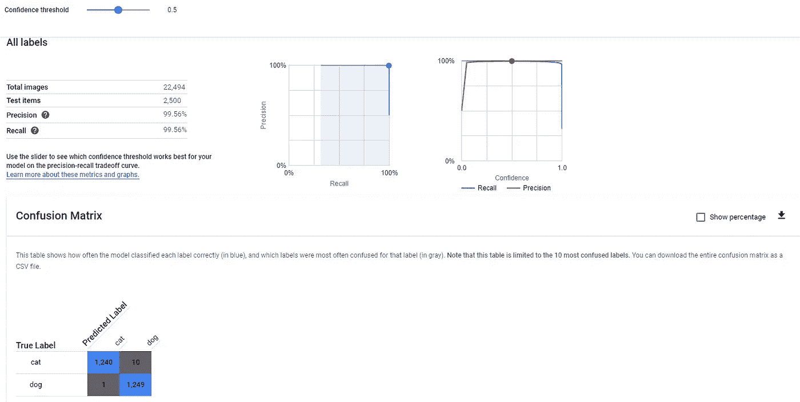

# 用谷歌自动分类狗和猫

> 原文：<https://towardsdatascience.com/classify-dogs-and-cats-with-google-automl-2ae6eac64117?source=collection_archive---------31----------------------->

## 让我们使用狗与猫的 Kaggle 数据集来测试 GCP 汽车

[https://MC . ai/build-a-machine-learning-model-on-cloud-using-Google-automl/](https://mc.ai/build-a-machine-learning-model-on-cloud-using-google-automl/)

这是我与[谷歌 Auto ML](https://cloud.google.com/automl) 的第一个项目，我非常好奇想尝试一下，因为我在 Medium 上看到了很多关于它的有趣帖子。例如，我建议你阅读这篇来自 Sriram Gopal 的非常有趣的[帖子](https://medium.com/@sriramgopal10792/image-classification-using-google-automl-tutorial-part-1-dc2beb6908f6)，他解释了使用 Google AutoML 进行类似项目的所有步骤

我决定使用来自 [Kaggle](https://www.kaggle.com/) 的 [**狗对猫**](https://www.kaggle.com/c/dogs-vs-cats/data) 数据集。目标是分类图像是否包含狗或猫

让我们从使用 **CRISP-DM 流程**(数据挖掘的跨行业流程)开始:

1.  **业务理解**
2.  **数据理解**
3.  **准备数据**
4.  **数据建模**
5.  **评估结果**
6.  **展开**

**业务理解**

图像分类是当今非常常见的任务，它包括将图像和一些类别作为输入，并输出输入图像属于一个或多个给定类别的概率

一部分来自我想尝试的项目的主要目标 [Google Auto ML](https://cloud.google.com/automl)

**数据理解**

Kaggle 提供的数据:

*   **测试**:包含 12500 张猫狗图片的文件夹，用作测试数据集
*   **train** :包含 25000 张猫狗图片的文件夹，图片名称中带有标签，即 dog.0.jpg cat.0.jpg
*   **sample submission . CSV**:CSV 文件，参赛时作为提交参考

这些图像是 RGB 的，并且具有不同的尺寸

Kaggle 的数据集结构与 Google AutoML 的数据集结构非常不同，Google AutoML 的数据集结构是每个标签一个文件夹，里面有图像

**准备数据和数据建模**

如前所述，Kaggle 已经完成了图像的标记，模型的选择和调整将由 Google AutoML Vision 完成

要使用谷歌自动视觉:

1.  创建一个谷歌云平台账户
2.  创建新项目
3.  启用 AutoML API
4.  创建服务帐户
5.  创建一个桶
6.  创建. csv 文件来映射数据集的图像
7.  将图像上传到桶中
8.  创建数据集并上传图像
9.  训练模型
10.  部署模型

因此，我们只需以预期的格式向 Google AutoML Vision 提供数据。要让 Google AutoML Vision 使用数据:

1.  将 Kaggle **train** 文件夹中的图像分离到**狗**和**猫**文件夹中
2.  将**狗**和**猫**文件夹上传到谷歌云存储的桶中
3.  创建一个 csv 文件来映射桶中数据集的图像

数据集已经在训练、验证和测试数据集中被自动拆分。也可以在映射 csv 文件中为每个图像指定训练、验证、测试或未分配，以更改用于训练、验证和测试的图像数量之间的比率

标签统计

模型的训练可能需要几个小时(您可以选择使用多少个节点小时),当它完成时，google 将发送一封电子邮件

**评估结果**

在**评估**页面中，我们可以看到模型性能

GCP 评估模型

可以使用滑块改变**置信度阈值**

我们也可以检查一下**混淆矩阵**(顺便说一句，我建议你读一读这篇来自[blog.exsilio.com](https://blog.exsilio.com/)的[帖子](https://blog.exsilio.com/all/accuracy-precision-recall-f1-score-interpretation-of-performance-measures/#:~:text=Precision%20%2D%20Precision%20is%20the%20ratio,the%20total%20predicted%20positive%20observations.&text=F1%20score%20%2D%20F1%20Score%20is,and%20false%20negatives%20into%20account.)

https://blog . ex silio . com/all/accuracy-Precision-recall-f1-score-interpretation-of-performance-measures/#:~:text = Precision %20% 2D % 20 Precision % 20 is % 20 比率% 20 总计% 20 预测% 20 正面% 20 观察值。&text = F1 %20 score % 20% 2D % 20 F1 % 20 score % 20 is，以及% 20false % 20negatives %进入% 20 帐户。

**真阳性(TP)** :这些是正确预测的阳性
**真阴性(TN)** :这些是正确预测的阴性
假阳性和假阴性，这些值出现在你的实际类与预测类相矛盾的时候。
**【FP】**:实际类为负，预测类为正
**假阴性(FN)** :实际类为正，预测类为负

**精度** = (TP + TN) / (TP + FP + FN + TN)

**精度** = TP / (TP + FP)

**回忆** = TP / (TP + FN)

**F1 得分** = 2*(召回率*精确度)/(召回率+精确度)

在我们的案例中:

TP = 1240
TN = 1249
FP = 1
FN = 10
精度=(1240+1249)/(1240+1+10+1249)= 0.995
精度= 1240 / (1240 + 1) = 0.999
召回= 1240 / (1240 + 10) = 0.992
F1

**展开**

培训结束后，我们可以在 GCP 部署并使用该模型

一个 [dash](https://dash.plot.ly/introduction) 应用程序已经被开发为用户界面:可以上传要分类的图像。当没有上传图像时，应用程序显示训练数据集的概览

Dash web 应用程序主页

当提供图像并按下**分类**按钮时，应用程序显示分类

图像分类

在所示的例子中，我在谷歌图片上搜索了一只狗，并用它作为输入来检查我的分类器的输出

**有趣的事实**

我试图对我的个人资料图片进行分类，显然我是一只得分为 0.89 的狗

我的个人资料图片分类

**注意:**代码可以在这个 github [仓库](https://github.com/simonerigoni/dogs_vs_cats)中找到