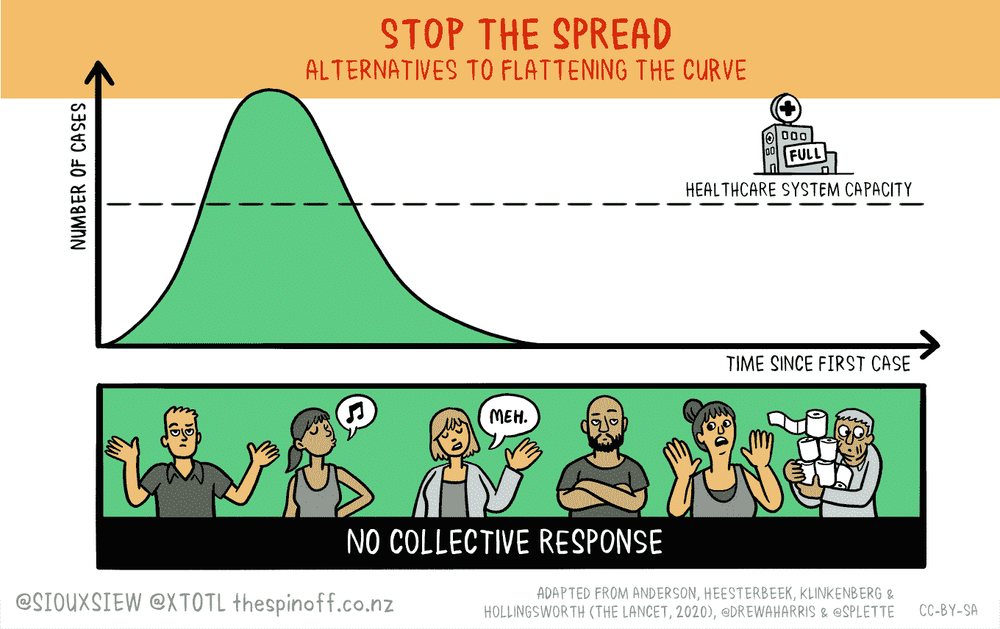
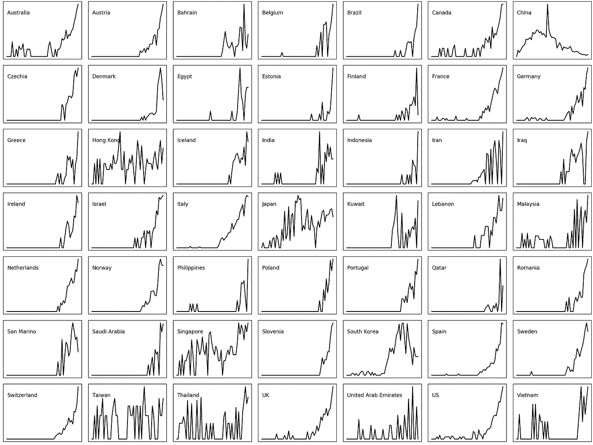
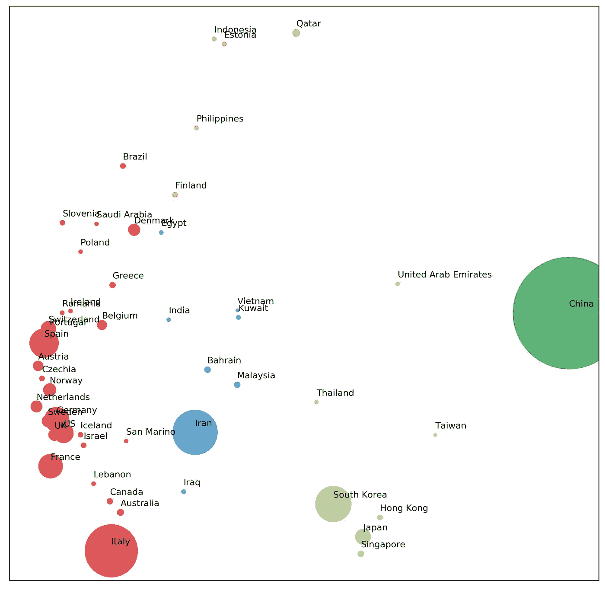
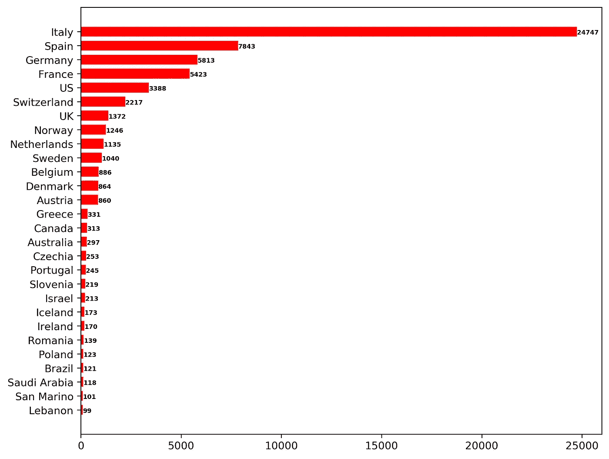

# 新冠肺炎增长数据的模式分类

> 原文：<https://towardsdatascience.com/classify-growth-patterns-for-covid-19-data-41af4c7adc55?source=collection_archive---------10----------------------->

不同国家/地区每日确诊病例的模式

## 全球冠状病毒病例数据的探索性数据分析

2 月 2 日，我启动了一个网络仪表板,用于跟踪最近冠状病毒(新冠肺炎)爆发的传播，它提供了全球确诊、康复和死亡病例的实时视图。

 [## 冠状病毒新冠肺炎爆发全球病例监测

### 冠状病毒新冠肺炎监测提供冠状病毒全球传播的最新数据。

dash-coronavirus-2020.herokuapp.com](https://dash-coronavirus-2020.herokuapp.com/) 

到目前为止，它已经吸引了超过 17，000 名活跃用户，并在社交媒体上被分享了近 3，500 次。我真的很高兴我能贡献出我的技能来帮助处于全球危机中的人们，特别要感谢那些支持这个网络仪表板运行的人。

回到仪表板本身，很明显，它上面显示的信息是为了有效和容易理解而设计的。它们总是及时更新，并且只提供有限数量的历史数据(即区域范围的历史数据)。这使得用户能够获得他们所关心区域的最新状态。

然而，除了显示在仪表板上的实时数据之外，还可以从这些数据中提取更多信息。今天，我将与你们分享从迄今收集的所有数据中提炼出的一些见解。这可能有助于提高公众意识，进一步促进预先准备和减缓传播。

像往常一样，如果你想练习代码，可以从[我的 Github](https://github.com/Perishleaf/data-visualisation-scripts/tree/master/coronavirus_country_PCoA) 访问笔记本。

## 我们预计每日确诊病例的增量模式是什么？

在我们讨论个别模式之前，最好用一幅最近流行的漫画(图 1)来解释我们期望实现什么样的模式来遏制病毒并减缓其传播。

图 1 |三相和[平曲线止价差](https://twitter.com/SiouxsieW)改编自[https://twitter.com/SiouxsieW](https://twitter.com/SiouxsieW)

流行病事件发展过程中的病例数可以用**流行病曲线**来说明(图 1，左图)，它包括三个阶段。目前，大多数国家正处于第一阶段，每天都有越来越多的病例得到确认。

我们希望看到的理想情况是放慢第一阶段的速度，使曲线变平，以便我们的卫生系统有足够的时间做好准备，最重要的是，有足够的资源应对每一个脆弱的病例(图 1，中图)。为了达到这种情况，需要采取严格的措施，包括旅行限制、自我隔离、社会距离和个人卫生。

对于那些处于疫情最早期阶段的国家，还有另一个积极的选择，即通过迅速和积极主动地采取全面措施来阻止疫情蔓延(图 1，右图)。

## 不同国家/地区每日确诊病例的增量模式是什么？

考虑到这些，让我们看看不同国家/地区的个别疫情曲线。此处使用的数据是从 1 月 21 日至 3 月 14 日收集的。为了能够看出模式，只有那些确诊病例超过 50 例的国家/地区包括在本分析中。

如图 2 所示，截至 3 月 14 日，共有 49 个国家/地区出现 50 例以上确诊病例。当绘制每日增量病例数与日期的关系图时(图 2)，我们可以清楚地看到不同的模式。例如，根据流行曲线的定义，mainland China(图 2，右上角)已经处于第三阶段，而大多数其他地区仍处于第一或第二阶段。

图 2 |每日增量病例数与日期的对比

## 我们可以对增量模式进行分类吗？

然而，这些曲线的视觉区分是相当困难的。最好将这些曲线分类成簇，其中相似的曲线归为同一组。在这里，我将 **P** 原则 **C** o 坐标 **A** 分析( **PCoA** )和 **k 均值聚类**结合起来，在二维空间上绘制国家/地区增量模式的相似性，并对它们进行分组。简而言之，在二维排序中，相邻的圆圈(即国家/地区)应该具有相似的生长模式，彼此远离的圆圈几乎没有共同的模式。

> **注意！**由于我们只对模式感兴趣，数据大小的影响应最小化，例如，mainland China 的每日增量数字比许多其他国家/地区高几个数量级。我们不希望这些差异包含在我们的分析中。这里的解决方案是首先将数据转换为平方根，然后将它们归一化为 0 到 1 之间的数字。这样做，我们只在计算不同国家/地区之间的相似性时赶上模式的变化。

图 3 |不同国家/地区增长模式的排序

正如我们从排序中看到的(图 3)，有 5 组用不同的颜色表示(圆圈大小表示确诊病例数)。Mainland China 形成了自己的集群(深绿色)。阿联酋、泰国、台湾、韩国、香港、日本和新加坡形成了另一个集群(浅绿色)。伊朗与伊拉克、马来西亚、巴林、印度、越南和科威特(蓝色)同组。大多数欧洲国家连同美国、加拿大和澳大利亚形成了一个大的集群(红色)。最后，芬兰、菲律宾、印度尼西亚、爱沙尼亚和卡塔尔被归为同一组。

通过这些分类，我们现在可以从曲线矩阵(图 4)中获得更多信息，例如哪些国家/地区具有相似的增长模式，以及它们处于哪个阶段。

根据流行病曲线的定义，Mainland China 现在已经处于第三阶段。这是一个令人鼓舞的迹象。然而，我们应该知道，这些都是建立在人们巨大牺牲的基础上的，通过在今年的节日期间(即中国新年)暂停整个国家，呆在家里，尽量减少户外活动，避免大型集会，如果外出戴口罩。此外，他们在几周内建立了两所新医院，并向武汉派遣了大约 43000 名医务人员。

图 4 |每日增量病例数与分类日期的对比

留给我们考虑的问题是，当疫情在许多其他国家/地区爆发时，我们是否有如此规模的资源来做中国所做的事情，或者我们是否应该迅速和积极主动地采取行动来减缓甚至阻止疫情的到来。

这些把我们带到第二个集群(浅绿色)。这些地区都在很早的时候记录了第一批确诊病例，然而，保持了相对平坦的曲线。这可能归功于他们及时部署了旨在遏制冠状病毒传播的深思熟虑的措施。这再次突出了迅速和主动采取行动的必要性。此外，这也意味着，如果我们坚持遵守所有措施，情况应该会有所改善。

你可能会注意到，韩国也属于这一类。这主要是因为曲线后来出现的高峰是由所谓的[患者 31](https://graphics.reuters.com/CHINA-HEALTH-SOUTHKOREA-CLUSTERS/0100B5G33SB/index.html) 触发的，他是一个超级传播者，并将它传递给了成千上万的其他人。幸运的是，韩国几乎已经度过了高峰期，正在回到一个合理的水平。

蓝色、黄色和红色组中的国家都处于第一阶段，但曲线风格略有不同。具体来说，蓝色组的特点是早期平坦曲线和晚期爬坡曲线的混合(图 5)。

图 5 |马来西亚和伊朗的累积病例

然而，黄组国家大多拥有确诊病例数的突然增加(图 6)，这可能表明控制失败。

图 6 |卡塔尔和芬兰的累积案例

红色组都是典型的指数增长曲线，是最不想要的情况。这些曲线可能表明在事情变得更糟之前，系统还没有准备好。

图 7 |西班牙和意大利的累积病例

## 向红色集团内的国家发出警报

如开始所述，分类只检查了生长模式，没有考虑规模。现在，让我们检查红组国家的案例数。

显然，并不是红色组中的每个国家都像意大利、西班牙或德国那样有高确诊病例数(图 8)。话虽如此，如果不采取认真的措施，这些数字肯定会成倍攀升，这进一步意味着本可预防的生命损失将是不可预防的。对这些国家的警告是现在就采取行动，否则就太晚了。

图 8 |截至 AEDT 时间 3 月 18 日的总病例数

> “生活是我们所有选择的总和。”
> 
> 阿尔伯特·加缪

数据源来自:

*   [丁香园](https://ncov.dxy.cn/ncovh5/view/pneumonia?scene=2&clicktime=1579582238&enterid=1579582238&from=singlemessage&isappinstalled=0)
*   [腾讯新闻](https://news.qq.com//zt2020/page/feiyan.htm#charts)
*   [澳洲政府卫生署](https://www.health.gov.au/news/coronavirus-update-at-a-glance)
*   [世界计量表](https://www.worldometers.info/coronavirus/)
*   [中华人民共和国国家卫生委员会](http://www.nhc.gov.cn/)
*   [JCU-CSSE](https://docs.google.com/spreadsheets/d/1yZv9w9zRKwrGTaR-YzmAqMefw4wMlaXocejdxZaTs6w/htmlview?usp=sharing&sle=true#)

这是所有的乡亲。和往常一样，我欢迎反馈、建设性的批评以及听到关于您的数据科学项目的信息。可以通过 [Linkedin](https://www.linkedin.com/in/jun-ye-29aaa769/) 和[我的网站](https://junye0798.com/)找到我。