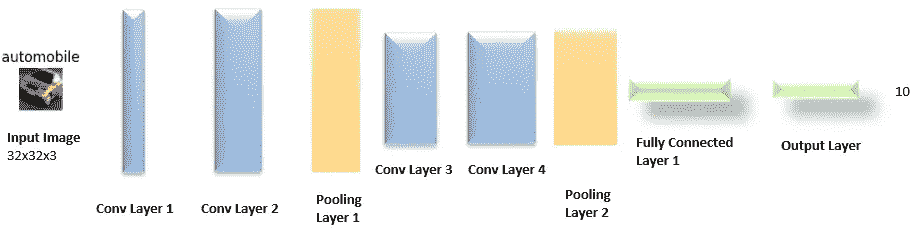

# 使用卷积神经网络对图像进行分类

> 原文：<https://towardsdatascience.com/classify-your-images-using-convolutional-neural-network-4b54989d93dd?source=collection_archive---------28----------------------->

## 从头开始建立一个 CNN 来分类图像

**简介**

你听说过计算机识别图像吗？嗯，这并不神秘，按照这篇代码文章来构建您自己的图像分类器。我们将从 CIFAR 数据集获取图像。然后将它发送到我们自己的神经网络中，在那里计算机识别各种事物，如颜色、大小、形状等。并根据我们提供的样本数据学习识别图像。然后我们将使用学习过的网络来预测新的输入图像是什么。

让我们开始吧！

**什么是 CIFAR-10 数据集？**

CIFAR-10 数据集由 10 类 60000 幅 32x32 彩色图像组成，每类 6000 幅图像。有 50000 个训练图像和 10000 个测试图像。

数据集分为五个训练批次和一个测试批次，每个批次有 10000 幅图像。测试批次包含从每个类别中随机选择的 1000 个图像。训练批次以随机顺序包含剩余的图像，但是一些训练批次可能包含来自一个类别的比来自另一个类别的更多的图像。在它们之间，训练批次正好包含来自每个类的 5000 个图像。

来源:https://www.cs.toronto.edu/~kriz/cifar.html

这些类是完全互斥的。汽车和卡车之间没有重叠。“汽车”包括轿车、越野车等诸如此类的东西。“卡车”仅包括大卡车。两者都不包括皮卡车。

[**火炬视觉数据集**](https://pytorch.org/docs/stable/torchvision/datasets.html)

在本文中，我们将使用 PyTorch 中的数据集。这里还有很多其他很棒的数据集。[https://pytorch.org/docs/stable/torchvision/datasets.html](https://pytorch.org/docs/stable/torchvision/datasets.html)

**检查 GPU 计算能力**

GPU 的并行计算能力将显著提高你的训练速度。请注意，CUDA 是由 NVIDIA 开发的，我们将在下面的代码中使用。

**导入数据**

在下面的代码中，我们从 torchvision 获取数据集。我已经指定了 20%的训练数据用于验证，以及 30 张图像的**批量。我强烈建议您使用验证数据集，我们将在下面看到它如何帮助选择正确的网络配置。**

在将图像传递给神经网络之前，我对图像进行了一些变换，比如水平翻转和 20°的随机旋转。对图像应用变换是非常有用的，因为这可以帮助你的网络学习和预测图像，即使它处于不同的方向、颜色、大小等。点击查看 torchvision [提供的各种变换。我们稍后将图像张量作为输入传递给我们的神经网络。](https://pytorch.org/docs/stable/torchvision/transforms.html)

classes 数组包含数据集中的 10 个类。

**查看训练数据的图像**🔎

拉伸图像

从上面来自训练数据集的样本图像中，我们可以看到我们应用了 RandomRotation(20)的变换。

**神经网络架构**

我们的模型需要将 RGB 光谱(深度= 3)中的 32×32 像素图像作为输入，并将输出作为 10 个类别(飞机、汽车、鸟、猫、鹿、狗、青蛙、马、船、卡车)之一返回

我已经创建了如下所示的架构，第一个卷积层接受 32x32x3 图像张量的输入。第一层的输出是 32x32x16 张量，每一层之后我们可以看到深度增加。在某些网络架构中，您可能会在每个卷积层之间看到一个池层，以减小规模。尽管池层有助于减小大小，但它也会丢失一些数据。由于我们的输入图像很小，我在每 2 个卷积层后使用了池层。2x2 合并图层后，我们可以看到张量大小从 32x32 减小到 16x16。卷积层 3 和 4 的输入张量分别是 16×16×32 和 16×16×64。

我使用了 25%的**压差**。通过在训练过程中忽略神经元，Dropout 有助于防止过度拟合。我还创建了一个名为 weights_init_normal 的函数，用正态分布的权重初始化模型。您不需要这样做，但是在较大的模型中，这可以帮助训练和验证损失快速收敛。

作者图片

卷积层充当特征提取器。更多的卷积层有助于识别每幅图像中的细微事物。完全连接的层和输出层充当分类器。

**定义损失函数和优化器**

我选择了 Adam 优化器，点击这里查看其他优化器，包括 SGD。**学习率**设定为 0.001。

**培训和验证**⏳

我们调用带有各种参数的训练方法，如**段数**、模型、加载器等。我们将来自训练数据集(loaders['train'])的图像(数据)传递给模型。然后计算损失并进行反向传播，在此期间，我们根据损失更新权重。model.eval()通知所有层我们处于 eval 模式，因此批 norm 和 dropout 层将在 eval 模式下工作。

训练和验证损失计算为每个时期的平均值，然后打印出来，如下所示。如果在一个时期内验证损失小于以前，我们将模型保存到 model.pt 文件。

训练完成后，从 model.pt 文件中加载模型，该文件将具有所有历元中最小的验证损失。

从上面的输出中，我们可以看到模型在纪元 54 之后被保存。它的验证损失为 0.54

虽然我已经运行了当前模型 60 个历元，但在更早的时候，使用一组不同的超参数，我能够在 15 个历元内获得类似的性能。

**策划培训和验证损失**

绘制训练和验证损失图，我们可以看到它们在一个点上汇聚，然后开始远离。它显示了我们的模型在最后是如何过度拟合的，这被描述为训练损失的持续减少和验证损失的增加。好在我们创建了验证集来检查这个条件，并且在模型过度拟合之前保存了它；)

**测试模型**

这个函数类似于训练，但是这里我们通过测试数据集并计算损失。

从上面的输出中，我们可以看到模型在一些类中表现得更好，而在另一些类中表现得不那么好。

**可视化少量测试结果**

当前的输出显示了所有 20 张正确分类的图片，测试一下你的图片，找出一些错误分类的图片。

**关于改进模型的想法**

我们看到这个模型在一些课上表现不错，而在另一些课上表现不太好。花了大量的纪元来训练。在训练过程中，我们可以传递更多不太精确的类的图像，以便模型更好地学习。增加卷积层的数量以识别更多的特征，同时优化 dropout 和 epoch 以平衡过度拟合。

尝试调整以下内容，亲自看看性能有何不同，

*   学习率
*   世
*   拒绝传统社会的人
*   批量
*   添加/移除转换
*   添加/删除卷积层
*   更改优化器

我喜欢听你的建议/反馈！