# 将 400 万个 Reddit 帖子分类到 4k 个子编辑中:一个端到端的机器学习管道

> 原文：<https://towardsdatascience.com/classifying-4m-reddit-posts-in-4k-subreddits-an-end-to-end-machine-learning-pipeline-ee511d26b362?source=collection_archive---------20----------------------->

## 应用多标签文本分类，用 fastText 和 FastAPI 构建一个数据产品。

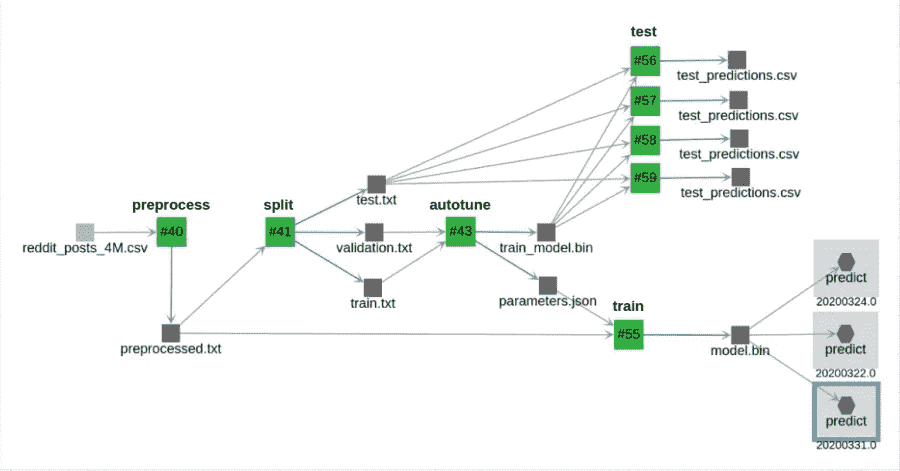

具有数据工件、执行和 API 端点的端到端 ML 管道。

找到合适的 subreddit 来提交你的帖子可能会很棘手，尤其是对 reddit 的新手来说。有数以千计的具有重叠内容的活动子编辑。如果对人类来说这不是一件容易的事，我没想到对机器来说会更容易。目前，Reddit 用户可以在一个特殊的子编辑中请求合适的子编辑: [r/findareddit](https://reddit.com/r/subreddit) 。


一位 Reddit 用户请求 subreddit 建议。

在这篇文章中，我分享了如何建立一个端到端的机器学习管道和一个为帖子建议子编辑的实际数据产品。你可以访问数据、代码、API 端点和用户界面，用你的 Reddit 帖子进行尝试。

# 从 4k 个子编辑中收集 400 万条 Reddit 帖子

我使用 Python Reddit API 包装器( [PRAW](https://github.com/praw-dev/praw) )请求 5k 个最受欢迎的子编辑，但只得到 4k 个。对于每个帖子，我收集了截至 3 月 17 日的最新 1k 帖子的标题和内容。我把数据导出到一个 CSV [文件中，可以在 S3 下载。](https://valohai-fasttext-example.s3.eu-west-3.amazonaws.com/reddit/reddit_posts_4M.csv)

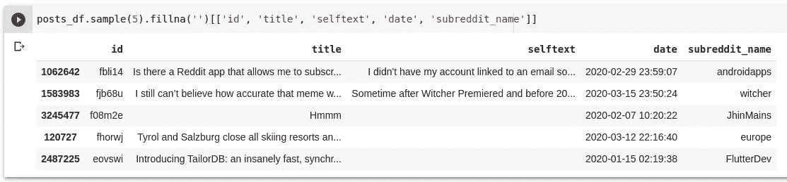

来自 400 万条 Reddit 帖子的数据框架样本。

就数据质量而言，这个数据集远非完美。有些子帖子太笼统，有些帖子彼此非常相似，有些帖子在文本中没有足够的信息来知道它们应该贴在哪里。之前的方法[选择了 1k 个子主题的子集，这些子主题在主题方面更加一致](https://www.kaggle.com/mswarbrickjones/reddit-selfposts/)。虽然这种数据选择确实会使模型在测试分割中获得更高的分数，但它不一定对真实数据更有用，因为它会错过许多子数据。

众所周知，数据清理会对模型的性能产生很大的影响，数据科学家会花费高达 80%的时间来清理数据。作为一名数据科学家，我经常高估数据转换的影响。为了避免在早期的数据转换上花费太多时间，我更喜欢尽可能快地直接构建一个端到端的简单基线。一旦我有了第一个结果，我就可以**运行版本控制的实验来观察每个转换的影响**。端到端解决方案还允许您尽早获得最终用户的反馈。

# 使用 fastText 进行多标签文本分类

在上一篇文章中，我使用 fastText 为文本分类构建了一个通用的 [ML 管道。我重用这些代码，在 Reddit 数据集上训练它，使用*标题*和*自我文本*作为特征，使用*子编辑名称*作为标签。在训练数据集中，每个帖子被分配到一个标签，但很自然地会将问题视为多标签问题。在多标签文本分类中，通过概率将每个帖子分配给每个子编辑。](/a-production-machine-learning-pipeline-for-text-classification-with-fasttext-7e2d3132c781?source=friends_link&sk=4e5dc6d23abaa8e87d55209b97831a43)

由脸书发布的 fastText 是一个具有两层的神经网络。**第一层训练单词向量，第二层训练分类器**。正如[原文](https://arxiv.org/abs/1607.01759)中提到的，fastText 适用于大量标签。收集的数据集包含 3 亿个单词，足以用 Reddit 数据从头开始训练单词向量。最重要的是，fastText 为由两个参数控制的子词创建向量， *minn* 和 *maxn，*设置最小和最大字符跨度以将一个词拆分成子词。在 Reddit 上，打字错误是常见的，如果不使用子词，特定术语可能会超出词汇表。

# 机器学习流水线架构

机器学习管道由 5 个通过 [Valohai 管道](https://docs.valohai.com/valohai-yaml/pipeline/?highlight=pipelines)交换数据的执行组成。每个执行都是一个 Python CLI，你可以在 [Github](https://github.com/arimbr/valohai-fasttext-example/blob/master/models/classification/commands.py) 上找到每个执行的代码，在[上一篇文章](https://blog.valohai.com/production-machine-learning-pipeline-text-classification-fasttext)中可以找到关于如何创建一个在云上运行的管道的更多细节。


具有数据工件、执行和 API 端点的端到端 ML 管道。

文本特征被连接，转换为小写，标点符号被删除。然后将数据分为训练(80%)、验证(10%)和测试(10%)。我将[自动调优命令](https://fasttext.cc/docs/en/autotune.html)设置为在具有 16 个内核的云机器上运行 24 小时，以在验证数据集上找到最佳参数。最后，在所有数据上重新训练模型，并在测试数据集上报告最终指标。对于每次执行， [Valohai](https://valohai.com) 负责启动和停止具有适当环境、代码、数据和参数的云机器。

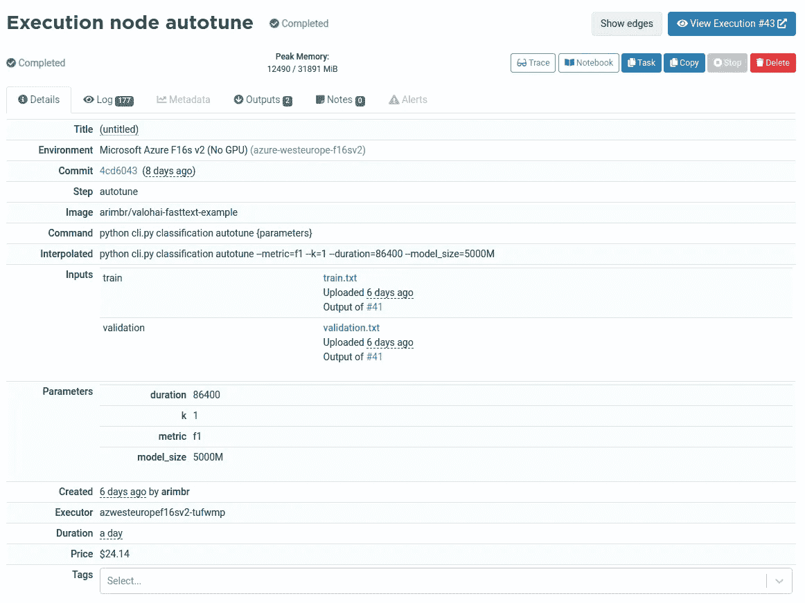

# 探索预测和指标

**自动调优执行聪明地尝试了 9 个不同的参数集**来决定一个最终的模型，该模型被训练了 100 个时期，具有 92 维的词向量、多达 3 个词的 n 元语法和 2 到 5 个字符的子词。这导致了 300 万单词的词汇量(包括子单词)和一个训练 7 小时、重 2 GB 的模型。

分类任务可以用经典的指标来评估，如精度、召回率和 f1 值。自动调优执行记录最佳参数，并在验证数据集中报告得分为 0.41 的 **f1。**

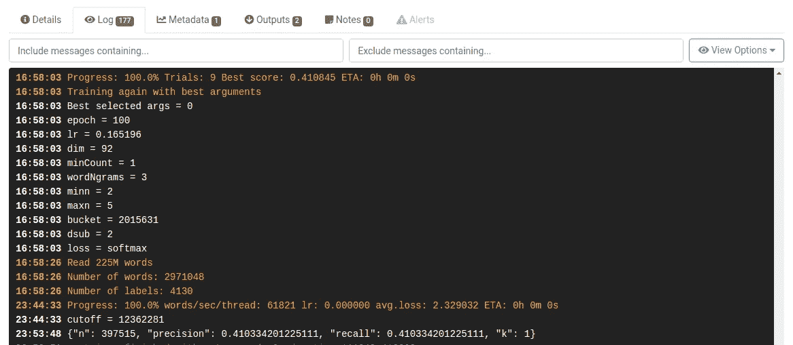

自动调优执行的日志。

在[极端多标签文本分类任务](http://manikvarma.org/downloads/XC/XMLRepository.html)中，通常**还会报告度量 P@k(进行前 k 个预测时的精度)和 R@k(进行前 k 个预测时的召回)**。下面，我们可以看到不同 k 值的测试数据集的精度和召回率。R@k 从进行一次预测(k=1)时的 0.4 变为进行二十次预测(k=20)时的 0.71。

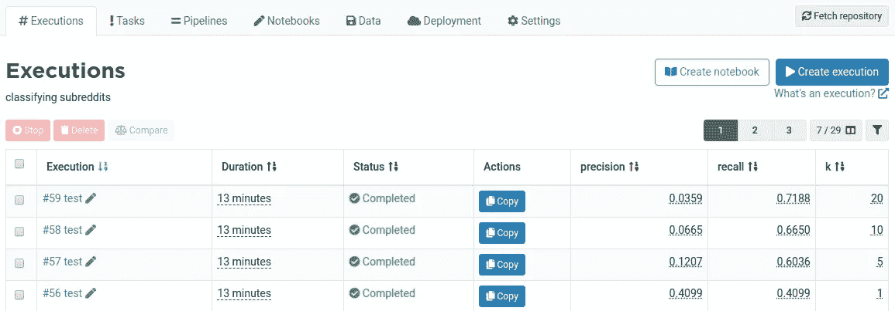

比较不同 k 值的测试执行的度量

## 标签分类报告

自然，不同的子条目之间的度量也不同。通过子编辑来探究 f1 分数直方图以及预测概率(p@1)和 f1 分数之间的关系是很有趣的。我创建了一个 [Google Colab 笔记本](https://colab.research.google.com/drive/12HhnbaHycgHsPZAhLRyBdUUQoTZzXjX7)来制作基于 *test_predictions.csv* 的图表。

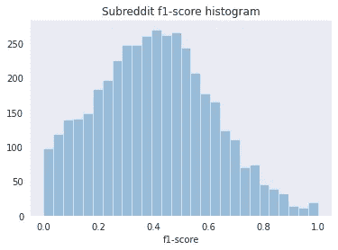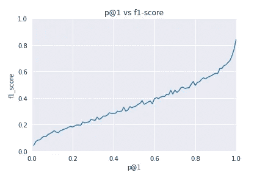

自然，f1 分数和 P@1(模型给出的第一次预测的概率)之间存在正相关。尽管如此，在测试数据集上，p@1 仍落后于 f1 得分。比如模型说第一个建议有 0.8 的概率，就要取为 0.5。该模型可能需要针对更多的时期进行训练，以更好地调整概率。

指标很重要，但它们不应该阻止你查看数据。相反，度量标准会告诉你应该往哪里看。例如，如果我们考虑 f1 值接近 1 的子网格，我们会发现一个很好的特性泄漏的例子。

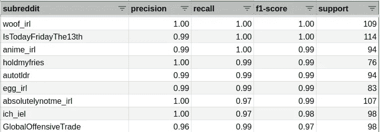

在子编辑 r/wood_irl 和 r/anime_irl 的情况下，大多数帖子的标题是子编辑的名称，没有文本和图像。在 r/holdmyfries **，**中，大多数帖子以 HMF 开头，这一特征泄漏可能会阻止模型从其他文本特征中学习。看看表现最差的子编辑，我发现几个流行的子编辑不一定有主题连贯性，比如 r/AskReddit。主题方面最连贯的子主题具有平均 f1 分数，例如 [r/MachineLearning](https://reddit/r/MachineLearning) 的 f1 分数为 0.4。

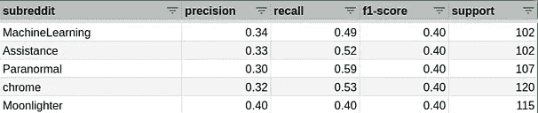

## 子编辑混淆矩阵

该模型不仅与用户分配的子编辑相矛盾，而且与标签空间相矛盾。如果你看看子编辑之间的混淆矩阵，你会发现子编辑有相似的主题。我上传了长格式的混淆矩阵到这个[谷歌电子表格](https://docs.google.com/spreadsheets/d/1NBY1o85ZiNpcm4tcYhKk_Z0TNxm2Q-MhptuCi9qJJoQ/edit?usp=sharing)，所以你可以用它来找到类似的子编辑。例如，这里有 **10 对经常被模型**混淆的子网格。label 列指的是人的选择，label@1 列指的是第一个模型选择。

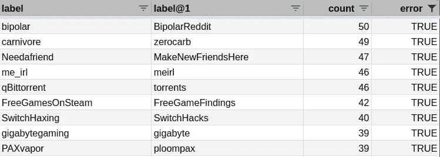

看看类似于 r/MachineLearning 的子编辑，它给出了一些关于为什么模型不总是能够预测人类选择的见解。通常有多种可能的选择。希望该模型仍然可以在数据中存在一些噪声的情况下进行学习，甚至在它以高概率预测不同的子网格时纠正人类的选择。

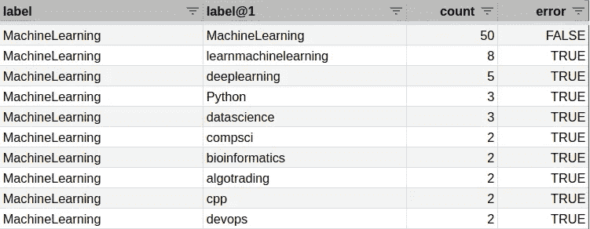

# 用 FastAPI 创建预测 API 端点

即使考虑到所有这些限制，R@5 为 0.6 的训练模型也是有用的。这意味着**有三分之二的时间，前五个预测包括人类**在测试数据集上选择的子集合。备选预测可以帮助用户发现新的子主题，并自己决定是否在那里发布。

为了用最新的帖子提交来测试模型，我使用 [FastAPI](https://fastapi.tiangolo.com/) 创建了一个 API 端点。FastAPI 是优步和微软的机器学习团队使用的 Python web 框架，因为它具有紧凑的代码、使用 Pydantic 的数据验证、自动文档编制以及 Starlette 带来的高性能。

[api.py](https://github.com/arimbr/valohai-fasttext-example/blob/master/api.py) 中的代码足以声明特征和预测模型，将训练好的模型加载到内存中并创建预测端点。

在 Github 上完成 [api.py。](https://github.com/arimbr/valohai-fasttext-example/blob/master/api.py)

# 将预测 API 端点部署到 Valohai

使用 [Valohai 的部署特性](https://docs.valohai.com/core-concepts/deployments/)，我在 valohai.yaml 配置文件中用 Docker 映像和服务器命令声明了一个端点。

在 Github 上完成 [valohai.yaml。](https://github.com/arimbr/valohai-fasttext-example/blob/master/valohai.yaml)

通过 Valohai UI，我可以将端点链接到由之前的执行生成的模型。这都是受版本控制的，因此您可以 A/B 测试不同的版本，进行 canary 发布，并在出现问题时进行回滚。

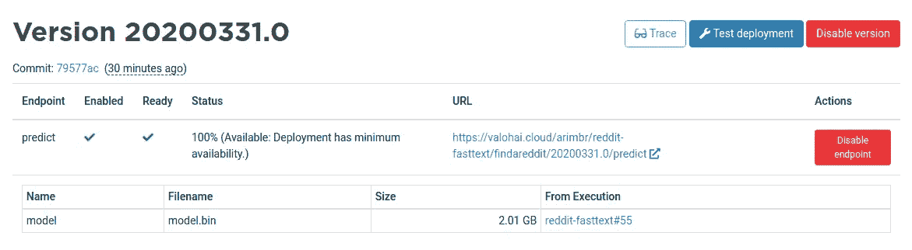

您可以使用 curl 调用 API 端点，并在请求体上使用 text 特性发出 POST 请求。

```
curl -X POST "https://valohai.cloud/arimbr/reddit-fasttext/findareddit/production/predict?k=5" -d “{\”text\”:\”I’m wanting to learn the basics of growing food at home. All indoors as I don’t have a suitable yard. So things that can grow in a pot.\”}”
```

您应该得到这样的 JSON 响应。

```
{“predictions”:[{“label”:”IndoorGarden”,”probability”:0.33},{“label”:”gardening”,”probability”:0.06},{“label”:”plantclinic”,”probability”:0.04},{“label”:”IWantToLearn”,”probability”:0.03},{“label”:”homestead”,”probability”:0.03}]}
```

懒得开终端？我们掩护你。Valohai 团队精心制作了一个 UI 来与模型 进行交互。


[试试子编辑查找器](https://valohai.com/subreddit-finder)

# 下一步是什么？

我已经看到了几个方面的改进，使模型更加有用。例如，从用户可能不知道的不太流行的子编辑中收集数据。对于 Reddit 用例，**报告的 R@5 的 0.6 分已经帮助用户发现新的子编辑**。如果我们从测试数据集中删除包含图像的帖子，分数可能会高得多。在不同的业务案例中，该算法可用于以高 p@1 概率自动分类文档，并支持业务用户手动分类较难的案例。

在我看来，下一步将是**监测模型的性能如何随着时间的推移而演变**，因为用户在 Reddit 上发布的内容存在自然的概念漂移，并解决这一问题。在下面的文章中，我将收集最新的数据，比较模型度量，并构建一个 CI/CD 机器学习系统，以经常重新训练和发布新模型。

如果你有一个带有文本和标签的数据集，你可以按照这个 [**教程**](/a-production-machine-learning-pipeline-for-text-classification-with-fasttext-7e2d3132c781?source=friends_link&sk=4e5dc6d23abaa8e87d55209b97831a43)****对你的数据重新训练管道。**您可以使用它来构建生产基准，以对市场中的产品进行分类，支持知识库中的票据或法律文档。**

# 有用的链接

*   S3: [Reddit 发布数据集](https://valohai-fasttext-example.s3.eu-west-3.amazonaws.com/reddit/reddit_posts_4M.csv)
*   Github: [ML 管道代码](https://github.com/arimbr/valohai-fasttext-example)
*   谷歌电子表格:[指标](https://docs.google.com/spreadsheets/d/1NBY1o85ZiNpcm4tcYhKk_Z0TNxm2Q-MhptuCi9qJJoQ/edit?usp=sharing)
*   Google Colab: [探索](https://colab.research.google.com/drive/12HhnbaHycgHsPZAhLRyBdUUQoTZzXjX7)
*   [子编辑查找器 UI](https://valohai.com/subreddit-finder/)

最初发表于 https://www.valohai.com。