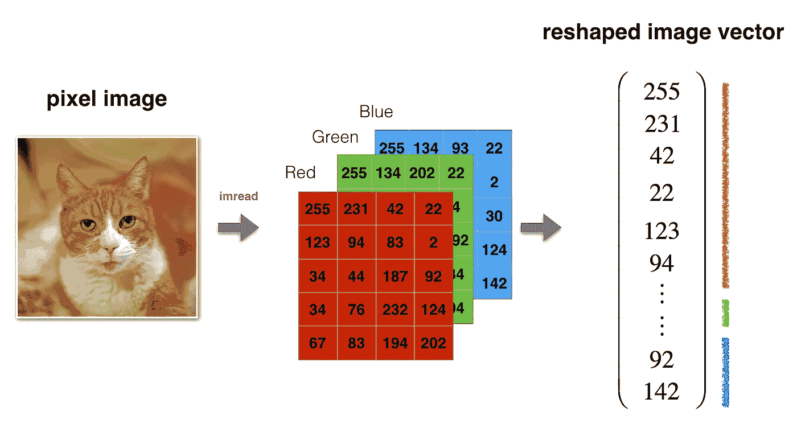
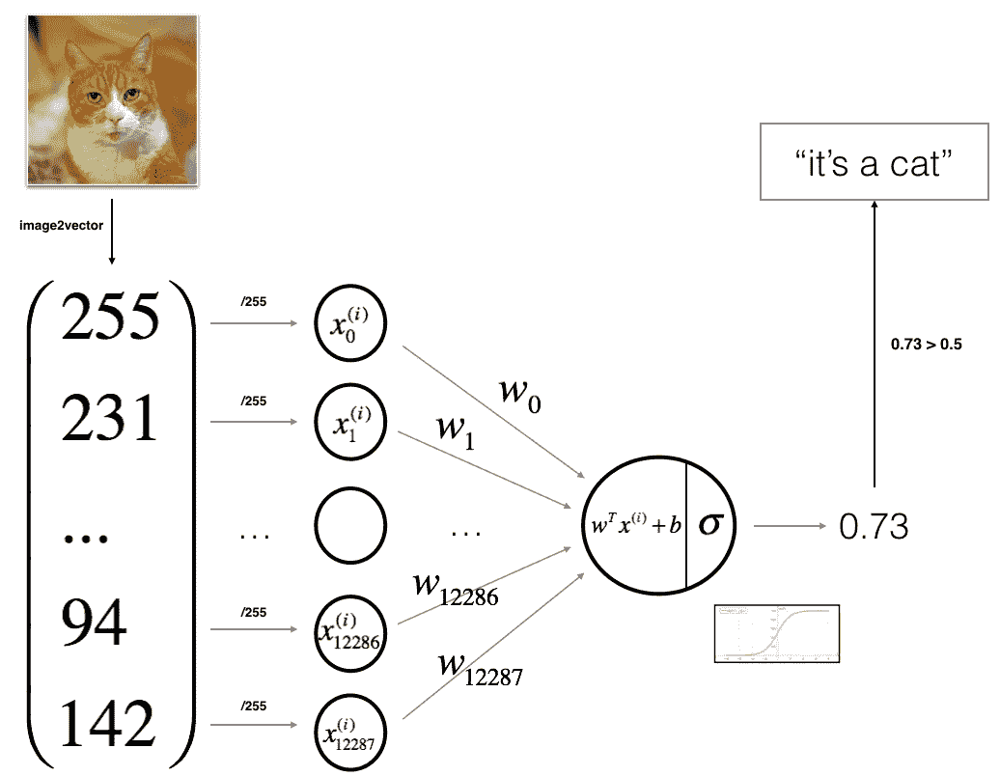
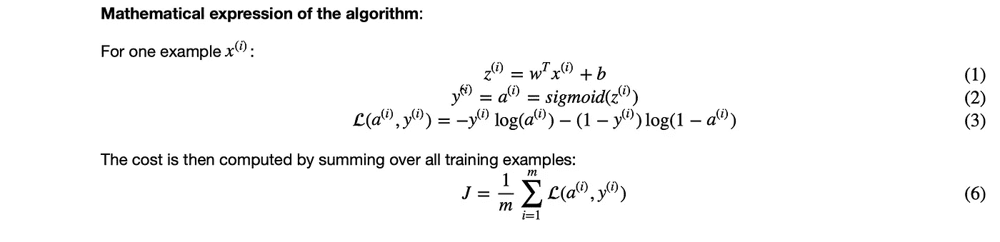
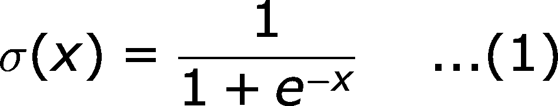
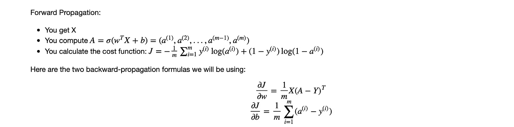
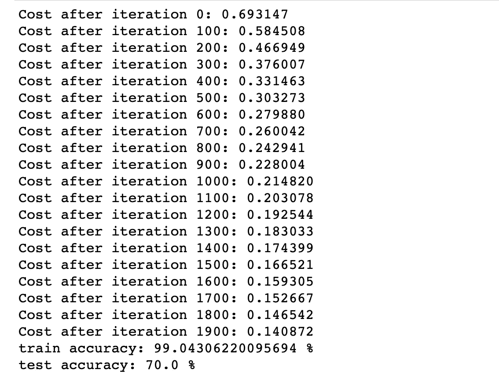
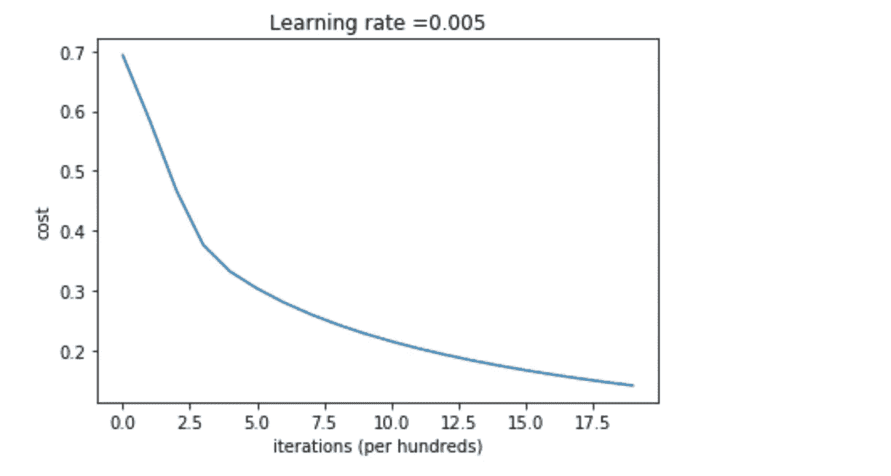
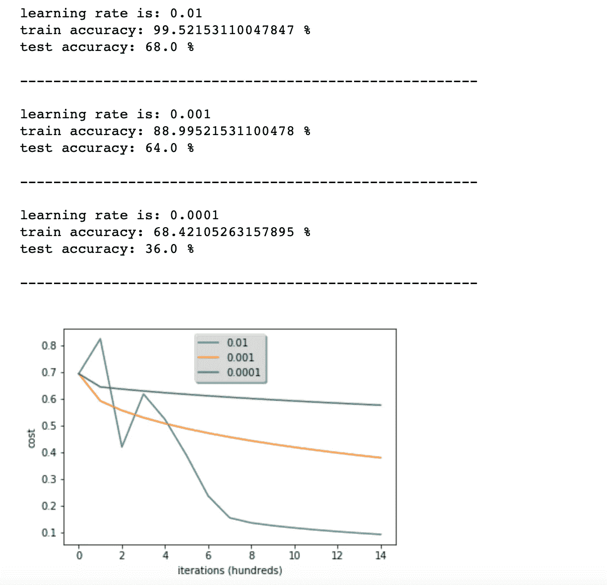
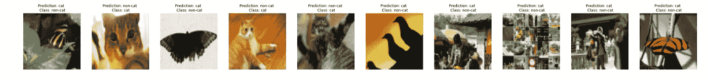
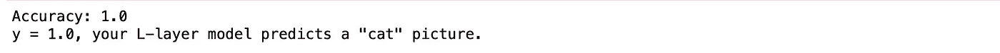

# 如何用逻辑回归模型对猫图片进行分类

> 原文：<https://towardsdatascience.com/classifying-cat-pics-with-a-logistic-regression-model-e35dfb9159bb?source=collection_archive---------9----------------------->

## 为二元分类建立两层神经网络

# 1.介绍

当我全神贯注于学期考试或家务杂事时，我会发现自己总是被猫视频所吸引。更重要的是，猫用可爱的爪子做傻事所带来的快乐超过了拖延的罪恶感。我心想，为什么不把我最大的两个兴趣——猫和机器学习——结合起来，以更好地促进技术进步。因此，用 2 层神经网络(本质上是逻辑回归模型)对猫图像进行即兴分类。

本教程的重点是设计一个简单的逻辑回归算法，用神经网络的思维方式来区分猫图像和非猫图像。

这篇文章仅仅关注教程的抽象概念；要深入了解代码，请参考 Github 资源库[这里的](https://github.com/TheClub4/Cat_Classification)。该库还具有 L 层深度神经网络，其性能优于 2 层模型。

# 2.数据

## 2.1 数据汇总

给定包含以下内容的数据集:

*   标记为猫(y=1)或非猫(y=0)的 m_train 图像的训练集。
*   标记为 cat (y=1)或非 cat (y=0)的 m_test 图像的测试集。
*   每个图像的形状为(num_px，num_px，3)，其中 3 表示 RGB 分量的 3 个通道。因此，每个图像都是(高度=数量 px)和(宽度=数量 px)的平方。

## 2.2 数据重塑

为了方便起见，我们应该将图像的形状(num_px，num_px，3)整形为一个 numpy 数组的形状(num _ px∫num _ px∫3，1)。在这之后，我们的训练和测试数据集将被转换成一个 numpy 数组，其中每一列代表一个展平的图像。应该分别有 m_train 和 m_test 列。

图像到矢量转换

## 2.2 数据预处理

为了表示彩色图像，必须为每个像素指定红色、绿色和蓝色通道(RGB );因此，每个像素值实际上是范围从 0 到 255 的三个数字的向量。

机器学习中一个常见的预处理步骤是对数据集进行居中和标准化，这意味着我们从每个示例中减去整个 numpy 数组的平均值，然后用整个 numpy 数组的标准偏差除以每个示例。但是，对于图片数据集，将数据集的每一行除以 255(像素通道的最大值)更简单、更方便。

# 3.学习算法的一般架构

学习算法体系结构

展平的输入矩阵将通过加权矩阵的参数 W[i]和偏置向量 b[i]传递。然后通过将参数传递通过 sigmoid 激活函数来预测 *Yhat* 的值。从参数的值和它们对应的 *Yhat* 值*，*我们可以通过计算成本函数来最小化成本；然后学习建模的参数。

算法的数学表达

# 4.构建算法

构建神经网络的主要步骤是:

1.  定义模型结构(如输入要素的数量)
2.  初始化模型的参数
3.  循环:

*   计算电流损耗(正向传播)
*   计算电流梯度(反向传播)
*   使用梯度下降更新参数

我们通常分别实现功能/步骤 1-3，然后将它们集成到一个我们称之为`model()`的功能中。

## 4.1 助手功能

我们将首先使用数学表达式实现 sigmoid 函数:

sigmoid 函数

## 4.2 初始化参数

我们必须将 W 和 b 初始化为零的向量。

**注:**常规上，在更深层次的神经网络(层数和神经元更多)中，我们通常随机初始化向量 W。这是因为第一个隐藏层中的每个神经元将执行相同的计算。因此，即使在梯度下降的多次迭代之后，该层中的每个神经元都将与其他神经元一样计算相同的东西。更多信息请参考 [Github 库](http://localhost:8888/notebooks/Documents/Cat_Classification/Cat_classification.ipynb#)。

## 4.3 向前和向后传播

既然我们的参数已经初始化，我们可以开始学习参数的“向前”和“向后”传播步骤。

## 4.4 优化

既然我们已经初始化了参数并计算了成本函数及其梯度，我们将继续使用梯度下降来更新参数。

目标是通过最小化代价函数*j*来学习参数 *w* 和 *b* 对于一个参数θ，更新规则为`**θ = θ − αdθ**`，其中α为学习率。

## **4.5 预测*Yhat***

前一个函数将输出学习到的 *w* 和*b；*因此*，w* e 能够使用 *w* 和 *b* 通过实现`predict()`函数来预测数据集 X 的标签。计算预测有两个步骤:

1.  计算ŷ= a =σ(w . t * x+b)
2.  将 *a* 的条目转换为 0(如果激活< = 0.5)或 1(如果激活>0.5)；将预测存储在矢量`Y_prediction`中。

## 4.6 关键要点

上面实现的功能:

*   初始化( *w* ， *b* )。
*   迭代优化损失学习参数( *w* ， *b* )。
*   计算成本及其梯度。
*   使用梯度下降更新参数。
*   使用所学的( *w* ， *b* )来预测一组给定示例的标签。

# 5.建模

现在，我们将按照正确的顺序把所有的构建模块(在前面的部分中实现的功能)放在一起，看看整个模型是如何构建的。

培训和测试准确性

训练准确率接近 100%。这是一个很好的健全性检查:我们的模型是有效的，并且有足够高的容量来适应训练数据。另一方面，测试准确率为 70%。考虑到我们使用的小数据集以及逻辑回归是一个线性分类器，对于这个简单的模型来说，这实际上并不坏。

成本函数和梯度

**解读**:可以看到成本在下降。这表明正在学习参数。但是，您会发现您可以在训练集上对模型进行更多的训练。尝试增加上面单元格中的迭代次数，然后重新运行这些单元格。您可能会看到，训练集的准确性提高了，但测试集的准确性却降低了。这叫做过度拟合。

# 6.进一步分析

## 6.1 学习率的选择

为了让*梯度下降*起作用，你必须明智地选择学习率。学习率 *α* 决定了我们更新参数的速度。如果学习率过大，我们可能会“超调”最优值。类似地，如果它太小，我们将需要大量的迭代来收敛到最佳值。这就是为什么使用一个合理的学习率是至关重要的。

让我们比较一下我们模型的学习曲线和几种学习率的选择。也可以尝试不同于我们已经初始化的三个变量的值，看看会发生什么。

**解读**:

*   不同的学习率给出不同的成本，从而得到不同的预测结果。
*   如果学习率过大(0.01)，成本可能会上下振荡。它甚至可能会发散(尽管在这个例子中，使用 0.01 最终仍然是物有所值的)。
*   更低的成本并不意味着更好的模式。你必须检查是否有可能过度拟合；当训练精度大大高于测试精度时，就会发生这种情况。

在深度学习中，通常建议您选择最能最小化成本函数的学习速率。如果您的模型过度拟合，使用其他技术来减少过度拟合，例如超参数调整。

## 6.2 结果分析

让我们来看一些模型标注错误的图片。这将显示一些标签错误的图像。

标签错误的图像

**模型表现不佳的几种图像类型包括:**

*   猫的身体在一个不寻常的位置
*   猫出现在相似颜色的背景下
*   不寻常的猫的颜色和种类
*   照像镜头视角
*   图片的亮度
*   比例变化(猫在图像中很大或很小)

# 7.使用 Github 存储库中您自己的图像进行测试！

这是我在 Unsplash 上找到的一个样本小猫图片，我决定在模型上测试它:

来自 [Unsplash](https://unsplash.com/photos/bmGy-eqrl1k)

猜猜模型输出是什么:

输出

万岁！虽然这是从一个简单的逻辑回归模型中推导出来的，但它仍然是值得的——猫总是赢家。前往 Github 知识库，深入了解如何使用两层神经网络和一层深度神经网络对猫图像进行分类。

# 参考

特别感谢 [**deeplearning.ai**](https://www.deeplearning.ai) ！

[1]用于 2 层和 L 层深度神经网络分类的 Github 知识库:[https://github.com/TheClub4/Cat_Classification](https://github.com/TheClub4/Cat_Classification)

[2]对于自动重新加载外部模块:[http://stack overflow . com/questions/1907993/auto reload-of-modules-in-ipython](http://stackoverflow.com/questions/1907993/autoreload-of-modules-in-ipython)