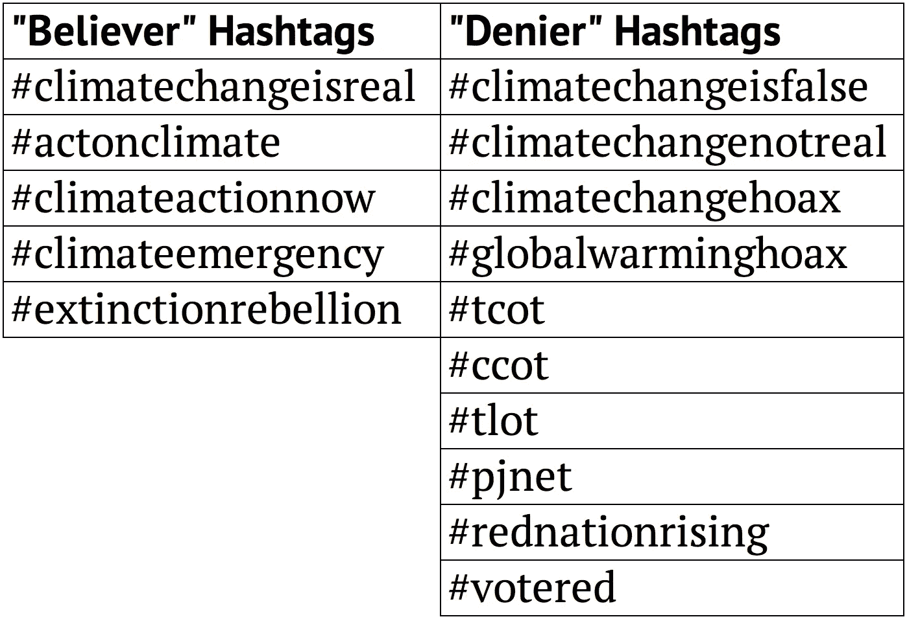
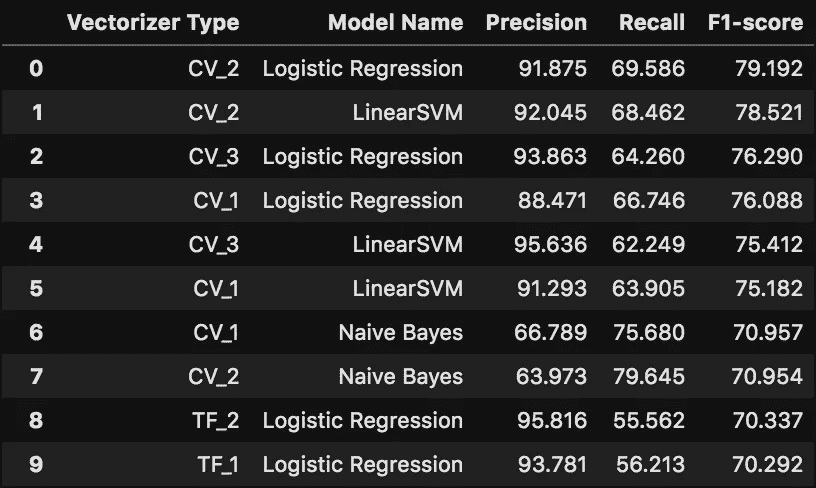
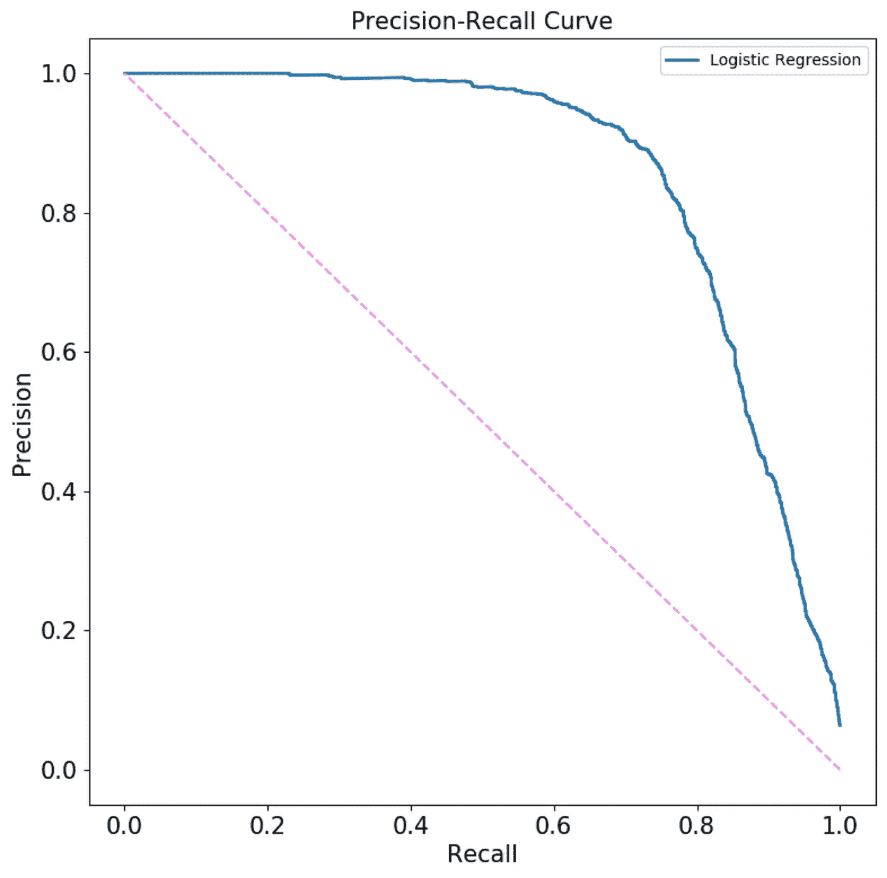

# 将气候变化推文分类

> 原文：<https://towardsdatascience.com/classifying-climate-change-tweets-8245450a5e96?source=collection_archive---------25----------------------->

## 利用 NLP 和分类技术将推文分类为气候变化信徒或否认者推文


来源:[slidescarnival.com](https://www.slidescarnival.com/woodville-free-presentation-template/4398)

# 背景

你好！在本文中，我将通过一个分类示例来识别 2017 年至 2019 年的气候变化推文，无论是气候变化“相信者”还是“否认者”。从[哈佛数据世界](https://dataverse.harvard.edu/dataset.xhtml?persistentId=doi:10.7910/DVN/5QCCUU)下载了 2000 万条气候变化推文 ID，并进行“水合”(即填充了包含实际推文、推文详情、转发详情、用户信息等的 JSON 文件。)使用`[twarc](https://github.com/DocNow/twarc)`。然后，推文文件被保存在 mongoDB 数据库中，所有的转发都被过滤掉，剩下的推文在标签和文本预处理的帮助下被分类为“相信者”或“否认者”。这一分类过程涵盖了该项目的第一部分(点击[此处](https://github.com/gravesa333/Classifying_Climate_Change_Tweets)查看 github repo)，而下一篇文章涵盖了第二部分(点击[此处](https://github.com/gravesa333/Clustering_Climate_Change_Tweets)查看 github repo)，并涉及主题建模和推文聚类，以根据地理位置确定情绪趋势。

如何将这些推文归类为“信徒”或“否认者”？我们不能简单地用情绪分析来区分这两者，因为相信者和否定者都会对气候变化产生积极和消极的情绪。因此，分类器模型是在包含明确的“相信者”或“否定者”标签的推特子集上训练的。标签列表是从 tweet 数据库中手动搜索和评估的；请参见下面的表 1，了解使用的内容。应该指出的是，否认者的推文比相信者的推文少得多，两者的比例分别为 6%和 94%。为了进行度量评估，相信者的推文代表负面情况，否认者的推文代表正面情况。



表 1:“权威”信徒和否认者标签

在执行上述分类流程时，将涵盖以下主题:

1.  **文本预处理**
2.  **基线模型管道**
3.  **绩效指标评估**
4.  **网格搜索**
5.  **阈值选择**
6.  **整个数据集的分类**

# 文本预处理

一旦 tweets 的子集从全集中提取出来，并进一步分成训练集和测试集，`CountVectorizer`和`TfidfVectorizer`被设置成将每个集转换成将用于建模的文档术语矩阵。[可以通过](/hacking-scikit-learns-vectorizers-9ef26a7170af) `[CountVectorizer](/hacking-scikit-learns-vectorizers-9ef26a7170af)` [和](/hacking-scikit-learns-vectorizers-9ef26a7170af) `[TfidfVectorizer](/hacking-scikit-learns-vectorizers-9ef26a7170af)`构建和实现自定义预处理和标记化功能。首先，预处理函数见下文；所有推文都被清除了以下特征:

1.  换行
2.  URL 的
3.  数字
4.  大写字母
5.  标点

```
def tweet_preprocessor(tweet): tweet = tweet.replace('\n', ' ') # remove line breaks
    tweet = re.sub(r"\bhttps://t.co/\w+", '', tweet) # remove URL's
    tweet = re.sub('\w*\d\w*', ' ', tweet) # remove numbers
    tweet = re.sub('[%s]' % re.escape(string.punctuation), ' ',   
            tweet.lower()) # remove capital letters and punctuation

    return tweet
```

接下来，见下面的记号化函数；t [okenization](https://nlp.stanford.edu/IR-book/html/htmledition/tokenization-1.html) 将每条推文分割成一个单词集合(即令牌)。[词汇化](https://nlp.stanford.edu/IR-book/html/htmledition/stemming-and-lemmatization-1.html)旨在将每个单词缩减到其基本形式。例如:大笑，大笑，大笑，大笑都会变成大笑。这通过减少唯一单词的数量来降低分析的复杂性。这两种技术都内置在 [spaCy](https://spacy.io/) 包中，该包在令牌化函数中使用:

```
# create a spaCy tokenizer
spacy.load('en')
lemmatizer = spacy.lang.en.English()def tweet_tokenizer(doc):

    tokens = lemmatizer(doc)
    return [token.lemma_ for token in tokens]
```

除了预处理和标记化，还有许多其他的[矢量器超参数](https://scikit-learn.org/stable/modules/generated/sklearn.feature_extraction.text.CountVectorizer.html)需要微调。例如:

1.  **最大词频**:设置一个词可以出现的最大 tweets 数(例如，如果一个词出现在超过 80%的 tweets 中，那么它可能不是 tweets 之间差异的良好指标)。
2.  **最小词频**:设置一个单词必须出现的最少推文数(例如，如果一个单词出现在少于 1%的推文中，那么它可能是一个不相关的术语，甚至可能是一个错别字)。
3.  **ngram range** :每条推文中的词应该如何分组？我们只对单词感兴趣吗？成对分组的单词？三胞胎？双人和三人组值得一看，因为他们可以帮助捕捉常见的短语(如“气候变化”)。
4.  **停用词**:除了从推文中删除常用停用词(如“the”、“is”、“are”等。)，所有确定的标签(上面列出的)都作为停用词包含在内。标签呈现了潜在的数据泄漏，这可能导致我们的分类器过度拟合，无法推广到其他推文。

矢量化被集成到分类管道中，这可以在下一节的代码中看到。

# 基线模型管道

最初管道的目标是挑选出一些潜在的基线模型用于进一步探索。为管道创建了矢量字典和模型字典；矢量器字典包含许多不同的`CountVectorizer`和`TfidfVectorizer`变体，例如具有不同的 ngram 范围、max_df 和 min_df，模型字典包含分类器列表。见下文:

**矢量词典**

```
vectorizer_dict = {'CV_1': CountVectorizer(ngram_range=(1,3),
                           max_df = 0.8, min_df = 3, 
                           preprocessor=tweet_preprocessor, 
                           tokenizer=tweet_tokenizer, 
                           stop_words=new_stop_words),
                   ...
                   'TF_1': TfidfVectorizer(ngram_range=(1,3),
                           max_df = 0.8, min_df = 3, 
                           preprocessor=tweet_preprocessor, 
                           tokenizer=tweet_tokenizer, 
                           stop_words=new_stop_words),
                   ...}
```

**模型词典**

```
model_dict = {'Logistic Regression': LogisticRegression(),
              'Naive Bayes': MultinomialNB(),
              'LinearSVM': SGDClassifier(random_state=42),
              'Decision Tree': DecisionTreeClassifier(max_depth=6),    
              'XGBoost': XGBClassifier(max_depth=6)}
```

由于数据集不平衡，使用`SMOTE`、`ADASYN`和`RandomOverSampler`来评估过采样的效果。没有一个选项执行得很好，所以它们从模型管道中被省略了。基准模型都用[精度、召回和 F1 分数](https://www.lpsm.paris/pageperso/has/source/Hand-on-ML.pdf)性能指标进行了评估。以下是每一个的快速定义:

1.  **精度**:正确的阳性病例预测的百分比
2.  **回忆**:正确预测的阳性病例的百分比
3.  F1 得分:精确度和召回率的调和平均值。

为了以高效的方式编译结果，在每次管道迭代后，这些指标都存储在一个字典中，同时还有相应的矢量器和模型名称。请参见下面的管道:

```
class_results_dict = defaultdict(list)for vec_name, vectorizer in vectorizer_dict.items():

    X_train_cv = vectorizer.fit_transform(X_train)
    X_test_cv  = vectorizer.transform(X_test) for mod_name, model in model_dict.items():
        model.fit(X_train_cv, y_train);
        y_pred_cv = model.predict(X_test_cv) precision_cv = precision_score(y_test, y_pred_cv)
        recall_cv = recall_score(y_test, y_pred_cv)
        f1_cv = f1_score(y_test, y_pred_cv)

        class_results_dict['Vectorizer Type'].append(vec_name)
        class_results_dict['Model Name'].append(mod_name)
        class_results_dict['Precision'].append(precision_cv)
        class_results_dict['Recall'].append(recall_cv)
        class_results_dict['F1-score'].append(f1_cv)class_results_df = pd.DataFrame(class_results_dict)
```

# 绩效指标评估

在这种情况下，F1 分数是评估每个模型的最佳指标。精确度和召回率都很重要，所以不需要权衡孰轻孰重。换句话说，第一类(假阳性)和第二类(假阴性)错误是相等的。看看`class_results_df`、`CountVectorizer`中的 F1 分数，在所有矢量器中，ngram 范围为(1，3)(即 CV_2)的表现最好，最有效的模型是逻辑回归和线性 SVM(SGD 分类器的默认)。请参见下面的表 2 中的`class_results_df`片段:



表 2:类 _ 结果 _df

Logistic 回归和 ngram 范围为(1，3)的 SGD 分类器通过网格搜索进一步优化超参数。

# 网格搜索

对于逻辑回归和 SGD 分类器，在进行单个网格搜索时，需要考虑多个超参数。对正则化的类型和强度进行评估，同时对逻辑回归评估不同类型的优化算法，并对 SGD 分类器评估不同类型的损失函数。代码见下文；利用`GridSearchCV`，其中选择 *cv=5* 折叠进行交叉验证。

```
from sklearn.model_selection import GridSearchCV# Logistic Regression
logit_params = [{'penalty': ['none', 'l1', 'l2']}, 
                {'solver': ['liblinear', 'lbfgs']},
                {'C':np.logspace(-5,3,num=9,base=10,dtype='float')}]gs_logit = GridSearchCV(LogisticRegression(), logit_params, cv=5,   
                        scoring='f1', error_score=0.0)
gs_logit.fit(X_train_cv, y_train)
y_true, y_pred = y_test, gs_logit.predict(X_test_cv)
f1_score = f1_score(y_true, y_pred)#SGD Classifier
sgd_params = [{'loss':
              ['hinge','log','modified_huber','squared_hinge']}, 
              {'penalty': ['none', 'l1', 'l2']}, 
              {'alpha': 
                np.logspace(-4,3,num=8,base=10,dtype='float')}]gs_sgd = GridSearchCV(SGDClassifier(), sgd_params, 
                      cv=5, scoring='f1')
gs_sgd.fit(X_train_ros, y_train_ros)
y_true, y_pred = y_test, gs_sgd.predict(X_test_cv2)
f1_score = f1_score(y_true, y_pred)
```

两个模型的 F1 分数都通过一个 *l2* 惩罚进行了优化。逻辑回归使用 *lbfgs* 解算器表现最佳，SGD 分类器使用 *modified_huber* 成本函数表现最佳(二次平滑 SVM 模型，其中 *gamma = 2* )。

# 阈值选择

优化每个模型的 F1 分数的下一步是找到最佳概率阈值。分类器的默认阈值设置为 50%，即大于 50%的概率表示拒绝的推文，而小于 50%的概率表示相信的推文。逻辑回归混淆矩阵的视频见下图 1；阈值小部件显示 F1 分数达到最大值，阈值设置为 0.32。

比较两个模型的 F1 得分，逻辑回归得分最高，F1 得分为 **0.803** 。为了直观地确认 F1 分数，有必要查看精确度-召回曲线(ROC 曲线对于不平衡的数据集不太可靠，因此在这种情况下没有使用 ROC 曲线)。参见下面的图 2:



图 2:逻辑回归精度-召回曲线

可以看出，当精度等于 0.870 且召回等于 0.746 时，曲线的最佳点出现；这些值计算出 F1 分数为 0.803。

为了提高这个分数，测试了不同的“确定的”标签组合(添加某些标签，删除某些标签，等等)。)，但是事实证明，使用表 1 中使用的标签列表时，模型的性能最好。

# 整个数据集的分类

确定逻辑回归模型和阈值后，对整个数据集进行最终分类。为每条推文生成预测概率，并应用 0.32 的阈值。参见下面的代码:

```
believer_denier_preds = []
y_final_predict = logit.predict_proba(X_final_test)for i in y_final_predict:
    if i[1] < 0.32:
        believer_denier_preds.append(0)
    else:
        believer_denier_preds.append(1)
```

因为推文没有预先确定的“正确”标签，所以需要人工评估来决定模型是否是有效的分类器。一个很好的初始检查是计算拒绝者推文与相信者推文的比率，并查看它是否与推文训练集中的比率相似(94%相信者对 6%拒绝者)。这个比例是 90%的相信者对 10%的否认者，这与训练集的比例大致相当。更深入的人工检查证实了分类器是有效的。

请随意查看 github repo，了解本文中详细描述的分类过程，位于[此处](https://github.com/gravesa333/Classifying_Climate_Change_Tweets)。当在 tweet 数据集上执行主题建模和聚类时，最终会使用这种分类。这个过程的 github repo 可以在[这里](https://github.com/gravesa333/Clustering_Climate_Change_Tweets)找到。

感谢阅读！