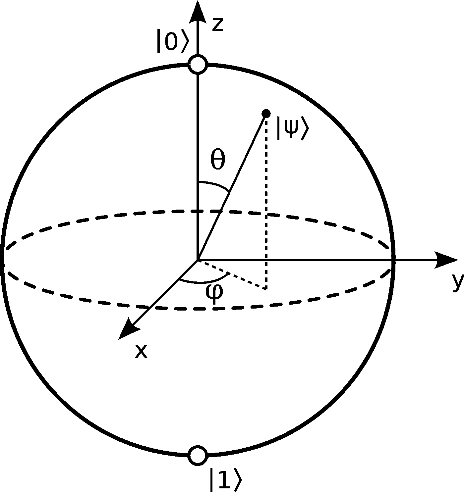
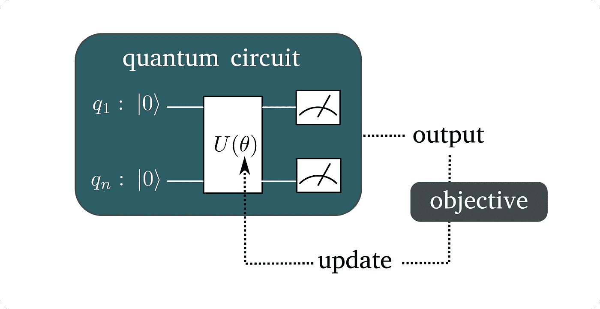

# 基于量子增强迁移学习的文档分类

> 原文：<https://towardsdatascience.com/classifying-documents-with-quantum-enhanced-transfer-learning-8ee6d04f3ccd?source=collection_archive---------21----------------------->

## 用变化的量子电路来补充预先训练的模型，将我们带到了量子增强的自然语言处理时代

最近，一个趋势非常明显:需要大型的预训练模型来实现计算机视觉和语言理解的最先进的性能。特别是，随着基于 Transformer 架构的模型的出现，自然语言处理(NLP)领域的能力和网络规模都在呈指数级增长(例如[伯特](https://github.com/google-research/bert)、 [GPT-2](https://openai.com/blog/better-language-models/) )。在本文中，我将通过使用通用语句编码器(USE)嵌入和一种称为*变分量子电路*的量子机器学习操作符，重点关注短文档(科学论文的预印本)的分类，粗略地说，这相当于经典机器学习领域中的全连接(密集)层。关于单词和句子嵌入如何用于分类的介绍，参见我之前的文章[用通用的句子嵌入对科学论文进行分类](/classifying-scientific-papers-with-universal-sentence-embeddings-4e0695b70c44)。如果你不熟悉量子计算的概念，我希望你会喜欢阅读我的文章[CERN 的幽灵计算机](https://medium.com/@riccardo.disipio/spooky-computers-at-cern-c08f8756444)。

## 量子机器学习

在我们深入研究实际代码(你可以在[https://github.com/rdisipio/qnlp](https://github.com/rdisipio/qnlp)上找到)之前，需要几句话来解释什么是量子机器学习，以及它如何对这种应用有用。

首先，在量子计算中，人们处理称为[量子位](https://en.wikipedia.org/wiki/Qubit)的等效位，由于量子系统的一种称为叠加的属性(有时据说它们可以同时代表 0 和 1)，量子位众所周知可以处理非二进制状态的信息。量子电路是应用于量子位的一系列操作，通过改变它们的相对相位来改变它们的状态*，例如*。量子位可以用所谓的[布洛赫球](https://en.wikipedia.org/wiki/Bloch_sphere)进行几何表示，因此对量子位的操作对应于这个虚拟空间中量子状态向量的旋转。



布洛赫球的图形表示。对量子位的量子操作对应于这个虚拟空间中量子状态向量的旋转。[鸣谢:维基百科]

根据计算的目的，有许多可能的量子电路。一般来说，量子电路实现一个量子算法。关于什么样的计算是可能的，请参考[微软](https://www.microsoft.com/en-ca/quantum/)的[斯蒂芬·乔丹](https://www.microsoft.com/en-us/research/people/stjorda/)维护的[量子算法动物园](https://quantumalgorithmzoo.org/)。最著名的大概就是[彼得·肖尔的因式分解算法](https://en.wikipedia.org/wiki/Shor%27s_algorithm)。量子算法的一个关键概念是，由于固有的自然量子位，某些计算可以以比经典等价计算更小的复杂性来执行(这种特性被称为*超多项式加速*)。完全公平地说，也有很多正在进行的研究试图“去量子化”这种算法，并使经典版本和量子版本一样快——这是因为量子比特的初始状态必须在运行实际算法之前准备好，这降低了整体加速。这一方向的开创性论文是 Ewin Tang 的“[量子启发的经典主成分分析和监督聚类算法](https://arxiv.org/pdf/1811.00414.pdf)”。

事实上，实际应用更可能是经典和量子运算的混合。尤其是在机器学习领域，人们可能会想，这两个领域是否可以结合在一起，联手合作，好消息是，事实上他们可以，他们也确实这样做了。加拿大初创公司 [Xanadu](https://www.xanadu.ai/) 开发的一个名为 [PennyLane](https://pennylane.ai/) 的软件库提供了常见 ML 框架如 [PyTorch](https://pytorch.org/) 和 [TensorFlow](https://www.tensorflow.org/) 与量子计算生态系统之间的接口。主要的想法很简单，但非常强大:人们可以用量子对应物代替神经网络的一部分(比如说致密层)，就是这样！你创造了一个混合经典量子神经网络。事实上，由于经典机器学习并不仅限于神经网络，量子机器学习也在各种方法中找到了它的优势，如[量子支持向量机](https://peterwittek.com/understanding-quantum-svms.html)。为了全面了解什么是可能的，我建议关注 edX 上的在线课程[，该课程由多伦多大学已故的彼得·魏特克教授。](https://www.edx.org/course/quantum-machine-learning)

[变分电路](https://qmlt.readthedocs.io/en/latest/variational.html)(也称为*参数化量子电路*)是一系列混合量子经典算法，以类似于经典致密层的方式执行操作。该算法的核心是依赖于一组参数𝜃的*量子电路* 𝑈，以及定义待优化标量的*目标函数*。电路可以被认为是一个黑盒，优化通常是通过迭代方案实现的，例如通过[基于梯度的优化](https://en.wikipedia.org/wiki/Gradient_descent)。



变分量子电路示意图。[鸣谢:Xanadu.ai]

## 文件分类

正如我在[用通用句子嵌入分类科学论文](/classifying-scientific-papers-with-universal-sentence-embeddings-4e0695b70c44)中解释的，谷歌在[tensorflohub](https://tfhub.dev/google/universal-sentence-encoder/4)上发布了一个预训练版本的[通用句子编码器](https://arxiv.org/abs/1803.11175)(使用)模型。要使用它:

```
import tensorflow_hub as hub
embed = hub.load("https://tfhub.dev/google/universal-sentence-encoder/4")
embeddings = embed([
    "The quick brown fox jumps over the lazy dog.",
    "I am a sentence for which I would like to get its embedding"])
```

输出由一个 512 维的向量列表组成，每个向量对应于输入中的一个文本字符串(在上面的例子中*例如*“快速棕色狐狸…”)。按照迁移学习范式，这个模型可以作为一个更大的网络的一部分。人们可以直接使用它，其参数是固定的，或者通过允许优化者修改它们来微调它。反过来，使用模型的输出被传递到其他层，以便为给定的下游任务训练网络的其余部分。有几个来自官方文档的例子，但是文档分类可能是最直观的。在这个例子中，我们将把属于两个非常不同的类别(即`astro-ph`和`cs.AI`)的预印本的摘要转换成句子嵌入，并附加一个具有两个输出的密集层。每个输出节点对应一个类别，因此在将输出与实际标签进行比较之前，应用一个 [softmax 激活](https://en.wikipedia.org/wiki/Softmax_function)功能。这是一个简单模型的样子:

有趣的是，人们可以在几秒钟内只用 1000 个例子训练这样的模型，但却获得 99.6%的准确率。

为了“量子化”我们的模型，我们必须用一个变分的量子电路来代替位于嵌入和输出之间的层。典型地，经典密集层具有 *N* 个输入和 *M* 个输出，因此在内部，它对应于矩阵乘法，随后是偏置的相加，以及激活函数的应用，*，例如*:

```
def call(self, inputs): x = tf.matmul(inputs, self.W1) + self.b1
   x = tf.math.tanh(x) return x
```

不幸的是，量子层不能明确地做到这一点，而是需要*修饰*。这意味着量子变分层实际上由三个操作组成:

*   一个经典的密集层，将维度从 N_inputs 转换为 N _ qubits，并将输入缩放π/2(因此它可以表示围绕 Bloch 球的旋转)
*   改变量子位状态的量子层
*   一个经典的稠密层，将维度从 N 个量子位转换成 N 个输出

为了用 PennyLane 库做到这一点，必须定义一个执行量子操作的设备(例如模拟器`default.qubit`，或者一个真实的设备，比如由 [IBM](https://www.ibm.com/quantum-computing/?p1=Search&p4=p50385922780&p5=e&cm_mmc=Search_Google-_-1S_1S-_-WW_NA-_-ibm%20quantum%20experience_e&cm_mmca7=71700000061253574&cm_mmca8=kwd-397733481108&cm_mmca9=EAIaIQobChMI-bP58eSI5wIVGKSzCh13BACoEAAYASAAEgJE_PD_BwE&cm_mmca10=409646905863&cm_mmca11=e&gclid=EAIaIQobChMI-bP58eSI5wIVGKSzCh13BACoEAAYASAAEgJE_PD_BwE&gclsrc=aw.ds) Q 或者 [Rigetti](https://www.rigetti.com/) 提供的设备)。然后，实际电路被编码到 python 函数*中，例如*:

```
def _circuit(inputs, parameters): qml.templates.embeddings.AngleEmbedding(inputs, wires=list(range(self.n_qubits))) qml.templates.layers.StronglyEntanglingLayers(parameters, wires=list(range(self.n_qubits))) return [qml.expval(qml.PauliZ(i)) for i in range(self.n_qubits)]
```

我们可以将许多致密层堆叠在一起，以增加网络的深度，量子变分层也可以做到这一点。在这个例子中，我们将保持简单，用四个量子位和两层快速运行。

最后，有一个包装类`QNode`负责将命令发送到后端设备，并得到结果。最值得注意的是，这个类通过简单地指定一个参数*，例如*，为 TensorFlow 和 PyTorch 提供了接口:

```
self.layer = qml.QNode(_circuit, self.dev, interface="tf")
```

整个量子模型看起来像这样:

## 结果和讨论

使用模拟器训练分类器的量子版本需要长得多的时间(每个时期大约一分钟，批量大小为 32)。这并不奇怪:如果我们有有效的量子过程模拟，我们首先就不需要量子硬件了！事实是，这种东西在原则上是不存在的，因为量子物理具有像纠缠这样的性质，而这在经典领域是没有对应的。因此，要传达的信息是，量子过程的模拟需要很长时间，并且随着量子比特数量的增加，变得越来越难以管理。另一方面，现实生活中的量子硬件是嘈杂的，因此约翰·普雷斯基尔定义我们目前生活在[嘈杂的中等规模量子(NISQ)技术](https://arxiv.org/abs/1801.00862)时代。事实上，热噪声限制了在不引入误差的情况下进行长时间计算的能力，并且可能是今天实现创建大规模、可靠的量子硬件的目标的主要障碍。

也就是说，与纯经典模型相比，混合网络能够以 98.8%的准确度执行分类。这也不应该太令人惊讶，因为繁重的工作实际上是由使用嵌入层完成的。然而，这实际上是一个了不起的结果:它意味着我们可以部署迁移学习，这样我们就不必为了同样的目的训练一个纯粹的量子网络，而只是将其用于下游的任务。在 PennyLane 网站上有另一个关于图像分类的迁移学习的例子，我鼓励大家去看看。

量子增强的自然语言处理时代即将到来！