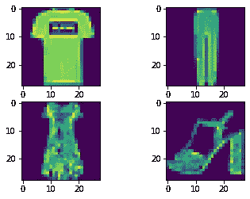
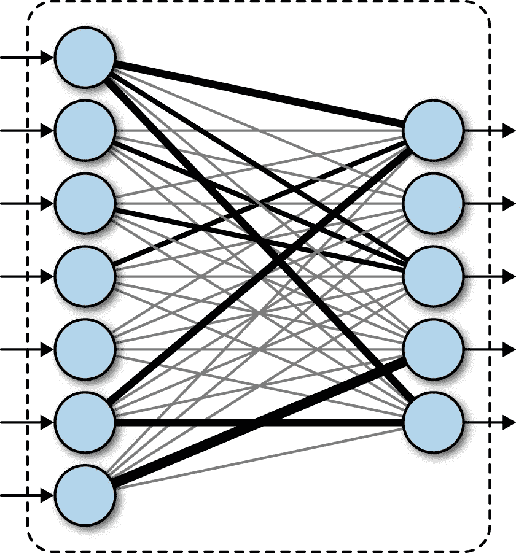
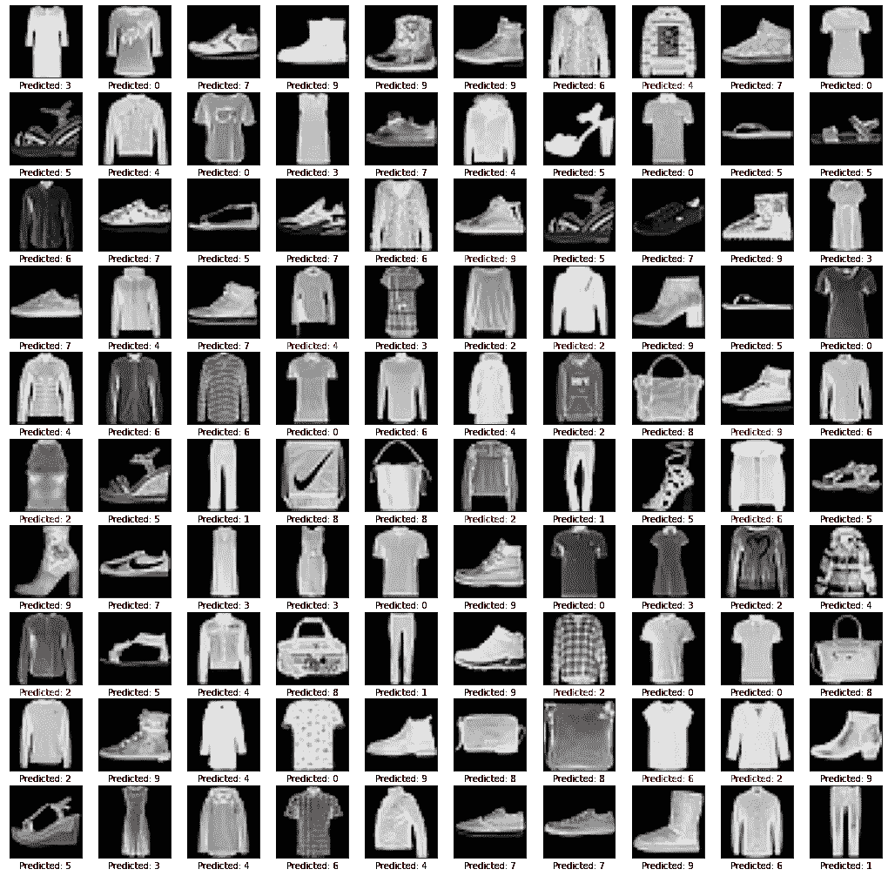

# 时尚服装分类-计算机视觉入门

> 原文：<https://towardsdatascience.com/classifying-fashion-apparel-getting-started-with-computer-vision-271aaf1baf0?source=collection_archive---------59----------------------->

## 通过创建一个对时尚服装图像进行分类的模型，开始学习计算机视觉。

在本指南中，您将训练一个神经网络模型来对衬衫、外套、运动鞋等服装图像进行分类。

> 咻！这对于初学者教程来说听起来太多了，我的意思是我们才刚刚开始，对吗？

不要担心！不要不知所措，不了解全部细节也没关系。相信我，随着你对这篇文章的深入研究，你会了解到所有的细节。

如果你对机器学习完全陌生，我建议你看看我的[初学者教程。](https://dsbootcamp.com/post_hello_world.html)

这里是完成的 [Colab 笔记本](https://colab.research.google.com/drive/1zedUbPfLFFKxzp4N3EdFyBFyr-dILBzM?usp=sharing)和 [GitHub 回购。](https://github.com/navendu-pottekkat/fashion-MNIST-tutorial)

说完了，我们开始吧！

# 数据

我们将使用[时尚-MNIST](https://github.com/zalandoresearch/fashion-mnist) 数据集。它是由 10 种服装的 60，000 个正方形(28x28 像素)灰度图像组成的数据集。

每件衣服都有一个特定的标签:

```
0- T-shirt/top1- Trouser2- Pullover3- Dress4- Coat5- Sandal6- Shirt7- Sneaker8- Bag9- Ankle boot
```


时尚 MNIST 数据集|来源:ZALANDO RESEARCH

# 让我们来看看代码

我们将使用 [TensorFlow](https://www.tensorflow.org/) 和 TensorFlow [Keras](https://keras.io/) 来构建我们的模型。

TensorFlow 是一个机器学习的端到端开源平台。它有一个全面、灵活的工具、库和社区资源的生态系统，让研究人员推动 ML 的最新发展，开发人员轻松构建和部署 ML 驱动的应用程序。

Keras 是 TensorFlow 用于构建和训练深度学习模型的高级 API。

你可以了解更多。现在对这些工具有一个基本的了解就足够了，因为随着时间的推移，你会学到更多关于 TensorFlow 和 Keras 的知识。

> **少说多码！！！**

## 导入库

我们将使用 [numpy](https://numpy.org/) 和 [matplotlib](https://matplotlib.org/) 作为辅助库。

我们从导入所有必需的库开始

## 导入数据

[时尚-MNIST](https://keras.io/api/datasets/fashion_mnist/) 数据在 [Keras 数据集中很容易获得。](https://keras.io/api/datasets/)

我们从 Keras 数据集导入时尚 MNIST 数据

这将把`fashion_mnist`数据加载到 4 个 NumPy 数组中:

*   `train_images`和`train_labels`数组是训练集——模型用来学习的数据。
*   根据测试集、`test_images`和`test_labels`阵列对模型进行测试。

## 探索数据

下面的代码显示有 6000 个训练图像和 1000 个 28x28 像素的测试图像。我们将在训练图像上训练模型，并通过在测试图像上执行预测来测试模型的性能。图像在`train_labels`和`test_labels`中有相应的标记。

我们发现我们加载的数据

```
Train Images Shape: (60000, 28, 28)
Train Labels Shape: (60000,)
Test Images Shape: (10000, 28, 28)
Test Labels Shape: (10000,)
```

现在让我们来看看刚刚加载的数据。

让我们来看看加载的图片！



从时尚 MNIST 数据集中加载的图像

由于像素值介于 0–255 之间，我们将其转换为介于 0 和 1 之间的值。即我们只是将像素值除以 255.0。

使图像正常化

## 创建模型

构建神经网络需要配置模型的层，然后编译模型。

[层](https://keras.io/api/layers/)是神经网络的基本构建模块。他们从输入的数据中提取特征或表示。经过训练后，这些功能将帮助我们解决手头的问题——对时尚服装进行分类。

在这里，我们将链接一些简单的层来创建我们的模型。

我们通过链接层来构建我们的模型

网络的第一层，[TF . keras . layers . flatten](https://www.tensorflow.org/api_docs/python/tf/keras/layers/Flatten)，将 2D 阵列(28×28 像素)的图像转换为 1D 阵列(大小为 28*28 = 784)。它基本上接受输入图像，将每行像素背靠背排列起来。该层仅用于转换数据。

一旦输入图像被展平层转换，网络就有两个 [tf.keras.layers.Dense](https://www.tensorflow.org/api_docs/python/tf/keras/layers/Dense) 层。

这些是井，[密集连接或完全连接的层。](https://medium.com/datathings/dense-layers-explained-in-a-simple-way-62fe1db0ed75)



紧密相连的层

第一密集层有 128 个神经元，第二密集层是我们网络的最后一层，有 10 个神经元。网络的最后一层是输出层，它将提供模型的输出。10 个节点中的每一个都将包含指示当前图像属于 10 个类别之一的概率分数。(请记住，我们的数据中有 10 种服装分类)

## 编译模型

我们几乎准备好训练我们的模型了！在此之前，我们必须再配置一些设置。

[损失函数](https://keras.io/api/losses/):测量模型在训练过程中的精确度。您希望最小化该函数，以便将模型“导向”正确的方向。即，该模型试图通过训练的每一步来最小化损失函数，以改进该模型。

[优化器](https://keras.io/api/optimizers/):优化器更新权重参数，使损失函数最小化。

[指标](https://keras.io/api/metrics/):指标是一个用来判断你的模型性能的函数。度量函数类似于损失函数，只是在训练模型时不使用评估度量的结果。以下模型使用准确度，即图像被正确分类的比例。

我们编译这个模型

你现在不需要知道损失函数[sparse _ categorial _ cross entropy](https://keras.io/api/losses/probabilistic_losses/#sparsecategoricalcrossentropy-class)或 [adam](https://keras.io/api/optimizers/) 优化器的所有细节。如果你需要了解更多，你可以查看文档。现在，掌握什么是损失函数和优化器就足够了。

## 训练模型

为了训练我们的模型，我们简单地将我们的训练数据和标签分别包含在`train_images`和`train_labels`中。

我们称之为`model.fit`方法来“拟合”训练数据的模型。

最后我们训练我们的模型

```
Epoch 1/10
1875/1875 [==============================] - 3s 2ms/step - loss: 0.3768 - accuracy: 0.8636
Epoch 2/10
1875/1875 [==============================] - 3s 2ms/step - loss: 0.3394 - accuracy: 0.8762
Epoch 3/10
1875/1875 [==============================] - 3s 2ms/step - loss: 0.3145 - accuracy: 0.8851
Epoch 4/10
1875/1875 [==============================] - 3s 2ms/step - loss: 0.2965 - accuracy: 0.8902
Epoch 5/10
1875/1875 [==============================] - 3s 2ms/step - loss: 0.2818 - accuracy: 0.8957
Epoch 6/10
1875/1875 [==============================] - 3s 2ms/step - loss: 0.2698 - accuracy: 0.9002
Epoch 7/10
1875/1875 [==============================] - 3s 2ms/step - loss: 0.2582 - accuracy: 0.9043
Epoch 8/10
1875/1875 [==============================] - 3s 2ms/step - loss: 0.2495 - accuracy: 0.9074
Epoch 9/10
1875/1875 [==============================] - 3s 2ms/step - loss: 0.2409 - accuracy: 0.9095
Epoch 10/10
1875/1875 [==============================] - 4s 2ms/step - loss: 0.2324 - accuracy: 0.9137
```

我们可以看到模型训练时显示的损失和准确性指标。随着模型的训练，损耗降低，精度提高。太棒了。你的模特在学习！

## 评估模型

该模型对训练数据的准确率约为 90% (0.90)。您可能有大约 90%的值(不要担心它是否略有不同，因为它可能有一些随机性)

但这还不够！我们还没有测试这个模型。我们现在将在我们的测试数据上测试我们的模型，这是模型从未见过的！让我们看看它的表现如何。

让我们看看我们的模型在测试数据上表现如何！

```
313/313 - 1s - loss: 0.3366 - accuracy: 0.8838

Test accuracy: 0.8838000297546387
```

事实证明，测试数据集上的准确性比训练数据集稍低。这可能意味着我们的模型过度拟合了我们的训练数据。我们现在不用担心这个。在以后的文章中，我们将讨论是什么导致了过度拟合，以及我们如何防止它。

## 做预测

终于！我们现在可以使用我们的模型对图像进行预测。这里我们有一个函数来绘制 100 个随机测试图像和它们的预测标签。如果预测结果与`test_labels`数据集中提供的标签不同，我们将用红色突出显示。

我们构建一个函数来查看模型的预测



我们有一些错误，但对于这样一个简单的模型，它做得相当好！

哇！你做到了！您已经成功地创建了一个模型，它可以查看时尚服装的图像，并以良好的确定性对它们进行分类！仔细想想，只需要几行代码。

我们看到了一些错误，但是对于我们的第一个模型，事情看起来相当不错！

完整的 Colab 笔记本可以在[这里](https://colab.research.google.com/drive/1zedUbPfLFFKxzp4N3EdFyBFyr-dILBzM?usp=sharing)获得，代码也可以在 [GitHub 获得。](https://github.com/navendu-pottekkat/fashion-MNIST-tutorial)

有了 TensorFlow、Keras 和一般机器学习的新知识，您将能够为各种数据集创建自己的模型。此外，您在这里学到的工具和技术是实践中使用的复杂模型的基础。

在接下来的教程中，我们将看看[卷积神经网络](/a-comprehensive-guide-to-convolutional-neural-networks-the-eli5-way-3bd2b1164a53)——一种广泛用于计算机视觉应用的神经网络。我们将看到，我们可以使用 CNN 进一步提高我们的模型的准确性。

**快乐编码！**