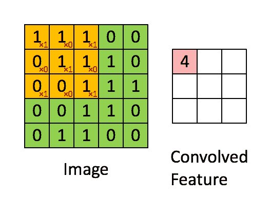

# 时尚服装分类-卷积神经网络入门

> 原文：<https://towardsdatascience.com/classifying-fashion-apparel-getting-started-with-convolutional-neural-networks-3ae4fc5d9f76?source=collection_archive---------52----------------------->

## 通过创建卷积神经网络(CNN)对时尚服装图像进行分类，开始学习计算机视觉。


来源: [Lum3n](https://www.pexels.com/@lum3n-44775) 通过[像素](https://pexels.com)

在本指南中，我们将改进我们在上一节中训练的服装图像分类模型。

如果你是机器学习或使用 [TensorFlow](https://www.tensorflow.org/) / [Keras](https://keras.io/) 的新手，我会建议你看看[第一部分](/classifying-fashion-apparel-getting-started-with-computer-vision-271aaf1baf0)，在那里我们以一种更容易和初学者友好的方式解决了同样的问题。

那好吧。让我简单介绍一下我们将要做的事情:

我们将关注一种新的深度学习神经网络，称为[卷积神经网络](/a-comprehensive-guide-to-convolutional-neural-networks-the-eli5-way-3bd2b1164a53)。它们最常用于计算机视觉应用，非常适合手头的任务。

简而言之，CNN 使网络能够将输入图像视为边缘、角落和颜色的组合，本质上捕捉了图像的内容。

要从更技术性的角度来看 CNN，我建议你浏览一下这篇文章。

在本指南中，我们不会过多地研究 CNN 是如何工作的，而是将重点放在如何使用 [TensorFlow](https://www.tensorflow.org/) 和 [Keras](http://keras.io/) 在代码中实现它。

这里是完成的 [Colab 笔记本](https://colab.research.google.com/drive/19uzZBsMBrfqGQ2H1GefbqDyf1nVM4pUH?usp=sharing)和 [GitHub 回购。](https://github.com/navendu-pottekkat/fashion-MNIST-tutorial)

# 数据

像之前的指南一样，我们将使用[时尚-MNIST](https://github.com/zalandoresearch/fashion-mnist) 数据集。它是由 10 种服装的 60，000 个正方形(28x28 像素)灰度图像组成的数据集。

每件衣服都有一个特定的标签:

```
0- T-shirt/top1- Trouser2- Pullover3- Dress4- Coat5- Sandal6- Shirt7- Sneaker8- Bag9- Ankle boot
```


时尚 MNIST 数据集|来源: [ZALANDO RESEARCH](https://github.com/zalandoresearch/fashion-mnist)

# 代码

我们将使用 [TensorFlow](https://www.tensorflow.org/) 和 TensorFlow [Keras](https://keras.io/) 来构建我们的模型。

我们将通过使用 CNN 作为我们的神经网络来扩展我们的知识。

我们将像在之前的教程中一样预处理图像。如果您不确定，请查看此链接[。](/classifying-fashion-apparel-getting-started-with-computer-vision-271aaf1baf0)

完整的代码可以在 [Colab 笔记本](https://colab.research.google.com/drive/19uzZBsMBrfqGQ2H1GefbqDyf1nVM4pUH?usp=sharing)和 [GitHub repo 中找到。](https://github.com/navendu-pottekkat/fashion-MNIST-tutorial)

在这一部分中，我们将直接开始创建模型。本质上，我们正在将我们新的和改进的 CNN 模型插入到我们以前的代码中。

## 创建模型

我们的模型将一个 28px x 28px 的灰度图像作为输入，输出一个长度为 10 的浮点数组，表示图像是服装的概率。(数据集中有 10 种不同的服装，标记为 0-9)

让我们看看我们的模型，然后我们将通过每一层。

首先，我们添加一个与我们的输入形状匹配的[输入层](https://keras.io/guides/functional_api/)。

然后我们[改变](https://keras.io/api/layers/reshaping_layers/reshape/)输入的形状，增加一个维度来表示我们图像的颜色通道。因为我们示例中的图像是灰度图像，所以颜色通道的数量是 1。

然后，我们有我们的第一个卷积 [Conv2D](https://keras.io/api/layers/convolution_layers/convolution2d/) 层。我们有 32 个内核大小为 3×3 的过滤器。

下面是一张 gif 图，展示了卷积是如何工作的。你可以查看这篇文章了解更多细节。( ***嘘……如果你还没有*** ，我建议你去看看)



卷积在行动！|来源: [vdumoulin](https://github.com/vdumoulin)

接下来，我们有另一个 [Conv2D](https://keras.io/api/layers/convolution_layers/convolution2d/) 层，有 64 个滤镜和 3x3 内核。你可能已经从代码中猜到了。

接下来我们有新的东西，一个[池](https://keras.io/api/layers/pooling_layers/max_pooling2d/)层。

你问什么是池层？为什么说我什么时候可以给你看？我认为这张 gif 是不言自明的。


MaxPooling Layer |来源:[谷歌](https://developers.google.com/machine-learning/practica/image-classification/convolutional-neural-networks)

如果这还不能说明问题，是的，你猜对了，看看我经常提到的那篇文章吧！

接下来是辍学层。它所做的是在训练过程中随机忽略或“丢弃”网络中的一些层。这可以防止网络中的单元过度适应训练数据。

然后，我们展平前一层的输出，并将其传递给一个密集连接的网络，这将是我们的输出层。

最终层中的 10 个节点中的每一个都将包含指示当前图像属于 10 个类别之一的概率分数。(请记住，我们的数据中有 10 种服装分类)

然后，我们像在[之前的指南](/classifying-fashion-apparel-getting-started-with-computer-vision-271aaf1baf0)中一样编译和训练模型。

完整的代码可以在 [Colab 笔记本](https://colab.research.google.com/drive/19uzZBsMBrfqGQ2H1GefbqDyf1nVM4pUH?usp=sharing)和 [GitHub repo 中找到。](https://github.com/navendu-pottekkat/fashion-MNIST-tutorial)

## 评估模型

我们的模型对测试数据有大约 92%的准确率。这比我们以前的型号大约增加了 5%。

```
313/313 [==============================] — 1s 2ms/step — loss: 0.3239 — accuracy: 0.9203 Test accuracy: 0.9203000068664551
```

模型似乎仍然[过度拟合](https://machinelearningmastery.com/overfitting-and-underfitting-with-machine-learning-algorithms/)训练数据。但是我们会把它留到下一次。我们现在不想让事情变得太复杂。

但是有了这个指南，我希望你能够得到在 TensorFlow 和 Keras 中使用 CNN 的 101 指南。在接下来的指南中，我们将看看如何通过使用一种叫做[迁移学习](/a-comprehensive-hands-on-guide-to-transfer-learning-with-real-world-applications-in-deep-learning-212bf3b2f27a)的技术来进一步改进我们的模型。

我们还将学习图像增强技术，以便我们不会用训练数据过度拟合我们的模型。在那之前，

**快乐编码！**