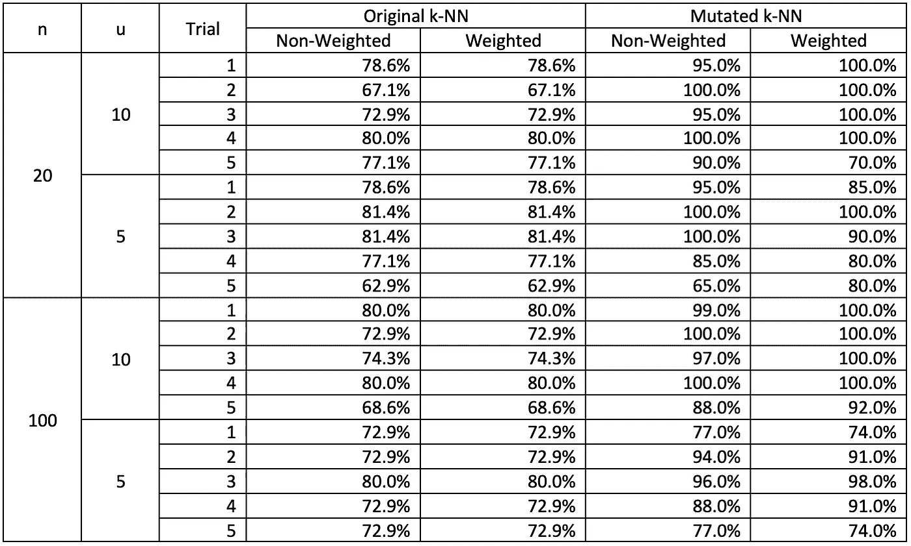

# 分类同质数据，你需要知道的！

> 原文：<https://towardsdatascience.com/classifying-homogeneous-data-what-you-need-to-know-7b3a86e5f855?source=collection_archive---------16----------------------->

## 过去一些研究人员做的很粗略，你应该做得更好！

我在北岭加州州立大学和刘莉教授一起做人机交互(HCI)的硕士论文。在此期间，我发现了一些我们作为数据科学家可以改进的地方。我没有统计学学位，也没有在网上找到以前的相关工作，但我在大量相关论文中看到了这个问题，并决定与大家分享我的发现。我认为我们需要重新考虑处理同质数据的方式。

图片来自 [Pixabay](https://pixabay.com/illustrations/question-mark-important-sign-1872665/)

# 什么是同质数据？

如果一个数据集是由彼此相似的事物组成的，那么它就是同构的。在本文的范围内，它意味着来自完全相同来源的数据。在监督学习的典型场景中，这将导致数据集在整个集合中具有完全相同的标签。

# 人们是如何处理同质数据的？

[费边论文](http://www.cs.columbia.edu/4180/hw/keystroke.pdf)中的非加权概率和

在大多数过去的研究中，比如[法比安关于击键动力学的论文](http://www.cs.columbia.edu/4180/hw/keystroke.pdf)，研究人员会根据所有计算出的概率的总和来评分。

人工神经网络的 soft-max 层本质上做同样的事情。它向网络的下一层中的节点输出加权和。

这背后的直觉很简单:

> 直觉:如果更多的推理倾向于一个结果，那么这个结果最有可能是正确的。

但远非完美…

# 我们在处理同质数据时遇到了什么问题？

概率总和背后的直觉是强大的，但远非完美。考虑这样一种情况，我们有两类数据，分别标记为 A 和 B。数据的分布如下图所示，其中 B 的分布区域由 A 包围。现在，如果我们发现样本来自区域 B，则样本可能具有标签 A 或 B。

典型数据分布图

当两个标签的样本数量相似时，我们可以获取多个样本，然后判断它们属于 B 类。这是因为 B 区域较小，因此 B 类的密度较高。因此，在 B 区域中，B 类比 a 类更有可能被找到。概率总和仍然有效。然而，如果标签为 B 的样本少得多，或者如果区域大小相似且重叠而不是封闭，我们可能会从 A 类获得比 B 类更多的样本，并且无法正确地对其来源进行分类。

调整与偏差成比例的概率和的权重肯定会有助于这些情况，但这种近似是粗略的…

# 我们应该如何处理同质数据？

在我们开始之前，让我们做 3 个假设:

1.  多个获得的样本来自相同的来源。
2.  抽样过程在概率上是独立的。
3.  每个等级在他们的区域内都有一个概率分布。

现在我们可以考虑下面展示的两种直觉。为简单起见，让我们假设在每个区域内均匀分布。

典型数据分布图

> 直觉 1:如果样本来自 A 区但在 B 区之外，那么来源就是 A 类。
> 
> 直觉 2:如果样本总是在区域 B 内，那么源极有可能是 B 类。

据此，我们可以推导出以下等式:

具有特定标注的采样要素的概率

现在让我们假设两个圆内均匀分布的点。假设红色圆圈 A 覆盖的面积是蓝色圆圈 B 的两倍，并且每个标签的样本数量相等。然后，如果我们随机选择一个位于蓝色圆圈内的点，因为红色点的密度是一半，所以选择的点实际上有 2 / 3 的机会属于蓝色区域。

如果我们从蓝色圆圈内进行 10 次观察，总几率不会改变。但是如果我们应用我们的新技术，我们会得到:

当我们已经看到 10 个样本都来自蓝色圆圈内时，这是一个更有可能的估计。

# 变异 k-NN 的性能

为了测试这一点，我创建了自己版本的 k-NN。它是原始 k-NN 的变异版本。[这里](/how-to-build-a-k-nn-in-node-js-without-tensorflow-cac5753daa87)是如何在 Node.js 中基于 k-d 树构建自己的 k-NN 的教程。输入数据来自我最近的一个实验，正如你所看到的，这些点彼此重叠。

重叠数据

性能如下表所示，其中 *n* 是选择 *u* 样本的次数。由于变异的 k-NN 的性能由于数据量小而不稳定，所以用随机混洗的数据进行了多次实验。

变异 k-NN 的性能

正如我们所看到的，变异后的 k-NN 总体上确实有超越性的表现。只有当数据分布在如上所述的封闭或严重重叠的情况下，性能改进才会更好。这将为我们处理这些类型的数据提供一些见解。

# 注释在最后…

我希望这篇文章对你有所帮助。我是一名计算机专业的学生，对很多事情都感兴趣。写作也是我的爱好，因为我喜欢把事情弄清楚并与他人分享，所以如果你在 Medium 上跟随我，你会看到更多这样的事情。

如果你感兴趣的话，我还有一篇关于我在数据科学领域的发现的非常老的文章:

[苹果的失败如何给我们数据科学家上了一课](https://medium.com/@shenhuang_21425/how-apples-failure-teaches-data-scientist-a-lesson-b654489096b9)