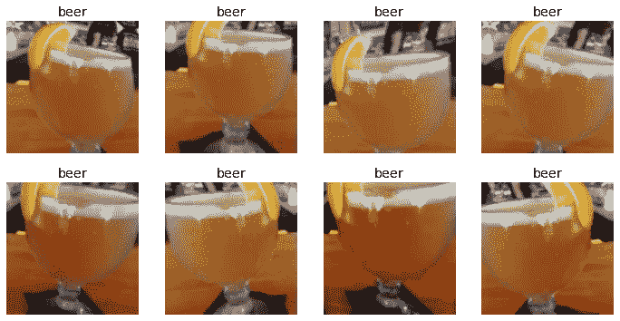

# 利用 fast.ai v2 对酒精饮料图像进行分类

> 原文：<https://towardsdatascience.com/classifying-images-of-alcoholic-beverages-with-fast-ai-34c4560b5543?source=collection_archive---------16----------------------->

## [实践教程](https://towardsdatascience.com/tagged/hands-on-tutorials)

## U sing fast.ai v2 和 Google Colab 提供令人陶醉的数据和 dram 混合服务


照片由 [Q.U.I](https://unsplash.com/@quinguyen?utm_source=unsplash&utm_medium=referral&utm_content=creditCopyText) 在 [Unsplash](https://unsplash.com/s/photos/alcohol?utm_source=unsplash&utm_medium=referral&utm_content=creditCopyText) 上拍摄

# 动机

我已经开始沉浸在更新的 fast.ai v2 深度学习课程中，我觉得应用和记录我迄今为止所学的东西将是理想的。在这篇文章中，我将分享我如何训练深度学习(CNN)分类器来区分不同类型的流行酒精饮料。

本演练的一个重要亮点是，它详细介绍了有关如何利用更新的 Microsoft Azure Bing Search V7 API 的最新说明，因为关键更改已于 2020 年 10 月 30 日实现。

# 链接

*   [GitHub 回购](https://github.com/kennethleungty/Alcohol-Image-Classifier-fastai)
*   [Jupyter 笔记本(完整版)](https://github.com/kennethleungty/Alcohol-Image-Classifier-fastai/blob/main/Alcohol_Image_Classifier_Full_Version.ipynb)
*   [Jupyter 笔记本(干净版)](https://github.com/kennethleungty/Alcohol-Image-Classifier-fastai/blob/main/Alcohol_Image_Classifier_Clean_Version.ipynb)

# 内容

> *第 1 节—设置*
> 
> *第 2 部分—下载图像数据*
> 
> *第 3 节—准备图像数据集*
> 
> *第 4 部分——训练模型*
> 
> *第 5 节—清理数据*
> 
> *第 6 节—使用图像分类器进行推理*
> 
> *第 7 部分—部署为 Web 应用*

# 第 1 部分—设置

首先，我强烈推荐在 Google Colab 上运行这款笔记本。要了解更多关于 Google Colab 设置的信息，请访问此[链接](https://course.fast.ai/start_colab)。

一旦这台笔记本在 Google Colab 上打开，**打开笔记本的 GPU 加速器，方法是前往顶部菜单，单击**`**Runtime**`**>**`**Change runtime type**`**>，选择** `**GPU**` **作为硬件加速器。**

接下来，在 Google Colab 运行时上安装 Google Drive。将出现一个链接，供您点击并检索您的授权码。授予 Google Drive 文件流的权限后，复制提供的代码，将其粘贴到“输入您的授权码”下的字段中，然后按 Enter 键。

```
from google.colab import drive
drive.mount('/content/drive/')
```

下一步是安装 fast.ai 依赖项。我发现这种依赖版本的组合在 Google Colab 上工作得很顺利。

```
!pip install fastai==2.0.19
!pip install fastai2==0.0.30
!pip install fastcore==1.3.1
!pip install -Uqq fastbookimport fastbook
from fastbook import *
fastbook.setup_book()
from fastai.vision.widgets import *

import warnings
warnings.filterwarnings("ignore")

import requests
import matplotlib.pyplot as plt
import PIL.Image
from io import BytesIO
import os

from IPython.display import Image
from IPython.core.display import HTML
```

然后，我们创建一个路径来存储将要下载的图像。注意，结果目录路径将是`/content/images`。

```
try:
  os.mkdir('images')
except:
  pass
```

之后，我们需要检索 Azure Bing Search V7 的 API 密钥，因为我们将使用它从 Bing 中提取图像数据集。要了解更多关于在微软 Azure 门户中设置 Bing 搜索 API 密钥的信息，请查看我的 GitHub repo 中的[自述文件](https://github.com/kennethleungty/Alcohol-Image-Classifier-fastai/blob/main/README.md)，以及微软 Azure Bing 搜索 API [快速入门指南](https://docs.microsoft.com/en-us/bing/search-apis/bing-image-search/quickstarts/rest/python)。

```
subscription_key = "XXX" #Replace XXX with your own API key
search_url = "https://api.bing.microsoft.com/v7.0/images/search"
headers = {"Ocp-Apim-Subscription-Key" : subscription_key}
```

一旦关键字被输入到`subscription_key`变量中，我们就可以检索一组与您选择的关键字相关的图像 URL。例如，为了找到`whisky`的一组图像，我们运行以下代码:

```
search_term = "whisky"#Add in count parameter so that max number of images (150) is  #retrieved upon each API call. Otherwise, default is 35.params  = {"q": search_term, "license": "public", "imageType": "photo", "count":"150"}response = requests.get(search_url, headers=headers, params=params)
response.raise_for_status()# Return json file
search_results = response.json()# Create a set of thumbnails for visualization
thumbnail_urls = [img["thumbnailUrl"] for img in search_results["value"][:16]]
```

我们可以创建一个 4 x 4 的缩略图网格图来可视化检索到的图像，允许我们验证这些图像确实代表了我们的关键字`whisky`。从展示的内容来看，我觉得这的确很像上好的老威士忌。

```
f, axes = plt.subplots(4, 4)
for i in range(4):
    for j in range(4):
        image_data = requests.get(thumbnail_urls[i+4*j])
        image_data.raise_for_status()
        image = Image.open(BytesIO(image_data.content))        
        axes[i][j].imshow(image)
        axes[i][j].axis("off")
plt.show()
```


下一步是整理来自搜索结果 JSON 文件的图像 URL 列表。与图像 URL 相关联的关键字是`contentUrl`。

```
img_urls = [img['contentUrl'] for img in search_results["value"]]
len(img_urls)
```

`len`函数应该会返回一个与关键字`whisky`相关的 150 个图片 URL 的列表。然后，我们从 URL 下载并显示一张图片到我们的`images`文件夹中名为`whisky_test.jpg`的**dest**ining 文件中。

```
dest = 'images/whisky_test.jpg'
download_url(img_urls[1], dest)img = Image.open(dest)
img.to_thumb(224,224)
```


我们得到了上面的威士忌图片，显示上面的代码块完美地工作。我们现在准备好了主要的行动。

# 第 2 节—下载图像数据

*更新:由于图片下载方式是动态的，请参考 fast.ai* [*图片部分*](https://course.fast.ai/images) *了解图片下载的最新方式*

区分常见酒类的图像会很有趣，即**威士忌、葡萄酒和啤酒。为此，我们首先在一个列表中定义三种酒精类型，并创建一个`Path`来存储我们稍后将要下载的图像。**

```
alcohol_types = ['whisky','wine','beer']
path = Path('alcohol')
```

对于三种酒精类型中的每一种，我们都创建了一个子路径来存储图像，然后从整理好的图像 URL 中下载图像。

```
if not path.exists():
    path.mkdir()
    for alc_type in alcohol_types:
        dest = (path/alc_type)
        dest.mkdir(exist_ok=True)

        search_term = alc_type
        params  = {"q":search_term, "license":"public",   
                   "imageType":"photo", "count":"150"}
        response = requests.get(search_url, headers=headers, 
                   params=params)
        response.raise_for_status()
        search_results = response.json()
        img_urls = [img['contentUrl'] for img in   
                    search_results["value"]]

        # Downloading images from the list of image URLs
        download_images(dest, urls=img_urls)
```

现在，我们应该将图像下载到带有酒精类型标签的相应文件夹中。为了证实这一点，我们可以利用`get_image_files`函数。

```
img_files = get_image_files(path)
img_files(#445) [Path('alcohol/beer/00000069.jpeg'),Path('alcohol/beer/00000007.jpg'),Path('alcohol/beer/00000092.jpg'),Path('alcohol/beer/00000054.jpg'),Path('alcohol/beer/00000082.jpg'),Path('alcohol/beer/00000071.jpg'),Path('alcohol/beer/00000045.jpg'),Path('alcohol/beer/00000134.jpg'),Path('alcohol/beer/00000061.jpg'),Path('alcohol/beer/00000138.jpg')...]
```

另一种验证下载的方法是点击 Google Colab 屏幕左侧导航栏上的文件图标，并导航至`content` > `alcohol`以查看各自的文件夹。

之后，我们需要检查我们下载的文件是否损坏。幸运的是，fastai 通过`verify_images`函数提供了一种方便的方法来实现这一点。

```
failed = verify_images(img_files)
failed
```

然后我们可以使用`map`和`unlink`方法从数据集中移除这些损坏的文件(如果有的话)。

```
failed.map(Path.unlink)
```

# 第 3 节-准备影像数据集

fastai 有一个叫做*数据块 API* 的灵活系统。有了这个 API，我们可以完全定制`DataLoaders`对象的创建。`DataLoaders`可以存储我们放置在其中的任何`DataLoader`对象，并用于随后生成训练集和验证集。

在我的理解中，`DataLoaders`本质上是一个对象，它存储了关于我们将要运行模型的数据的信息。`DataBlock`基本上是一个创建`DataLoaders`的模板函数。

```
alcohols = DataBlock(
    blocks=(ImageBlock, CategoryBlock), 
    get_items=get_image_files, 
    splitter=RandomSplitter(valid_pct=0.2, seed=1),
    get_y=parent_label,
    item_tfms=Resize(128))
```

让我们一部分一部分地看一下上面的代码:

```
*blocks=(ImageBlock, CategoryBlock)*
```

这个`blocks`元组分别表示我们的*独立*和*相关*变量的数据类型。因为我们的目标是对图像进行分类，我们的自变量是图像(`ImageBlock`)，而因变量是类别/标签(`CategoryBlock`)

```
*get_items=get_image_files*
```

`get_items`参数指定要使用的函数，以便提取数据集中图像的文件路径。回想一下，我们之前使用 fastai 内置的`get_image_files`将文件路径放入变量`img_files`。这个`get_image_files`函数获取一个路径(我们将在后面指定)，并返回该路径中所有图像的列表。

```
*splitter=RandomSplitter(valid_pct=0.2, seed=1)*
```

`splitter`方法将把数据集分成训练集和验证集。我们指定`RandomSplitter`来确保它被随机分割，其中的`valid_pct`参数用于指示数据集的多大比例将被分配为验证集。也可以在`RandomSplitter`中设置随机种子，以实现结果的再现性。

```
*get_y=parent_label*
```

`parent_label`是 fastai 提供的一个函数，用来获取图像文件所在文件夹的名称。由于我们已经将图像放在具有各自酒类名称的文件夹中，这个`parent_label`将返回文件夹名称*威士忌、葡萄酒*和*啤酒*。

```
*item_tfms=Resize(128)*
```

我们通常使用将图像调整为正方形，因为这样做更容易，因为原始图像可以有不同的高度/宽度和纵横比。为此，我们对每个项目(`item_tfms`)执行转换，将它调整为 128x128 像素的正方形。

既然已经提供了所有的细节和参数，我们就可以用下面的单行代码启动数据加载器了。请注意，`dataloaders`的参数是存储图像的`path`，即`alcohol`文件夹路径。

```
dls = alcohols.dataloaders(path)
```

让我们通过展示我们的验证集中的 10 个图像的子集来简要地看一下这些图像

*注:以下显示的图像缩略图是验证数据下载是否正确的好方法。以前当我运行这段代码时，我意识到我没有相应地更新搜索词，导致所有图像都是威士忌。如果操作正确，接下来的一批应该会显示来自不同类别的大量图像。*

```
dls.valid.show_batch(max_n=12, nrows=2)
```


## 演示数据增强的工作原理

在继续下一步之前，有必要讨论一下数据扩充的概念。为了丰富我们的训练数据集，我们可以创建输入数据的随机变化，使它们看起来不同，但实际上不会改变数据的原始含义和表示。

一种常见的方法包括`RandomResizedCrop`，它抓取原始图像的随机子集。我们使用`unique=True`用不同版本的`RandomResizedCrop`变换来重复相同的图像。

发生的情况是，在每个时期(这是一个完整的通过我们在数据集中的所有图像)，我们随机选择每个图像的不同部分。这意味着我们的模型可以学习识别我们图像中的不同特征。它还反映了图像在现实世界中的工作方式，因为同一件物品的不同照片可能会以略微不同的方式取景。使用项目转换的好处是，它反过来有助于防止过度拟合。

指定的`min_scale`参数决定了每次最少选择多少图像。有了以上所有的决定，我们可以使用`.new`方法创建一个新的`DataBlock`对象，并运行它来给我们一个名为`dls`的新的`DataLoaders`对象。

```
alcohols = alcohols.new(item_tfms=RandomResizedCrop(128, min_scale=0.3))
dls = alcohols.dataloaders(path)
dls.train.show_batch(max_n=8, nrows=2, unique=True)
```


在项目转换(`item_tfms`)之后，我们运行批量转换(`batch_tfms`)，在批量单个项目上应用一组标准的数据扩充转换(`aug_transforms()`)。

`item_tfms`和`batch_tfms`的区别在于`item_tfms`对每个单独的项目(如图像)进行转换，而`batch_tfms`对整批项目进行转换。

以下代码说明了增强变换`aug_transforms`对单个输入图像的影响。你将能够观察到某种形式的旋转、视角扭曲和对比度变化。

```
alcohols = alcohols.new(item_tfms=Resize(128), batch_tfms=aug_transforms())
dls = alcohols.dataloaders(path)
dls.train.show_batch(max_n=8, nrows=2, unique=True)
```



# 第 4 部分—训练模型

现在，图像已经准备好了(尽管还没有清理)，我们可以开始训练，立即构建一个简单的深度学习模型。首先，我们用下面的代码准备好`DataLoaders`对象。在这个迭代中，我们以 224x224 像素的尺寸调整和裁剪我们的图像，`min_scale`为 0.5。

```
alcohols = alcohols.new(
    item_tfms=RandomResizedCrop(224, min_scale=0.5),
    batch_tfms=aug_transforms())
dls = alcohols.dataloaders(path)
```

卷积神经网络(CNN)是用于图像分类的事实上的神经网络类型，这就是我们将要使用的。架构方面，我对`cnn_learner` fast.ai 函数任意选择了 resnet34(即 34 层深)。resnet 的细节可以在[这里](/an-overview-of-resnet-and-its-variants-5281e2f56035)找到。

我们使用`.fine_tune`方法而不是`.fit`方法，因为我们利用预训练的 resnet 模型来执行迁移学习。我们指定历元的数量为 4(即`.fine_tune`中的参数)。

```
learn = cnn_learner(dls, resnet34, metrics=error_rate)
learn.fine_tune(4)
```


从上面我们可以看到，在训练我们的 CNN 学习者几分钟后，我们获得了 0.229 的`error_rate`(即 77.1%的准确率)。考虑到我们还没有清理数据集，这是一个不错的开始。

使用混淆矩阵可以更好地可视化结果。

```
interpretation = ClassificationInterpretation.from_learner(learn)
interpretation.plot_confusion_matrix()
```


fast.ai 还提供了一种简单的方法，让我们可以找出哪些图像的丢失率最高。如果模型是不正确的(特别是如果它也对其不正确的答案有信心)，或者如果它是正确的，但对其正确的答案没有信心，则损失是较高的数字。这些帮助我们识别模型有问题的图像。

```
interpretation.plot_top_losses(5, nrows=1)
```


从上面来看，似乎有些问题源于几个实际标签贴错了，而不是预测错了。

例如，行中间的图像很明显是一品脱啤酒的图像(这正是模型所预测的)。然而，分配给它的实际标签是威士忌，这是不正确的。这凸显了在训练任何类型的机器学习模型之前，拥有正确标记的数据(尽可能多)的重要性。

## 第 5 节—清理数据

请注意，我们在清理数据之前运行了模型。事实上，这样做使得数据清理更加容易。如上图所示，`plot_top_losses`已经可以指出哪些图像是模型最难处理的。

通过内置的 fast.ai `ImageClassifierCleaner`图形用户界面(GUI)小部件，数据清理过程变得很容易。

```
cleaner = ImageClassifierCleaner(learn)
cleaner
```


显示的图像行是损失最大的图像，这个 GUI 为您提供了查看和修改它们的机会。

清理是通过为上面的每个图像选择一个下拉选项，然后反复运行“清理”代码来完成的。由于网上的解释不清楚，我花了一些时间来弄清楚这个问题，所以这里有一些进一步的细节:

*   **步骤 1** :在`cleaner`输出单元中加载一行图像(如葡萄酒类别的训练集)后，根据您自己的判断，为您希望编辑的图像选择一个下拉选项。选项包括从数据集中删除图像，或将图像移动到新的类别中。如果不需要更改，则不需要选择任何选项，因为默认选项是<保持>。
*   **步骤 2** :一旦你完成了显示的图像行的选项更新，运行下面的“清理”代码来执行更改。

```
# Delete images marked as delete
for idx in cleaner.delete(): cleaner.fns[idx].unlink()

# Update category of image to the newly specified category by moving # it into the appropriate folder
for idx,cat in cleaner.change(): shutil.copyfile(cleaner.fns[idx], path/cat)
```

`cleaner.delete`删除您标记为<删除>的图像，同时`cleaner.change`将图像转移到带有更新标签的文件夹中。

*   **步骤 3:** 再次返回到带有该行图像的`cleaner`单元格，并通过下拉菜单切换到一组新的图像，例如啤酒类别的验证组或威士忌类别的训练组
*   **步骤 4:** 加载新一行图像后，选择每个图像的相关下拉选项，然后重新运行“清理”代码
*   **第 5 步**:对每个数据集重复第 3 步和第 4 步，直到所有数据集至少被检查一次。

## 数据清理后重新训练模型

```
dls = alcohols.dataloaders(path)
learn = cnn_learner(dls, resnet34, metrics=error_rate)
learn.fine_tune(4)
```


通过一点点数据清理(主要是通过用`.unlink`方法移除不相关的图像)，我们看到了`error_rate`的巨大改进(从 0.229 降低到 0.096)。这意味着准确率从更早的 77.1%(数据清理前)提高到了现在的 90.4%。

```
interpretation = ClassificationInterpretation.from_learner(learn)
interpretation.plot_confusion_matrix()
```


从上面的混淆矩阵中，我们可以清楚地看到，该模型在区分三种类型的酒精饮料方面变得更好。

训练完成后，我们希望导出模型，以便保存架构、训练参数和`DataLoaders`设置。这些都要存到泡菜里(。pkl)文件。

```
learn.export()path = Path()
path.ls(file_exts='.pkl')(#1) [Path('export.pkl')]
```

# 第 6 节—使用图像分类器进行推理

在加载包含我们深度学习图像分类模型信息的 pickle 文件后，我们可以用它来推断(或预测)新图像的标签。模型现在被加载到学习变量`learn_inf`中。

```
learn_inf = load_learner(path/'export.pkl')
```

我们使用一个样本图像来测试我们的模型

```
# Sample image
ims = ['https://alcohaul.sg/products/i/400/5f7edfe79ae56e6d7b8b49cf_0.jpg']
dest = 'images/test_whisky.jpg'
download_url(ims[0], dest)im = Image.open(dest)
im.to_thumb(224,224)
```


我们的样本图像是日比喜和谐威士忌的图像。让我们看看我们的模型是否能够识别它的类别。

```
learn_inf.predict('images/test_whisky.jpg')('whisky', tensor(1), tensor([4.1783e-04, 9.9951e-01, 7.0310e-05]))learn_inf.dls.vocab['beer', 'whisky', 'wine']
```

看起来一切都很好。该模型能够以高置信度确定测试图像代表威士忌的图像(概率为 99.95%)。

# 第 7 部分—部署为 Web 应用程序

让我们简单探讨一下模型的部署。我们首先为用户创建一个按钮，上传他们希望分类的新图像。

然后，我们利用`PIL.Image.create`方法检索上传的图像，并将其存储在`img`变量中

```
btn_upload = widgets.FileUpload()
btn_upload
```


```
# Retrieving the uploaded image
img = PIL.Image.create(btn_upload.data[-1])
```

然后我们设置一个`Output`小部件来显示上传的图像。

```
out_pl = widgets.Output()
out_pl.clear_output()
with out_pl: display(img.to_thumb(224,224))
out_pl
```


用户上传了一张 Talisker 18 威士忌图片。现在是时候再次测试我们建立的模型的分类能力了。

```
pred,pred_idx,probs = learn_inf.predict(img)lbl_pred = widgets.Label()
lbl_pred.value = f'Prediction: {pred}; Probability: {probs[pred_idx]:.04f}'
lbl_pred
```


从上面可以看出，我们的模型确实预测图像是威士忌的图像(概率为 99.65%)。我们现在可以继续构建我们的 web 应用程序，包括一个运行按钮，供用户单击并启动分类过程。

```
btn_run = widgets.Button(description='Classify Image')
btn_runButton(description='Classify Image', style=ButtonStyle())
```


然后我们设置一个回调，这样上面的按钮可以在点击时执行特定的功能。我们想要的是，每当用户为他/她上传的图像单击“分类图像”时，分类模型就会运行，然后生成分类预测。

```
def on_click_classify(change):
    img = PIL.Image.create(btn_upload.data[-1])
    out_pl.clear_output()
    with out_pl: display(img.to_thumb(128,128))
    pred,pred_idx,probs = learn_inf.predict(img)
    lbl_pred.value = f'Prediction: {pred}; Probability: {probs[pred_idx]:.04f}'

btn_run.on_click(on_click_classify)
```

现在，将所有这些放在一个 VBox 中，这样小部件就可以很好地排列在我们笔记本中的垂直 web 应用程序模板中。

```
VBox([widgets.Label('Select your alcohol!'), 
      btn_upload, btn_run, out_pl, lbl_pred]
```


# **进一步的步骤**

为了在笔记本之外部署这个应用程序，我们可以利用`Voila`来创建一个真正独立的应用程序(基于 Jupyter 笔记本)。

由于这方面超出了本笔记本的范围，请随意在这里探索 Voila [的细节。](https://voila.readthedocs.io/en/stable/using.html)

# 结论

至此，本教程到此结束。我们讨论了端到端的建模体验，从 fast.ai 和 Google Colab 设置，到数据摄取，一直到为我们构建的模型设置一个简单的 web 应用程序。

随着我继续 fast.ai 学习之旅，我将继续发布进一步的演练。同时，喝一杯的时间到了。干杯！

# 在你走之前

欢迎您**加入我的数据科学学习之旅！**点击此[媒体](https://kennethleungty.medium.com/)页面，查看我的 [GitHub](https://github.com/kennethleungty) ，了解更多令人兴奋的数据科学内容。