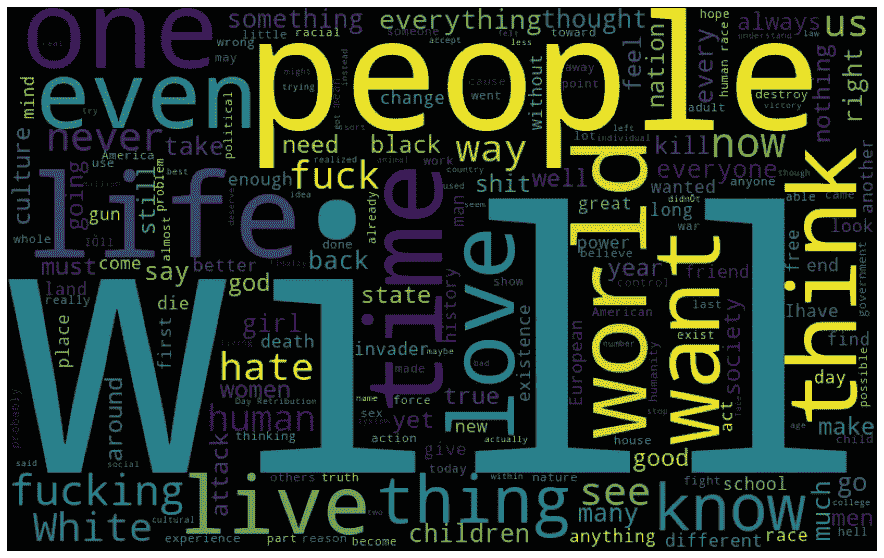

# 利用深度迁移学习对大众射手宣言进行分类

> 原文：<https://towardsdatascience.com/classifying-mass-shooter-manifestos-with-deep-transfer-learning-f80576aabdf7?source=collection_archive---------49----------------------->

## 使用 TextCNN 和 ManifestoCorpus 的深度迁移学习教程

蒂姆·马德在 [Unsplash](https://unsplash.com?utm_source=medium&utm_medium=referral) 上的照片

# **简介**

在美国，大规模枪击事件以惊人的速度发生。尽管存在与大规模枪击事件和公众反应间接相关的分类任务，但没有太多关注大规模枪击事件宣言本身。Mass shooter manifestos 的规模天生有限，这就是使用 TextCNN 等深度学习模型的迁移学习如何帮助正确分类小型数据集，如 ManifestoCorpus，这是一种为此目的制作的新数据集。Keras 发布了一个[开发者指南](https://keras.io/guides/transfer_learning/)，用于迁移学习和微调，供那些希望进一步了解最新实现的人使用。我在乌普萨拉大学的顶点项目的所有代码都可以在我的 [GitHub](https://github.com/perkdrew/mass-shooter-deep-transfer) 上找到，包括其他分类任务和模型。

# **迁移学习**

NLP 有不同类型的迁移学习，可以根据源域和目标域是否完成相同的任务、源域和目标域的确切性质以及学习任务的精确顺序来粗略定义。任何迁移学习背后的直觉是，我们正在利用来自基础模型的知识来从受约束的数据集中获得洞察力。

出于 NLP 的目的，两个不同的领域朝着一个共同的任务努力，在源领域包含唯一的标记数据的情况下，领域适应是最常见的迁移学习类型。出于这里的目的，ManifestoCorpus 是由源数据集设置的标准手动标记的。在迁移学习中，通常还会改变基本模型，如层和参数，以适应再训练期间的特定目标数据集。这是通过在预训练期间冻结基本模型(即特征提取器)层和在再训练期间解冻微调模型来实现的。

# **数据**

**源数据** 使用 Kaggle 提供的[sensition 140 数据集](https://www.kaggle.com/kazanova/sentiment140)作为源数据集。最初的数据集包括 160 万条推文，但我在训练中只包括了 16 万条推文。我将正面、负面和中性推文的标签二值化为非负面和负面的标签。
**目标数据** ManifestoCorpus 包含 425 段大规模射手宣言和 425 段普通宣言。对于目标数据集，为每个分类任务手动标记文本，以最好地反映其源数据集的注释，交叉引用相关作品的人类注释者作为标记的动机。有二进制、多类和多标记数据集，但这里我们只看否定和非否定段落的二进制分类。

大众射手常用词

# **实现**

首先，必须为基础模型准备好源数据集。我们在这里采取了一些额外的步骤来移除来自 Twitter 数据的杂波文本。

之后，我们为微调后的模型准备目标数据集。不像手动管理的数据那样需要清理。

我们将希望建立将在 TextCNN 的嵌入层中使用的单词嵌入。这里我们用手套。

现在，我们可以开始为一个为情感分析而设计的 CNN 构建基础和微调模型。实现遵循 Géron 的优秀*动手机器学习中的迁移学习教程，使用 Scikit-Learn、Keras 和 TensorFlow。*

重要的变化是我们选择在模型之间解冻哪些层。我们通过将感兴趣的层的可训练权重参数从假变为真来冻结和解冻层。我们解冻前四层，并在全连接层之前向微调模型添加几个卷积层。

最终评估是通过 Scikit-Learn 中的精度、召回率和 F1 的分类报告进行的。

# 结果

在我的发现中，阴性标签产生了 73%的准确率、66%的召回率和 69%的 F1，而非阴性标签产生了 71%的准确率、78%的召回率和 75%的 F1。非负面标签更容易分类和概括。这并不奇怪，因为非否定性文本的宽度比否定性文本宽。宣言和推文的领域可能太不一样了，也不适合更强的表现。ManifestoCorpus 也有其固有的偏见和局限性，但据我所知，它是唯一一个将 NLP 应用于大量射手文本的数据集。我们可以预期，伯特或 UMLFit⁴等最先进的语言模型将通过简单的软件包在迁移学习中取得更有前途的结果。自从这个顶点项目完成以来，NLP 的迁移学习在很短的时间内取得了很大的进展。请随意使用 ManifestoCorpus！

[1]:杰森·布朗利。(2017 年 12 月 20 日)。*深度学习的迁移学习的温柔介绍*[https://machinelingmastery . com/Transfer-Learning-for-Deep-Learning/](https://machinelearningmastery.com/transfer-learning-for-deep-learning/)

[2]:奥雷连·盖伦。(2019 年 9 月)。*使用 Scikit-Learn、Keras 和 TensorFlow 进行机器实践学习，第二版*

[3]:威廉·法尔孔。(2019 年 11 月 25 日)。 *Lit BERT: NLP 迁移学习 3 步走。*[https://towards data science . com/lit-Bert-NLP-transfer-learning-in-3-steps-272 a 866570 db](/lit-bert-nlp-transfer-learning-in-3-steps-272a866570db)

[4]: Akhilesh Ravi。(2019 年 11 月 23 日)。了解 ul mfit—NLP 中向迁移学习的转变*。*[https://towards data science . com/understanding-ul mfit-and-elmo-the-shift-forward-transfer-learning-in-NLP-b 5d 8 e 2e 3 f 664](/understanding-ulmfit-and-elmo-the-shift-towards-transfer-learning-in-nlp-b5d8e2e3f664)