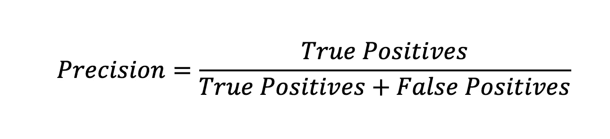
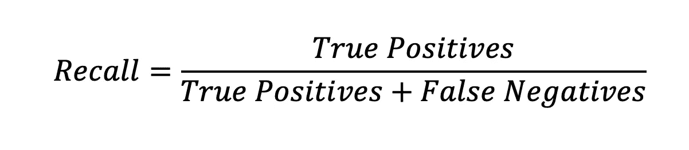

# 评估机器学习模型的性能

> 原文：<https://towardsdatascience.com/classifying-model-outcomes-true-false-positives-negatives-177c1e702810?source=collection_archive---------10----------------------->

## 评估模型的最常见和最快速的方法之一

凯文·Ku 在 [Unsplash](https://unsplash.com/s/photos/classification-coding?utm_source=unsplash&utm_medium=referral&utm_content=creditCopyText) 上的照片

有多种方法可以评估机器学习模型的表现。然而，本文将介绍一种最常见、最快速的方法来评估模型的性能，这种方法被称为 Precision 和 Recall。

# 分类模型结果

在我们进入精确和回忆之前，我们必须首先理解真正的阳性、真正的阴性、假阳性和假阴性结果分类的含义。

为了更好地理解这些结果分类，假设我们正在建立一个分类模型来确定患者是否患有癌症。在这种情况下，因为我们的模型的目的是试图预测患者是否患有癌症，所以如果患者患有癌症，则**阳性结果**将是，并且可以理解的是，如果患者没有患有癌症，则**阴性结果**将是。

## 真阳性

真阳性(TP)是模型正确预测*的 ***阳性结果*** 。*

*在我们的例子中，这意味着被模型预测为患有癌症的患者确实患有癌症。*

## *真正的否定*

*真阴性(TN)是模型正确预测*的 ***阴性结果*** 。**

**在我们的例子中，这意味着被预测为健康的患者确实没有患癌症。**

## **假阳性**

**假阳性(FP)是模型错误预测*的 ***阳性结果*** 。这也称为 I 型误差。***

**在我们的例子中，这意味着被预测患有癌症的患者实际上是健康的。**

## **假阴性**

**假阴性(FN)是模型错误预测*的*阴性结果。这也被称为第二类错误。****

***在我们的例子中，这意味着被预测为健康的患者实际上患有癌症。***

# ***精确度与召回率***

***尽管 TP、TN、FP 和 FN 值可以为数据科学家提供模型性能的一些指示，但很难在不参考其他值的情况下单独对每个值进行数值评估。这就是为什么数据科学家经常使用**精度**和**召回**来评估模型。***

## ***精确***

***精确度是积极的(或相关的)结果的百分比。计算如下:***

******

***在我们的例子中，精确度是实际患有癌症并被检测出患有癌症的患者人数与预测患有癌症的患者人数的比例。***

## ***回忆***

***召回率是被正确识别的实际阳性的百分比。计算如下:***

******

***在我们的例子中，回忆将是实际患有癌症和被预测患有癌症的患者数量占实际患有癌症的患者总数的比例。***

## ***精确度和召回率***

***理想情况下，一个性能良好的模型应该产生高精度值和高召回值。***

***拥有**高精度**但**低召回**意味着虽然模型擅长预测正面类，但它只检测到正面结果总数的一小部分。在我们的例子中，这将意味着被预测患有癌症的患者最有可能患有癌症，但是在所有患有癌症的患者中，该模型仅预测其中一小部分患有癌症。因此，该模型**低估了**。***

***具有**低精度**但是**高召回**意味着尽管模型正确地预测了大多数肯定的情况，但是它也预测了许多否定也是肯定的。在我们的例子中，这意味着在所有实际患有癌症的患者中，大多数被正确地预测为患有癌症，也有许多没有患癌症的患者被模型预测为患有癌症。所以模型是**过预测**。***

# ***结论***

***这是一个评估模型的简单方法的快速介绍。这些值收集和计算起来真的很快，并且可以给出一个模型表现如何的估计。***