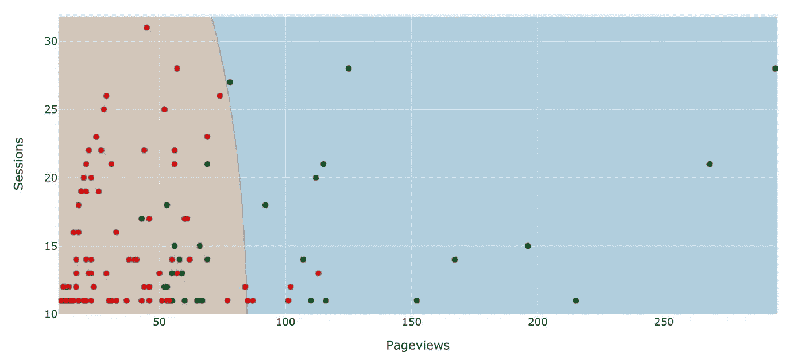
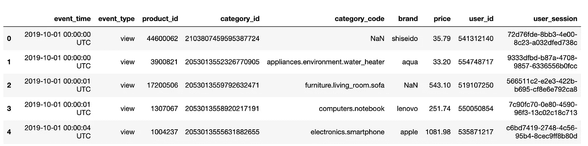
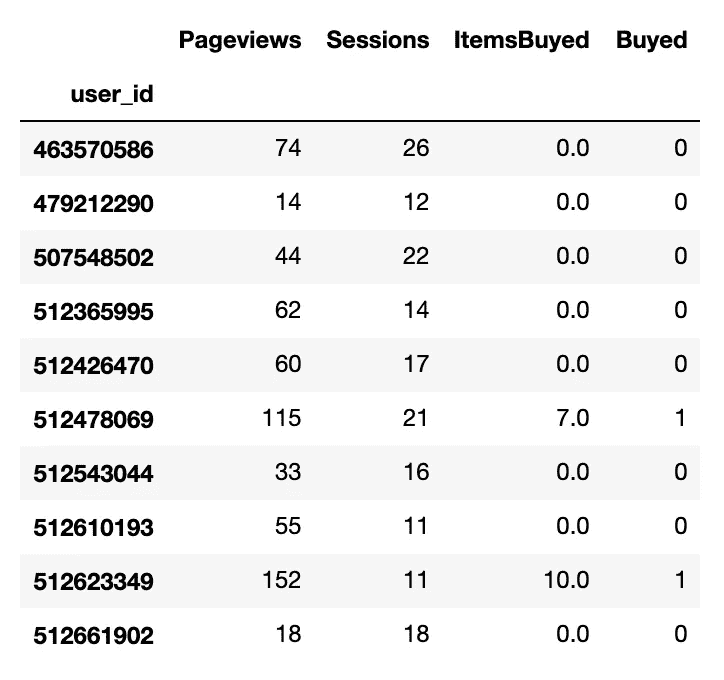
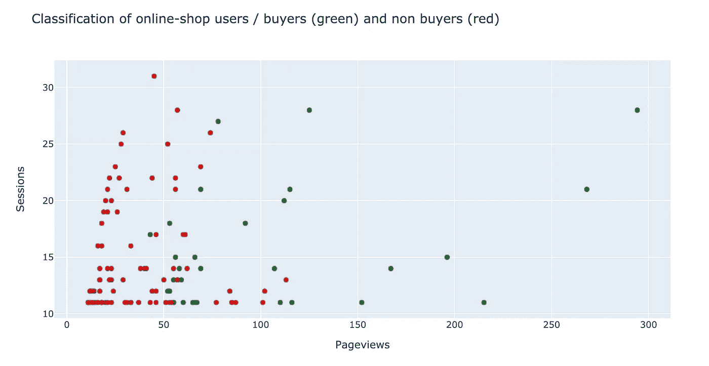
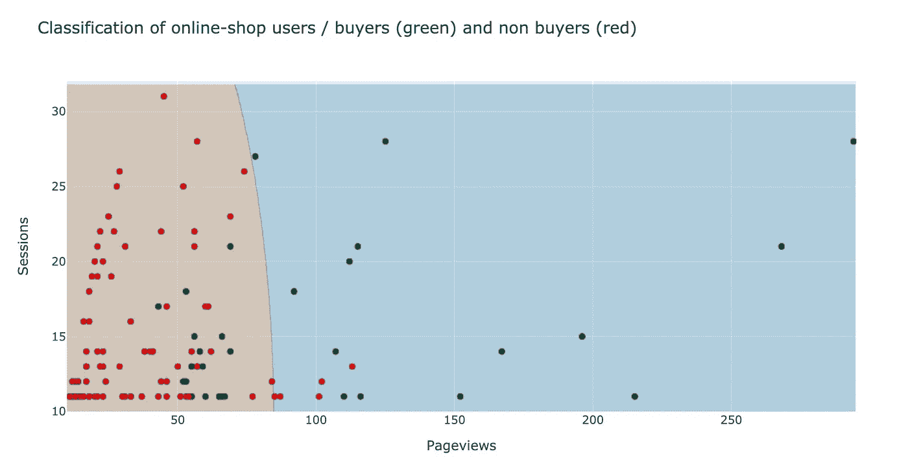
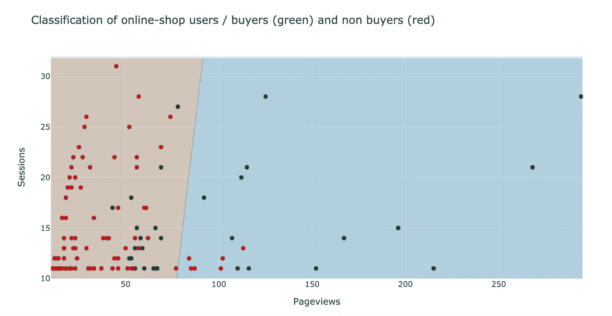
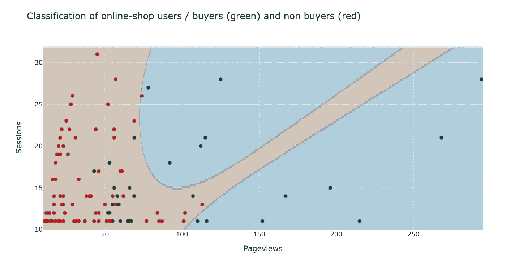
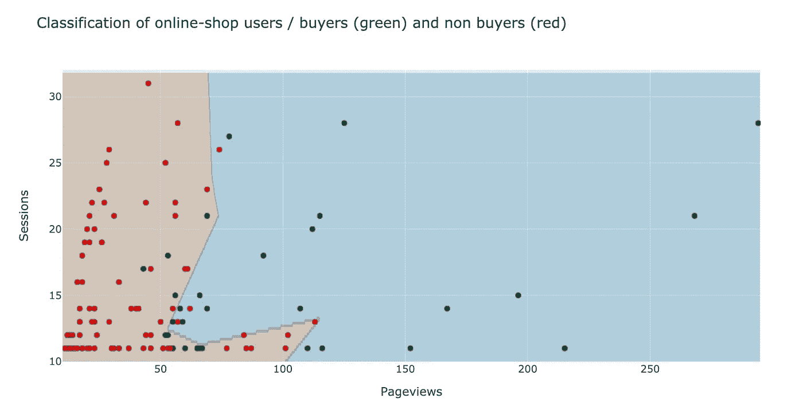
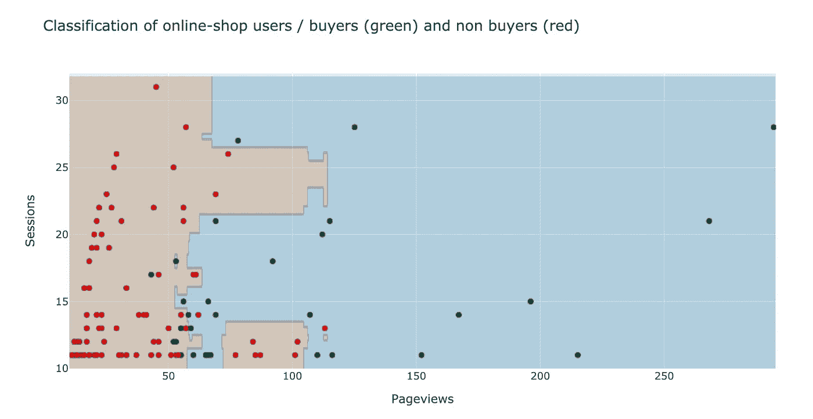

# 对网上商店顾客进行分类

> 原文：<https://towardsdatascience.com/classifying-online-shop-customers-65438e0cc58b?source=collection_archive---------40----------------------->

## 不同机器学习分类器的可视化方法

作者图片

在这篇文章中，我想展示如何使用不同的机器学习方法，利用在线商店的跟踪数据将客户分为购买和不购买。利用从原始数据中汇总的特征，例如访问次数和页面浏览次数，可以训练和可视化预测模型。

特别注意借助于二维图和决策边界的着色的预测模型的视觉呈现。不同方法的特点以及模型调整不足和过度的情况变得很明显。为了使可视化成为可能，我考虑只有两个特征的非常简化的模型。

## 数据导入

让我们从 CSV 文件加载原始数据。这些来自 Kaggle 数据集[https://www . ka ggle . com/mkechinov/ecommerce-behavior-data-from-multi-category-store](https://www.kaggle.com/mkechinov/ecommerce-behavior-data-from-multi-category-store)。这与我在关于分段和可视化的文章中使用的数据源相同:

[https://towards data science . com/segmentation-of-online-shop-customers-8c 304 a2 d 84 b 4](/segmentation-of-online-shop-customers-8c304a2d84b4)

为了演示和分析，我只使用了一部分数据。

跟踪网上商店的数据

在线商店的产品页面上有 1，000，000 条数据记录，具有产品类别、品牌、价格、用户会话 id 等特征。

为了进一步处理数据，我们形成了一个数据框架，该数据框架聚集了各个匿名访问者的数据，并计算了在线商店的页面浏览量和访问量。此外，为每个访问者计算购买物品的数量，从而创建一个标签，无论该顾客是否是购买者。

为了简化下面的演示，从分析中删除了一些访问者的数据。

网上商店用户的汇总数据

这为我们提供了来自 121 个网站访问者的数据。

## 数据的图形表示

在我们开始分析之前，让我们来看一个访问者的二维图，它使用访问次数和页面浏览量作为坐标轴。是否是买家由颜色代码表示。图书馆“Plotly”(【https://plotly.com/】)是用来搞阴谋的。

网店用户的特征空间/作者提供的图片

红点和绿点大多集中在这个“特征空间”的某些区域。在下文中，我们尝试创建分类模型，根据访问者在特征空间中的位置，正确地将他们识别为购买者。

为了能够可视化模型和它们的预测，我们需要一个辅助函数，它也可以在二维图中绘制决策边界。训练完模型后，该函数对一个狭窄的点网格执行分类预测，然后使用此信息根据预测对区域进行着色。

## 按会话和页面浏览量对访问者进行分类

对于分类模型的实现，我们使用库“Scikit Learn”([https://scikit-learn.org/](https://scikit-learn.org/))。我们考虑不同的方法，包括我们的可视化功能的参数。

## 朴素贝叶斯分类

贝叶斯分类器是从贝叶斯定理导出的分类器。它将每个对象分配给它最可能所属的类。形式上，它是一个数学函数，将一个类分配给特征空间中的每个点。

朴素贝叶斯分类器因其快速的可计算性而非常流行。天真的基本假设是属性是独立的。在我们的例子中，这并没有实现，页面浏览的数量取决于访问的数量。

如下图所示，结果的质量也一般。分类器只是粗略地划分了红点和绿点的区域。很多点都在错误的区域。

作者使用朴素贝叶斯/图像进行分类

关于朴素贝叶斯的更多信息:

 [## 第 1 章:监督学习和朴素贝叶斯分类—第 1 部分(理论)

### 欢迎来到监督学习的踏脚石。我们首先讨论一个小场景，它将构成…

medium.com](https://medium.com/machine-learning-101/chapter-1-supervised-learning-and-naive-bayes-classification-part-1-theory-8b9e361897d5) 

## 支持向量机分类

我们从线性支持向量分类开始。对于线性内核，最佳可能分离由直线实现。在图中，您可以看到直线是如何放置的，以保持到分类边界附近的点的距离尽可能大。这种线性模型定义复杂区域的可能性自然是有限的。

作者用 SVM /图像分类

关于支持向量机的更多信息:

 [## 支持向量机的友好介绍(SVM)

### 机器学习被认为是人工智能的一个分支，它与人工智能的发展密切相关

towardsdatascience.com](/a-friendly-introduction-to-support-vector-machines-svm-925b68c5a079) 

在具有多项式核的变体中，多项式被使用到指定的次数作为分离。该图显示了高达 4 次多项式的使用，这使得该方法有更多的可能性来适应数据。

作者用多项式 SVM /图像分类

如果程度设置得高，则可以在特征空间中定义更复杂的区域。具有混合点的区域仍然没有被更好地解决。然而，随着多项式次数的增加，有过度拟合的危险。

作者用多项式 SVM-10 次/图像进行分类

## 神经元网络

有了神经网络，可以定义任何复杂的功能和区域。这是由层数和神经元数定义的。在该图中，使用了具有 3 层，每层 25 个神经元的神经网络。

作者用神经网络/图像分类

关于神经网络分类的更多信息，请参见:

 [## 基于神经网络的虹膜数据分类

### Iris flowers 数据集是分类文献中最著名的数据集之一。目标是…

medium.com](https://medium.com/gadictos/iris-data-classification-using-neural-net-335d3303abd8) 

## 决策树

根据允许的最大深度，决策树可以形成或多或少复杂的分类区域。然而，总是仅在轴方向上具有决策限制。这导致区域呈阶梯状。

作者用决策树/图片分类

在深度很深的地方，决策树很快就会过度适应。这可以在图中通过窄条纹清楚地看到，每个窄条纹仅分类一个数据点。

有关决策树的更多信息，请访问:

 [## 机器学习和数据科学决策树指南

### 决策树是一类非常强大的机器学习模型，可以在许多任务中实现高精度，同时…

towardsdatascience.com](/a-guide-to-decision-trees-for-machine-learning-and-data-science-fe2607241956) 

## 随机森林——决策树的集合

如果不使用单个决策树，而是使用多个决策树，然后让大多数单个分类器来决定整体分类，我们就称之为随机森林。这些具有决策树的一些优点，例如简单性和良好的可解释性，但是它们可以更灵活地划分分类区域，并且不会很快过度适应。

作者用随机森林/图像分类

该图显示了非常灵活的决策限制，但也显示了过度适应的方法。

有关随机森林的更多信息，请访问:

 [## 随机森林的不合理有效性

### 机器学习从业者有喜欢的算法是很常见的。这有点不合理，因为没有…

medium.com](https://medium.com/rants-on-machine-learning/the-unreasonable-effectiveness-of-random-forests-f33c3ce28883) 

使用这个只有两个特征的买家分类的例子，我们直观地展示了一些非常普遍的分类方法的典型属性。这有助于发展对方法的直觉，并更好地评估风险，如过度适应。