# 通过图像分析对帕金森病进行分类:第一部分

> 原文：<https://towardsdatascience.com/classifying-parkinsons-disease-through-image-analysis-2e7a152fafc9?source=collection_archive---------39----------------------->

## 应用计算机视觉

## 预处理和探索性数据分析


在 [Unsplash](https://unsplash.com/s/photos/science?utm_source=unsplash&utm_medium=referral&utm_content=creditCopyText) 上由[halance](https://unsplash.com/@halacious?utm_source=unsplash&utm_medium=referral&utm_content=creditCopyText)拍摄的照片

## 我简介

阿金森氏病通常伴有震颤和僵硬等运动障碍症状。这些会对患有早期疾病的人的书写和素描产生明显的影响[1]。缩微图是一个人的笔迹中异常小的波动，然而，由于一个人发展的笔迹、语言、熟练程度和教育等的可变性，已经声称难以解释[1]。因此，2017 年进行的一项研究旨在通过使用螺旋和波浪的标准化分析来改善诊断。在这一系列的帖子中，我们将分析该研究中收集的原始图像，看看我们是否可以为一名帕金森患者创建一个分类器，并在此过程中得出一些结论。我们将使用的数据托管在 Kaggle [2]上，特别感谢 Kevin Mader 分享数据集上传。

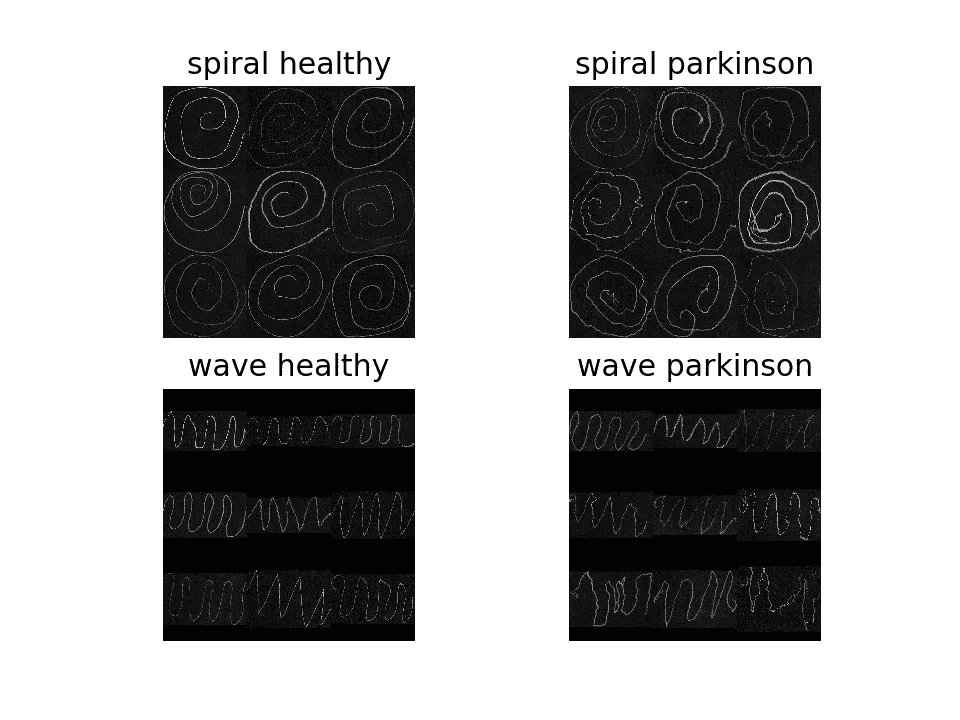

图片来自作者。我们将使用的数据的样本图像。

在第 1 部分中，我们将进行一些探索性的数据分析，并对图像进行预处理，以创建一些有望有助于分类的特征。我选择不使用卷积神经网络(CNN)来简单地对图像进行分类，因为这将是一个黑盒——没有任何衡量曲线/草图之间潜在差异的指标。相反，我们不是简单地执行分类任务，而是试图使用图像处理来理解和量化差异。在随后的帖子中，我将与 CNN 进行比较。

来自吉菲

> 在我们开始之前，声明这并不意味着任何形式的医学研究或测试。请参考[原始论文](https://www.ncbi.nlm.nih.gov/pmc/articles/PMC5592741/)了解实际实验的细节，我并没有参与其中。
> Zham P，Kumar DK，Dabnichki P，Poosapadi Arjunan S，Raghav S. *利用画螺旋的速度和笔压综合指数区分帕金森病的不同阶段*。前神经元。2017;8:435.发布于 2017 年 9 月 6 日。doi:10.3389/fneur.2017.00435

# 探索性数据分析

首先，让我们看一下图像，执行一些基本的分割，并开始探索一些感兴趣的潜在特征。我们将全程使用熊猫来存储图像和信息。对于那些质疑你是否会阅读这一部分的人，这里是我们将要进入的内容:
-阈值处理和清理
-通过最近邻的厚度量化
-骨架化
-交叉点和边缘点

## 阈值处理和清洗

我们使用一个修改的读取和阈值函数，主要是从 Kevin Mader 在 Kaggle 上的原始笔记本中获得的[2]。在这里，当我们想要查看蒙太奇风格的图像时，可以选择调整大小，如上图和下图所示。我们首先读入并反转图像，使图形在黑色背景上是白色的，如果需要还可以调整大小。我们还应用了一个小的中值滤波器。

> 这个项目有相当多的代码，我不会把它们都放在这里，所以如果你想查看笔记本或 python 脚本以了解更多细节，请查看 github 链接。

```
from skimage.io import imread
from skimage.util import montage as montage2d
from skimage.filters import threshold_yen as thresh_func
from skimage.filters import median
from skimage.morphology import disk
import numpy as npdef process_imread(in_path, resize=True):
    """read images, invert and scale them"""
    c_img = 1.0-imread(in_path, as_gray=True)
    max_dim = np.max(c_img.shape)
    if not resize:
        return c_img
    if c_img.shape==(256, 256):
        return c_img
    if max_dim>256:
        big_dim = 512
    else:
        big_dim = 256
    """ pad with zeros and center image, sizing to either 256 or 512"""   
    out_img = np.zeros((big_dim, big_dim), dtype='float32')
    c_offset = (big_dim-c_img.shape[0])//2
    d_offset = c_img.shape[0]+c_offset

    e_offset = (big_dim-c_img.shape[1])//2
    f_offset = c_img.shape[1]+e_offset
    out_img[c_offset:d_offset, e_offset:f_offset] = c_img[:(d_offset-c_offset), :(f_offset-e_offset)]
    return out_imgdef read_and_thresh(in_path, resize=True):
    c_img = process_imread(in_path, resize=resize)
    c_img = (255*c_img).clip(0, 255).astype('uint8')
    c_img = median(c_img, disk(1))
    c_thresh = thresh_func(c_img)
    return c_img>c_thresh
```

最后，对于读入的内容，我们还通过移除任何与主草图无关的小对象来清理图像。

```
from skimage.morphology import label as sk_labeldef label_sort(in_img, cutoff=0.01):
    total_cnt = np.sum(in_img>0)
    lab_img = sk_label(in_img)
    new_image = np.zeros_like(lab_img)
    remap_index = []
    for k in np.unique(lab_img[lab_img>0]):
        cnt = np.sum(lab_img==k) # get area of labelled object
        if cnt>total_cnt*cutoff:
            remap_index+=[(k, cnt)]
    sorted_index = sorted(remap_index, key=lambda x: -x[1]) # reverse sort - largest is first
    for new_idx, (old_idx, idx_count) in enumerate(sorted_index, 1): #enumerate starting at id 1
        new_image[lab_img==old_idx] = new_idx
    return new_image
```

这是通过仅保留大于 1%的激活像素的足够大的分量来实现的；由截止值定义。首先标记图像中的每个单独的对象，并将每个标记的面积相加(不是 0)。如果计数超过总数的 1%,则保留索引。执行负排序，使最大的对象具有标签 1。用新的订购 id 替换旧的标签号。

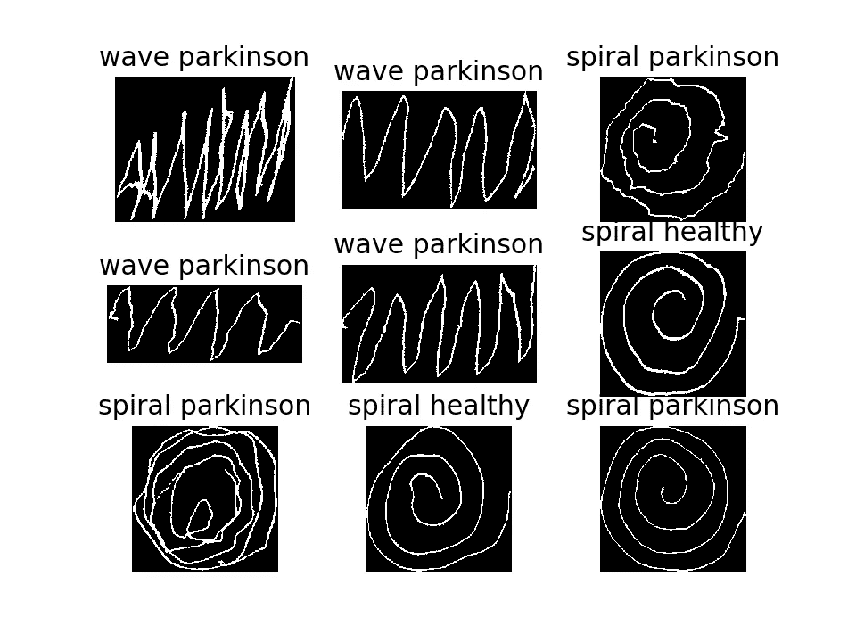

图片来自作者。阈值处理和清理后的数据样本图像。

作为绘图差异的初始视图，我们可以创建一个骨架图像并形成一个新的数据框，其中每一行都是每个图像中非零像素的单个像素坐标。然后，我们可以将这些曲线中的每一条绘制在一个图表上——在归一化位置之后。我们不会使用这种格式的数据框，这只是为了可视化。

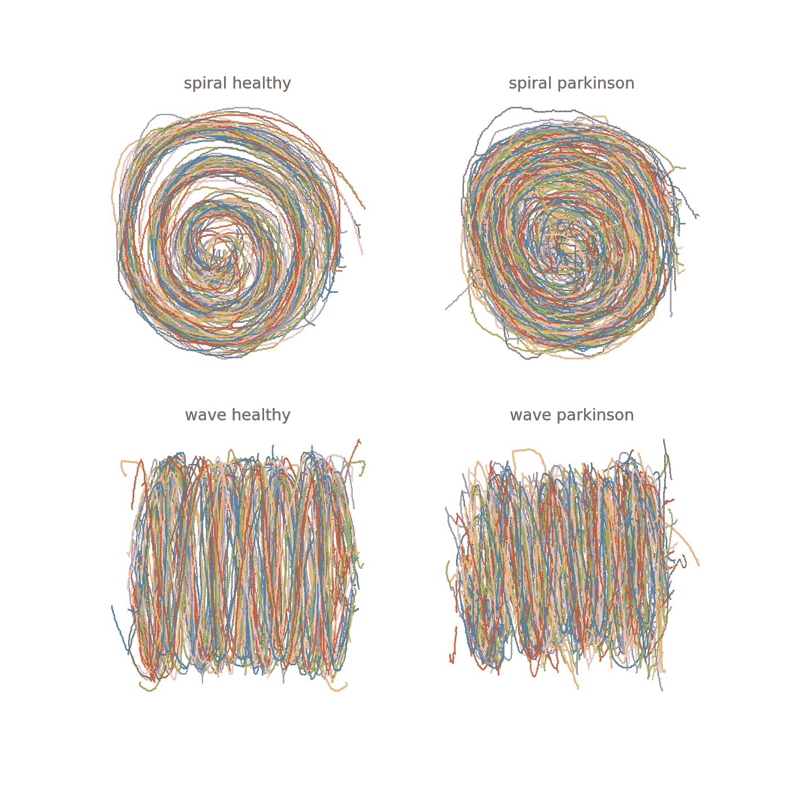

图片来自作者。一个地块上的所有图纸。

正如我们所看到的，健康的草图之间有很强的一致性。考虑到帕金森症状可能导致的随机运动，这是有意义的。

## 厚度量化

N ext，我们将尝试量化厚度。为此，我们将使用距离图来给出图纸宽度的近似值。中轴也返回一个距离图，但是骨骼化更干净，因为它做了一些修剪。

```
from skimage.morphology import medial_axis
from skimage.morphology import skeletonizedef stroke_thickness_img(in_img):
    skel, distance = medial_axis(in_img, return_distance=True)
    skeleton = skeletonize(in_img)
    # Distance to the background for pixels of the skeleton
    return distance * skeleton
```

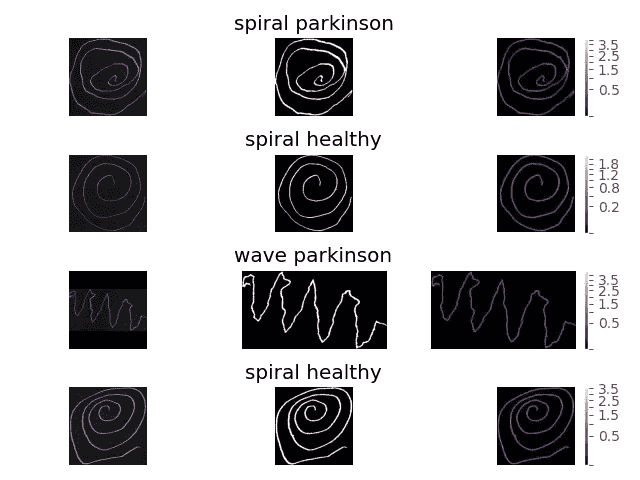

图片来自作者。线条粗细计算。

通过绘制平均值和标准偏差，我们看到了这些图之间的一些相关性。主要是在标准差中，考虑到随机影响，这也是有意义的，事实上它是巨大的，并不小于健康也是有意义的。

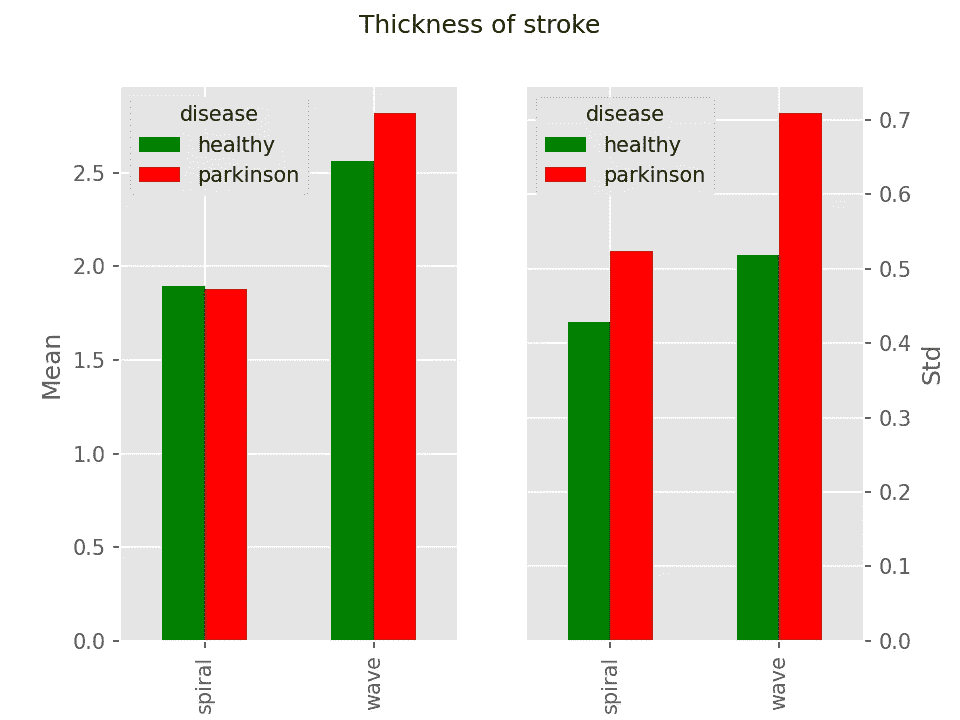

图片来自作者。图纸的厚度。

## 交叉点和边缘点

D 由于图像骨架化的工作方式，根据线条的“平滑度”,更多起伏的曲线会有更多的端点。因此，与平滑线相比，这些是随机运动的一些度量。另外，我们可以计算交点的数量；完美的曲线没有交点，只有两个端点。这些在其他图像处理应用中也是有用的，例如道路绘图。

我不会在这里过多地讨论代码，因为需要进行相当多的清理，但是，我会尝试使用一些图像来解释我所做的事情。首先，我们计算曲线骨架的最近邻图像。除了在边缘点的值为 1 和在交叉点的值为 3 之外，这给了我们在任何地方的值为 2；这是在使用连通性 2(8 个最近的邻居)时。这是放大后的结果图像。

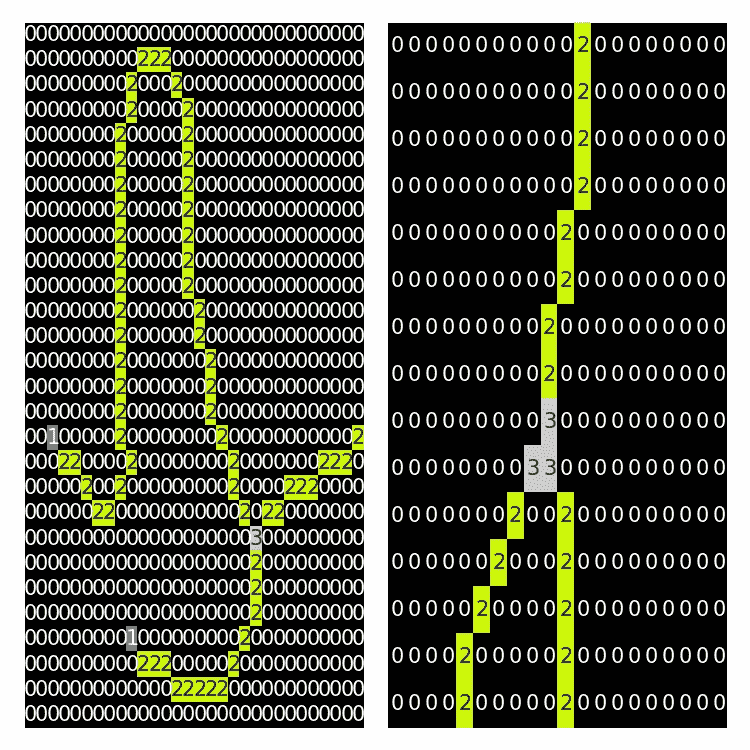

图片来自作者。交点和边缘点。

正如你所看到的，这和预期的一样，除了我们遇到了一些问题，如果我们想得到一个像素交叉点来正确量化交叉点的数量。右边的图像有三个值为 3 的像素，尽管这只是一个交集。当这些交点的总和大于“正确的”交点时，我们可以通过隔离这些区域，用下面的伪算法来清理这个问题。我们可以将最近邻(NN)图像和阈值相加来隔离它们。连通性 1 有直接邻居，连通 2 包括对角线。

*   从原始神经网络，分别使用连接 1 和 2 求和。
*   隔离连通性 2 中值≥ 8 的交叉点。
*   标记连接到交叉点像素的每条边。
*   对于连通性 1 图像，隔离总和在 3 和 5 之间的交叉点像素。这些是我们不想要的。
*   覆盖不正确的交叉点像素。

结果如下:

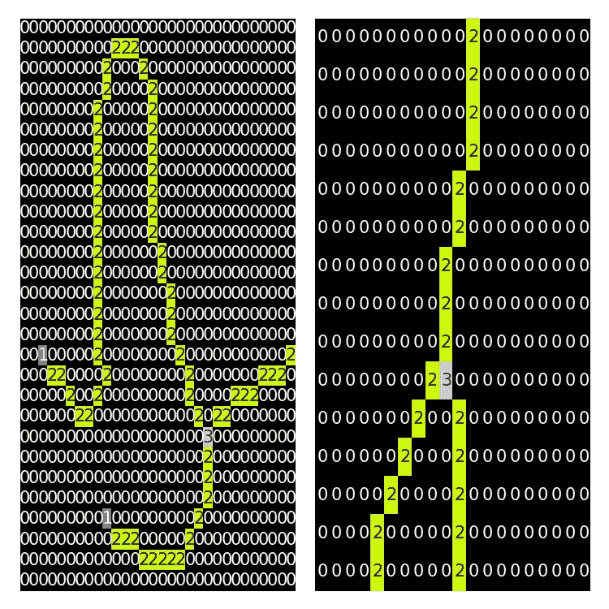

图片来自作者。交叉点和边缘点，已更正。

如你所见，我们现在在交叉点位置有一个值为 3 的像素。我们现在可以简单地将这些位置相加，以量化交点的数量。如果我们把这些画在一条曲线上，我们可以看到结果，黄色下面是交叉点，绿色是边缘点。

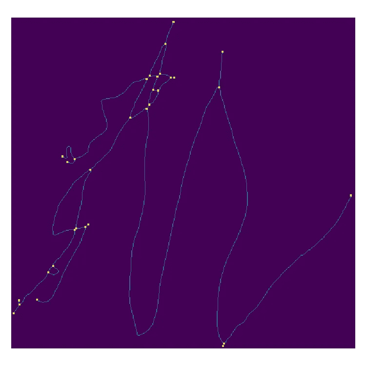

图片来自作者。绘制了交点和边缘点的骨架曲线。

如果我们画出每种绘画类型的数量，我们可以看到相当强的相关性:

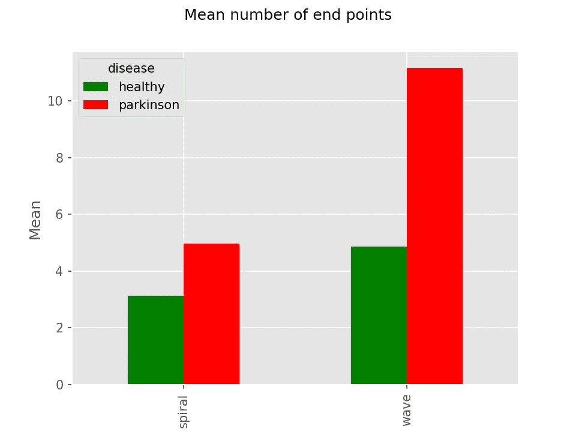

图片来自作者。平均边缘点数。

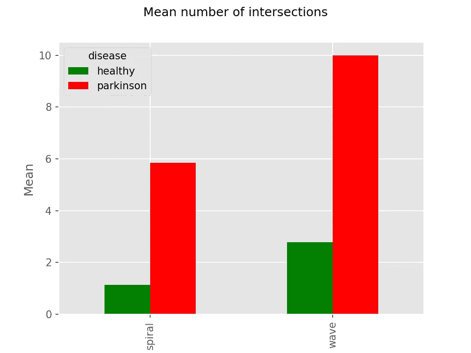

图片来自作者。平均相交数。

我们还可以看到，我们对具有大约 2 个边缘点的健康曲线的初始估计也是正确的。帕金森波图有非常多的边缘点，因为这些通常非常“尖锐”而不是平滑地弯曲，这在这些波的尖端产生了大量的边缘点。

最后，我们还可以检查骨架图像中像素总数的相关性。这与图纸的“间接”性质有关。这种量化非常简单，我们只需对骨架图像中大于零的像素求和。

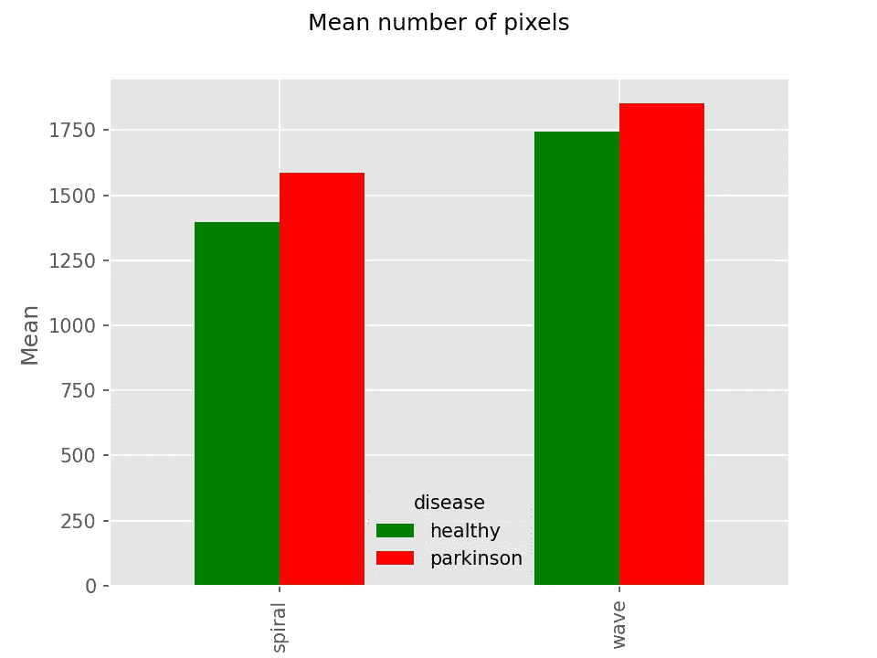

图片来自作者。平均像素数。

没有一段感情那么牢固，但还是有意义的。

## 摘要

因此到目前为止，我们已经读入、清理并获得了一些潜在有用的指标，这些指标不仅有助于我们了解缩微程度，还可以用作分类器(如逻辑回归或随机森林)的输入。在本系列的第 2 部分中，我们将使用这些度量标准进行分类，并与一个更强大的黑盒神经网络进行比较。使用随机森林的优势在于，我们还可以看到哪些功能对模型的影响最大。根据以上观察，你是否已经有了直觉，知道哪些特性可能是最重要的？

如果你觉得这篇文章的任何部分提供了一些有用的信息或一点灵感，请关注我。

你可以在我的 [github](https://github.com/robintwhite) 上找到源代码。*该项目目前仍在建设中。*

链接到我的其他帖子:

*   [计算机视觉和终极 Pong AI](/computer-vision-and-the-ultimate-pong-ai-e6d70153fc45)——使用 Python 和 OpenCV 在线玩 Pong
*   [《我的世界》测绘仪](https://medium.com/analytics-vidhya/minecraft-mapper-ab4478e98297) —计算机视觉和光学字符识别从截图和绘图中抓取位置

## 奖金

这里不使用，但为了好玩，我们也可以创建一个图形来表示每个图像，因为我们有节点和边，其中节点是交叉点或边点，边是连接这些点的绘图部分。

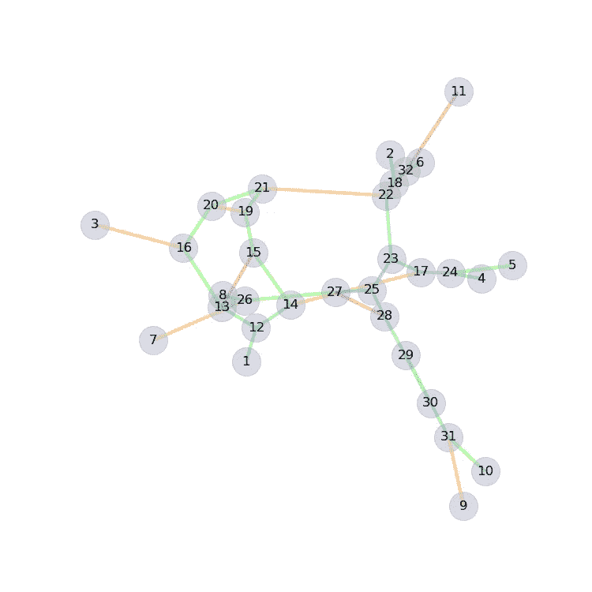

图片来自作者。网络图的绘制。

我们为此使用了 Networkx 库，其中每个数字要么是一个节点，要么是交叉点，其颜色对应于连接节点的绘图部分的长度。

## 参考

[1] Zham P，Kumar DK，Dabnichki P，Poosapadi Arjunan S，Raghav S. *利用画螺旋的速度和笔压综合指数区分帕金森病的不同阶段*。前神经元。2017;8:435.发布于 2017 年 9 月 6 日。doi:10.3389/fneur . 2017.00435
【2】Mader，K. *帕金森素描概述。*[https://www.kaggle.com/kmader/parkinsons-drawings](https://www.kaggle.com/kmader/parkinsons-drawings)。获取日期:2020 年 7 月 9 日