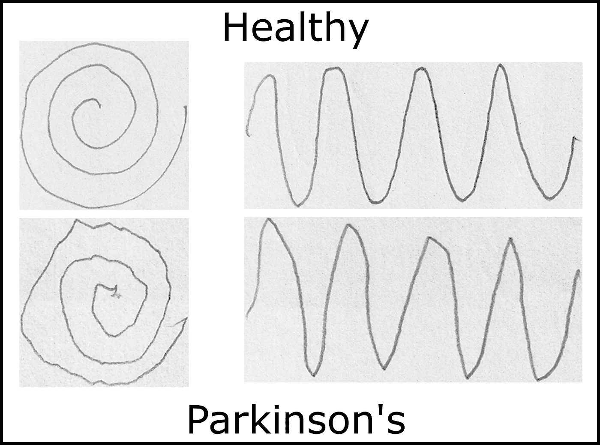
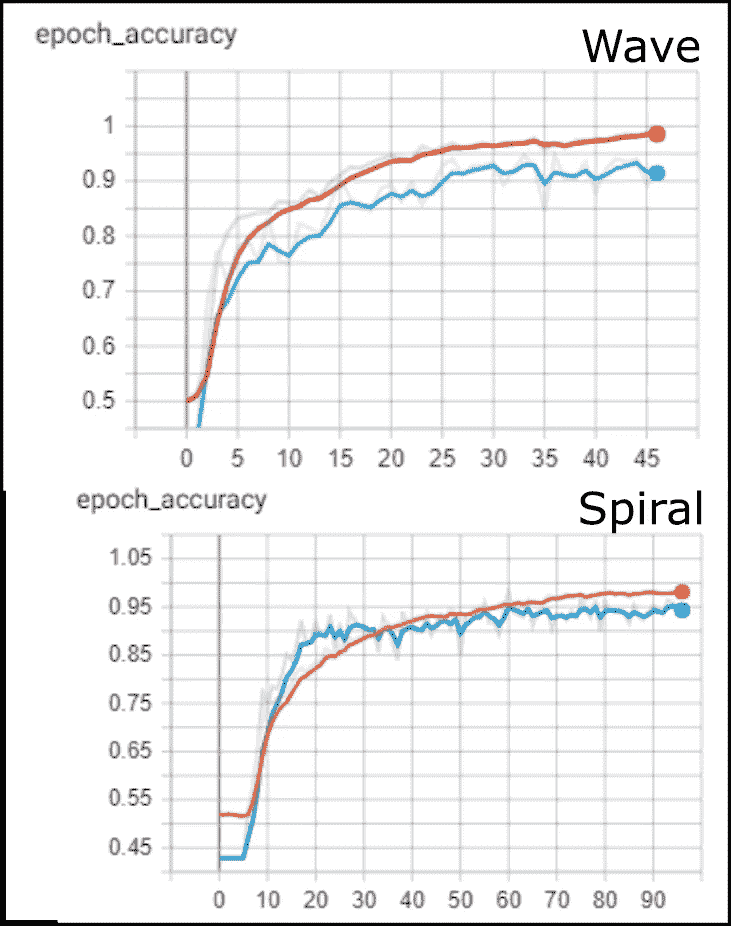

# 通过图像分析对帕金森病进行分类:第二部分

> 原文：<https://towardsdatascience.com/classifying-parkinsons-disease-through-image-analysis-part-2-ddbbf05aac21?source=collection_archive---------41----------------------->

## 应用计算机视觉

## 比较随机森林、ResNet50 特征提取和定制卷积神经网络



在我之前的[帖子](/classifying-parkinsons-disease-through-image-analysis-2e7a152fafc9)中，我概述了一些手动获取的特征，如交叉点和端点的数量、线条粗细、标准偏差等。在这篇文章中，我们将应用这些特征，尝试将两组图画分为健康型和帕金森型。此外，我们还将使用更高级的机器学习方法来研究其他两种分类方法:即结合逻辑回归的特征提取；以及定制的、从零开始训练的卷积模型。

> 在我们开始之前，声明这并不意味着任何形式的医学研究或测试。关于实际实验的细节请参考[的原始论文](https://www.ncbi.nlm.nih.gov/pmc/articles/PMC5592741/)，我并没有参与其中。
> Zham P，Kumar DK，Dabnichki P，Poosapadi Arjunan S，Raghav S. *利用画螺旋的速度和笔压的综合指数区分帕金森病的不同阶段*。前神经元。2017;8:435.发布于 2017 年 9 月 6 日。doi:10.3389/fneur.2017.00435。

在做这样一个项目时，重要的是要决定目标是什么？这里有两个:
1。了解波形和螺旋图像的草图类型(健康或帕金森)之间的可观察差异。
2。创建一个高精度的分类器来确定患者是否可能患有帕金森氏症。
正如我在以前的帖子中提到的，直接进入神经网络模型的一个限制是，它在很大程度上是一个黑盒分类器。我们失去了对帕金森氏症引起的绘画中的根本差异的理解。这就是我们的第一个分类器被使用的地方，它实际上同时针对这两个目标。我们将从那里开始。

来自吉菲

## 来自手工构建特征的随机森林分类器

这一部分的标题说明了一切。我在上一篇文章中对获得的特征使用了随机森林分类器。显而易见，我们将使用的特征是:
-【平均厚度】；标准厚度'；number _ pixels '；数字 _ 边缘点'；“数量 _ 交叉点”。
我发现的一个技巧是通过创建交互特征来合并一些非线性，其中每个特征与每个其他特征相乘。例如:均值 _ 厚度*数量 _ 交点。这将特征的数量增加到 15 个。
我们还必须记住标准化每个特性。这使得平均值为 0。本质上，我们减去平均值，然后除以每个特征列的标准偏差。
最后，我们必须为我们的目标类创建一个一次性编码。这只是一个二元分类，所以这就足够了。这将把我们的“健康”或“帕金森”标签转换为 0 或 1。我们还确保将培训数据与测试数据分开。
就是这样！我们可以将我们的特征列传递给一个随机的森林分类器。这里还需要注意的是，我们需要波浪和螺旋数据集的独立模型。一个明显但重要的注意事项。以下是 wave 的结果:

测试的波形准确度:80%

```
+--------------+-----------+----------+-------------+---------+
|     Wave     | precision | recall   | f1-score    | support |
+--------------+-----------+----------+-------------+---------+
| healthy      |      0.74 |     0.93 |        0.82 |      15 |
| parkinson    |      0.91 |     0.67 |        0.77 |      15 |
|              |           |          |             |         |
| accuracy     |           |          |        0.80 |      30 |
| macro avg    |      0.82 |     0.80 |        0.80 |      30 |
| weighted avg |      0.82 |     0.80 |        0.80 |      30 |
+--------------+-----------+----------+-------------+---------+
```

> [https://ozh.github.io/ascii-tables/](https://ozh.github.io/ascii-tables/)

随机森林分类器提供了许多很好的优势，我在这里使用的主要优势是能够给出最有影响力的特征列表。以下是它们出现的顺序:

```
Feature impact (in order of importance): 
['std_thickness_num_ep' 'std_thickness' 'num_ep_num_inters'
 'num_pixels_num_ep' 'num_pixels_num_inters' 'mean_thickness_num_inters'
 'mean_thickness_num_ep' 'std_thickness_num_inters'
 'std_thickness_num_pixels' 'mean_thickness' 'num_ep' 'num_inters'
 'num_pixels' 'mean_thickness_std_thickness' 'mean_thickness_num_pixels']
```

对于螺旋:

测试的螺旋精度:67%

```
+--------------+-----------+----------+-------------+---------+
|    Spiral    | precision | recall   | f1-score    | support |
+--------------+-----------+----------+-------------+---------+
| healthy      |      0.63 |     0.80 |        0.71 |      15 |
| parkinson    |      0.73 |     0.53 |        0.62 |      15 |
|              |           |          |             |         |
| accuracy     |           |          |        0.67 |      30 |
| macro avg    |      0.68 |     0.67 |        0.66 |      30 |
| weighted avg |      0.68 |     0.67 |        0.66 |      30 |
+--------------+-----------+----------+-------------+---------+Feature impact (in order of importance): ['num_pixels_num_ep' 'num_pixels' 'std_thickness_num_ep'
 'num_pixels_num_inters' 'std_thickness_num_pixels'
 'mean_thickness_num_ep' 'mean_thickness' 'std_thickness_num_inters'
 'std_thickness' 'mean_thickness_std_thickness'
 'mean_thickness_num_pixels' 'mean_thickness_num_inters'
 'num_ep_num_inters' 'num_ep' 'num_inters']
```

在我的上一篇文章中，我问，“根据我们看到的结果，我们认为哪个是最重要的？”。机器学习的一个优势是，我们可以分配这些非线性的相互作用，这可能是我们难以预测的。此外，我们可以看到每种类型的绘画的影响是不同的。在波动集上，准确率还不错，为 80%，但在螺旋集上，准确率很低，为 67%——仍然比机会集(50%)好。显然，可以对特征进行一些微调，从而使螺旋集达到更好的精度。然而，使用随机森林，我们现在可以观察到绘图的某些部分有多重要。当然，通过端点和像素数识别的波纹在波浪和螺旋模型中都很突出。

## 用 ResNet50 进行特征提取，用逻辑回归进行分类

在下一节中，我们将首先通过在 ImageNet 上训练的 ResNet50 模型传递我们的图像，但保留图层的顶部。我们可以使用 tf.keras 轻松做到这一点:

```
model = ResNet50(weights="imagenet", include_top = False)
```

当一幅图像通过这个时，它将产生 2048 * 7 * 7 的“特征”——对图像进行分类的数字。这是 ResNet50 最后一层的数字。然后，我们可以通过逻辑回归来传递这个大向量，以获得分类——这是一种非常快速有效的方法，可以获得相当不错的准确性，而无需进行任何真正的训练。一个重要的注意事项是，您必须首先通过一些预处理来将图像转换成合适的格式。这个型号需要的尺寸是 224 x 224。张量形状应该是(N，224，224，3)，其中 N 是样本数。有一个预定义的前置函数，用 imagenet _ utils . preprocess _ input 减去均值。值得一提的是，我从 Adrian Rosebrock 的《计算机视觉深度学习实践者》*一书中学到了这项技术。*

```
bs = 16
# loop in batches
for i in np.arange(0, len(imagePaths), bs):
    batchPaths = imagePaths[i:i + bs]
    batchLabels = labels[i:i + bs]
    batchImages = []
    # preprocess each image
    for j, imagePath in enumerate(batchPaths):
        image = load_img(imagePath, target_size=(224, 224), interpolation='bilinear')
        image = img_to_array(image)

        # expand dims and subtract mean RGB
        image = np.expand_dims(image, axis=0)
        image = imagenet_utils.preprocess_input(image)
        if j==0 and i==0:
            fig, axs = plt.subplots()
            plt.imshow(image.reshape((224,224,3)).astype(np.uint8),clim=(0,255), interpolation=None)
            plt.show()
        batchImages.append(image)

    batchImages = np.vstack(batchImages)
    # extract features
    features = model.predict(batchImages, batch_size=bs)
    features = features.reshape((features.shape[0], 100352))
```

一旦我们将我们的特征和相关标签存储在数据帧中，我们就可以将它们传递给逻辑回归。本质上，这里的想法是，在图像的这个非常高的维度表示中，应该有一个清晰的划分。我认为这是正确的，因为它很精确:

测试的波形准确度:87%

```
+--------------+-----------+----------+-------------+---------+
|     Wave     | precision | recall   | f1-score    | support |
+--------------+-----------+----------+-------------+---------+
| healthy      |      0.92 |     0.80 |        0.86 |      15 |
| parkinson    |      0.82 |     0.93 |        0.87 |      15 |
|              |           |          |             |         |
| accuracy     |           |          |        0.87 |      30 |
| macro avg    |      0.87 |     0.87 |        0.87 |      30 |
| weighted avg |      0.87 |     0.87 |        0.87 |      30 |
+--------------+-----------+----------+-------------+---------+
```

测试的螺旋精度:83%

```
+--------------+-----------+----------+-------------+---------+
|     Wave     | precision | recall   | f1-score    | support |
+--------------+-----------+----------+-------------+---------+
| healthy      |      0.81 |     0.87 |        0.84 |      15 |
| parkinson    |      0.86 |     0.80 |        0.83 |      15 |
|              |           |          |             |         |
| accuracy     |           |          |        0.83 |      30 |
| macro avg    |      0.83 |     0.83 |        0.83 |      30 |
| weighted avg |      0.83 |     0.83 |        0.83 |      30 |
+--------------+-----------+----------+-------------+---------+
```

与我们手动创建的只有 15 个特征的模型相比，这是一个明显的改进，也是需要最少努力的一个——但是除了分类之外，我们也没有获得太多信息。

## 定制卷积神经网络

在我们的最后一种方法中，我们从头开始构建一个定制模型并进行训练。我们只有很少的训练样本——只有 72 个，所以我们使用增强。在训练期间，我创建了一个占训练集 20%的验证集，并对迄今为止我一直在比较的 30 幅未接触过的图像进行了预测。
下面是螺旋模型的总结。我将图像缩减为原来的 2 倍，并转换成灰度。波浪模型完全相同，但图像大小不同。我还为对比度拉伸和标准化应用了一个预处理函数。有关增强、回调等的详细信息。请参考我的代码，因为这超出了本文的范围。优化是使用 Adam 完成的。

```
Model: "SpiralNet"
_________________________________________________________________
Layer (type)                 Output Shape              Param #   
=================================================================
conv2d (Conv2D)              (None, 128, 128, 32)      320       
_________________________________________________________________
activation (Activation)      (None, 128, 128, 32)      0         
_________________________________________________________________
conv2d_1 (Conv2D)            (None, 128, 128, 32)      9248      
_________________________________________________________________
activation_1 (Activation)    (None, 128, 128, 32)      0         
_________________________________________________________________
max_pooling2d (MaxPooling2D) (None, 64, 64, 32)        0         
_________________________________________________________________
dropout (Dropout)            (None, 64, 64, 32)        0         
_________________________________________________________________
conv2d_2 (Conv2D)            (None, 64, 64, 64)        18496     
_________________________________________________________________
activation_2 (Activation)    (None, 64, 64, 64)        0         
_________________________________________________________________
conv2d_3 (Conv2D)            (None, 64, 64, 64)        36928     
_________________________________________________________________
activation_3 (Activation)    (None, 64, 64, 64)        0         
_________________________________________________________________
max_pooling2d_1 (MaxPooling2 (None, 32, 32, 64)        0         
_________________________________________________________________
dropout_1 (Dropout)          (None, 32, 32, 64)        0         
_________________________________________________________________
conv2d_4 (Conv2D)            (None, 32, 32, 128)       73856     
_________________________________________________________________
activation_4 (Activation)    (None, 32, 32, 128)       0         
_________________________________________________________________
conv2d_5 (Conv2D)            (None, 32, 32, 128)       147584    
_________________________________________________________________
activation_5 (Activation)    (None, 32, 32, 128)       0         
_________________________________________________________________
max_pooling2d_2 (MaxPooling2 (None, 16, 16, 128)       0         
_________________________________________________________________
dropout_2 (Dropout)          (None, 16, 16, 128)       0         
_________________________________________________________________
flatten (Flatten)            (None, 32768)             0         
_________________________________________________________________
dense (Dense)                (None, 128)               4194432   
_________________________________________________________________
activation_6 (Activation)    (None, 128)               0         
_________________________________________________________________
dropout_3 (Dropout)          (None, 128)               0         
_________________________________________________________________
dense_1 (Dense)              (None, 1)                 129       
_________________________________________________________________
activation_7 (Activation)    (None, 1)                 0         
=================================================================
Total params: 4,480,993
Trainable params: 4,480,993
Non-trainable params: 0
_________________________________________________________________
```

这是训练板:



来自作者。每个模型的训练和验证曲线。

最后，指标:

测试的波形准确度:87%

```
+--------------+-----------+----------+-------------+---------+
|   WaveNet    | precision | recall   | f1-score    | support |
+--------------+-----------+----------+-------------+---------+
| healthy      |      0.92 |     0.80 |        0.86 |      15 |
| parkinson    |      0.82 |     0.93 |        0.87 |      15 |
|              |           |          |             |         |
| accuracy     |           |          |        0.87 |      30 |
| macro avg    |      0.87 |     0.87 |        0.87 |      30 |
| weighted avg |      0.87 |     0.87 |        0.87 |      30 |
+--------------+-----------+----------+-------------+---------+
```

测试中的螺旋精度:90%

```
+--------------+-----------+----------+-------------+---------+
|  SpiralNet   | precision | recall   | f1-score    | support |
+--------------+-----------+----------+-------------+---------+
| healthy      |      0.93 |     0.87 |        0.90 |      15 |
| parkinson    |      0.88 |     0.93 |        0.90 |      15 |
|              |           |          |             |         |
| accuracy     |           |          |        0.90 |      30 |
| macro avg    |      0.90 |     0.90 |        0.90 |      30 |
| weighted avg |      0.90 |     0.90 |        0.90 |      30 |
+--------------+-----------+----------+-------------+---------+
```

虽然我们在波集上实现了与 ResNet50 特征提取相同的精度，但是我们在螺旋集上获得了更好的改进。我们的训练集中也只有 30 幅图像，非常小。随着数字的增加，我们可以看到两者的验证精度都更接近，最佳模型的验证精度都在 95%左右。

## 摘要

下面是对不同方法的相同测试集的结果的最终总结:

```
+------------------------+------+--------+
|    Test Accuracy %     | Wave | Spiral |
+------------------------+------+--------+
| Random Forest Manual   |   80 |     67 |
| ResNet50 feat. Log Reg |   87 |     83 |
| Custom Nets            |   87 |     90 |
+------------------------+------+--------+
```

看着这些图片，我对它们的表现很满意，有些图片我看不出有什么不同…一些更多的功能工程可能会影响随机森林手动模型，但我会把这个交给你。

来自吉菲

如果你觉得这篇文章的任何部分提供了一些有用的信息或一点灵感，请关注我。

你可以在我的 [Github](https://github.com/robintwhite) 上找到源代码。

链接到我的另一篇文章:

*   [通过图像分析对帕金森病进行分类:第一部分](/classifying-parkinsons-disease-through-image-analysis-2e7a152fafc9) —预处理和探索性数据分析