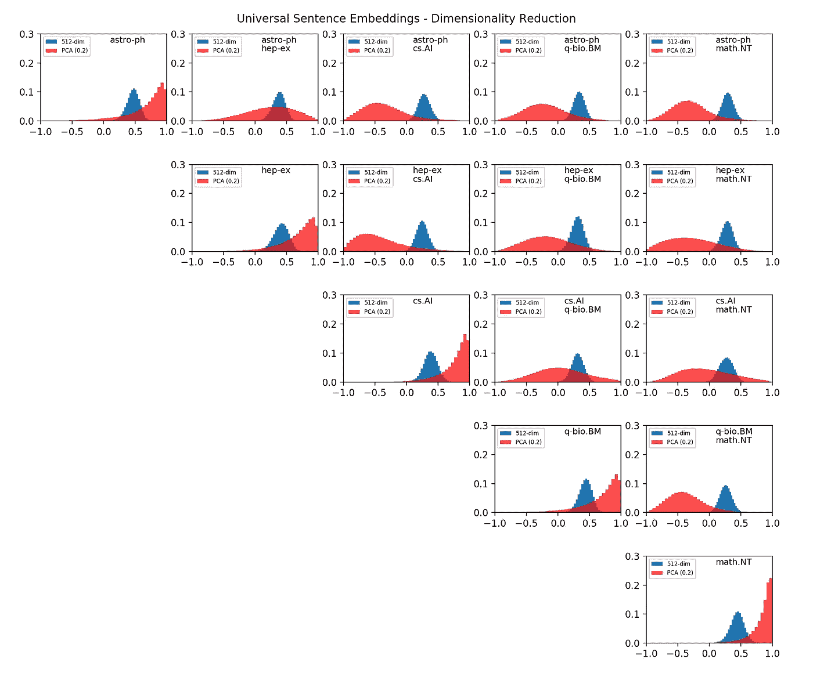

# 基于通用句子嵌入的科技论文分类

> 原文：<https://towardsdatascience.com/classifying-scientific-papers-with-universal-sentence-embeddings-4e0695b70c44?source=collection_archive---------29----------------------->

## 如何教计算机区分天体物理学和计算机科学？

几年来，由于计算机视觉的惊人进步，计算机已经获得了几乎像人类一样的识别建筑物、动物和其他物体的能力。使这成为可能的突破是理论直觉(*即*上世纪 80 年代[卷积神经网络](https://en.wikipedia.org/wiki/Convolutional_neural_network)的引入)和硬件(得益于 GPU 卡的广泛和经济高效的可用性)的结合，这使得在合理的时间内执行复杂的算法成为可能。这一类别的缩影可能是 VGG 类的模型，即[公开可用的](http://www.robots.ox.ac.uk/~vgg/software/vgg_face/)部署，因为大多数预先训练的模型。像它的大多数兄弟一样， [VGG -19](https://keras.io/applications/#vgg19) 需要训练一个强大的计算机集群，但是一旦初始阶段完成，它可以部署在不太强大的机器上，在许多情况下甚至是移动设备上(例如参见 [MobileNet](https://keras.io/applications/#mobilenet) )。然而，虽然计算机视觉领域在相当长的一段时间内一直处于黄金时代，但对于另一项任务:书面文本的解释来说，情况并非如此。


现在，计算机非常善于识别常见的物体。但是他们足够好去阅读一篇科学论文吗，更不用说去理解它的意思了？

可以说，如果人类不能在为时已晚之前识别出狮子、鬣狗和其他食肉动物的威胁，他们就不会在生物进化的早期阶段幸存下来。另一方面，人类学家认为，随着我们语言能力的提高，人类社会变得越来越复杂。虽然语言最初是如何成为一种东西的[还没有被完全理解](https://en.wikipedia.org/wiki/Origin_of_language)，但是很明显，交流基本信息并不需要一种具有语法的完全成熟的语言。这个概念由[诺姆·乔姆斯基](https://en.wikipedia.org/wiki/Noam_Chomsky)在他的[语法等级理论](https://en.wikipedia.org/wiki/Chomsky_hierarchy)中进行了著名的阐述。因此，期望机器能够理解人类语言，或者至少通过口头交流的方式与我们互动，这并不太遥远，尽管在开始时是有限的。长话短说，我们正在努力，但人类语言的复杂性是一个非常难啃的骨头。最著名的问题可能是[共指消解](https://nlp.stanford.edu/projects/coref.shtml)、*即*寻找文本中引用同一实体的所有表达式的任务。拿下面这句话来说:

> "我让一个铁球滚下斜坡，当它碰到一扇玻璃窗时，就碎了。"

任何人都可以看出，第一个代词 *it* 指的是*球*，而第二个代词指的是*玻璃*，反之亦然。从语法上来说，这两种选择都是完全正确的，但是物理世界的知识和一些直觉引导我们做出正确的匹配。这对机器来说绝非小事。当前的范例需要在大量文本(称为*语料库*)上训练大型神经网络模型，从这些文本中估计单词之间关联的概率( *n* -grams)。一旦模型被训练，它随后被*微调*到某个任务，*例如* [问答](/building-a-question-answering-system-part-1-9388aadff507)，[语言生成](https://talktotransformer.com/)，[命名实体识别](/named-entity-recognition-with-nltk-and-spacy-8c4a7d88e7da)。在下文中，我们将关注一个相对简单的任务:文档分类。我们将训练一台机器根据摘要来识别给定科学论文的类别。

## 文本嵌入

虽然用计算机可以处理的数字对图像进行编码非常简单(*即*通过将其像素表示为矩阵)，但对文本来说却不是这样。其实不同的可能性都是存在的，最好的大多取决于任务本身。最基本的方法包括创建一个字典，*，即*语料库中出现的所有*单词的索引集合。然后，给定的文本由一个向量表示，其中每个元素都是相应单词的索引。*

```
*dictionary = ["apple", "banana", "zucchini"]"banana banana apple" -> [1, 1, 0]
"zucchini apple apple" -> [2, 1, 1]*
```

*这种方法的问题是向量的长度是可变的(事实上相当于文本中的字数)，这对于数字处理来说不是一个理想的特性。另一种常见的选择是将文本表示为矩阵，其中每行代表一个单词。反过来，每个单词由一个固定长度的二进制向量表示，其中除了唯一指向字典中相应单词的一个元素之外，所有元素都为零，例如:*

```
*[1,0,0] -> "apple"
[0,1,0] -> "banana"
[0,0,1] -> "zucchini"*
```

*这种方法叫做*单热向量*，也不是特别适合，因为它需要大量内存，这基本上是浪费了，因为大多数元素都是零。这个问题的常见解决方案是使用[稀疏矩阵](https://en.wikipedia.org/wiki/Sparse_matrix)来代替。*

*近年来，人们已经意识到，更好的解决方案是将每个单词表示为固定长度的*密集*向量，例如:*

```
*[0.1, -0.1] -> "apple"
[0.3, 0.1] -> "banana"
[-0.2, 0.1] -> "zucchini"*
```

*最明显的优势是编码每个单词需要更少的维度。字典基本上变成了单词向量的*查找表*。然而，真正的交易是将语义意义*附加到嵌入空间的每个维度的能力。最辉煌的例子如下:给定四个代表*国王*、*王后*、*男性*、*女性*的向量，人们发现:**

```
*king - male + female = queen*
```

*或者类似地:*

```
*france - paris + rome = italy*
```

*这是如何实现的超出了本文的范围，但足以说明的是，一个神经网络( [word2vec 或 skip-gram](https://becominghuman.ai/how-does-word2vecs-skip-gram-work-f92e0525def4) 模型)是在一个语料库上训练的，以预测最可能的上下文，*即*给定单词之后的单词，或者两个单词更有可能在给定单词之前和之后找到。*

*在最近，这种和其他类似的技巧已经被用来通过爬行数百万网页(包括维基百科的完整转储)来训练巨大的网络，如[伯特](https://en.wikipedia.org/wiki/BERT_(language_model))和 [GPT-2](https://openai.com/blog/better-language-models/) 。在这一点上，语言处理网络正在做着与计算机视觉网络相同的事情:如果不能访问庞大的样本数据库，它们的训练就不可能进行，而这反过来只有在互联网出现后才成为可能。*

*最后，对我们的目标来说最重要的是，一个类似的网络已经通过不仅考虑单个单词，而且考虑句子和短文段而得到训练。我们将部署由一个名为[通用句子编码器](https://tfhub.dev/google/universal-sentence-encoder/4) (USE)的预训练网络创建的嵌入向量，用数字表示文档，并应用一些简单的分类技术。*

## *文件分类:微调神经网络*

*有了句子嵌入，我们现在可以把注意力转向实际的分类任务。对于这个例子，我们将通过下载 arXiv 服务器上出现的预印本摘要来创建一个用于训练/测试的小型数据库。关于如何下载这些文件的很好的介绍可以在[这里](https://betatim.github.io/posts/analysing-the-arxiv/)找到。*

*将摘要保存在数据帧中后，我们可以稍后加载该文件，并使用带标签的信息来训练一个简单的网络。*

*请注意代码的以下部分:*

*   *输入由作为文本存储的摘要序列组成。然后，输入被传递到第一层(UniversalEmbedding ),该层本质上是预训练的深度网络。其输出被传递到一个密集层，激活 *softmax* 来预测类别*
*   *为了支持多个类别，输出是一个向量，其中每个元素对应一个给定的类。激活 *softmax* 使输出标准化，以便可以根据输入属于给定类别的概率进行解释。为了一致性，损失函数是*分类交叉熵*。*

```
*There are 2 known categories: ['cs.AI', 'astro-ph']
Training set has 14550 samples
Testing set has 4850 samplesModel: "AbstractClassifier"
_________________________________________________________________
Layer (type)                 Output Shape              Param #
=================================================================
text_in (InputLayer)         [(None, 1)]               0
_________________________________________________________________
lambda (Lambda)              (None, 512)               0
_________________________________________________________________
dense (Dense)                (None, 16)                8208
_________________________________________________________________
dense_1 (Dense)              (None, 2)                 34
=================================================================Total params: 8,242
Trainable params: 8,242
Non-trainable params: 0
_________________________________________________________________Training...
Train on 11640 samples, validate on 2910 samples
.
.
.
Epoch 19/20
11640/11640 [==============================] - 11s 952us/sample - loss: 0.0143 - acc: 0.9962 - val_loss: 0.0255 - val_acc: 0.9897
Epoch 20/20
11640/11640 [==============================] - 11s 978us/sample - loss: 0.0139 - acc: 0.9964 - val_loss: 0.0254 - val_acc: 0.9911Done training
Testing...
4850/1 - 4s - loss: 0.0097 - acc: 0.9938*
```

*尽管相对简单，该代码能够区分 astro-ph 和 cs 之间的论文。具有 99%准确度和非常少的过度训练的 AI 类别(验证损失稳定在比训练损失 0.0139 更高的值 0.0254，训练损失 0.0139 持续下降更长时间)。事实上，这一壮举是可能的，由于使用嵌入做了繁重的工作。你刚刚发现了*迁移学习*的乐趣:一旦一个模型已经在一个大型数据库上预先训练好，你所要做的就是*根据你的目的对*进行微调！*

## *信息太多！*

*这些单词或句子嵌入的一个方面是嵌入空间的绝对大小，这里是 512 维，这对于实际应用来说是相当麻烦的。最有可能出现的问题是缺乏大型数据库，甚至无法执行微调步骤—将嵌入层连接到具有 64 个输出节点的密集层将需要拟合 512*64+64 = 32，832 个参数。根据经验，应该有至少 10 倍以上的训练示例，*，即*大约 300k，这对于许多应用来说可能很大。*

*人们很容易理解，并不是所有的维度都携带有用的信息来完成手头的任务。一种在保留信息的同时减小嵌入空间大小的简单而有效的方法是应用[主成分分析](https://en.wikipedia.org/wiki/Principal_component_analysis) (PCA)。想法是查看所有嵌入向量的变化，并丢弃存在大变化的维度(代表噪声)，同时保留具有更强关联的维度(主分量)。*

*由于实际上不可能将 512 维中发生的事情可视化，一个好的方法是计算这些向量之间以及不同类别之间的余弦相似性(*即*归一化点积)。这种操作背后的思想是，属于相似类别的向量应该彼此靠近，因此具有小角度，而属于不同类别的向量应该远离，因此具有大角度。余弦运算将角度压缩到 0 到 1 之间，使比较更容易。如果 PCA 正在做它的工作，人们应该期望在由于 PCA 的维数减少之后不同类别之间的分离有所改善，*，即*通过丢弃噪声应该出现“信号”。*

*这正是下面的图所显示的。蓝色直方图显示了使用完整的 512 嵌入空间的余弦相似性的分布，而红色直方图表示 PCA 后的相同分布。在对角线上，属于同一类的文档应该有一个非常接近 1 的余弦，但似乎不是这样(它们大多分布在 0.5 左右)。此外，通过查看不同类别之间的乘积(非对角线直方图)，可以看到很少的分离，*即*一些直方图峰值低于 0.5，但效果并不显著。如果我们使用完整的嵌入空间，对文档进行分类的希望很小！*

**

*PCA 前后文档嵌入的余弦相似性。*

*然而，在 PCA(红色直方图)之后，可以看到一些非常有趣的特征。首先，对角线上的直方图被推向 1，这是一个好现象:同一类别中的论文由彼此接近的向量表示！此外，现在查看非对角线直方图，很明显直方图被推向 0，*，即*，类别之间的相似性相当低。最后，有趣的是，即使在 PCA 之后，两个类别仍然难以区分:hep-ex(实验高能物理)和 astro-ph(天体物理)。这令人惊讶吗？数据基本上是在告诉我们，这两个科学分支比人工智能(cs)等其他分支有更强的相关性。AI)和数论(数学。NT)？*

*总而言之，正如许多[人在温哥华 NeurIPS2019 大会上所争论的](https://medium.com/@thresholdvc/neurips-2019-entering-the-golden-age-of-nlp-c8f8e4116f9d)，自然语言处理(NLP)领域正在进入一个黄金时代。NLP 基本上正在经历与 2010 年计算机视觉相同的革命。迁移学习和预训练模型基本上为任何人提供了一个机会，为特定任务(如文档分类)微调简单模型。*

*保持(微调)调谐！*