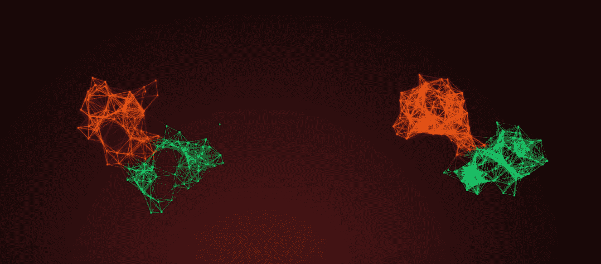
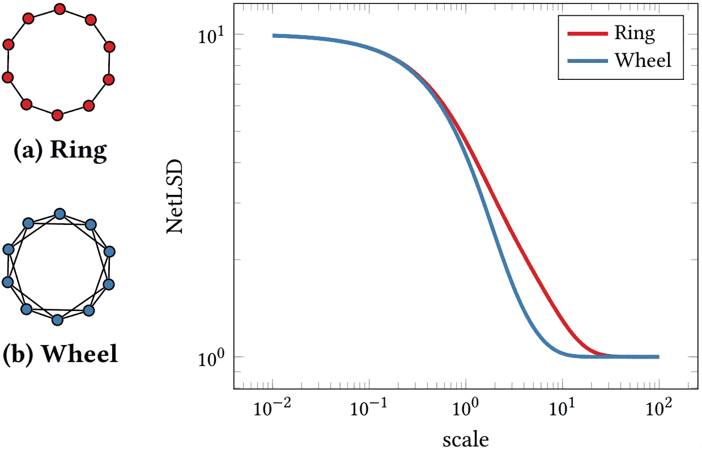
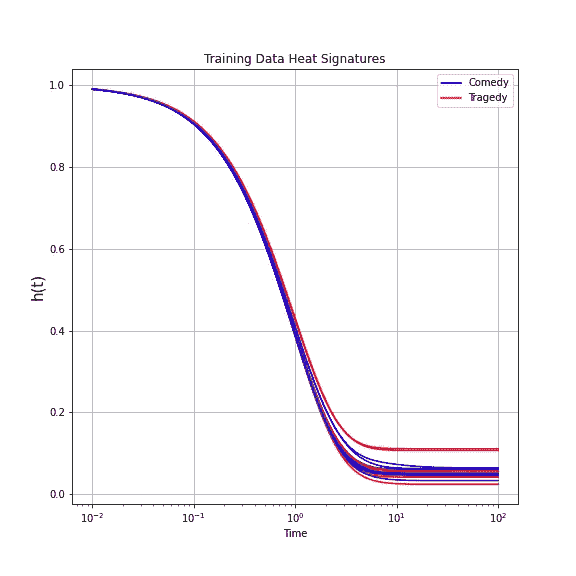
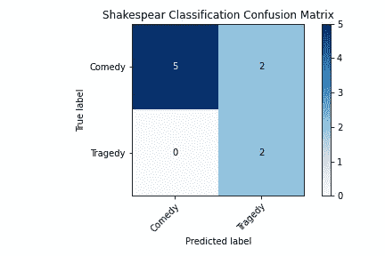

# 用🕸网络对莎士比亚进行分类

> 原文：<https://towardsdatascience.com/classifying-shakespeare-with-networks-2a6c1c44e17f?source=collection_archive---------57----------------------->

## 没有 NLP 是什么造就了喜剧或悲剧(+代码！)

所有莎士比亚的戏剧，以网络形式

威廉·莎士比亚是我们最著名和最受称赞的剧作家之一。他的写作生涯跨越了 36 部戏剧(很容易归因)，他作品的一个有趣的方面是这些戏剧可以被分成明确的类别:喜剧、悲剧和历史。喜剧有快乐的结局，令人振奋，其中主要人物克服了一些障碍。悲剧通常以有缺陷的主角的死亡而告终。然而，我们怎样才能正式区分喜剧和悲剧呢？这就是我们将在本文中解决的问题，但我们不会以您可能期望的方式去做。

我的研究(见: [cameronraymond.me](https://cameronraymond.me/) )专注于网络以及我们之间的联系如何塑造我们的世界。虽然很多人分析了莎士比亚戏剧中的对话，但很少有人费心去研究人物之间的不同之处。喜剧和悲剧是非常不同的——不仅在对话方面，而且在人物和场景的相互关系上。**我要证明的是，只看莎士比亚戏剧的结构，而不看任何对话，我们就能确定哪些戏剧是喜剧，哪些是悲剧。**

诚然，这乍一看可能有些奇怪。如果你想区分喜剧和悲剧，为什么不看真实的对话呢？

我认为*而不是* *依赖语言是一种优势，因为虽然不是每个人都说同一种语言，但**大多数故事都是由人物关系驱动的**。“网络优先”的方法让我们可以不受语言障碍的阻碍，对讲故事进行更普遍的比较。依赖自然语言处理(NLP)的方法需要知道如何解释不同的语言以及同一种语言的不同用法！一个从《西区故事》中学习的 NLP 模型可能很难解释《罗密欧与朱丽叶》，尽管它们都是英文的，并且遵循相同的故事情节。尽管存在代沟，但网络优先的方法有可能利用两者之间的关系相似性。因此，目的是测试莎士比亚的喜剧和悲剧的结构是否清晰到足以区分两者，而不依赖于对语言的任何理解。*

# 数据

谢天谢地，莎士比亚的大部分戏剧都被数字化了。使用一个 [Kaggle 数据集](https://www.kaggle.com/kingburrito666/shakespeare-plays/)，我们可以下载所有 36 个剧本，并将它们的脚本加载到一个数据帧中。由于脚本包含舞台指示，它没有给出角色如何相互关联的信息，我们将删除这些行。既然我们不会分析莎士比亚的历史，我们也可以放弃这些。

既然数据是可用的格式，我们就可以开始构建我们的网络(每个剧本一个)。因为我们对角色之间的关系感兴趣，我们将在两个角色之间添加一个链接，也称为边，如果他们*在同一个场景*中说话。经常在一起说话的字符可能以某种有意义的方式连接在一起。这将形成我们的网络优先分类模型的基础。

让我们以莎士比亚 1623 年的戏剧*为例，结局好的就都好*。首先，我们将为剧中对话进行隔离。然后我们再计算每个角色说话的次数，把那些对剧的结构有意义贡献的(说话超过 5 次的)保留下来。

接下来，我们将创建网络。我们可以通过一个场景接一个场景，如果两个角色在同一个场景中说话，在他们之间添加一个链接来做到这一点。这些角色在不同场景中一起说话的次数越多，他们之间的联系就越紧密。

重复所有 27 个剧本，想象一下，这些就是最终的网络！现在我们需要一种只使用这些网络来区分喜剧和悲剧的方法。

# 如何比较网络

比较网络的传统方法。

现在我们已经为莎士比亚的戏剧建立了网络，我们需要一些方法来区分它们。不幸的是，没有简单的方法来比较两个网络的结构。传统上，最主要的比较方法被称为图形编辑距离(GED)。该方法计算在两个网络变得相同之前，需要在这两个网络之间重新分配多少条边。这在上图中可以看到。不幸的是，这依赖于每个图都有相同数量的节点——否则它们永远不会相同。因为我们的戏剧有各种各样的角色，我们需要转向别的东西。 **GED 也比较简单，很少抓住一个网络的底层结构，所以需要更细致入微的比较方法。**

密度不同但结构相似的两个图。[来源](https://www.youtube.com/watch?v=aiPOa1NTgvM)。

为了解决这个问题，我们求助于 2018 年发表在知识发现国际会议上的一篇论文。这些研究人员定义**如果信息在一段时间内以相似的方式流经两幅图，那么这两幅图就是相似的。**由此产生的方法称为网络拉普拉斯谱描述符，简称 NetLSD。他们的假设是，信息通过一个网络流动，就像热量通过你的空气管道扩散一样。如果网络中的每个节点随着时间的推移释放一些“热量”，并沿着边缘传递给邻居，那么随着时间的推移，它将产生一个捕捉网络结构的签名。所以在每一个时间步，你要做的就是把网络中的“热量”加起来。这由 *h(t)* 表示，并在下图中显示为 y 轴。由于每个热追踪信号使用相同数量的时间步长，因此比较不同规模的网络要容易得多。通过使用这种技术，他们能够以较高的准确度(94–95%)识别不同类型的蛋白质和酶。

两个相似图形的 NetLSD 热特征:来源:Tsitsulin 等人。

虽然实现 NetLSD 相对简单(特别是如果你使用他们的 [Python](https://pypi.org/project/NetLSD/) 包),但是它需要一些关于计算机如何表示网络和线性代数的背景知识。对那些感兴趣的人来说，这里有[原文](https://arxiv.org/abs/1805.10712)。由于 NetLSD 的内部工作对我们分类喜剧和悲剧的任务并不重要，我将继续。

# 把所有东西放在一起

现在我们有了一种有意义地比较网络的方法，我们可以对不同的戏剧进行分类。首先，我们将把这 27 部戏剧分成两个部分:我们的训练数据，我们已知类型的观察戏剧，以及测试数据，将被分类的未知戏剧。我们将利用我们以前观察到的戏剧知识来帮助分类未知的戏剧。由于剧本很少，我将保留三分之一的剧本作为测试数据来验证模型。

接下来，我们将采用我们所有的训练数据，我们知道流派的戏剧，并计算它们的热跟踪签名。

让我们看看喜剧和悲剧之间的热量传递是否有明显的不同。这有点混乱，但似乎悲剧比喜剧平均保留了更多的“热度”。使用这些签名，我们可以开始对未知的戏剧进行分类。

先前观察到的活动的热特征(也称为“训练数据”)

对新剧本进行分类的过程相对简单。我们计算未观察到的游戏的热迹特征，然后找到具有最接近的热迹特征的五个先前观察到的游戏。如果这五部中的大部分是喜剧，那么我们就把这部剧标为喜剧，否则我们就把它标为悲剧。这就是所谓的 k 近邻(KNN)分类器。KNNs 并不真正对每一个说法进行建模——这就是为什么我更喜欢先验这个术语而不是训练数据——但是与 KNN 一起工作的游戏如此之少，这是一个合理的选择。

我们表现如何？嗯，**在我们的测试数据中，我们能够正确分类 9 部戏中的 7 部，原始准确率为 77.8%。**测试集包含 7 部喜剧和 2 部悲剧，我们能够**正确分类所有的悲剧**和 **5/7 部喜剧**。这表明，喜剧和悲剧产生了足够不同的结构，我们可以通过查看网络来区分哪个是哪个。

喜剧/悲剧分类混淆矩阵。

# 那又怎样？

虽然 27 次播放是一个小样本，但我认为这个实验的原则是合理的。网络优先的方法让我们做一些乍一看似乎不太可能的事情:我们能够在不看一段对话的情况下判断出一部剧的类型。我个人认为这很酷。

你是说这意味着我们不再关心 NLP 了？

显然不是。当像戏剧这样的东西被抽象成一个网络时，语言中有大量丰富的信息丢失了。然而，网络给了研究人员不依赖语言或不受语言束缚的灵活性。这又回到了比较不同语言或不同时期戏剧的例子。这些应用程序不会停留在比较戏剧或电影上。虚假信息通常通过创建社交媒体机器人网络来大量传播，这些机器人转发和放大彼此的假新闻，以给人以合法性的错觉。与其关注一个账户在说什么，不如看看它的连接网络是否与已被关闭的虚假信息机器人网络相似，这可能更有帮助。由于网络的可塑性很强，几乎可以用来表示任何东西，因此有很多潜在的应用。如果你想了解更多关于网络科学/图论及其应用的知识，请访问我下面的网站！它链接到我所有的作品。

*最初发布于*[*https://cameronraymond . me*](https://cameronraymond.me)*。*

[1]: Tsitsulin、Anton、Davide Mottin、Panagiotis Karras、Alexander Bronstein 和 Emmanuel Müller。"倾听图形的形状."在第 24 届 ACM SIGKDD 知识发现国际会议&数据挖掘的会议记录中，第 2347–2356 页。2018.