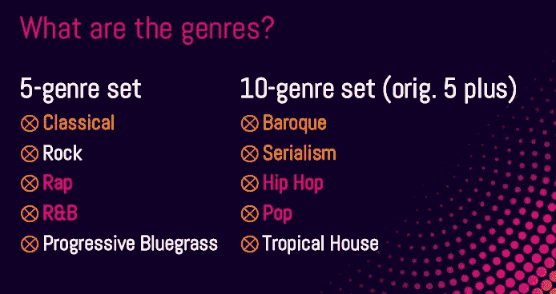
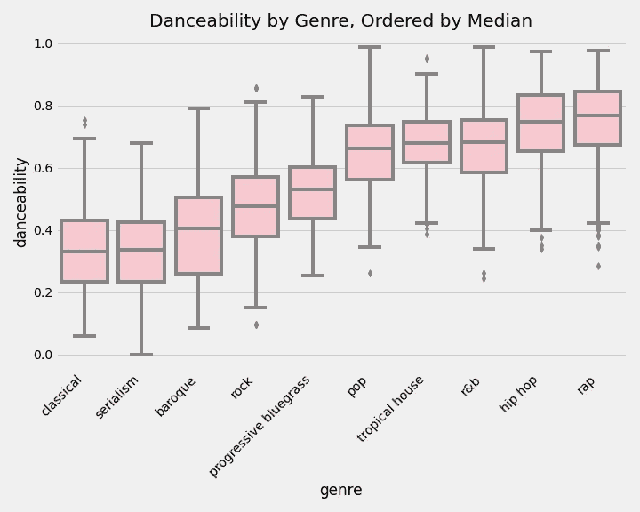
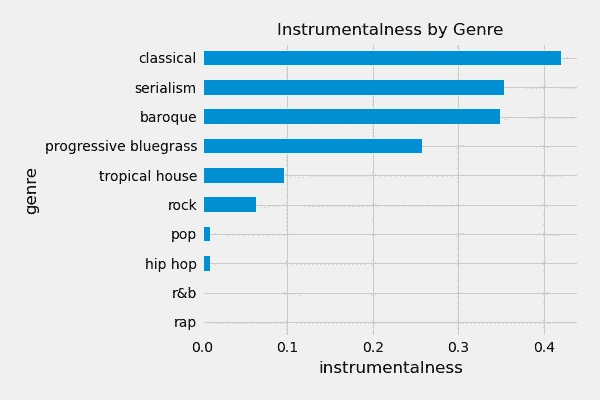
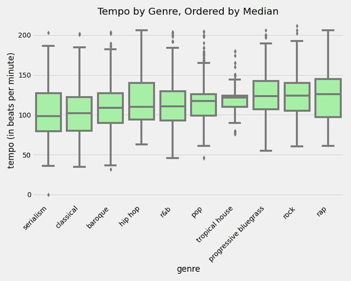
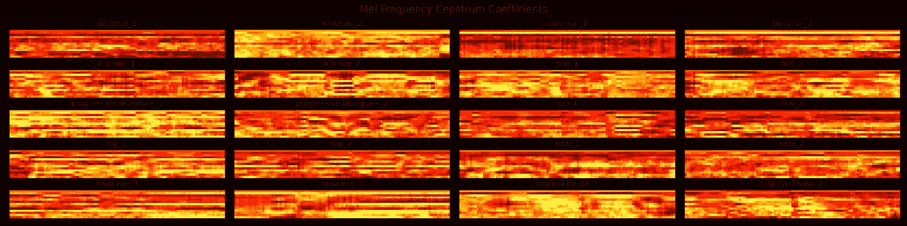
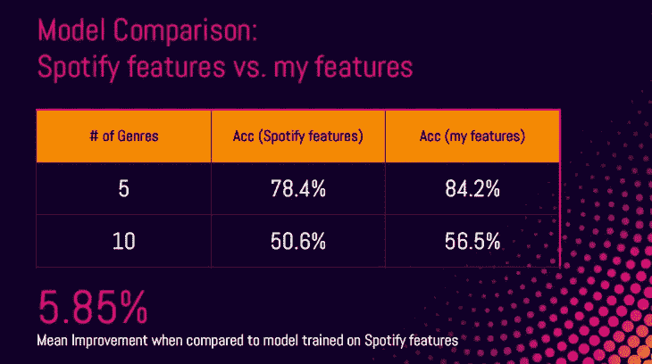
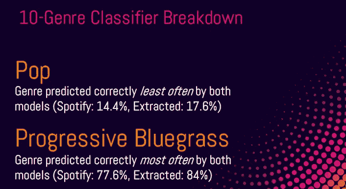

# 歌曲类型分类:使用 Spotify 的内置功能还是提取我自己的功能

> 原文：<https://towardsdatascience.com/classifying-song-genre-using-spotifys-built-in-features-vs-extracting-my-own-a4d5fe448948?source=collection_archive---------24----------------------->

## [实践教程](https://towardsdatascience.com/tagged/hands-on-tutorials)

我总是很难仅凭声音来区分音乐中真正特定的流派——我正在看着你，[金属](https://en.wikipedia.org/wiki/Heavy_metal_genres)！所以，我把体裁分类的问题变成了数字信号处理问题。我们去处理吧！

*【我应该先说我有音乐表演硕士学位，是一名录音艺术家，并且自己出版我的音乐，所以这是我对这个主题的兴趣开始的地方。]*

照片由 [Adi Goldstein](https://unsplash.com/@adigold1?utm_source=medium&utm_medium=referral) 在 [Unsplash](https://unsplash.com?utm_source=medium&utm_medium=referral) 上拍摄

# 问题是什么，为什么重要？

流派分类对于音乐分发平台很重要( [CD Baby](https://cdbaby.com/) 、 [Distrokid](https://distrokid.com/) 和 [Songtradr](https://www.songtradr.com) 是一些你可能很熟悉的)。好的流派分配有助于艺术家和联系新的观众，并让听众高兴(你的朋克摇滚播放列表中没有意外的圣诞歌曲)。如果顺利，大家都赢了！

对于这个项目，我想用下面的问题陈述来调查流派分类的问题:

> 使用来自音频源的**特征，分类模型能否以足够高的**准确度**预测一个 **30 秒音频剪辑**的流派，以自动将歌曲组织成它们各自的流派？**

# 我们在讨论多少数据？

好问题，读者！这是我们得到的信息:

*   总共 9365 首歌曲
*   10 种类型

我把这些歌曲分成简单的 5 种风格集和复杂的 10 种风格集。难度水平是由体裁的紧密程度决定的。下面的橙色和粉色是相互关联的。

我训练和测试模型的流派列表。图片作者。

# 我从探索数据中发现了哪些有趣的事情？

当我开始使用 Spotify API 的`spotipy`Python 库[挖掘数据时，我发现 Spotify 让你可以访问一些有趣的](https://spotipy.readthedocs.io/en/2.16.1/)[预设计功能](https://developer.spotify.com/documentation/web-api/reference/tracks/get-audio-features/)。我将着眼于舞蹈性、乐器性和节奏，但还有许多其他有趣的功能可用！

可舞性是一首歌的可舞性从 0 到 1 的评级。这结合了从歌曲中提取的许多不同的节奏元素。我们看到前五大适合跳舞的类型正是我们所期待的。对不起古典，你的华尔兹不适合跳舞！图片作者。

乐器性是衡量一个音轨是否不包含人声的指标。我们可以看到，古典音乐、序列音乐和巴洛克音乐的平均器乐化程度远远高于说唱音乐、R&B 音乐和嘻哈音乐。这很有道理！图片作者。

这很有趣，不同流派之间的节奏差异很大，但看起来热带小屋的四分位数范围最窄。朋友们，保持你的热带音乐在 120-130 BPM 之间！图片作者。

# 现在挑战来了:我能打败 Spotify 的功能吗？

Spotify 已经做了一些很好的工作，从音频来源中提取可解释的、有意义的数据，但我想看看我是否可以创建自己的数据。我花了一些时间四处打听和寻找资源(感谢[诺亚·克里斯蒂安森](https://medium.com/@nchristiansen)和[萨拉·苏伊丹](https://medium.com/@saraesoueidan)！)，研究`librosa`，通过[音乐信息检索](https://musicinformationretrieval.com/)网站挖掘一些思路。

我用`librosa`设计了一些东西:

*   **能量**:响度的量度
*   **均方根能量**:响度的另一种度量
*   **梅尔频率倒谱系数(MFCC)** :特定频率范围内响度(功率)的更详细测量。

我不想深究数学，但 MFCC 类似于声波指纹。每一个声音都是特别而独特的，就像你们每一个人一样。

看看这些独一无二的小曲片段！X 轴是时间，Y 轴是频率范围，颜色越亮，该点的频率范围越强大。图片作者。

# 建模阶段

因为每一个不正确的估计都同样糟糕，所以我使用准确性(10 种类型集的基线 10%)作为我的模型成功的衡量标准。我测试了几个不同的模型，最后使用了一个**支持向量分类器(SVC)** ，原因如下:

*   最终，**的表现超过了我测试的其他模型**(包括一个卷积神经网络)
*   用当前数据集来拟合模型只需要**几秒钟**

所以这是**更好更快**——你还能要求什么呢？唯一的问题是，如果我有数百万首歌曲，这个模型可能无法很好地扩展。

下面是我的模型——用新设计的功能构建——与另一个用 Spotify 的预设计功能训练的 SVC 相比的表现:

5 个流派的集合是更容易的集合，与 10 个流派的集合相比，它们之间的关联更少。图片作者。

# 突击测验:你能猜出这些歌曲的流派吗？我的模型不能。

## **FDVM 再爱**

*   预测类型:流行音乐
*   实际类型:热带住宅

*我唯一能猜到的是，这里的鼓点不像其他热带屋的曲目那样存在。*

## 美利坚合众国总统的小猫

*   预测类型:热带住宅
*   实际类型:摇滚

*这首每段结尾都有动态滴，类似热带屋歌。*

## 西海岸的派对(壮举。费丝·伊文斯马托马和臭名昭著的 B.I.G

*   预测类型:热带住宅
*   实际类型:说唱

*这首歌刚刚得到了一个糟糕的 30 秒抽签，Spotify 为我们的 30 秒预览随机选择的歌曲片段是合唱部分，在我的人类耳朵里听起来更像是热带房屋的曲调。*

如果你想玩玩，看看更多不正确的猜测，我已经在[我的公共 Github](https://github.com/EricHeidbreder/GenreClassifier) 中构建了一些代码，它将从你选择的任何流派中返回一首随机错误预测的歌曲！

# 结果

图片作者。

我从这个过程中学到的是**子流派在声音层面上没有很好的定义**。可能还有其他因素影响到次类型的创作。在这一点上，我不能预测足够准确的类型来进行自信的部署，但我希望在未来尝试一些事情:

*   从音频中提取歌词。我认为对歌词的分析有助于预测子流派。例如，我认为说唱歌曲的歌词总数会比 r & b 歌曲多，这可能是一种在这两种风格之间做出决定的方式。
*   **无监督学习模型。我很想看看当计算机对它们进行分类时会出现多少流派，然后使用迁移学习将结果反馈到另一个模型中。**

感谢阅读！如果您想查看该项目，请前往[我的公开回购](https://github.com/EricHeidbreder/GenreClassifier)。由于使用的一些数据集超过 100MB，我无法将它们全部上传到 GitHub，但你应该可以用我的代码重建它们。我很乐意更多地谈论这个项目——留下评论或在 [LinkedIn](https://www.linkedin.com/in/eric-heidbreder/) 上找到我！

# 来源和进一步阅读/观看

*   【https://musicinformationretrieval.com/energy.html 
*   [https://musicinformationretrieval.com/mfcc.html](https://musicinformationretrieval.com/mfcc.html)
*   医学博士 SahidullahSaha，Gou tam(2012 年 5 月)。“说话人识别 MFCC 计算中基于块的变换的设计、分析和实验评估”。言语交流。54 (4): 543–565.doi:10.1016/j . specom . 2011 . 11 . 004
*   亚当斯塞斯。“DSP 背景——音频分类的深度学习”。
    https://www.youtube.com/watch?v=Z7YM-HAz-
    IY&list = pl ha 3 b 2k 8 r 3t 2 ng 1 ww _ 7 mixeh 1 pfqjqi _ P