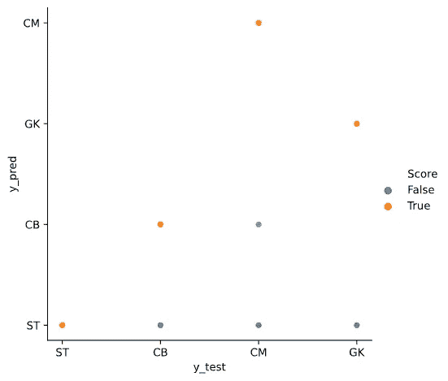

# 用 Sklearn 对足球运动员的位置进行分类。

> 原文：<https://towardsdatascience.com/classifying-the-position-of-the-football-player-based-on-their-performance-statistics-using-fifa-23f317eeb493?source=collection_archive---------35----------------------->

## 使用 Fifa 18 比赛数据，将足球运动员分类为 CM、ST、CB 和 GK。

**来源** : [Freepik](https://www.freepik.com/free-photo/crop-athlete-kicking-soccer-ball_2222108.htm#page=1&query=football&position=2)

感谢‘Aman Shrivastava’分享[数据](https://www.kaggle.com/thec03u5/fifa-18-demo-player-dataset)。

我们将使用所提供的数据集，该数据集已经过处理并准备就绪。

**用例:**作为一名用户，我有一名球员的统计数据，我想知道这名球员应该打前锋(ST)、中场(CM)、中后卫(CB)还是守门员(GK)。

我用过的数据是 FIFA 2018 比赛中所有球员的属性得分。数据的尺寸是 14045 x 74，但我使用的是专业球员的数据，他们被选择作为前锋、中后卫、中场和门将。经过此筛选后，剩余的数据集有 7587 x 77 个维度。

**数据分析**

当我们检查过滤后的数据时，我们注意到 CM 位置的样本量与其他位置相比较小。这将影响偏向重样本的预测。

有些球员根据他们踢的位置而擅长一些技能。举例来说，ST 必须进行更少的铲球，所以他们的铲球能力将低于 CB，反之亦然。

通过检查变量“PrefPos”的皮尔逊相关性，也分享了这一证据。

> 为了自己找到相关性，首先使用 cat.codes 方法将 PrefPos 变量更改为 numeric category。

下面的形象化比较了铲球能力和终结能力，但是有一个可变的“年龄”,一个球员是否有可能在早年成为一个糟糕的终结者，随着时间的推移，他的技能会有所提高？

本页底部有一些更有趣的方框图。

**培训和测试取样**

我们希望通过为具有训练集和测试集的样本创建子群体来创建具有相等样本比率的样本，以避免出现 CM 位置的样本量更少的情况，然后我们选择并分配变量['PrefPos']作为目标。

**训练模型和预测**

因为我们的目标是多类分类，所以 sklearn 提供了一些选项。我使用 SGD 分类器，因为它本身能够处理多类，如下所示:

让我们在训练好的模型上拟合测试集，并得到预测

**交叉验证和准确性**

显然，目前我们得到了 42%的总体精度，但正如我们在上面检查的那样，该精度因位置而异，CM 位置的精度远低于 42%。

**多类混淆矩阵**

我们现在来看看错误率。

**结论:**

对模型的初步检验表明，在根据运动员的表现对他们进行分类的情况下，有机会进一步改进模型的性能。有机会做进一步的特征工程，并使用深度学习算法来进一步提高模型的性能。

完整代码:

从[这里](https://gist.github.com/alaizaz/1d33bfb172cb7efa33204fc1a6b74747.js)下载数据。

我还研究了年龄对专业运动员某些技能的影响，结果如下:

ST 平均具有较好的整理能力，并随着年龄的增长而提高

反应是任何运动的一个必要方面，但 CM 往往略胜一筹。

CBs 擅长滑铲。

受年龄影响的一个属性是冲刺速度。

感谢您的阅读，我打算在下一篇博客中讨论初级强化学习。

**数据来源:**再次特别感谢 Aman Shrivastava 分享[数据](https://www.kaggle.com/thec03u5/fifa-18-demo-player-dataset)。