# 在线评论论坛中的毒性分类:端到端项目

> 原文：<https://towardsdatascience.com/classifying-toxicity-in-online-comment-forums-end-to-end-project-57720af39d0b?source=collection_archive---------43----------------------->

## 利用自然语言处理(NLP)和深度学习对用户提交的评论中的毒性进行分类和跟踪。

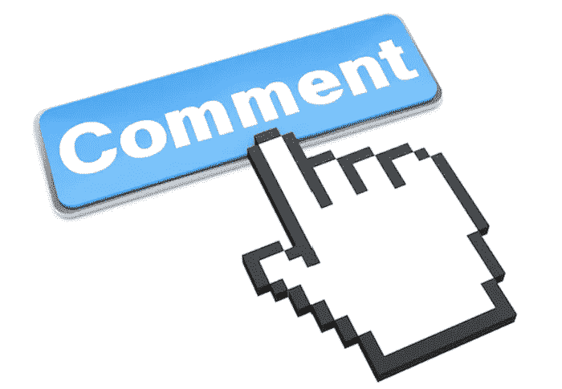

脸书评论按钮

一个完整的交互式 Jupyter 笔记本，包含代码和解释，可以在我的 Github [这里](https://github.com/lukenew2/toxicity/blob/master/code/Toxicity.ipynb)找到。

# 介绍

自从社交媒体和在线对话成为日常生活的一部分以来，在线处理毒性和遏制骚扰已经成为一个日益严重的问题。几乎不可能在没有目睹不必要的骚扰或不尊重等有害行为的情况下进行在线对话。数字世界有潜力成为一个通过向人们学习来促进增长、同情和教育的社区，但受到利用这种面对面断开的用户的阻碍。

我相信每个人都有权利参与在线对话，而不必担心被骚扰或成为无端辱骂的目标，这让我想起了不久前我在脸书无意中发现科林·卡佩尼克帖子上一些关于被邀请回 NFL 试训的粗鲁评论。

谁是科林·卡佩尼克？他是旧金山 49 人队的四分卫，在国歌声中跪下抗议美国的警察暴行和种族不平等。

下面的评论来自他的帖子，并启发我使用我在数据科学方面的技能来有效地检测和跟踪用户评论的毒性，如下所示。

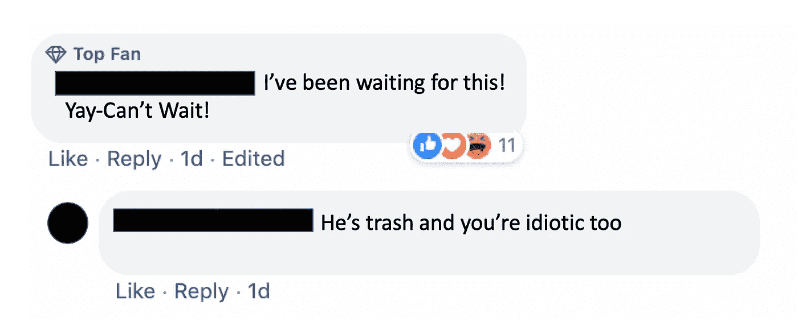

# 方法学

我使用的数据来自 Kaggle，由用户在在线论坛上提交的大约 180 万条评论组成。每条评论都标有让另一个人退出对话的可能性。我把毒性定义为任何大于 0.5 的概率。数据集可以在这里找到[。](https://www.kaggle.com/c/jigsaw-unintended-bias-in-toxicity-classification/data)

在将我的数据转换成分类算法可以使用的格式之前，我对原始文本数据进行了预处理。这包括:

*   删除不需要的字符

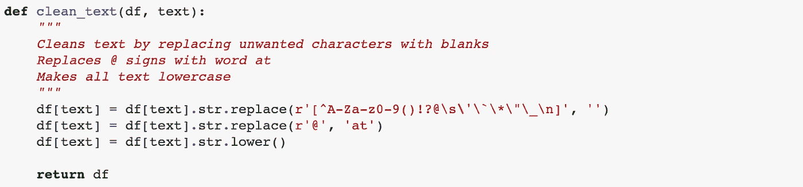

*   标记化

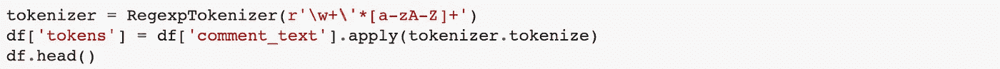

*   删除停用词和缩写(我创建了自己的停用词列表)

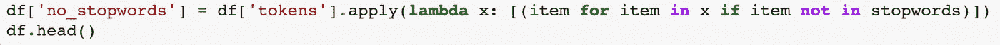

*   词性标注

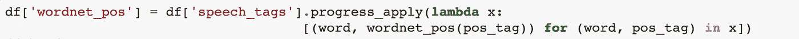

*   词汇化

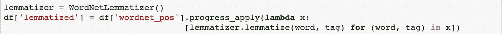

为了更多地了解我的数据，我计算了词汇化后的单词数和我们的词汇量(独特的单词)。此外，知道我们最长的句子有多长可能会有帮助。

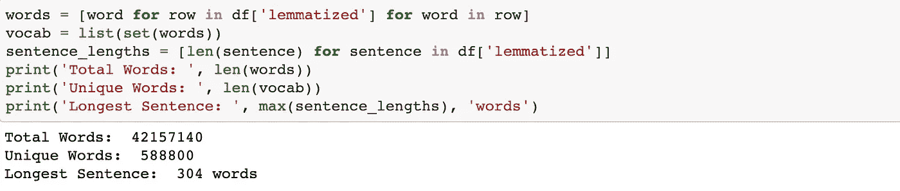

现在我准备开始建模过程。每个模型都是不同的单词嵌入、维度缩减和分类算法的组合。我使用了如下所示的工具和受试者操作特征(ROC)曲线下面积(AUC)来对每个模型的性能进行评分。

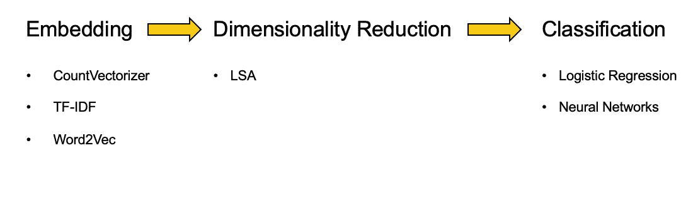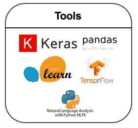

# 结果

我最好的模型是通过深度学习获得的。我使用了带有 Word2Vec 嵌入的双向 LSTM。这意味着我用预先训练好的单词向量将我所有的单词嵌入到谷歌的 Word2Vec 词汇表中，并让我的模型学习其余的。我的 vocab 有 2 亿个单词在谷歌的 Word2Vec vocab 中，这使得我的模型只剩下 20 万个嵌入来训练。使用预先训练的单词向量大大减少了计算时间并显著提高了性能。

## 网络架构:双向 LSTM

双向长短期记忆(LSTM)是一种递归神经网络(RNN)架构，围绕记忆更新策略增加了复杂性，允许我们捕捉单词使用的空间模式，这与人类如何交流极其相关。通过将文本视为单词序列，并以明确的顺序方式处理这些单词，我们可以在模型中获得很大的预测能力。

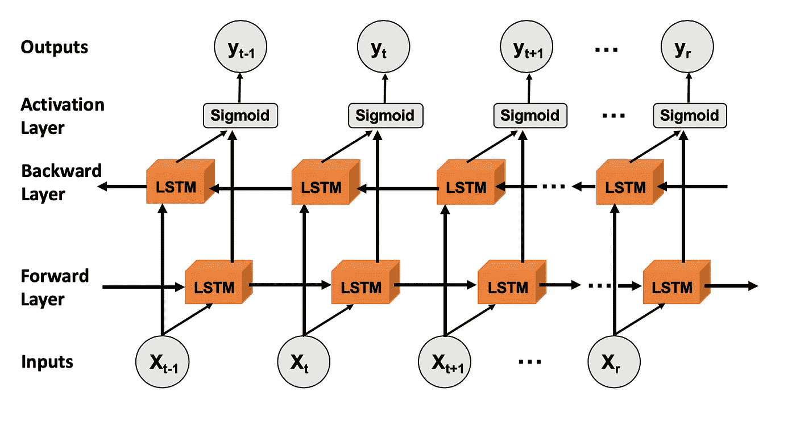

双向仅仅意味着我们从前到后和从后到前处理文本，允许我们捕捉丰富的上下文。利用 Keras，以下是我使用的超参数。

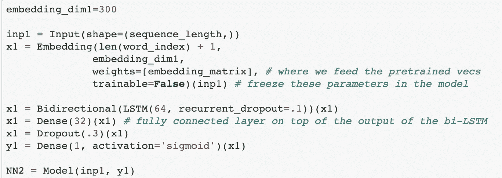

## 受试者工作特征曲线

利用预先训练的词向量和深度学习的力量，我的最终模型在性能上给了我一个显著的提升，结果是

ROC AUC=0.951

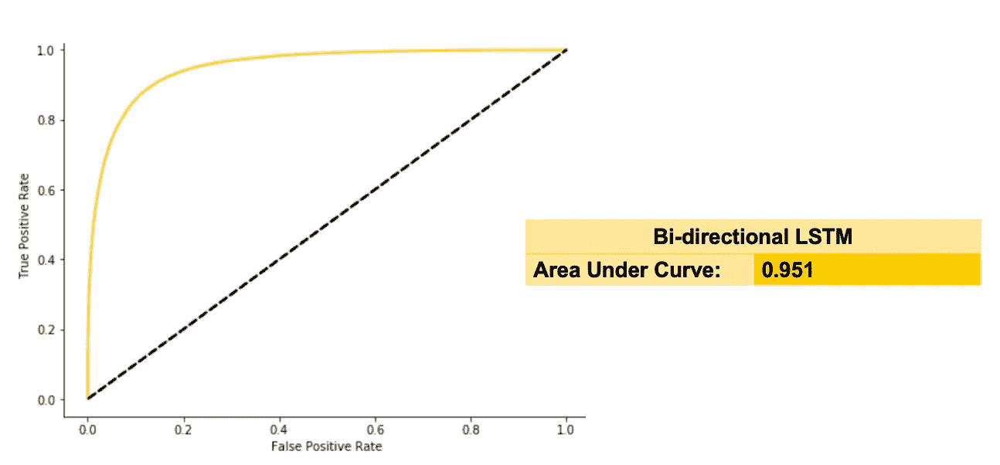

利用深度学习能力的唯一问题是我们在模型中失去了可解释性。我无法看到特性的重要性来检查我的模型是否做出了正确的决策。相反，我去了在线评论论坛，让我的模型实时预测评论，供我观察。

所以回到科林·卡佩尼克之前的帖子，使用我的模型，我们看到毒性评论被标记为 99.5%的毒性。而“头号粉丝”的评论毒性为 0.2%。

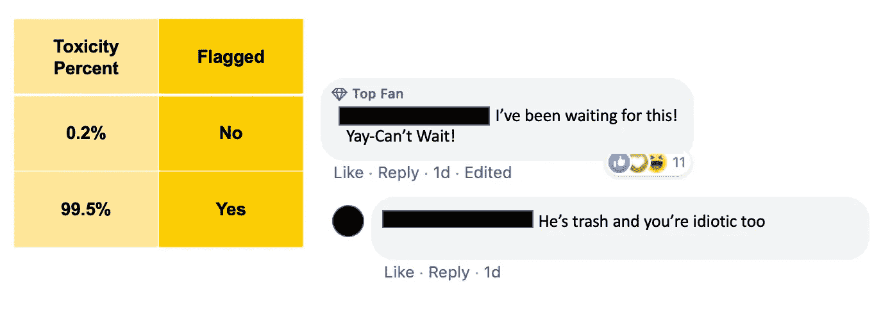

# 结论

回到最初的问题，这种模式如何在我们的在线对话中增加礼貌？嗯，要看平台。例如，在线游戏，你可能想检测有毒用户，然后根据违规次数或违规严重程度实施某种限制。

## 社会化媒体

然而，对于像脸书和推特这样的社交媒体平台，你可能不想限制人们的言论自由。如果我们在人们打字时在评论上方放置实时毒性追踪器，他们可以对自己说的话更加自觉，并有希望第二次猜测他们将要发布的毒性评论。

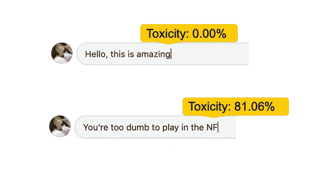

毒性追踪器只需要放在有上网不礼貌历史的用户身上。与游戏类似，我们可以使用人工智能来检测这些用户，然后对他们使用毒性跟踪器。进行一项案例研究，看看有中毒史的用户在开启网络聊天时是否会改变他们的行为，这将是一件有趣的事情。

# 参考

 [## 如何解决 90%的 NLP 问题:一步一步的指南

### 使用机器学习来理解和利用文本。

blog.insightdatascience.com](https://blog.insightdatascience.com/how-to-solve-90-of-nlp-problems-a-step-by-step-guide-fda605278e4e)