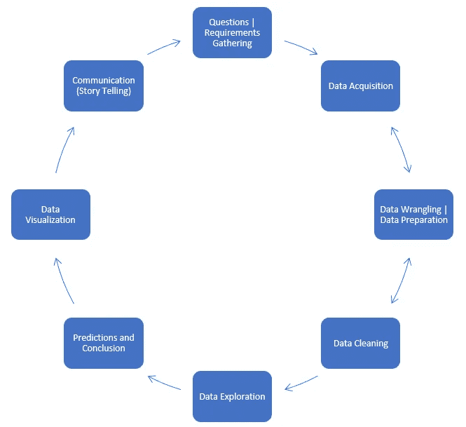
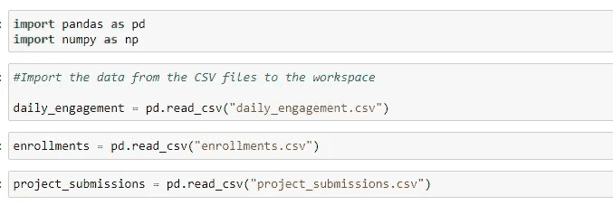
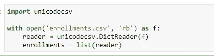
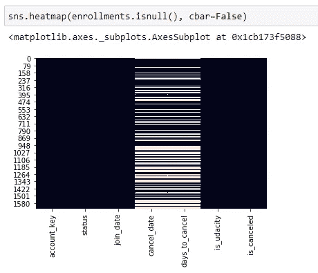
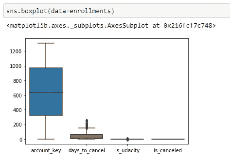
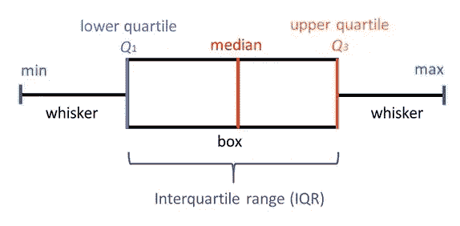
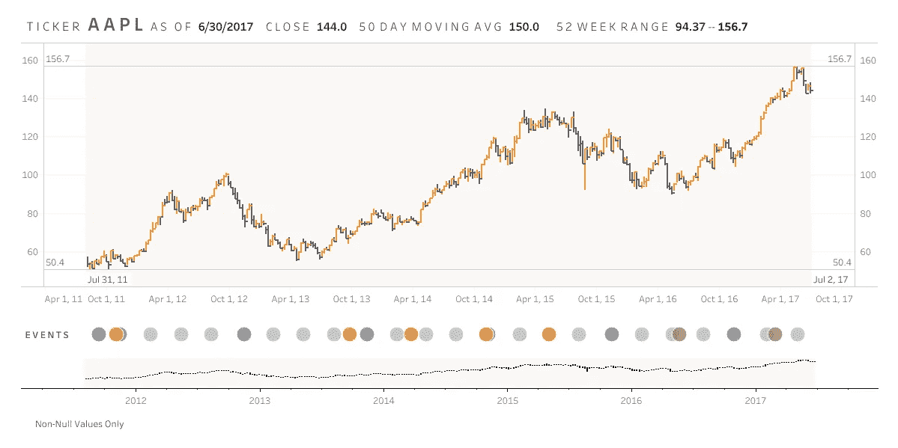

# 分析数据的清晰架构

> 原文：<https://towardsdatascience.com/clean-architecture-of-analyzing-data-7e689da7dd4a?source=collection_archive---------44----------------------->

## 简化数据分析过程

不管你来自什么职业，如果你的企业或服务有客户，那么你肯定是在分析数据。这种分析是你对未来发展充满信心的根源。在这篇文章中，我将深入分析数据的过程以及从中获取最大收益的方法。让我们深潜。

数据分析不仅仅与在硅谷工作的科技公司相关。它是每个行业的一部分，适用于所有产品。医药、杂货店、大学、气象站以及几乎所有你能想到的行业每天都要处理大量的数据。我将解释并演示一个典型的数据分析过程是如何工作的。但是，这些步骤并不详尽，并且可能不会按照所述的直线顺序发生。这只是勾勒出数据分析作为架构的整体图景。

解决任何分析问题的一般思维模式是通过假设检验的结果来看待它。什么是假设检验？它是验证结果的程序，从结果开始。我们形成一个结果(称为假设)，然后解决问题以证明假设是真的。类似地，当解决一个分析问题时，我们从决策开始，从结果中需要什么开始，然后形成我们达到这个结果的策略。不断回顾这一结果并反思方法是否正确总是一个好主意。原始流程是这样的，我们从定义决策和分析所需的输出开始。然后是可以使用的分析方法，项目有什么数据要求。下一步是获取数据，收集数据并将其存储在一个可访问的位置，并进一步使用它来执行分析。这种方法通常回答有关项目可行性的问题。

这是建筑的草图。虽然它并不详尽，可能会根据项目的需求不断变化

## 1.问题/需求收集

理解需求是关键。重要的是要找出你想要解决的业务问题是什么，以及你想要衡量的 KPI 是什么。下一步是规划前进的道路。我推荐的一个非常有用的策略是花些时间从给你的信息中找出数据指针。这些数据指针是性能指标，它们将构成您需要关注的信息集。问具体的问题很重要。这个阶段也为您的数据分析解决方案奠定了基础。从数据中记下你认为会对决策产生影响的关键领域。一旦完成并理解了这些，你现在就可以进入数据探索和收集了。

## 2.数据采集

在加载数据和执行前两步的过程中，涵盖了数据采集的主要部分。但是，作为一个过程，获取不仅仅是将数据从一个资源带到您的工作空间。关于这次收购，一直存在术语上的混乱。首先，“数据获取”有时用于指组织产生的数据，而不是(或同时)来自组织外部的数据。这是一个谬论，因为组织产生的数据是已经获得的。因此，我们只考虑从其他来源和流程中获取的数据。

这方面的一个重要步骤是识别数据的来源和类型。数据可以多次从云服务移动到本地主机，或者来自 API 调用。我的建议是，如果数据源在云上，并且是静态数据(在一段时间内保持不变，不会改变),那么在这段时间内在本地下载数据、执行分析并发布报告将是一个不错的选择。另一方面，如果数据是一个连续的流(刷新数据)，我建议在云本身上执行分析。

使用 Panda 的 read_csv 函数将本地文件导入为 Panda 数据框[图片由作者提供]

## 3.数据争论/数据准备

根据 Aberdeen Group 的一份报告，数据准备“是指任何旨在提高数据质量、可用性、可访问性或可移植性的活动。这一步从收集数据并将其导入到您的工作区开始。从现在开始，由于有可能向您展示数据，我将使用一个数据集来解释进一步的步骤。它将首先以大多数代码能够理解的格式接收数据。如果使用基于查询的程序来处理数据，任何 SQL 语法都可以。我将在一个 CSV 文件上继续使用 Python。这里需要注意的一件重要事情是，数据是 CSV 格式，TSV 格式对于 Python，R 来说更容易理解和解释。同时，这些格式可以很容易地在 Excel 上运行以可视化，但同时，XLS 格式的文档很难理解和运行。您可以使用各种语句将数据加载到 Python 环境中。

导入数据的另一种方式。打开文件并创建一个流以写入文件。“打开”函数以只读、二进制读写和其他方式打开文件

一旦数据被导入，一些方法有助于理解存在的变量类型和可用的数据量。这可以使用一些 Pandas 函数来完成，如“数据帧”。Info()”或“DataFrame.head()”。下一步是试图找到这些数据中的异常。这些异常可能是空白列、缺失值，或者在某些情况下是异常值。对于许多分析师来说，处理异常值的概念非常不同，处理异常值也主要取决于手头的问题。有时删除离群值可能是有意义的，有时我们可能希望为所有列创建一个标准化的表格来弥合离群值，这需要标准偏差和方差。这里的一般规则是，如果数据点距离数据的平均值±3 SD，建议忽略该异常值，不考虑进行进一步分析。

## 4.数据清理

数据清理部分初始化一些可视化库，以检查数据差异。这很重要，因为异常值会极大地导致我们对分析的误解。Pandas、Matplotlib 和 Seaborn 中有一些公共库可用于识别这些异常值。让我们看一些代码，这些代码将确定数据中是否有需要清理的值。我在这里解释实现的两个部分，一个是寻找缺失值，另一个是寻找异常值。

要查找缺失值，我们可以使用下面的函数:IsNull()或 isna()。下面的热图显示了在列中显示为 Null 的数据点。然后，可以使用插补技术(如均值/中值插补)对其进行填充(尽管生产级代码不考虑均值插补)

热图用于查找数据中的空值/缺失值[图片由作者提供]

另一个重要的技术是绘制一个箱线图。这些图通常揭示了我们正在尝试处理的数据的大量信息，并且可以很容易地用于识别风险因素，如数据中的偏斜度和数据中的异常值。

方框图的示例实现[图片由作者提供]

箱线图的解释可通过以下方式完成:

图片由 [SimplyPsychology](https://www.simplypsychology.org/boxplots.html) 解释箱线图的解释[1]

**最低分:**最低分，排除离群值(显示在左须末端)。

**下四分位数:**25%的分数低于下四分位数(也称为第一四分位数)。

**中位数:**中位数标志着数据的中点，由将方框分成两部分的线表示(有时称为第二个四分位数)。一半分数大于或等于该值，一半分数小于该值。

**上四分位:**百分之七十五的分数落在上四分位值以下(也称为第三四分位)。因此，25%的数据高于该值。

**最高分:**最高分，排除离群值(显示在右须末端)。

**触须:**上下触须代表中间 50%以外的分数(即较低的 25%分数和较高的 25%分数)。

**四分位范围(或 IQR):** 这是显示中间 50%分数的箱形图(即第 25 和第 75 百分位之间的范围)。

处理有偏差或缺失的数据将根据不同的业务场景而改变。正如我之前解释的一般规则，任何超过 3 个标准差阈值的数据点都可以被删除，因为这是一个无法解决的直接异常情况。对于插补，使用了许多技术，如均值插补、热箱插补等。

## 5.数据探索

数据的探索性分析不仅令人着迷，而且也是收集数据中的架构和依赖关系的最佳形式之一。这个阶段可以或者有时不可以与手头的主要问题相关联，但是仍然在我的分析解决方案的干净架构中占有一席之地。这样做的主要原因是从业务需求中形成的用例经常会回答所有的问题，尽管有时我们可能会遗漏一些数据。这些数据对于解决手头的问题可能是必需的，也可能不是必需的，但是对于掌握数据集的结构非常有用。

这可以由各种步骤和图表组成，您可以使用这些步骤和图表来分析数据，并探索不同数据值之间的联系和意义。这里的目标应该是彻底理解表格列的工作方式以及它们所包含的值。这是实际预测分析和得出结论之前的阶段，因此应该利用它来清除与正在分析的数据相关的所有形式的疑问。我列出了几个可以使用的基本图，以及从中可以得出什么样的衍生品。

绘制像箱线图、分布图和散点图这样的图表将向您展示数据曲线的样子，它在哪里是偏斜的，以及可能的异常值是什么。帕累托图和直方图有助于分析数据的置信区间以及最常见的值。如果数据是多维的，并且变化超出了理论上的认识，我们可以使用类似主成分分析(PCA)的东西来执行维数减少。

## 6.预测和结论

我们正慢慢接近这一进程的尾声，因为大部分分析现已结束，但解决方案仍未完成。这里要考虑的一个重要方面是，对于任何数据分析解决方案；解决方案的交付通常不会交给其他数据分析师。因此，我们从数据中得出的结论需要用大多数人都能理解的语言来表达。这可以在可视化阶段得到完善，但尽管如此，越容易理解的东西，就越容易呈现。对于根据数据做出的预测，请确保仅根据第一步的要求做出预测。很少有分析师喜欢将额外的信息可视化，假设大量的数据是一个好的预测。理论上，这可能证明你在分析过程中做得很好，但最终如果消费者不需要额外的数据，这些数据就没有任何用处。因此，要记住的重要一点是尽可能保持简单明了。

## 7.数据可视化

我们现在来看架构中的最后一部分，数据可视化更像是为您的数据将要提供的通信添加一个额外的验证层。现在，可视化本身是一个巨大的进步，包含了许多概念，也可以有自己的架构。通过认识到数据可视化本身是一项全职工作，不像架构图的所有其他步骤，可以理解这一点的深度。

我已经创建了一个单独的故事来解释数据可视化实际上有多重要，我建议大家浏览一下。

> [https://medium . com/analytics-vid hya/the-science-of-data-visualization-995 e 45238354](https://medium.com/analytics-vidhya/the-science-of-data-visualization-995e45238354)

## 8.交流(讲故事)

尽管数据可视化涵盖了分析的大部分图形信息，但架构的最后一部分是讲故事的艺术。一旦分析、预测和可视化完成，我们就回到任务的第一步，收集需求并理解我们需要回答的问题。沟通包括给最终用户答案。在得出这个结论的过程中，我们可能会遇到不需要放入结论中的各种数据段。在我看来，给出结果的最好形式是一页或者最多两页的报告仪表板。[2]该报告将包含我们正在解决的问题的准确、中肯的答案，并且只包含最终用户需要的数据。在沟通过程中使用的语言应该从业务用户的角度出发，而不是从数据科学家的角度出发。有一些工具可以用来以创造性的方式传达这一信息——tableau、adobe analytics 是一些非常棒的仪表板工具。我将为如何开始讲故事的艺术写一篇单独的文章。但是，同时让我向您展示几个很棒的仪表板示例。

来自公众的图片 [Tableau Viz Gallery](https://www.tableau.com/about/blog/2017/7/viz-gallery-contest-winners-prove-visual-analytics-art-73390) 作者**尤里·法尔**展示了 AAPL(苹果)的股价走势

网络分析仪表板图片在 [Unsplash](https://unsplash.com/s/photos/analytics-dashboard) 上由[卢克·切瑟](https://unsplash.com/@lukechesser)拍摄

并不总是需要使用强大的工具和复杂的算法来解决数据分析问题。虽然，当需要时，许多工具将为您提供先进的技术和选择，但代价是过于复杂。将解决方案复杂化的一个缺点是将这些结果呈现给涉众。你的程序越复杂，就越难提出来。

数据驱动项目的当前状态需要改变，因为敏捷框架已经为软件工程创造了奇迹，所以是时候采用迭代方法来解决数据科学问题了。我相信这个提议的解决方案有助于缓解项目的生命周期，并且到目前为止已经为我展示了清晰的结果。

请在下面的评论中让我知道你对遵循一种架构进行数据科学项目的想法，或者在 [Twitter](https://twitter.com/rjrahul24) 上与我联系。

**参考文献:**

[1]关于箱形图的细节和解释—[https://www.simplypsychology.org/boxplots.html](https://www.simplypsychology.org/boxplots.html)

[2]用于单页报告仪表板的 Tableau 博客—[https://www . Tableau . com/about/blog/2017/7/viz-gallery-contest-winners-prove-visual-analytics-art-73390](https://www.tableau.com/about/blog/2017/7/viz-gallery-contest-winners-prove-visual-analytics-art-73390)