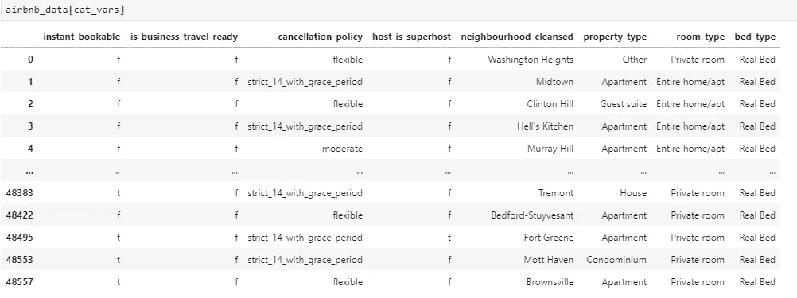
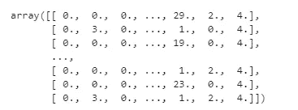

# 像专家一样预处理数据:Scikit 简介-学习管道

> 原文：<https://towardsdatascience.com/clean-efficient-data-pipelines-with-pythons-sklearn-2472de04c0ea?source=collection_archive---------7----------------------->

## 用于估算、缩放、编码和转换数据的可重复使用的函数


20 年代的数据争论照片由[马希尔·云萨尔](https://unsplash.com/@mahiruysal?utm_source=unsplash&utm_medium=referral&utm_content=creditCopyText)在 [Unsplash](https://unsplash.com/s/photos/cowboy?utm_source=unsplash&utm_medium=referral&utm_content=creditCopyText) 上拍摄

> "如果没有一个系统的方法来启动和保持数据干净，坏数据就会发生."
> 
> —多纳托·迪奥里奥

您编写了所有的查询，收集了所有的数据，并全力以赴实现您在 Medium 上读到的最新机器学习算法。等等！你很快意识到你需要处理缺失数据、插补、分类数据、标准化等。

您可以开始编写可应用于任何数据集的函数和数据管道，而不是“手动”预处理数据。幸运的是，python 的 Scikit-Learn 库有几个类可以让这一切变得轻而易举！

在本文中，您将学习如何:

*   在任何数据集上轻松再现转换。
*   轻松跟踪应用于数据集的所有变换。
*   开始构建您的转换库，您可以在以后的不同项目中使用它。

**tl:dr** :让我们建立一个管道，在那里我们可以像这样估算、转换、缩放和编码:

```
**from sklearn.compose import ColumnTransformer**data_pipeline = ColumnTransformer([
    ('numerical', num_pipeline, num_vars),
    ('categorical', OneHotEncoder(), cat_vars),

])airbnb_processed = data_pipeline.fit_transform(airbnb_data)
```

不需要了解太多，你就可以推断出不同的变换应用于数值变量和分类变量。让我们进入众所周知的杂草，看看我们如何结束这个管道。

# **数据**

对于所有这些例子，我将使用来自 insideairbnb.com 的 airbnb 纽约房源数据集。这是一个真实的数据集，包含从 airbnb 搜集的信息，并拥有与该网站上的一个房源相关的所有信息。

假设我们想要预测一个列表的价格，给定一些变量，如财产类型和邻居。

```
raw_data = pd.read_csv('[http://data.insideairbnb.com/united-states/ny/new-york-city/2020-07-07/data/listings.csv.gz'](http://data.insideairbnb.com/united-states/ny/new-york-city/2020-07-07/data/listings.csv.gz'),
                        compression='gzip')
```

让我们从获取我们想要使用的分类变量和数值变量开始。为了简单起见，我们将删除我们感兴趣的分类变量中缺失值的数据，并且不进行审查。

# 归罪

如果数据集没有丢失数据，它是真实的吗？现实情况是，我们必须一直处理缺失数据。您必须决定如何为您的特定用途处理丢失的数据

*   您可以删除带有缺失数据的 na()行。可能会丢失太多数据。
*   删除缺少数据的变量。如果你真的想要那个变量呢？
*   将 NAs 替换为零、平均值、中值或其他计算值。

Scikit-Learn 为我们提供了一个简单的类来处理缺失值。

让我们用中位数来估算数字变量，如价格或保证金。为简单起见，我们对所有数值变量都这样做。

```
**from sklearn.impute import SimpleImputer**imputer = SimpleImputer(strategy="median")# Num_vars is the list of numerical variables 
airbnb_num = airbnb_data[num_vars]airbnb_num = imputer.fit_transform(airbnb_num)
```

`SimpleImputer`类将用中值替换所有缺失的值。`.fit_transform()`方法将返回一个很好的 numpy 数组对象，可以用于任何机器学习方法。您可以选择不同的指标，并将其作为参数传递给[。](https://scikit-learn.org/stable/modules/generated/sklearn.impute.SimpleImputer.html)

# 编码分类变量

数字变量非常简单。让我们处理通常以字符串形式出现的分类数据。在这种情况下，我们必须处理诸如邻居、房间类型、床类型等变量。机器学习算法更好地处理数字，所以我们将转换我们的分类变量。

我们的分类数据看起来如何:



我们将转换所有的文本变量。

我们使用`OrdinalEncoder`将字符串数据转换成数字。变量中的每个唯一值将被映射到一个数字。例如，公寓=0，公寓=1，等等。

```
**from  sklearn.preprocessing import OrdinalEncoder**ordinal_encoder = OrdinalEncoder()airbnb_cat_encoded = ordinal_encoder.fit_transform(airbnb_cat)
airbnb_cat_encoded[:,1:10]
```

编码后，我们得到:



我们所有的文本数据现在都被编码了。

完事了吗？还没有。ML 算法可以从字面上理解事物，认为类别 1 和类别 2 比类别 1 和类别 19 更相似。这可能有利于评级或有秩序的事物，但邻里关系呢？这个简单的编码器能区分 SoHo 和 TriBeCa 的氛围吗？它知道所有的正常人都在市中心工作吗？


曼哈顿室友类型 via [6sqft](https://www.6sqft.com/hilarious-infographic-of-manhattan-stereotypes-is-spot-on/)

我们可以将数据转换为每个类别都有一个单一的属性。例如，当“property_type”为“House”时，我们创建一个等于 1 的属性，否则创建一个等于 0 的属性。对所有其他类别重复上述步骤。

这个过程被称为一键编码。如果你来自统计学或计量经济学背景，这些被称为虚拟变量/属性。

```
**from sklearn.preprocessing import OneHotEncoder**cat_encoder = OneHotEncoder()airbnb_cat_hot_encoded = cat_encoder.fit_transform(airbnb_cat)
airbnb_cat_hot_encoded<48563x281 sparse matrix of type '<class 'numpy.float64'>'
	with 388504 stored elements in Compressed Sparse Row format>
```

出现一个野稀疏矩阵！编码器返回的不是 NumPy 数组，而是一个稀疏矩阵，这在我们有数百个类别的多个分类属性时非常方便。

除了每行有一个 1 之外，矩阵中全是 0。这将使用大量的存储器来存储，但是备用矩阵是智能的，并且只存储非零元素的位置。

# 特征缩放

在使用机器学习算法时，缩放我们的数据非常重要。也有例外，但是当变量处于不同的尺度时，我们通常需要对它们进行缩放。你可以在这里阅读全部内容。

有几种方法可以做到:

*   **最小-最大缩放**:减去最小值并除以范围(最大-最小)。值的范围从 0 到 1。MinMaxScaler 就是这样做的。
*   **标准化**:减去平均值，除以标准差。你最终得到的是 0 均值和单位方差。在这种情况下，值是不受限制的。标准化受异常值的影响较小。我们可以使用 StandardScaler。

```
**from sklearn.preprocessing import StandardScaler**StandardScaler().fit_transform(airbnb_num)
```

那很容易！

# **自定义转换**

Scikit-Learn API 非常灵活，允许您创建自己的自定义“转换”,您可以轻松地将它合并到您的流程中。您只需要实现 fit()、transform()和 fit_transform()方法。

添加`TransformerMixin`作为基类会自动获得 fit_transform()方法。

这里，我们有一个非常简单的转换器，它创建了评级与评论数量的比率。你可以把这些弄得尽可能复杂。

查看 Scikit-Learn 文档了解更多详细信息和[示例](https://scikit-learn.org/stable/developers/develop.html)。

# 管道

我们终于可以把所有东西放在一起了！一个数据集可能需要多次转换，这些转换根据变量类型而有所不同。这些也必须以正确的顺序执行。

Scikit-Learn 为我们提供了 Pipeline 类来帮助这个无处不在的过程编写干净高效的代码。

把所有的放在一起

我们为数字变量创建了一个管道。管道构造函数接受一个(' Estimator Name '，Estimator())对列表。除了最后一个估算器，所有估算器都必须有 fit_transform()方法。他们一定是变形金刚。名字应该是信息丰富的，但你可以把任何你想要的。

让我们用分类数据完成我们的管道，并创建我们的“主”管道

我们可以组合应用于不同变量集的不同管道。在这里，我们将数字管道(Impute、Transform、Scale)应用于数字变量(num_vars 是列名列表)，并对分类变量(cat_vars 是列名列表)进行热编码。

`ColumnTransformer`类将完全按照名字所暗示的那样去做。它会将管道或转换器应用于指定的变量列表。

它接受一个元组列表(“名称”，转换器/管道，“变量列表”)

一旦我们建立并定义了我们的管道流程，我们就可以使用`fit_transform()`方法轻松地将其应用于任何数据集或新数据。

# 结论

现在，您已经了解了实现干净高效的管道的基础知识，这些管道可以在不同的数据集上轻松地组织和利用。有关更多详细信息，请参考 [Scikit-Learn 文档](https://scikit-learn.org/stable/modules/generated/sklearn.pipeline.Pipeline.html)

为什么止步于预处理？在管道中，你可以完成你的模型的训练。下面是一个快速完整的示例:

来自 [Scikit-Learn 文档的示例](https://scikit-learn.org/stable/modules/generated/sklearn.pipeline.Pipeline.html)

一旦您有了数据转换设置，您就可以将培训作为另一个“评估者”包含在您的管道中。您的管道可以用作任何其他估计器。`SVC()`包含在末尾，将使用传递给它的缩放数据。然后，您可以将此管道重新用于许多其他机器学习算法或数据集。

希望这个框架能帮助你写出易于维护的简洁代码。你可以在这个 [git 库](https://github.com/gperez1138/data-wrangling-tutorial)的 jupyter 笔记本中找到这个 airbnb 完整的工作示例。

如果你觉得这是有价值和有帮助的，请鼓掌并分享。关注我或在 linkedin 上随意联系。