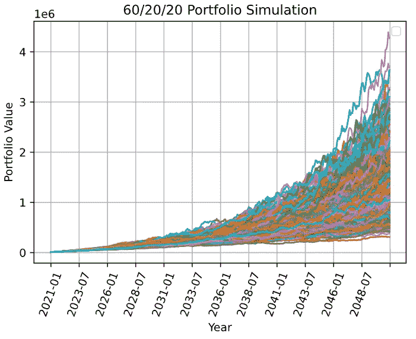
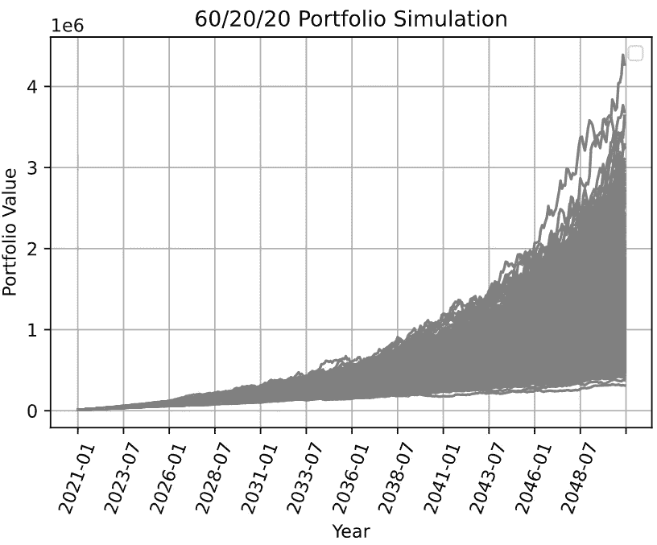
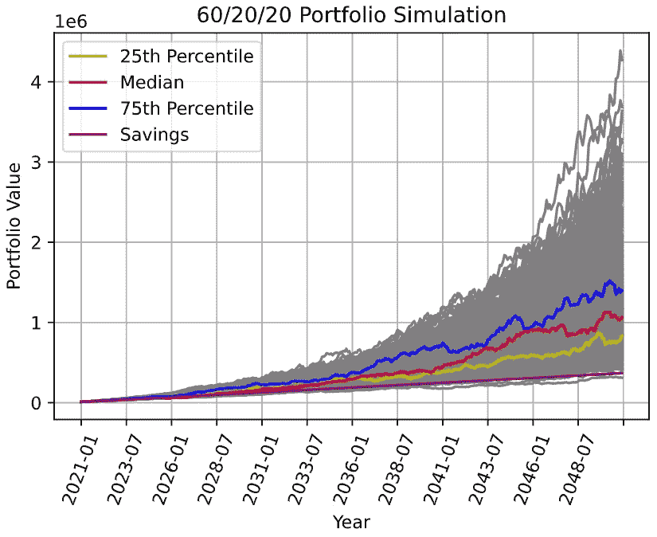

# 更清晰的蒙特卡罗模拟图

> 原文：<https://towardsdatascience.com/cleaner-monte-carlo-simulation-graphs-145b5be7f6ab?source=collection_archive---------35----------------------->

展示 1000 次模拟结果的快速指南

不久前，我在对投资组合配置进行蒙特卡罗模拟，试图找出如何让图表看起来更好。现在，我不是可视化大师的图形专家，但我确实想出了让它看起来更好的方法，这将只是一篇与你分享的短文！

如前所述，我运行了一些蒙特卡洛模拟，以计算出我的投资组合在 30 年后会是什么样子。如果你感兴趣，这是代码片段(但是完整的代码可以在我的 [github](https://gist.github.com/zachlim98/github.com/zachlim98) 上找到)。我在接下来的 30 年里模拟了三种不同的基金(使用它们的均值和标准差)。我对这些基金进行了不同的加权，然后对它们进行了 1000 次模拟。

从最初的剧情可以看出，一点用处都没有。所有的 **1000 个**结果都是用全彩色绘制的，真的没有任何有用的信息可以从中收集到。我可以说出结果的大致范围，但除此之外，它真的不是特别有用。

我认为最重要的投资组合是(a)第 75 个百分点，(b)中间值，(c)第 25 个百分点，以及(d)基础投资组合(即不投资于市场的纯储蓄)

为了获得第 25、50 和 75 个百分点的投资组合的位置，我结合了分位数和指数函数，将它们转换为字符串，以便以后在绘图时可以使用它们的列名

在绘制图时，我将所有的图都设置为灰色。这将使它们淡出背景，并允许我突出重要的投资组合结果(按照前面提到的重要结果)

显然没有什么值得大书特书的，但现在至少我们有了一张空白的画布来工作！

列表中的`quantiles`都是字符串。这使得我可以轻松地调用带有`.loc`的特定投资组合，并引用确切的投资组合。我还创建了一个使用颜色和标签的列表。我还添加了一个图例来显示标签。就这样，这就是最终产品！

与最初的情节相比，最终的结果看起来好了很多。它给出了相同的背景信息(可能结果的大致范围)，但也强调了重要的投资组合。或许更好的方法是去除异常结果。然而，出于我研究的目的，我想展示所有的结果，因此就把它留在这里了。

数据可视化是数据故事中如此重要的一部分。虽然我们可以有最酷的结果和发现，但一个传达清晰信息的好图也是至关重要的，尤其是在今天的图形密集型文化中。

*最初发表于*[*【zachlim98.github.io/me】*](https://zachlim98.github.io/me/)*。*