# 在 Azure Databricks 中将模式漂移的 CSV 文件清理并转换为关系数据

> 原文：<https://towardsdatascience.com/cleansing-and-transforming-schema-drifted-csv-files-into-relational-data-in-azure-databricks-519e82ea84ff?source=collection_archive---------13----------------------->

## 使用 PySpark 增量处理和加载模式漂移文件到 Azure Databricks 中的 Azure Synapse Analytics 数据仓库


由 [Unsplash](https://unsplash.com/?utm_source=medium&utm_medium=referral) 上的[hkon grim stad](https://unsplash.com/@grimstad)拍摄的照片

数据是企业的血液。数据以不同的形状和大小出现，这使得寻找处理和消费的方式成为一项持续的挑战性任务，没有这种方式，数据就没有任何价值。

本文将介绍如何利用 Apache Spark 的并行分析功能，将模式漂移的 CSV 文件迭代地清理和转换为可查询的关系数据，并存储在数据仓库中。我们将在 Spark 环境中工作，并用 PySpark 编写代码来实现我们的转换目标。

**警告:** *Microsoft Azure 是一项付费服务，遵循本文可能会导致您或您的组织承担财务责任。*

*在继续本文之前，请阅读我们的使用条款:*[*https://dhyanintech . medium . com/disclaimer-disclosure-disclosure-terms-of-use-fb3 BF BD 1e 0e 5*](https://dhyanintech.medium.com/disclaimer-disclosure-terms-of-use-fb3bfbd1e0e5)

# 先决条件

1.  有效的 Microsoft Azure 订阅
2.  带有 CSV 文件的 Azure 数据湖存储第二代帐户
3.  Azure Databricks 工作区(高级定价层)
4.  Azure Synapse 分析数据仓库

*如果您还没有设置先决条件，请参考我们以前的文章开始:*

[](https://medium.com/@dhyanintech/a-definitive-guide-to-turn-csv-files-into-power-bi-visuals-using-azure-4483cf406eab) [## 使用 Azure 将 CSV 文件转换为 Power BI 视觉效果的权威指南

### 使用 Microsoft Azure 产品将新冠肺炎数据转化为惊人的 Power BI 视觉效果的分步指南。

medium.com](https://medium.com/@dhyanintech/a-definitive-guide-to-turn-csv-files-into-power-bi-visuals-using-azure-4483cf406eab) [](https://medium.com/@dhyanintech/using-azure-data-factory-to-incrementally-copy-files-based-on-url-pattern-over-http-569476b625fc) [## 使用 Azure Data Factory 基于 HTTP 上的 URL 模式增量复制文件

### 一个创新的 Azure 数据工厂管道，通过 HTTP 从第三方网站增量复制多个文件…

medium.com](https://medium.com/@dhyanintech/using-azure-data-factory-to-incrementally-copy-files-based-on-url-pattern-over-http-569476b625fc) 

登录到 [Azure 门户](https://portal.azure.com/)，找到并打开你的 Azure Databricks 实例，然后点击“启动工作区”我们的 Databricks 实例将在新的浏览器选项卡中打开；等待 Azure AD SSO 自动为您登录。

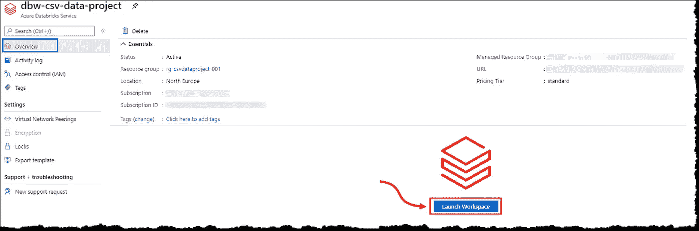

Azure 门户:启动 Databricks 工作区(图片由作者提供)

接下来，我们需要创建一个节点集群，以利用 Apache Spark 无与伦比的并行处理(双关语)能力来处理、清理和转换我们的半结构化数据。

[](https://spark.apache.org/) [## Apache Spark 面向大数据的统一分析引擎

### 闪电般快速的统一分析引擎 Apache Spark 是用于大规模数据处理的统一分析引擎…

spark.apache.org](https://spark.apache.org/) 

# 旋转阿帕奇火花集群

选择左侧菜单上的**集群**开始创建新的集群。通过选择 **+创建集群**开始，如图所示继续操作。这里需要注意的两个基本问题是 Databricks 运行时版本以及工作节点的最小和最大数量。我们的集群将在这些节点之间自动扩展以适应负载。等待创建过程完成。

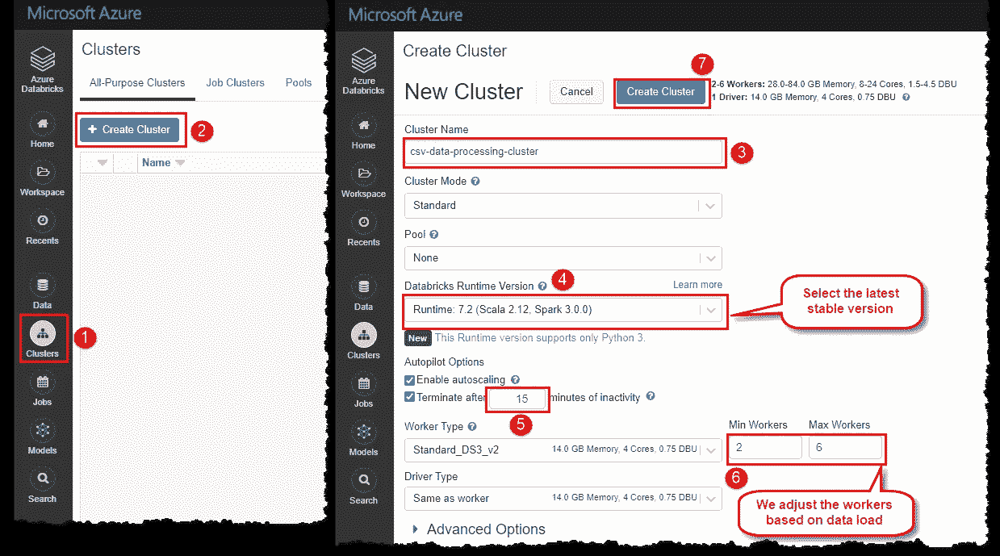

Azure Databricks:建立一个 Apache Spark 集群(图片由作者提供)

点击**开始**来启动你的集群。Azure 可能需要几分钟来配置和设置您的群集资源。密切关注集群状态指示器，查看实时状态。

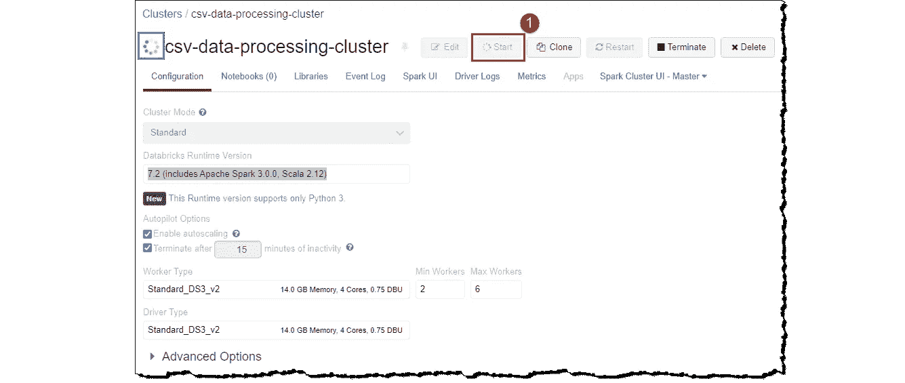

Azure Databricks:启动 Spark 集群(图片由作者提供)

数据砖块的真正魔力发生在[笔记本](https://docs.databricks.com/notebooks/index.html)中。Azure Databricks 支持用 Python、Scala、SQL 和 r 编写的笔记本，在我们的项目中，我们将使用 Python 和 PySpark 来编码所有的转换和清理活动。让我们开始创建一个 Python 笔记本。

*笔记本是一个基于网络的文档界面，其中包含可运行的代码、叙述性文本和可视化效果。*

*PySpark 是 Apache Spark 的 Python API。Apache Spark 是用 Scala 写的。PySpark 已经发布，支持 Apache Spark 和 Python 的协作。*

在左侧菜单中选择**工作区**,并按照所示步骤操作。你的笔记本创建后会打开；花点时间四处看看，熟悉一下 UI 和我们可用的各种选项。

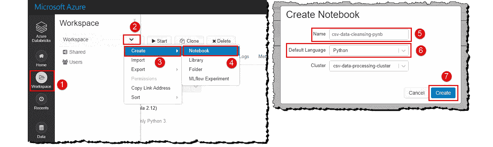

Azure Databricks:创建一个 Python 笔记本(图片由作者提供)

笔记本的前几行应该告诉数据块我们的数据在哪里以及如何访问它。我们将*将我们的存储帐户挂载到 Databricks 文件系统，并将其作为本地存储进行访问。*

# 将存储帐户装载到数据块文件系统

请阅读我们的文章，了解在 Azure Databricks 中安装和访问 ADLS 第二代存储的详细步骤。我们会尽量简短。

[](https://medium.com/@dhyanintech/mounting-accessing-adls-gen2-in-azure-databricks-using-service-principal-and-secret-scopes-96e5c3d6008b) [## 使用服务主体和秘密范围在 Azure 数据块中挂载和访问 ADLS Gen2

### 关于使用 Azure 密钥库支持的秘密范围和服务从数据块访问 Azure 数据湖存储 Gen2 的指南…

medium.com](https://medium.com/@dhyanintech/mounting-accessing-adls-gen2-in-azure-databricks-using-service-principal-and-secret-scopes-96e5c3d6008b) 

# 从数据块连接和访问 Azure Synapse 分析数据仓库

我们的最终目标是将数据加载到数据仓库中，从数据中获得洞察力，并构建报告来做出决策。让我们在继续之前设置连接。

[](https://medium.com/@dhyanintech/a-credential-safe-way-to-connect-and-access-azure-synapse-analytics-in-azure-databricks-1b008839590a) [## 在 Azure Databricks 中连接和访问 Azure Synapse Analytics 的凭据安全方式

### 关于如何在 PySpark 中使用秘密作用域设置 SQL Server 防火墙和从数据块连接的指南

medium.com](https://medium.com/@dhyanintech/a-credential-safe-way-to-connect-and-access-azure-synapse-analytics-in-azure-databricks-1b008839590a) 

我们的连接都设置好了；让我们继续清理刚刚挂载的 CSV 文件。我们将简要解释语句的目的，并在最后展示整个代码。

# 使用 PySpark 进行转化和净化

首先，让我们将一个文件读入 PySpark 并确定模式。我们将设置一些选项来告诉 PySpark 列的类型和结构。

```
# Read the csv files with first line as header, comma (,) as separator, and detect schema from the file
csvDf = spark.read.format("csv") \
.option("inferSchema", "true") \
.option("header", "true") \
.option("sep", ",") \
.load("dbfs:/mnt/csvFiles/01-22-2020.csv")csvDf.printSchema()
```

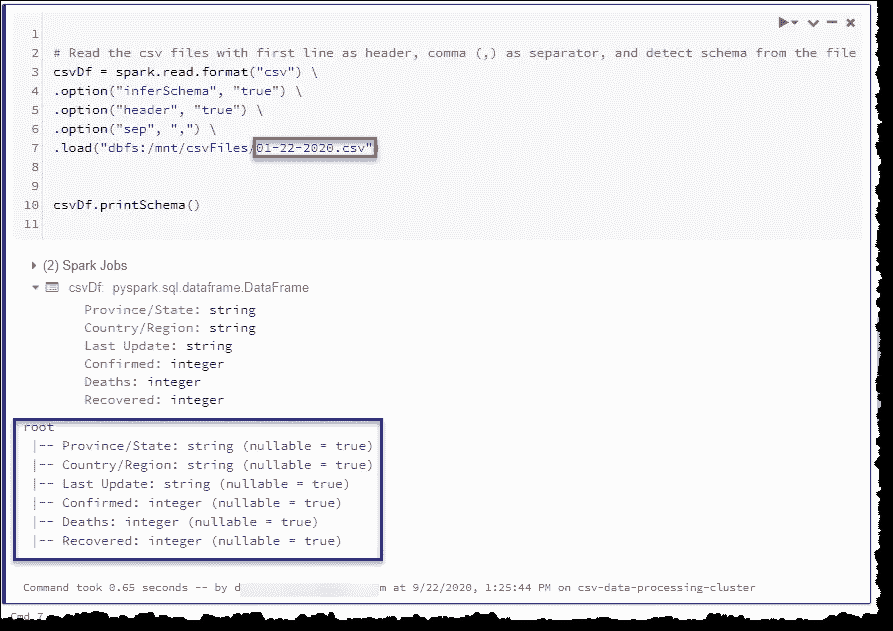

PySpark:确定文件的模式(图片由作者提供)

这个文件的列数比我们从 [GitHub 源](https://github.com/CSSEGISandData/COVID-19/tree/master/csse_covid_19_data#daily-reports-csse_covid_19_daily_reports)得到的少，列名也不同。我们对最终功率 BI 可视化的突出显示列感兴趣。

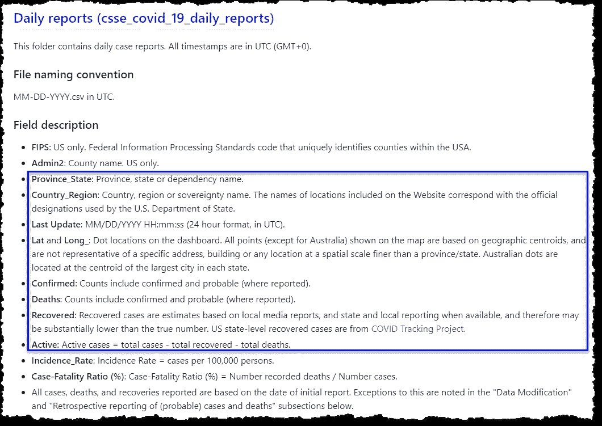

数据源:预期的架构(图片由作者提供)

让我们读取一个较新的文件并检查其结构。

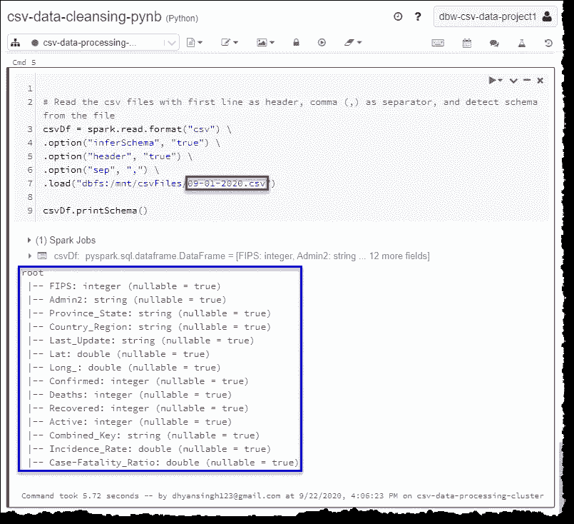

PySpark:确定文件的模式(图片由作者提供)

这个文件的结构更接近我们的来源的描述。图式的差异并没有让我们的事情变得简单。如果我们所有的文件都有相同的模式，我们可以一次加载并清理所有的文件。我们的例子是典型的*模式漂移*，我们必须恰当地处理它；否则，我们的 ELT(提取、加载和转换)过程将会失败。我们将设计我们的转换来解释这种漂移，并使它不会因模式改变而出错。

> 模式漂移是源经常改变元数据的情况。字段、列和类型可能会被更改、添加或删除。

我们将通过重命名列来开始清理，以匹配数据库中表的属性，从而在表和数据之间建立一对一的映射。我们将通过将所有字母转换为小写并删除空格、正斜杠('/')和下划线(' _ ')来实现这一点。

```
# Function to flatten the column names by removing (' ', '/', '_') and converting them to lowercase letters
def rename_columns(rename_df):
  for column in rename_df.columns:
    new_column = column.replace(' ','').replace('/','').replace('_','')
    rename_df = rename_df.withColumnRenamed(column, new_column.lower())
  return rename_dfcsvDf = rename_columns(csvDf)
csvDf.printSchema()
```

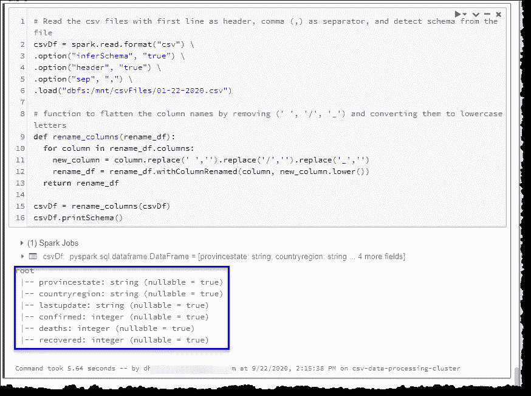

PySpark:展平列名(作者图片)

我们的列名现在看起来好多了。我们将添加一些新的列来处理我们缺少列的情况；*活动*、*经度*、*纬度*和*源文件*。我们将使用文件名作为*源文件*列的值。本专栏将有助于设置数据库中数据的增量加载。

首先，我们将把数据中存在的 *lat* 和 *long* 列名重命名为 *latitude* 和*经度*。接下来，我们将使用 PySpark 中的`lit()`来添加缺少的*活动*、*纬度*和*经度*列，其中*为空*值，而*源文件*的文件名为列值。

```
# lit() function to create new columns in our datafram
from pyspark.sql.functions import lit# Check dataframe and add/rename columns to fit our database table structure
if 'lat' in csvDf.columns:
  csvDf = csvDf.withColumnRenamed('lat', 'latitude')

if 'long' in csvDf.columns:
  csvDf = csvDf.withColumnRenamed('long', 'longitude')

if 'active' not in csvDf.columns:
  csvDf = csvDf.withColumn('active', lit(None).cast("int"))

if 'latitude' not in csvDf.columns:
  csvDf = csvDf.withColumn('latitude', lit(None).cast("decimal"))

if 'longitude' not in csvDf.columns:
  csvDf = csvDf.withColumn('longitude', lit(None).cast("decimal"))# Add the source file name (without the extension) as an additional column to help us keep track of data source
csvDf = csvDf.withColumn("sourcefile", lit('01-22-2020.csv'.split('.')[0]))csvDf = csvDf.select("provincestate", "countryregion", "lastupdate", "confirmed", "deaths", "recovered", "active", "latitude", "longitude", "sourcefile")csvDf.printSchema()
```

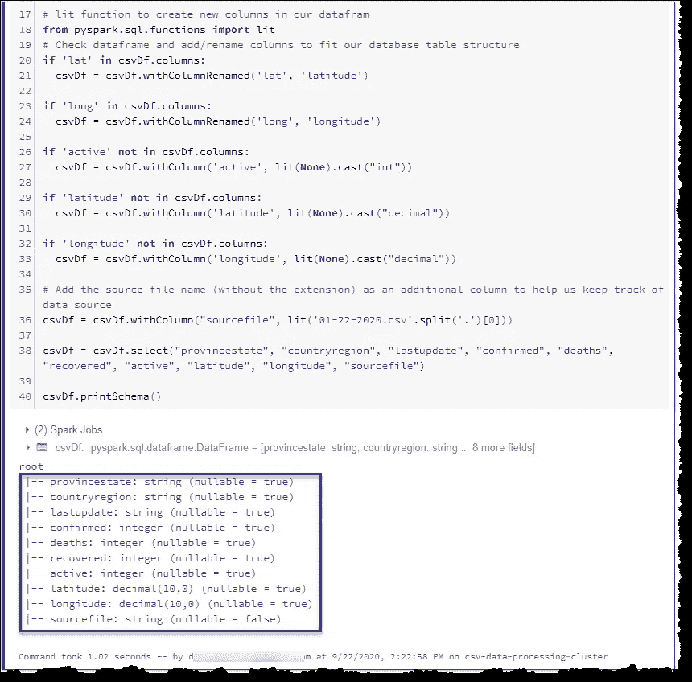

PySpark:添加额外的栏目(图片由作者提供)

让我们用`display(DATAFRAME)`来看看我们在清理活动开始时查看的两个文件的数据

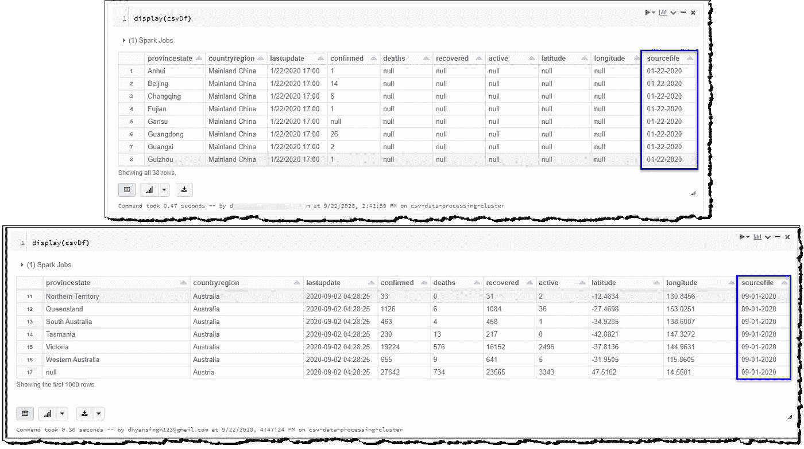

PySpark:显示数据框的数据(图片由作者提供)

这两个文件现在都为我们提供了固定结构的格式化数据，并准备好插入到我们的数据库中。我们已经成功地处理了漂移模式。

到目前为止，我们手动运行了两个文件的代码；我们应该自动处理一个接一个的文件。我们可以使用 Databricks 文件系统实用程序来遍历所有文件。

*关于 Databricks 文件系统实用程序的进一步阅读:*

 [## 数据块工具

### Databricks 实用程序(DBUtils)使执行强大的任务组合变得容易。您可以使用这些实用程序来…

docs.databricks.com](https://docs.databricks.com/dev-tools/databricks-utils.html#dbutilsfsls-command) 

```
# List all the files we have in our store to iterate through them
file_list = [file.name for file in dbutils.fs.ls("dbfs:{}".format(mountPoint))]for file in file_list:
  print(file)
```

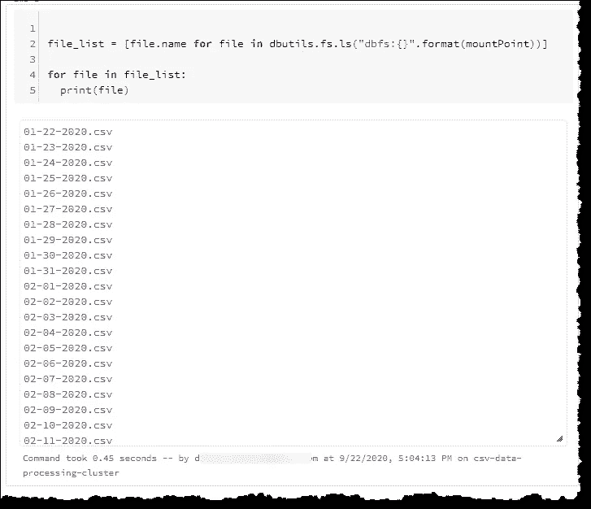

PySpark:使用 Databricks 工具列出文件(图片由作者提供)

我们只需要处理尚未加载到数据库中的文件(增量加载)。我们可以通过查询数据库找出最后加载的文件的名称，并调整迭代器代码以忽略已经加载的文件。

```
# Find out the last file we loaded into the database
# This will return *null* if there's no data in the table
lastLoadedFileQuery = "(SELECT MAX(sourcefile) as sourcefile FROM csvData.covidcsvdata) t"lastFileDf = spark.read.jdbc(url=jdbcUrl, table=lastLoadedFileQuery, properties=connectionProperties)lastFile = lastFileDf.collect()[0][0]# List all the files we have in our store to iterate through them
file_list = [file.name for file in dbutils.fs.ls("dbfs:{}".format(mountPoint))]# Find the index of the file from the list
loadFrom = file_list.index('{}.csv'.format(lastFile)) + 1 if lastFile else 0# Trim the list keeping only the files that should be processed
file_list = file_list[loadFrom:]
for file in file_list:
  print(file)
```

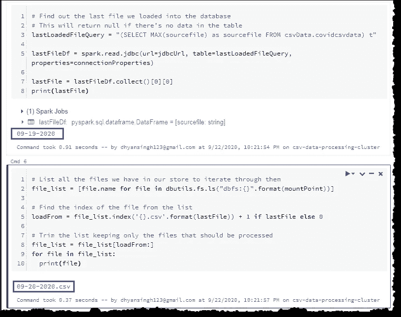

PySpark —概念验证:增量处理(图片由作者提供)

组合和重组我们到目前为止编写的所有代码将允许我们通过增加数据库负载来清理模式漂移文件。试试看。您可以在文章末尾找到 GitHub 的整个笔记本，用于任何故障排除目的。

# 结论

我们查看了我们的 CSV 文件，意识到它们有不同的模式，需要不同的处理方法，然后才能将它们加载到我们的数据仓库中。我们使用 PySpark 创建了一个创造性的解决方案来增量处理我们的文件，并设计了一个满足我们需求的解决方案。

# 后续步骤

如果您正在关注我们关于将 CSV 数据转化为 Power BI 视觉效果的系列文章，或者有兴趣了解如何在您的数据工厂管道中添加和执行 Databricks notebook，请阅读我们的下一篇文章继续您的旅程。

[](https://medium.com/@dhyanintech/executing-azure-databricks-notebook-in-azure-data-factory-pipeline-using-access-tokens-3326b8703432) [## 使用访问令牌在 Azure 数据工厂管道中执行 Azure Databricks 笔记本

### 关于如何使用 Azure Key Vault 安全访问在数据工厂管道中添加和执行 Databricks 笔记本的指南…

medium.com](https://medium.com/@dhyanintech/executing-azure-databricks-notebook-in-azure-data-factory-pipeline-using-access-tokens-3326b8703432) 

## 喜欢这个帖子？与 Dhyan 联系

让我们做朋友吧！你可以在 [LinkedIn](https://www.linkedin.com/in/dhyans/) 上找到我或者在 [Medium](https://dhyanintech.medium.com/membership) 上**加入**我。