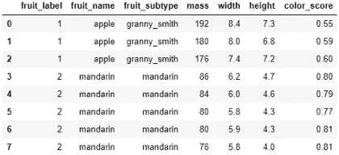
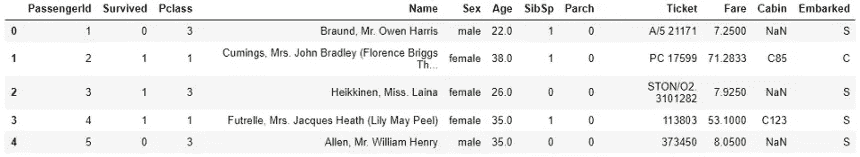
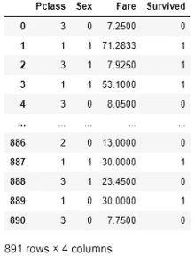
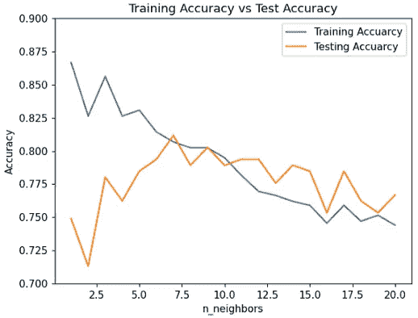

# 学习使用 Python 的 Scikit_learn 库通过项目开发 KNN 分类器

> 原文：<https://towardsdatascience.com/clear-understanding-of-a-knn-classifier-with-a-project-for-the-beginners-865f56aaf58f?source=collection_archive---------31----------------------->


杰克·威瑞克在 [Unsplash](https://unsplash.com?utm_source=medium&utm_medium=referral) 上的照片

## 适合机器学习新手

学习机器学习概念的最佳方式是做一个项目。在这篇文章中，我将使用一个项目来描述一些关键的机器学习概念。

在这篇文章中，我将详细解释一个分类模型，它是**，一个监督机器学习的主要类型**。顾名思义，我们将要研究的模型叫做 KNN 分类器。

KNN 分类器是一种非常流行和众所周知的监督机器学习技术。本文将通过一个简单但完整的项目来解释 KNN 分类器。

## 什么是监督学习模型？

我来详细解释一下。但是维基百科是这么说的:

> **监督学习**是学习函数的[机器学习](https://en.wikipedia.org/wiki/Machine_learning)任务，该函数基于示例输入-输出对将输入映射到输出。它从由一组训练示例组成的标记的[训练数据](https://en.wikipedia.org/wiki/Training_set)中推断出一个函数。

监督学习模型采用输入特征(X)和输出(y)来训练模型。该模型的目标是定义一个可以使用输入要素并计算输出的函数。

> **举个例子会更清楚**

这是一个数据集，包含一些水果样本的质量、宽度、高度和颜色分数。



该数据集的目的是训练一个模型，这样如果我们向模型输入质量、宽度、高度和颜色分数，模型就可以让我们知道水果的名称。就像如果我们输入一块水果的质量、宽度、高度和颜色分数分别为 175、7.3、7.2、0.61，模型应该输出水果的名称为苹果。

这里，质量、宽度、高度和颜色分数是输入特征(X)。水果的名字是输出变量或标签(y)。

> 这个例子对你来说可能听起来很傻。但这是在非常高级的监督机器学习模型中使用的机制。

稍后，我将用一个真实的数据集展示一个实际的例子。

## KNN 分类器

KNN 分类器是基于记忆的机器学习模型的一个例子。

这意味着这个模型记住了带标签的训练样本，并使用它们来对它以前没有见过的对象进行分类。

> KNN 分类器中的 k 是它将检索的训练样本的数量，以便预测新的测试样本。

> **KNN 分类器分三步工作:**

1.  当给它一个新的实例或例子进行分类时，它将检索以前记忆的训练例子，并从中找到 k 个最接近的例子。
2.  然后分类器查找这 k 个最接近的例子的标签(上面例子中的水果名称)。
3.  最后，模型将这些标签结合起来进行预测。通常，它会预测多数标签。例如，如果我们选择我们的 k 为 5，从最近的 5 个例子中，如果我们有 3 个橙子和 2 个苹果，新实例的预测将是橙色。

## 数据准备

在我们开始之前，我鼓励您检查您的计算机中是否有以下可用资源:

1.  [Numpy 库](https://numpy.org/)
2.  [熊猫图书馆](https://pandas.pydata.org/)
3.  [Matplotlib 库](https://matplotlib.org/)
4.  [Scikit-Learn 库](https://scikit-learn.org/stable/)
5.  [Jupyter 笔记本](https://jupyter.org/)环境。

如果您没有安装 Jupyter 笔记本，请使用您选择的任何其他笔记本。我建议用谷歌合作笔记本。[跟随此链接开始](https://colab.research.google.com/notebooks/intro.ipynb#recent=true)。只要记住一件事，

> 谷歌合作笔记本不是私人的。所以，不要在那里做任何专业或敏感的工作。但对练习很有帮助。因为里面已经安装了很多常用的包。

**我建议**，下载数据集。我在页面底部提供了链接。如果你是为了学习这个而阅读的话，请自己运行每一行代码。

首先，导入必要的库:

```
%matplotlib notebook
import numpy as np
import matplotlib.pyplot as plt
import pandas as pd
from sklearn.model_selection import train_test_split
```

对于本教程，我将使用来自 [Kaggle](https://www.kaggle.com/) 的 Titanic 数据集。我将这个数据集上传到我笔记本所在的文件夹中。

下面是我如何使用 pandas 在笔记本中导入数据集。

```
titanic = pd.read_csv('titanic_data.csv')
titanic.head()

#titaninc.head() gives the first five rows of the dataset. We will    #print first five rows only to examine the dataset.
```



看第二列。它包含了这个人是否幸存的信息。0 表示该人幸存，1 表示该人未幸存。

在本教程中，我们的目标是预测“幸存”特征。

为了简单起见，我将保留几个对算法更重要的关键特征，去掉其余的。

这个数据集非常简单。仅仅从直觉上，我们可以看到有一些列对于预测‘幸存’特征来说是不重要的。

例如，“乘客 Id”、“姓名”、“机票”和“客舱”似乎不能用来预测乘客是否幸存。

我将创建一个具有一些关键特性的新数据框架，并将其命名为 titanic1。

```
titanic1 = titanic[['Pclass', 'Sex', 'Fare', 'Survived']]
```

“性别”列具有字符串值，需要进行更改。因为计算机不理解单词。它只懂数字。我将更改 0 的“男性”和 1 的“女性”。

```
titanic1['Sex'] = titanic1.Sex.replace({'male':0, 'female':1})
```

这是数据帧 titanic1 的样子:



我们的目标是根据 titanic1 数据图中的其他信息预测“幸存”参数。因此，输出变量或标签(y)是“幸存的”。输入特征(X)是“P 级”、“性别”和“费用”。

```
X = titanic1[['Pclass', 'Sex', 'Fare']]
y = titanic1['Survived']
```

## KNN 分类器模型

首先，我们需要将数据集分成两组:训练集和测试集。

我们将使用训练集来训练模型，其中模型将记住输入特征和输出变量。

然后，我们将使用测试集来查看模型是否可以使用“P-class”、“Sex”和“Fare”来预测乘客是否幸存。

方法' [train_test_split](https://scikit-learn.org/stable/modules/generated/sklearn.model_selection.train_test_split.html) '将有助于拆分数据。默认情况下，此函数将 75%的数据用于定型集，25%的数据用于测试集。如果您愿意，您可以更改它，并且您可以指定“训练大小”和“测试大小”。

如果将 train_size 设置为 0.8，则拆分为 80%的训练数据和 20%的测试数据。但是对我来说，默认值 75%就不错了。因此，我没有使用 train_siz 或 test_size 参数。

```
X_train, X_test, y_train, y_test = train_test_split(X, y, random_state=0)
```

请记住对“random_state”使用相同的值。这样，每次进行这种拆分时，训练集和测试集都会获得相同的数据。

我选择 random_state 为 0。你可以选择一些你喜欢的。

Python 的 scikit -learn 库已经有了 KNN 分类器模型。我会进口那个。

```
from sklearn.neighbors import KNeighborsClassifier
```

将此分类器保存在变量中。

```
knn = KNeighborsClassifier(n_neighbors = 5)
```

这里，n_neighbors 是 5。

这意味着当我们要求我们的训练模型预测新实例的生存机会时，将需要 5 个最接近的训练数据。

基于这 5 个训练数据的标签，模型将预测新实例的标签。

现在，我将使训练数据适合模型，以便模型可以记住它们。

```
knn.fit(X_train, y_train)
```

你可能会认为，由于它记住了训练数据，它可以正确预测 100%的训练特征的标签。但这并不确定。为什么？

看，每当我们输入并要求它预测标签时，它会从 5 个最近的邻居那里进行投票，即使它已经记住了完全相同的特征。

让我们看看它能给我们多少训练数据的准确性

```
knn.score(X_train, y_train)
```

我得到的训练数据准确率是 0.83 或者 83%。

记住，我们有一个我们的模型从未见过的测试数据集。现在检查一下，它能多准确地预测测试数据集的标签。

```
knn.score(X_test, y_test)
```

准确率出来是 0.78 或者 78%。

**祝贺你！你开发了一个 KNN 分类器！**

注意，训练集的精度比测试集的精度高一点。那太合适了。

> **什么是过度拟合？**

有时，模型对训练集的学习非常好，因此可以很好地预测训练数据集标签。但是，当我们要求模型使用测试数据集或以前没有看到的数据集进行预测时，它的表现不如训练数据集。这种现象被称为过度拟合。

用一句话来说，当训练集精度高于测试集精度时，我们称之为过拟合。

## 预言；预测；预告

如果您想要查看测试数据集的预测输出，以下是如何操作的:

输入:

```
y_pred **=** knn.predict(X_test)y_pred
```

输出:

```
array([0, 0, 0, 1, 1, 0, 0, 0, 1, 1, 0, 1, 0, 1, 1, 1, 0, 1, 0, 0, 0, 0,
       0, 1, 0, 1, 0, 1, 1, 0, 0, 1, 0, 0, 0, 0, 0, 0, 0, 0, 0, 0, 0, 0,
       1, 0, 0, 1, 0, 0, 1, 0, 1, 0, 1, 0, 1, 0, 0, 0, 0, 0, 1, 1, 1, 0,
       1, 0, 1, 1, 1, 0, 1, 0, 0, 0, 0, 0, 0, 0, 0, 0, 1, 0, 0, 1, 0, 1,
       1, 1, 0, 0, 0, 1, 0, 0, 1, 0, 1, 1, 0, 0, 0, 0, 0, 0, 1, 1, 0, 1,
       0, 1, 1, 0, 1, 1, 1, 0, 0, 1, 1, 0, 0, 0, 0, 1, 0, 0, 0, 0, 1, 0,
       0, 0, 1, 0, 0, 1, 0, 0, 0, 1, 0, 1, 0, 0, 0, 1, 1, 0, 1, 1, 1, 0,
       1, 0, 0, 0, 1, 1, 0, 0, 1, 1, 0, 0, 0, 0, 0, 0, 0, 1, 0, 0, 1, 0,
       1, 0, 0, 1, 0, 1, 0, 0, 0, 0, 1, 0, 0, 1, 0, 0, 1, 1, 0, 1, 0, 1,
       1, 0, 0, 0, 0, 1, 0, 0, 0, 0, 1, 0, 0, 0, 0, 1, 0, 0, 1, 0, 0, 1,
       0, 1, 1], dtype=int64)
```

或者你可以只输入一个例子并找到标签。

我想看看当一个人乘坐“P-class”3 旅行时，“性别”是女性，这意味着 1，并且支付了 25 英镑的“车费”，如果她能按照我们的模型生存下来。

输入:

```
knn.predict([[3, 1, 25]])
```

> 记得用两个括号，因为它需要一个 2D 数组

输出:

```
array([0], dtype=int64)
```

输出为零。这意味着根据我们训练的模型，这个人不可能存活。

> 请随意尝试更多像这样不同的输入！

## 如果你想看一些 KNN 分类器的进一步分析

KNN 分类器对“k”或 n 个邻居的选择非常敏感。在上面的例子中，我使用了 n 个邻居 5。

对于不同的 n_neighbors，分类器会有不同的表现。

让我们看看它在不同 n_neighbors 值的训练数据集和测试数据集上的表现。我选 1 到 20。

现在，我们将计算从 1 到 20 的每个 n_neighbors 值的训练集精度和测试集精度，

```
training_accuracy  = []  
test_accuracy = []
for i in range(1, 21):
    knn = KNeighborsClassifier(n_neighbors = i)
    knn.fit(X_train, y_train)
    training_accuracy.append(knn.score(X_train, y_train))
    test_accuracy.append(knn.score(X_test, y_test))
```

运行这个代码片段后，我得到了不同 n_neighbors 的训练和测试精度。

现在，让我们在同一个图中绘制针对 n_neighbors 的训练和测试集精度。

```
plt.figure()
plt.plot(range(1, 21), training_accuracy, label='Training Accuarcy')
plt.plot(range(1, 21), test_accuracy, label='Testing Accuarcy')
plt.title('Training Accuracy vs Test Accuracy')
plt.xlabel('n_neighbors')
plt.ylabel('Accuracy')
plt.ylim([0.7, 0.9])
plt.legend(loc='best')
plt.show()
```



> **分析上图**

一开始，当 n_neighbors 为 1、2 或 3 时，训练精度比测试精度高得多。因此，该模型正遭受高度过拟合。

从那以后，训练和测试的准确性越来越接近。这是最佳点。我们希望如此。

但是当 n_neighbors 变得更高时，训练集和测试集的精度都下降了。我们不需要那个。

根据上图，该特定数据集和模型的最佳 n_neighbors 应为 6 或 7。

> **这是一个很好的分类器！**

看上面的图！当 n_neighbors 约为 7 时，训练和测试准确率都在 80%以上。

## 结论

本文的目的是用一个项目展示一个 KNN 分类器。如果你是一个机器学习初学者，这将帮助你学习一些机器学习和工作流程的关键概念。有这么多不同的机器学习模型。但这是监督机器学习模型的典型工作流程。

这是我在文章中使用的泰坦尼克号:

[](https://github.com/rashida048/Datasets/blob/master/titanic_data.csv) [## rashida 048/数据集

### 在 GitHub 上创建一个帐户，为 rashida048/Datasets 开发做出贡献。

github.com](https://github.com/rashida048/Datasets/blob/master/titanic_data.csv) 

## 更多阅读:

[](/a-complete-understanding-of-precision-recall-and-f-score-concepts-23dc44defef6) [## 完全理解精确度、召回率和 F 分数的概念

### 机器学习中如何处理倾斜数据集

towardsdatascience.com](/a-complete-understanding-of-precision-recall-and-f-score-concepts-23dc44defef6) [](/k-mean-clustering-algorithm-from-scratch-in-python-and-dimensional-reduction-step-by-step-guide-9ebabe5ca433) [## Python 中从头开始的 k 均值聚类算法:分步指南

### 并学习使用它来降低图像的维数

towardsdatascience.com](/k-mean-clustering-algorithm-from-scratch-in-python-and-dimensional-reduction-step-by-step-guide-9ebabe5ca433) [](/your-everyday-cheatsheet-for-pythons-matplotlib-c03345ca390d) [## Python Matplotlib 的日常备忘单

### 完整的可视化课程

towardsdatascience.com](/your-everyday-cheatsheet-for-pythons-matplotlib-c03345ca390d) [](/all-the-datasets-you-need-to-practice-data-science-skills-and-make-a-great-portfolio-857a348883b5) [## 练习数据科学技能和制作优秀投资组合所需的所有数据集

### 一些有趣的数据集提升你的技能和投资组合

towardsdatascience.com](/all-the-datasets-you-need-to-practice-data-science-skills-and-make-a-great-portfolio-857a348883b5) [](/sort-and-segment-your-data-into-bins-to-get-sorted-ranges-pandas-cut-and-qcut-7785931bbfde) [## 数据宁滨与熊猫削减或 Qcut 方法

### 当你在寻找一个范围而不是一个确切的数值，一个等级而不是一个分数

towardsdatascience.com](/sort-and-segment-your-data-into-bins-to-get-sorted-ranges-pandas-cut-and-qcut-7785931bbfde) [](/master-pandas-groupby-for-efficient-data-summarizing-and-analysis-c6808e37c1cb) [## Pandas 的 Groupby 功能详细，可进行高效的数据汇总和分析

### 学习对数据进行分组和汇总，以使用聚合函数、数据转换、过滤、映射、应用函数…

towardsdatascience.com](/master-pandas-groupby-for-efficient-data-summarizing-and-analysis-c6808e37c1cb)