# 清晰理解深度优先搜索算法及其 Python 实现:图算法

> 原文：<https://towardsdatascience.com/clear-understanding-of-depth-first-search-algorithm-and-its-python-implementation-graph-algorithm-3e87d8f1a9ea?source=collection_archive---------33----------------------->


[李灿明](https://unsplash.com/@brock222?utm_source=medium&utm_medium=referral)在 [Unsplash](https://unsplash.com?utm_source=medium&utm_medium=referral) 上拍照

## 借助清晰的视觉效果进行学习。还要学习人们在深度优先搜索算法中常犯的一个错误

> **什么是深度优先搜索？**

这是广泛使用和非常流行的图搜索算法之一。为了理解这个算法，想象一个迷宫。当我们必须解决一个迷宫的时候我们做什么？我们走一条路，一直走，直到我们找到一个死胡同。在到达死胡同后，我们会原路返回，继续前进，直到我们看到一条我们以前没有尝试过的路。走那条新路线。再次继续前进，直到我们找到一个死胡同。再走一次原路…

深度优先搜索几乎以同样的方式工作。使用这种回溯过程。从起点开始，它一直走，直到再也找不到可以走的路。然后沿原路返回，回到有未探索路径的点。它一直这样做，直到遍历完所有的节点和边。

这是我介绍深度优先搜索的最简单的方法。稍后我会更详细地解释它。

> **为什么深度搜索很重要**

深度优先搜索有广泛的使用案例。

1.  解决我上面描述的迷宫或难题
2.  安排问题
3.  图中的循环检测
4.  网络分析
5.  映射路线
6.  拓扑排序

还有很多。深度优先搜索也是许多其他复杂算法的基础。

> **深度优先搜索如何工作？**

在本节中，我们将直观地看到深度优先搜索的工作流程。这是一个图，源节点显示为节点 u。

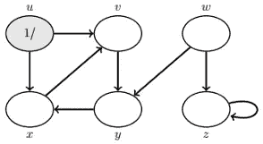

我们可以从 u 到节点 v 或 x，我们可以去任何方向。我选择去 v，从图中可以清楚的看到，从 v 出来的路由只有一条，那就是 y。

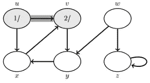

从图中可以清楚地看到，只有一条从 v 发出的路由，即 y。因此，我们现在位于 y 中。

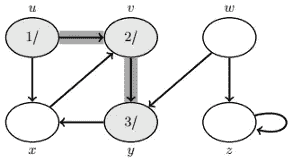

和以前一样，从 y 也有一个输出路径。那是到 x，所以，我们必须到 x，那是唯一的选择。

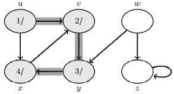

看，我们被困住了！如前所述，在这种情况下，我们采取回溯。

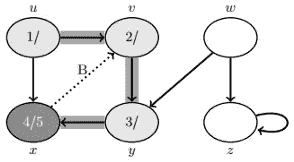

通过回溯，我们回到了 y。

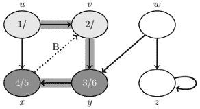

从这里没有路可走。所以，我们再回溯一下。

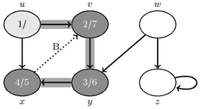

现在，我们在 v. Explore v .中，但是没有从 v .再次传出的路径。所以再退一步。

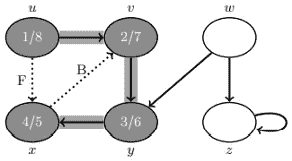

我们又回到了一步，那就是我们的源节点 u。

这里我们可以看到有一条我们没有探索过的外出路径。

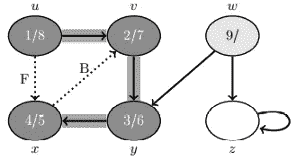

我们从 u 到 x，看到 x 已经被访问过了。这种类型的边缘被称为前沿。从 x 到 v 也有一条路径。节点 v 也被访问，v 是 x 的祖先。因此**这条路径被称为后边缘。**

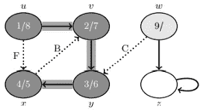

我们完成了“uvyx”圆中的所有节点和边。这里我们探索一个新的节点 w。

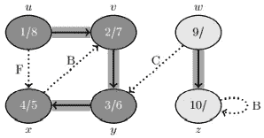

从 w 出发，我们可以去 z 或者 y，我现在选择去 z。

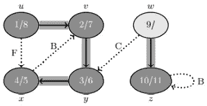

注意，z 使用**后沿**返回 z。

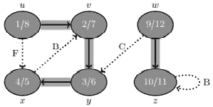

从 z 处无处可去，所以我们再次回溯，回到 w 处，w 有一条未探索的边通向 y。

**这种类型的连接边称为交叉边。**

旅行结束了。我们走遍了所有的节点和边缘。

> **开发深度第五搜索算法**

在开发算法之前，将上图表示为邻接表是很重要的。如果你以前没有见过邻接表，它就是一本字典。其中，每个节点都是一个键，并且在该键中用传出路径链接的节点都是列表中的值。

看下面的邻接表。节点‘u’有两条到节点‘v’和节点‘x’的输出链路。因此，“u”是键，一个包含元素“v”和“x”的列表是值。同样，我们必须每隔一个节点做一个键值对。

```
g = {
    'u': ['v', 'x'],
    'v': ['y'],
    'y': ['x'],
    'x': ['v'],
    'w': ['y', 'z'],
    'z': ['z']
    }
```

邻接表准备好了。

我将使用递归方法来开发深度优先搜索算法。

这个想法是遍历所有的节点和顶点，就像我们在上一节的图片中遍历的那样。为了跟踪被访问的节点，我们将从一个空列表开始。

```
class depth_first:
    def __init__(self):
        self.visited = []
```

现在定义一个循环遍历所有节点的函数，如果有一个未被访问的节点，我们将进入那个节点，找出这个节点将我们带到哪里。

```
def dfs(self, graph):        
    for ver in graph:
        if ver not in self.visited:
            self.dfs_visit(graph, ver)
    return self.visited
```

注意，在这个函数中，我们调用了一个函数“dfs_visit”。该函数应该遍历由未访问节点提供的整个未访问路线，并将这些未访问节点添加到“已访问”列表中。我们将递归地实现这个函数。

以下是“dfs_visit”函数:

```
def dfs_visit(self, graph, vertex):
    if vertex not in self.visited:
        self.visited.append(vertex)
        for nb in g[vertex]:
            self.dfs_visit(g, nb)
```

仔细看看！如果节点不在“已访问”列表中，此函数将添加一个节点。然后它会转到与其相邻的一个节点并调用自己。

这样，它将遍历以前没有访问过的整个路线，一次一个。

以下是完整的代码:

```
class depth_first:
    def __init__(self):
        self.visited = []    def dfs(self, graph):
        for ver in graph:
            if ver not in self.visited:
                self.dfs_visit(graph, ver)
        return self.visited

    def dfs_visit(self, graph, vertex):
        if vertex not in self.visited:
            self.visited.append(vertex)
            for nb in g[vertex]:
                self.dfs_visit(g, nb)
```

现在让我们用之前描述的邻接表来测试一下。

```
d = depth_first()
print(d.dfs(g))
```

输出:

```
['u', 'v', 'y', 'x', 'w', 'z']
```

看，节点的顺序和我们预想的一样！

> **人们在 DFS 算法中常犯的错误**

我看到许多其他网站和博客解释了深度优先搜索算法。但是他们使用的代码是这样的:

```
def dfs(graph, vertex, path=[]):
    path += [vertex]    for n in graph[vertex]:
        if n not in path:
            path = dfs(graph, n, path)
    return path
```

如果你注意到，它没有通过顶点循环。它从源节点开始，并不断遍历相邻节点。它将在一个图上工作，其中每个节点都有一个连接回任何其他被访问节点的传出节点。

但是在我们正在处理的图中，节点“y”没有到“w”的输出链接，这种算法将不起作用。因为它永远不会到达 w。

让我们检查一下

```
print(dfs(g, 'u'))
```

输出:

```
['u', 'v', 'y', 'x']
```

看，它看不到节点“w”和“z”。

> **结论**

我想尽可能清楚地介绍和解释深度优先搜索的工作过程以及如何开发该算法。希望现在对你来说很容易。

欢迎在[推特](https://twitter.com/rashida048)上关注我，并喜欢我的[脸书](https://www.facebook.com/rashida.smith.161)页面。

> **更多阅读**

[](/a-complete-guide-to-hypothesis-testing-for-data-scientists-using-python-69f670e6779e) [## 数据科学家使用 Python 进行假设检验的完整指南

### 用样本研究问题、解决步骤和完整代码清楚地解释

towardsdatascience.com](/a-complete-guide-to-hypothesis-testing-for-data-scientists-using-python-69f670e6779e) [](/a-complete-anomaly-detection-algorithm-from-scratch-in-python-step-by-step-guide-e1daf870336e) [## Python 中从头开始的完整异常检测算法:分步指南

### 基于概率的异常检测算法

towardsdatascience.com](/a-complete-anomaly-detection-algorithm-from-scratch-in-python-step-by-step-guide-e1daf870336e) [](/an-ultimate-cheat-sheet-for-data-visualization-in-pandas-4010e1b16b5c) [## 熊猫数据可视化的终极备忘单

### 熊猫所有的基本视觉类型和一些非常高级的视觉…

towardsdatascience.com](/an-ultimate-cheat-sheet-for-data-visualization-in-pandas-4010e1b16b5c) [](/multiclass-classification-algorithm-from-scratch-with-a-project-in-python-step-by-step-guide-485a83c79992) [## 使用 Python 从零开始的多类分类算法:分步指南

### 本文介绍两种方法:梯度下降法和优化函数法

towardsdatascience.com](/multiclass-classification-algorithm-from-scratch-with-a-project-in-python-step-by-step-guide-485a83c79992) [](/want-to-become-a-data-scientist-in-12-weeks-3926d8eacee2) [## 想在 12 周内成为数据科学家？

### 花钱前再想一想

towardsdatascience.com](/want-to-become-a-data-scientist-in-12-weeks-3926d8eacee2) [](/great-quality-free-courses-to-learn-machine-learning-and-deep-learning-1029048fd0fc) [## 学习机器学习和深度学习的优质免费课程

### 顶级大学高质量免费课程的链接

towardsdatascience.com](/great-quality-free-courses-to-learn-machine-learning-and-deep-learning-1029048fd0fc)