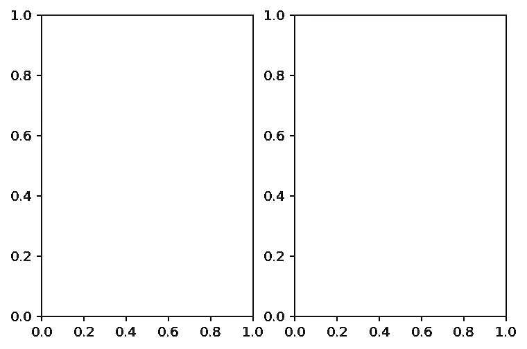

# 一劳永逸地澄清困惑:fig，ax = plt.subplots()

> 原文：<https://towardsdatascience.com/clearing-the-confusion-once-and-for-all-fig-ax-plt-subplots-b122bb7783ca?source=collection_archive---------1----------------------->

## 了解 Matplotlib 中的图形和轴对象


来自[像素](https://www.pexels.com/photo/person-holding-pencil-on-white-canvas-1076339/?utm_content=attributionCopyText&utm_medium=referral&utm_source=pexels)的[只需说出](https://www.pexels.com/@stockphotoartist?utm_content=attributionCopyText&utm_medium=referral&utm_source=pexels)的名字

## 介绍

通过阅读本文，您将了解 Maptlolib 绘图中的两个核心对象:图形和轴。你终于会明白简单剧情(`plt.plot`)和用`plt.subplots()`创造支线剧情的区别了。

当你开始进入数据科学的旅程时，你会被介绍到 [Matplotlib](https://matplotlib.org/tutorials/index.html) 作为你的第一个数据可视化库。大多数初学者教程对学生开了一个残酷的玩笑，首先向他们介绍“初学者友好的”`pyplot > plt`界面。当这些穷学生冒险进入现实世界时，他们会发现 StackOverflow 上的花花公子和大多数其他人使用更灵活的面向对象方式。他们会感到困惑，很可能会转移到 Seaborn 和 Plotly。或者更糟，到 [Tableau](https://www.tableau.com/) 的无代码接口，就像我差点做的那样。(由于这种混乱，我特别记得自己浏览 Quora 和 StackOverflow 线程，想知道人们是否使用 Tableau 而不是 Matplotlib)

本文将向您介绍 Matplotlib 中的图形和轴对象，以及它们相对于其他方法的优势。

[](https://ibexorigin.medium.com/membership) [## 通过我的推荐链接加入 Medium-BEXGBoost

### 获得独家访问我的所有⚡premium⚡内容和所有媒体没有限制。支持我的工作，给我买一个…

ibexorigin.medium.com](https://ibexorigin.medium.com/membership) 

获得由强大的 AI-Alpha 信号选择和总结的最佳和最新的 ML 和 AI 论文:

[](https://alphasignal.ai/?referrer=Bex) [## 阿尔法信号|机器学习的极品。艾总结的。

### 留在循环中，不用花无数时间浏览下一个突破；我们的算法识别…

alphasignal.ai](https://alphasignal.ai/?referrer=Bex) 

## 概观

```
 I. Introduction II. Setup III. plt.subplots(), preliminary understanding IV. Axes methods vs. pyplot, understanding further V. plt.subplots() grid system VI. Doubling axis VII. Sharing a commong axis between subplotsVIII. Working with figure object IX. Conclusion
```

> 示例数据和文章的笔记本可在 [this](https://github.com/BexTuychiev/medium_stories/tree/master/working_with_ax_fig_objects) GitHub repo 中获得。

## 设置


```
>>> climate_change.head()
```


## plt.subplots()，初步了解

这一切都从调用`.subplots()`命令开始:

```
>>> plt.subplots()(<Figure size 432x288 with 1 Axes>, <AxesSubplot:>)
```


如果您注意的话，除了空白图之外，该函数还返回了一个由两个值组成的元组:

**:**(<图尺寸 432x288 带 1 轴>，<轴 Subplot: >)

每次我们调用`subplots()`函数时，它都会返回这些类型的元组，这些元组总是有两个值。在 Python 中，有一种技术叫做元组解包。让我给你看一个简单的例子:

如果我们打印上面三个的值:

```
>>> print(ten)
10
>>> print(eleven)
11
>>> print(twelve)
12
```

很好，我们把一个大小为 3 的元组分解成三个不同的变量。所以，现在你会更好地理解这段代码:


> 我们创建了两个变量，`fig`和`ax`。请记住，这些是随意的名字，但却是一个标准，我们是好人之一，所以我们将遵循惯例。

这两个变量现在包含用于所有类型的绘图操作的两个核心对象。第一个对象`fig`，简称`figure`，把它想象成你剧情的框架。您可以调整框架的大小和形状，但不能在框架上绘图。在单个笔记本或脚本上，可以有多个图形。每个人物可以有多个支线剧情。在这里，支线剧情与轴线同义。第二个对象，`ax`，axes 的缩写，是你在上面画画的画布。或者换句话说，它是一张你可以绘制和保存数据的空白纸。一个轴对象只能属于一个图形。

## 轴方法与 pyplot，进一步了解

在帖子的开头，我说过`pyplot`是一个更加初学者友好的与 Matplotlib 交互的方法。的确，与 axes 方法相比，`pyplot`提供了一种更快、更简洁的绘图方法。它将有更少的局部变量和语法。但是为什么大多数人更喜欢面向对象的方式呢？

我们来看看`pyplot`的简洁方式:


嗯，这很简单。我们只用了三句台词。现在让我们看看，如果我们试图在它旁边绘制(完全不相关的)气候变化数据，会发生什么:

在这种情况下，我们得到一个`TypeError`。`pyplot`本身不能创建新轴或新图形，也不能智能地绘制新数据。当我们进行更复杂的绘图时，我们需要一个更灵活的方法。

Mpl 有这个概念叫`current figure`。默认情况下，`pyplot`本身会创建一个`current figure`轴并在其上绘图。例如，如果我们想要聚焦在那个`current figure`上，并在其上绘制额外的数据，正如我们在上一个例子中所尝试的，`pyplot`在给出新的绘制命令后，立即将`current figure`移动到一个新的。

为了避免这种情况，让我们看看我们完全控制每个图形和轴的方法:


我们特别指出我们正在处理这个`fig`对象。这意味着我们编写的任何绘图命令都将应用于属于`fig`的 axes ( `ax`)对象。除非我们用`plt.subplots()`命令定义一个新图形，否则当前的`figure`将是变量`fig`。这种方式非常好，因为现在我们可以在一个图形中创建尽可能多的轴或支线剧情，并使用它们。

> 从现在开始，我将交替使用支线剧情和轴线术语，因为它们是同义词。

## plt.subplots()网格系统

我们看到了一个创建支线剧情的例子。让我们看看如何在单个图形中创建更多:



在其他参数中，`.subplots()`有两个参数指定网格尺寸。`nrows`和`ncols`分别用来指出我们需要的行数和列数。如果你注意的话，现在我们的第二个变量包含不是一个而是两个轴。而且现在给的是一个`numpy.ndarray`。因此，我们必须解包或索引该数组，以使用我们的绘图命令:


> **专业提示**:注意`padding`设置为 3 的`fig.tight_layout()`功能。这会给支线剧情一点喘息的机会。

这两种方法完全相似，由您选择一种。让我们再看一个例子，但稍微难一点:


> **专业提示**:正确设置`figsize=(width, height)`参数。会让你的剧情更加鲜明。


这篇文章不是特别关于绘图，而是给你对图形和轴对象的直觉。但是，让我简要地向您介绍一下 axes 对象的其他一些常用方法:


所有在`pyplot` API 中可用的方法在`ax.set_`中都有等价的方法。如果你使用一个通用的，`ax.set()`方法，当你有多个支线剧情时，你会避免重复。但是，如果您需要为绘图的特定部分指定附加参数，请使用`ax.set_`:


## 双重轴

有时候，我们希望一个支线剧情有不止一个`XAxis`或者`YAxis`。虽然用普通的`pyplot`接口是不可能的，但用顶级的`figure`面向对象的 API 是非常容易的。假设我们想要在一个单独的绘图中绘制`climate_change`的`relative_temp`和`co2`列。我们希望它们共享一个`XAxis`,因为数据是同一时间段的:


我们希望有一个公共的`XAxis`，即`date`列，所以我们使用`ax.twinx()`创建了另一个轴。如果在某些情况下你想要一个通用的`YAxis`，等效的功能是`ax.twiny()`。

## 在支线剧情之间共享一个公共轴

假设我们想比较八十年代和九十年代的二氧化碳排放量。理想情况下，我们会希望在一边绘制 80 年代，在另一边绘制 90 年代。因此，让我们对这两个时间段的数据进行分组:

> **专业提示**:如果您正在处理时间序列数据，请将日期列设置为数据帧的索引。使用`.set_index()`方法或使用`pd.read_csv()`功能中的`index_col`参数。这将使时间段的子集设置更加容易。


很好，我们有两个并排的图，但是如果我们仔细看，我们的图是误导的。看起来两个时间段的二氧化碳排放量没有太大的差别。其原因是两个图具有不同的`YAxis`范围。为了更好的理解，让我们来纠正它:


现在，很明显，随着时间的推移，二氧化碳排放量持续增加(比现在高得多)。我们使用`sharey=True`来指定我们想要相同的`YAxis`给所有的支线剧情。

## 使用体形对象

我想你已经注意到，一旦你使用`.subplots()`命令或其他方法创建了一个图形对象，几乎所有的事情都会发生在 axes 对象上。`figure`对象的一个常用方法是`savefig()`方法。所以，让我们开始探索吧。我们将回到二氧化碳的双轴图。让我们将它保存到本地内存:

我们传递了一个文件名作为要保存的字符串。这将在根目录中保存一个同名的图像。可以使用的图像格式:

1.  `.png` -如果你想要高质量的图片并且不在乎磁盘空间，使用`png`。这种格式允许无损压缩。
2.  `.jpg` -有损压缩。`jpg`图像将比`png`的尺寸小，质量也低。如果您希望以后将图像上传到网站或任何其他类似的方式，建议使用这种格式。
3.  `.svg` -支持动画和图像编辑。如果您想使用编辑软件(如 Adobe Illustrator)修改图形，请使用这种格式。

`.savefig()`的其他参数允许控制您的图形质量:

## 结论

我希望您现在对图形和轴对象有了清晰的理解。我们只介绍了 [Matplotlib](https://matplotlib.org/tutorials/index.html) 中的一种绘图方法。如果你想进一步探索，图书馆可以深入到你想要的深度。你可以在 Matplotlib 的官方[文档](https://matplotlib.org/tutorials/index.html)中了解更多关于图形和轴对象的方法。我强烈建议您尝试其他功能并进行实践！(顺便说一句，那是很多 GitHub gists！)

**看看我在 Medium 上的其他作品:**

[](https://towardsdatascience.com/tricky-way-of-using-dimensionality-reduction-for-outlier-detection-in-python-4ee7665cdf99?source=your_stories_page-------------------------------------)[](/mastering-catplot-in-seaborn-categorical-data-visualization-guide-abab7b2067af) [## 掌握 Seaborn 中的 catplot():分类数据可视化指南。

### 如果你能在锡伯恩做到，那就在锡伯恩做吧，#2

towardsdatascience.com](/mastering-catplot-in-seaborn-categorical-data-visualization-guide-abab7b2067af) [](/master-a-third-of-seaborn-statistical-plotting-with-relplot-df8642718f0f) [## 掌握 Seaborn 的三分之一:用 relplot()统计绘图

### 如果你能在锡伯恩做到，就在锡伯恩做吧

towardsdatascience.com](/master-a-third-of-seaborn-statistical-plotting-with-relplot-df8642718f0f)