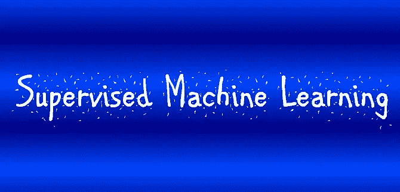
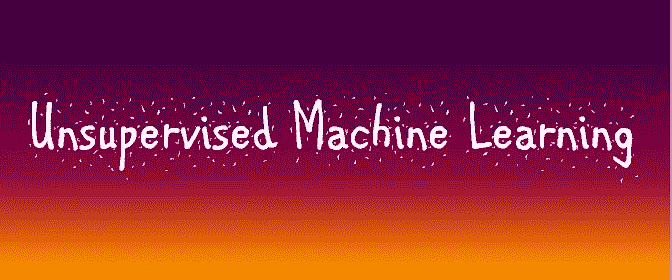
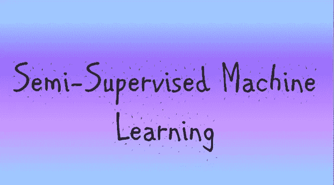
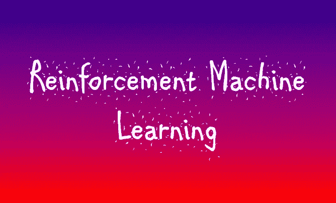
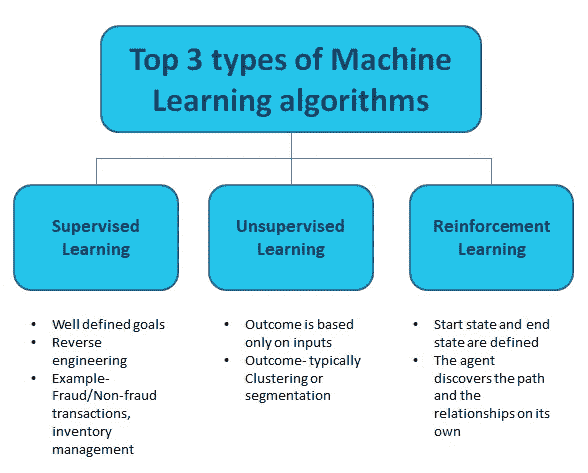

# 解释清楚:4 种机器学习算法

> 原文：<https://towardsdatascience.com/clearly-explained-4-types-of-machine-learning-algorithms-71304380c59a?source=collection_archive---------13----------------------->

## 你是一个涉足机器学习的数据科学家吗？如果是的话，那么你应该看看这个。

## 定义、目的、流行的算法和用例——都有解释

安迪·凯利在 [Unsplash](https://unsplash.com?utm_source=medium&utm_medium=referral) 上的照片

机器学习已经走过了漫长的道路，从仅仅是一个科幻小说的主题到成为最可靠和最多样化的商业工具，增强了每个商业运作的多方面。

它对各种业务表现的影响已经变得如此重要，以至于需要实施顶级的机器学习算法来确保许多行业在这个高度竞争的世界中的生存。

在商业运作中实施 ML 需要大量的资源，并且是一个战略步骤。因此，现在我们理解了机器学习算法为什么重要，下一步就是理解如何使用 ML 算法来拯救你。

实现这一目标的第一步是清楚地了解你希望使用机器学习来解决什么样的业务问题，并清楚地了解不同类型的机器学习算法所需的资源和努力，以便你能够从桌面上的许多算法中选择最佳算法。

在这篇文章中，我们将介绍机器学习算法的主要类型，解释每种算法的用途，并看看它们的好处是什么。

# 机器学习算法的类型

# 1.监督机器学习算法

监督学习算法是所有四种 ML 算法中最简单的。这些算法需要模型开发者的直接监督。在这种情况下，开发人员会标记样本数据语料库，并设置算法运行的严格边界。

这是机器学习的一个简单版本:

*   你选择什么样的信息输出(样本)给**【馈送】**算法
*   你决定什么样的**结果**是想要的*(例如“是/否”或“真/假”或“销售额/净信贷损失/房价”等)*

从机器的角度来看，这个过程或多或少是一个“连接点”的例行程序。

> 监督学习的主要目的是扩大数据的范围，并根据标记的样本数据预测不可用、未来或未知的数据。

监督机器学习包括两个主要过程:**分类和回归。**

*   ***分类*** 是从过去的数据样本中学习并手动训练模型以**预测本质上二元结果(是/否，真/假，0/1)** 的过程。例如:在接下来的 9 个月里，客户是否会流失，某人是否患有癌症等等。分类算法识别某些类型的对象，并相应地对它们进行分类，以预测两种可能结果中的一种。
*   ***回归*** 是识别模式并计算**连续结果**的预测的过程。例如:预测房价或下个月的销售预测等。

## **使用最广泛的监督算法有:**

*   线性回归；
*   逻辑回归；
*   随机森林；
*   梯度增强树；
*   支持向量机(SVM)；
*   神经网络；
*   决策树；
*   朴素贝叶斯；
*   最近的邻居。

## 监督学习算法用例

这些算法最常见的应用领域是销售、零售商业和股票交易中的价格预测和趋势预测。这些算法使用输入数据来评估可能性并计算可能的结果。

# 2.无监督机器学习算法

无监督学习算法不涉及开发者的直接控制。监督机器学习要求的要点是，我们应该事先知道过去数据的结果，以便能够预测未知数据的结果，但是在无监督机器学习算法的情况下,**期望的结果是未知的，尚未定义**。

有时候你不想准确预测结果。您只想执行一个分段或聚类。例如，一家银行希望对其客户进行细分，以了解他们的行为。这个商业问题需要使用无监督的机器学习算法，因为这里没有预测具体的结果。

> 两者的另一大区别是，监督学习专门使用标记数据，而非监督学习则以未标记数据为食。

无监督机器学习算法用于:

*   探索信息的结构；
*   提取有价值的见解；
*   检测模式；
*   将这一点落实到运营中以提高效率。

> 换句话说，无监督的机器学习试图通过筛选和理解提供给它的信息来描述这些信息。

无监督学习算法应用以下技术来描述数据:

*   **聚类:**它是一种对数据的探索，用于根据数据的内部模式将其分割成有意义的组(即聚类)，而无需任何组凭证的先验知识。凭证由单个数据对象的相似性以及它与其他数据对象的不同之处来定义(这也可以用于检测异常)。
*   **降维:**很多时候，传入的数据中有很多噪音。机器学习算法使用降维来消除这种噪声，同时提取相关信息。

## 最广泛使用的无监督算法有:

*   k-均值聚类；
*   t-SNE(t-分布式随机邻居嵌入)；
*   PCA(主成分分析)；
*   关联规则。

## 无监督学习算法用例

数字营销*(用于基于某些凭证识别目标受众群体——可以是行为数据、个人数据元素、特定软件设置或其他)*和广告技术*(该算法可用于开发更有效的广告内容目标，也可用于识别活动表现中的模式)*是采用无监督学习算法的主要行业。这些也用于需要探索客户信息和调整相关服务的情况。

# 3.半监督机器学习算法

半监督学习算法代表了监督和非监督算法之间的中间地带。本质上，半监督模型将两者的某些方面结合成一个自己的东西。

让我们理解半监督算法是如何工作的:

1.  半监督机器学习算法使用**有限的一组标记样本数据**来形成操作的要求(即训练本身)。
2.  这种限制导致了部分训练的模型，该模型随后得到标记未标记数据的任务。由于样本数据集的限制，结果被认为是**伪标记数据**。
3.  最后，**标记的和伪标记的数据集被组合**，这创建了一个独特的算法，该算法结合了监督和非监督学习的描述性和预测性方面。

> 半监督学习使用分类过程来识别数据资产，并使用聚类过程将其分组为不同的部分。

## 半监督学习算法用例

法律和医疗保健行业以及其他行业在半监督学习的帮助下管理 web 内容分类、图像和语音分析。

在 web 内容分类的情况下，半监督学习被应用于爬行引擎和内容聚合系统。在这两种情况下，它都使用各种标签来分析内容，并将其排列在特定的配置中。然而，这个过程通常需要人工输入来进一步分类。

在图像和语音分析的情况下，算法执行标记以基于样本语料库提供具有连贯转录的可行图像或语音分析模型。例如，它可以是 MRI 或 CT 扫描。利用一小组示例性扫描，有可能提供能够识别图像中异常的相干模型。

# 4.强化机器学习算法

**强化学习通常理解为机器学习人工智能。**

> 从本质上讲，强化学习就是开发一个自我维持的系统，通过连续的尝试和失败，基于标记数据的组合和与输入数据的交互来改进自己。

加强型 ML 采用了一种叫做**勘探/开发**的技术。机制很简单——**行动发生，结果被观察，下一个行动考虑第一个行动的结果。**这是一种迭代算法。

使用这种算法，机器被训练来做出特定的决定。它是这样工作的:机器被暴露在一个环境中，在这个环境中，它不断地通过试错来训练自己。机器从过去的经验中学习，并试图捕捉尽可能好的知识，以做出准确的商业决策。

## 最常见的强化学习算法包括:

*   q-学习；
*   时差(TD)；
*   蒙特卡罗树搜索(MCTS)；
*   异步行动者-批评家代理(A3C)。

## 强化学习算法用例

强化机器学习适用于信息有限或不一致的情况。在这种情况下，算法可以基于与数据和相关过程的交互来形成其操作程序。

现代 NPC 和其他视频游戏大量使用这种类型的机器学习模型。强化学习为人工智能对玩家动作的反应提供了灵活性，从而提供了可行的挑战。例如，碰撞检测功能对移动的车辆使用这种类型的 ML 算法。

自动驾驶汽车也依赖于强化学习算法。例如，如果自动驾驶汽车( [Waymo](https://waymo.com/) )检测到道路左转——它可能会激活“左转”场景等等。

这种强化学习变化的最著名的例子是 AlphaGo，它与世界上第二好的围棋选手正面交锋，并通过计算当前棋盘位置之外的动作序列击败了他。

另一方面，市场营销和广告技术运营也使用强化学习。这种类型的机器学习算法可以通过紧密适应用户的行为和周围环境，使重定向操作在传递转换方面更加灵活和高效。

此外，强化学习用于放大和调整聊天机器人的自然语言处理( [NLP](https://theappsolutions.com/blog/development/natural-language-processing/) )和对话生成，以:

*   模仿输入消息的风格
*   开发更多吸引人的、信息丰富的回答
*   根据用户反应找到相关回应。

总之，要记住的最重要的 ML 算法类型是监督式、非监督式和强化式。

请继续关注这个空间，了解更多关于统计、数据分析和机器学习的信息！