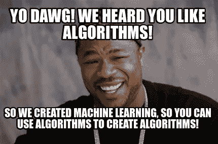
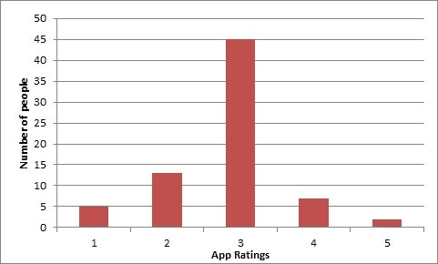
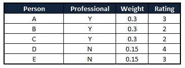
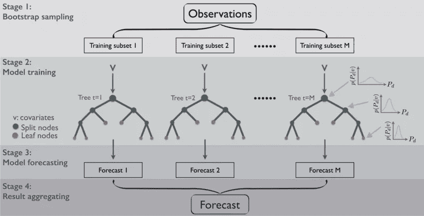
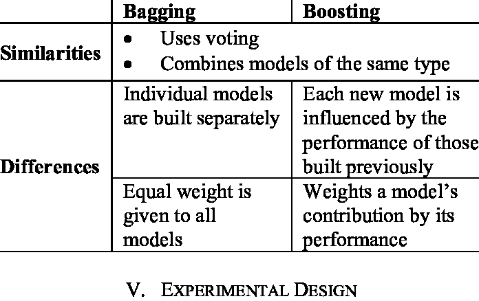

# 清楚地解释:集成学习方法，机器学习的核心

> 原文：<https://towardsdatascience.com/clearly-explained-ensemble-learning-methods-the-heart-of-machine-learning-fc4b828601b9?source=collection_archive---------58----------------------->

## 机器学习基础

## 去神秘化，非传统的解释，它会值得你花时间。

欧文·比尔德在 [Unsplash](https://unsplash.com?utm_source=medium&utm_medium=referral) 上的照片

我曾在“[上发表过一个帖子，清楚地解释了:什么是偏差-方差权衡，过度拟合&欠拟合](/clearly-explained-what-is-bias-variance-tradeoff-overfitting-underfitting-7896884dcf2d)”。如果你是一个新手，或者只是想在全力投入整体建模的海洋之前温习一下 ***偏差和方差*** 的概念，这篇全面的文章可以作为这篇文章的重要前传。说到这里，我们继续了解更多关于系综建模的知识。我将引用一些现实生活中的例子来简化系综模型的 ***什么、为什么和如何的概念，重点是装袋和助推技术*** 。

来源: [Giphy](https://gph.is/1s4ZJv9)

**场景 1:** 你需要一副新耳机。现在，你有可能走进一家商店，买下售货员展示给你的耳机吗？在这个时代，我确信答案是否定的，因为现在我们在购买任何东西之前都非常依赖我们的“研究”。你可以浏览一些网络技术门户网站，查看用户评论，然后比较你感兴趣的不同型号，同时检查它们的功能和价格。你也可能会询问你的朋友和同事的意见。简而言之，你不会直接得出结论，而是在彻底研究之后做出明智的决定。

现在，我们可以看看集成学习方法的技术定义。

来源:灵感来自 [SAS 研究所](https://blogs.sas.com/content/subconsciousmusings/2014/08/22/looking-backwards-looking-forwards-sas-data-mining-and-machine-learning/)的一张图表

# 什么是系综法？

*机器学习中的集成模型组合来自多个模型的决策，以提高整体性能。他们的操作思路与购买耳机时相似。*

学习模型中误差的主要原因是由于**噪声、偏差和方差**。

集成方法有助于将这些因素降至最低。这些方法旨在提高机器学习算法的稳定性和准确性。

**场景 2:** 假设你开发了一个健康健身 app。在将其公之于众之前，您希望收到重要的反馈，以弥补潜在的漏洞(如果有的话)。你可以求助于以下方法之一，阅读并决定哪种方法是最好的:

1.  **你可以听取配偶或密友的意见。**
2.  你可以问问你的朋友和办公室同事。
3.  **您可以发布该应用的测试版，并接收来自 web 开发社区和非偏见用户的反馈。**

没有印象分的猜测答案:D，是的，当然，我们将推出第三个选项。

现在，暂停一下，想想你刚才做了什么。你从足够多的人那里听取了多种意见，然后根据这些意见做出了明智的决定。这也是集合方法所做的。

> ***机器学习中的集成模型将来自多个模型的决策进行组合，以提高整体性能。***

**场景三:**看看下图；我们可以看到一群被蒙住眼睛的孩子在玩“触摸并告诉”的游戏，同时检查一头他们从未见过的大象。他们中的每一个人都有不同的版本来描述大象的样子，因为他们中的每一个人都接触到了大象的不同部位。现在，如果我们让他们提交一份关于大象描述的报告，他们的个人报告将只能根据他们的经验准确地描述一部分，但他们可以结合他们的观察，给出一份关于大象描述的非常准确的报告。

类似地，集成学习方法使用一组模型，与使用单个模型相比，它们的组合结果在预测准确性方面几乎总是更好。

> ***集成是一种分而治之的方法，用于提高性能。***

来源: [Pixabay](https://pixabay.com/illustrations/blind-men-burmese-elephant-story-1421406/)

现在，让我们深入一些重要的合奏技巧。

裂一点:D 你做的很棒:)来源:[链接](https://memegenerator.net/instance/81949914/yo-dawg-yo-dawg-we-heard-you-like-algorithms-so-we-created-machine-learning-so-you-can-use-algorithm)

# 简单的集成技术

1.  **取结果的模式**

众数:众数是一个统计术语，指在一组数字中出现频率最高的数字。

在这种技术中，使用多个模型来预测每个数据点。每个模型的预测都被视为单独的投票。我们从大多数模型中得到的预测被用作最终预测。

例如:我们可以通过参考上面的场景 2 来理解这一点。我在下面插入了一张图表来展示我们的健康和健身应用程序的测试版从用户社区获得的评级。(*将每个人视为不同的模型*

输出=模式=3，因为大多数人都这样投票

2.**取结果的平均值**

在这种技术中，我们从所有模型中获取预测的平均值，并使用它们进行最终预测。

平均值=总和(评分*人数)/总人数=(1 * 5)+(2 * 13)+(3 * 45)+(4 * 7)+(5 * 2)/72 = 2.833 =四舍五入到最接近的整数将是 3

3.**取结果的加权平均值**

这是平均法的延伸。所有模型被赋予不同的权重，定义每个模型对于预测的重要性。例如，如果你的回答者中有 25 人是专业的应用程序开发人员，而其他人之前没有这方面的经验，那么这 25 人的回答会比其他人更重要。

例如:为了子孙后代，我将这个例子的规模缩减到 5 个人

加权平均值=(0.3 * 3)+(0.3 * 2)+(0.3 * 2)+(0.15 * 4)+(0.15 * 3)= 3.15 =四舍五入到最接近的整数得出 3

# 高级集成技术

我们现在将学习装袋和增压技术。但是，要使用它们，你必须选择一个基本的学习算法。例如，如果我们选择一个分类树，打包和提升将由一个我们想要的大小的树池组成。

# 1.打包(引导汇总)

自举聚合是一种集成方法。首先，我们创建带有替换的训练数据集的随机样本(训练数据集的子集)。然后，我们为每个样本建立一个模型(分类器或决策树)。最后，使用平均或多数投票来组合这些多个模型的结果。

> ***由于每个模型都暴露于不同的数据子集，我们最终会使用它们的集体输出，因此我们会确保通过不要过于依赖我们的训练数据集来解决过度拟合的问题。因此，装袋帮助我们减少方差误差。***

*多个模型的组合降低了方差，尤其是在模型不稳定的情况下，并且可能产生比单个模型更可靠的预测。*

随机森林技术实际上使用了这一概念，但它更进一步，通过在训练时为每个自举样本随机选择一个特征子集来进行分裂，从而进一步减少方差。

来源:[链接](https://www.researchgate.net/figure/Schematic-of-the-RF-algorithm-based-on-the-Bagging-Bootstrap-Aggregating-method_fig1_309031320)

# 2.助推

来源:[吉菲](https://gph.is/MCE5gq)

提升是一种迭代技术，它基于最后一次分类来调整观察的权重。如果一个观察被错误地分类，它会试图增加这个观察的权重，反之亦然。

> ***Boosting 总体上降低了偏差误差，建立了强预测模型。Boosting 显示出比 bagging 更好的预测准确性，但它也倾向于过度拟合训练数据。*** *因此，参数调整成为 boosting 算法避免过拟合的关键部分。*

Boosting 是一种顺序技术，其中第一个算法在整个数据集上进行训练，后续算法通过拟合第一个算法的残差来构建，从而为先前模型预测不佳的那些观察值赋予更高的权重。

它依赖于创建一系列弱学习者，每个弱学习者可能对整个数据集都不好，但对数据集的某个部分是好的。因此，每个模型实际上都提高了整体的性能。

# 装袋和增压之间的差异总结

来源:[链接](https://www.researchgate.net/figure/Comparison-between-bagging-and-boosting_tbl1_224453264)

# 集合方法的优势/好处

几乎所有的 ML 黑客马拉松都使用集成方法来增强模型的预测能力。

让我们来看看使用系综方法的优势:

1.  **更准确的预测结果**——我们可以将集合方法的工作与我们的金融投资组合的*多样化*进行比较。建议保持债券和股票的混合投资组合，以减少可变性，从而最大限度地降低风险。类似地，在大多数情况下，与单个模型相比，模型集合将在测试用例场景(看不见的数据)上提供更好的性能。
2.  **稳定且更健壮的模型** -多个模型的综合结果总是比单个模型的噪音小。这导致模型的稳定性和鲁棒性。
3.  **集合模型可用于捕捉数据中的线性和非线性关系**。这可以通过使用两种不同的模型并形成两者的集合来实现。

# 集合方法的缺点

1.  **降低模型解释能力-** 由于复杂性增加，使用集成方法降低了模型解释能力，使得最终很难得出任何关键的商业见解。
2.  **计算和设计时间高-** 对实时应用不利。
3.  选择模特来创作合奏是一门很难掌握的艺术。

因此，现在我们已经讨论了集合方法的所有基础知识，您可以着手尝试它们来进一步增强您的理解。

你可以看看我下面关于机器学习的其他帖子，这些帖子很受欢迎。

 [## 分类 ML 模型的 10 大模型评估指标

### 解释非常规，这将作为评估分类机器学习模型的详尽列表。

towardsdatascience.com](/top-10-model-evaluation-metrics-for-classification-ml-models-a0a0f1d51b9)  [## 解释清楚:4 种机器学习算法

### 定义、目的、流行的算法和用例——都有解释

towardsdatascience.com](/clearly-explained-4-types-of-machine-learning-algorithms-71304380c59a) 

更多关于机器学习、数据科学和统计学的定期帖子，请关注这个空间。

*感谢您的阅读！:)*

*快乐学习:)*