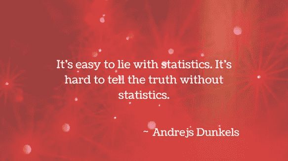
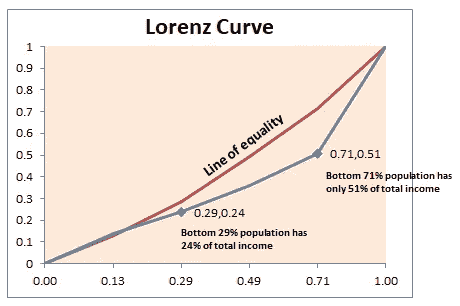
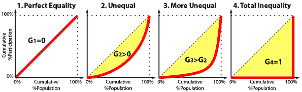
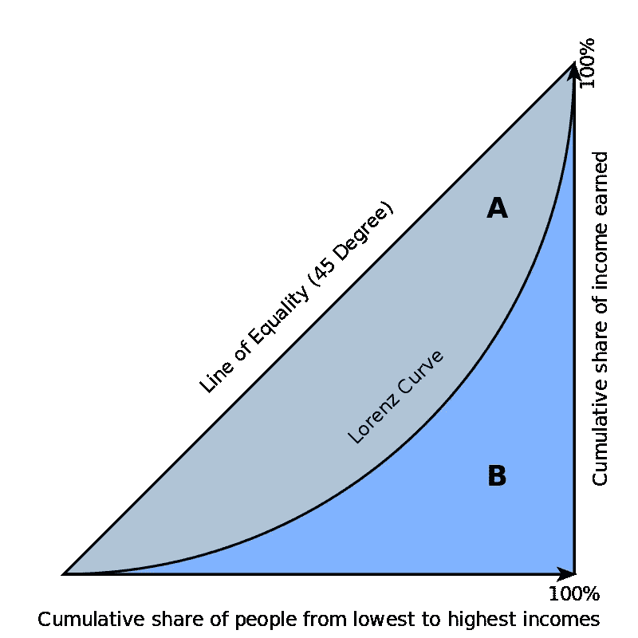
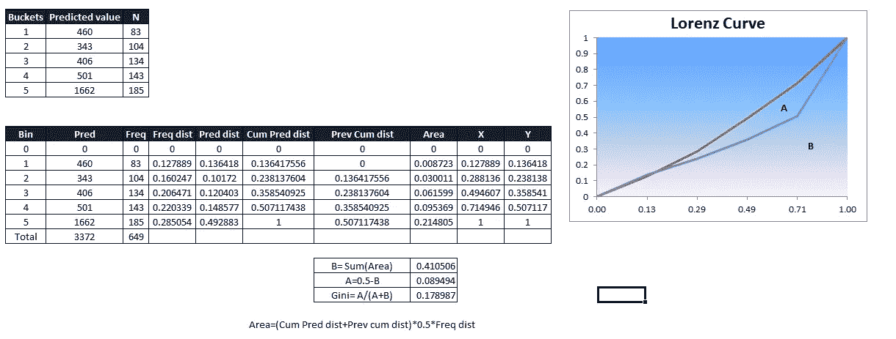

# 解释清楚:基尼系数和洛伦茨曲线

> 原文：<https://towardsdatascience.com/clearly-explained-gini-coefficient-and-lorenz-curve-fe6f5dcdc07?source=collection_archive---------0----------------------->

## 一个重要的统计经济系数——基尼系数

## 让我们了解基尼系数是什么和为什么以及洛伦兹曲线的一切

这篇文章将为数据科学专业人士解释基尼系数的用法和相关性，我们还将了解洛伦兹曲线，这是一种用图形确定基尼系数的方法。

# 基尼指数的传统定义是什么？

> 基尼指数或基尼系数是由意大利统计学家科拉多·基尼在 1912 年提出的一种分配的统计方法。它被用来衡量经济不平等，测量人口中的收入分配。

系数范围从 0(或 0%)到 1(或 100%)，0 代表完全相等，1 代表完全不相等。超过 1 的值实际上是不可能的，因为我们没有考虑负收入。(收入最低时可以为 0，但不能为负)

因此，一个所有居民收入相同的国家，其收入基尼系数为 0。在一个国家，一个居民赚取了所有的收入，而其他人什么都没赚到，那么这个国家的收入基尼系数就是 1。

众所周知，基尼系数是分析一个国家或地区收入或财富分配的重要工具，但是，

> 基尼不应被误认为是对收入或财富的绝对衡量。

一个高收入国家和一个低收入国家可以有相同的基尼系数，只要*收入在每个国家内分配相似*:

根据经合组织的数据，2016 年土耳其和美国的收入基尼系数都在 0.39-0.40 左右[，尽管土耳其的](http://www.oecd.org/social/income-distribution-database.htm)[人均 GDP](https://www.investopedia.com/terms/p/per-capita-gdp.asp)还不到美国的一半(以 2010 年美元计算)。

# 基尼指数在数据建模中的应用

基尼系数或基尼指数衡量一个变量的值之间的不平等。指数值越高，数据越分散。或者，基尼系数也可以计算为相对平均绝对差的一半。

# 基尼指数的图示(洛伦茨曲线)

基尼系数通常是根据洛伦茨曲线在数学上定义的，洛伦茨曲线绘制了人口总收入(y 轴)中最底层 x%的人口累积收入的比例。

因此，45 度线代表收入完全平等。

> 基尼系数可以被认为是位于平等线和洛伦兹曲线之间的面积(图中标记为 A，下图中标记为 A)与平等线下的总面积(图中标记为 A 和 B)之比；即 G = A / (A + B)。由于 A + B = 0.5(因为坐标轴的刻度从 0 到 1)，它也等于 2A 和 1–2B。

基尼系数通常通过洛伦茨曲线来表示，洛伦茨曲线通过在水平轴上绘制收入的人口百分位数，在垂直轴上绘制累积收入来显示收入(或财富)分布。

> 基尼系数等于完全平等线以下的面积(定义为 0.5)减去洛伦茨曲线以下的面积，除以完全平等线以下的面积。换句话说，它是洛伦兹曲线和完全平等线之间面积的两倍。

另一种思考基尼系数的方式是作为对完全平等的偏离的衡量。洛伦茨曲线偏离完全平等的直线(代表基尼系数为 0)越远，基尼系数越高，社会越不平等。

图:图片来源- [维基百科](https://en.wikipedia.org/wiki/Gini_coefficient#/media/File:Economics_Gini_coefficient2.svg)

**示例:**以下是如何通过绘制洛伦兹曲线并计算平等线和曲线之间的面积来计算基尼系数的 excel 图示。

所以，现在基尼系数及其使用洛伦兹曲线的计算对你们来说应该是小菜一碟:)

如果你有任何问题或建议，请告诉我。

感谢您的阅读:)

请关注这个空间，了解更多关于分析、统计和机器学习的内容！

快乐学习！！