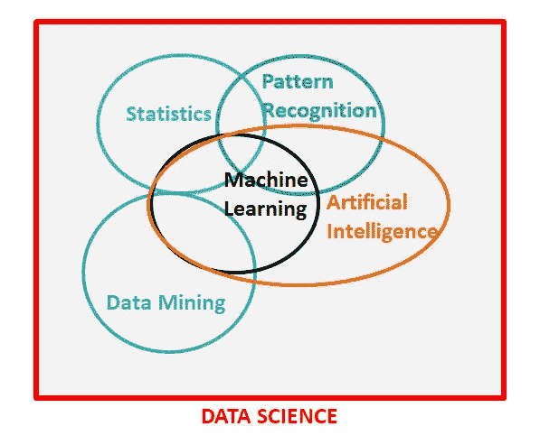

# 清楚地解释:机器学习如何不同于统计建模

> 原文：<https://towardsdatascience.com/clearly-explained-how-machine-learning-differs-from-statistical-modeling-967f2c5a9cfd?source=collection_archive---------12----------------------->

## 它们彼此非常不同，所有的数据科学家都必须理解为什么和如何！

来源:灵感来自于 SAS 研究所的图表

这篇文章提出了一个非常重要的区别，作为数据科学领域的一个活跃部分，我们应该理解这个区别。上面的文氏图最初是由 SAS Institute 发布的，但他们的图没有显示统计学和机器学习之间的重叠，据我所知，这可能是一个疏忽。根据我的信息和理解，我已经重新创建了这个图表。这个文氏图非常恰当地提出了数据科学所有分支的区别和重叠。

> **我愿意相信数据科学现在是一个总括术语，所有其他科学都可以被描述为数据科学的分支，每个分支都不同，但又与其他分支如此相似！**

**机器学习 *VS* 统计建模:**这是一个古老的问题，每个数据科学家/ML 工程师或任何开始这些领域旅程的人都会遇到。在研究这些领域时，有时机器学习感觉与统计建模交织在一起，这让我们想知道如何区分这两者，或者哪个标签对哪个模型来说是完美的。当然，如今机器学习已经成为一个时髦词汇，但这并不意味着我们开始将我们的统计模型贴上机器学习模型的标签，因为与流行的观点相反，*它们是不同的*！下面详细了解一下区别。

这个帖子的流程将是:

1.  **机器学习和统计建模的定义**
2.  **机器学习和统计建模的区别**
3.  **什么时候用哪个？**

# 定义

## 机器学习

> 对开发计算机算法感兴趣的研究领域被称为机器学习，该算法在不依赖基于规则的编程的情况下将数据转换为智能行为。

## 统计建模

> 统计模型通常被指定为一个或多个随机变量和其他非随机变量之间的数学关系。因此，统计模型是“一个理论的正式表示”。

既然枯燥冗长的定义已经过时，让我们更深入地理解这两个领域之间的差异。

# 机器学习和统计建模的区别

## 1.历史和学术相关性

统计建模在机器学习出现之前几个世纪就已经出现了，大约在 20 世纪 50 年代，第一个 ML 程序——塞缪尔的 checker 程序被引入。

世界上所有的大学现在都在启动他们的机器学习和人工智能项目，但他们并没有关闭他们的统计部门。

机器学习与计算机科学部门和独立的人工智能部门一起教授，这些部门处理构建预测算法，这些算法能够通过学习从数据中“学习”而变得“智能”，而没有任何预先指定的规则，如上文 ML 的定义中所述。

**鉴于**

*统计建模与数学系一起教授，数学系侧重于建立模型，这些模型首先可以找到不同变量之间的关系，然后可以预测可以描述为其他独立变量的函数的事件。*

## 2.不确定性公差

这是这两个领域的重要区别。

在**统计建模**中，我们注意到许多不确定性估计*(如置信区间、假设检验)*，我们必须考虑到，在我们可以信任特定算法的结果之前，必须满足所有假设。因此，它们具有低的不确定性容忍度。

例如:如果我们已经建立了一个线性回归模型，在我们使用该模型的结果之前，我们必须检查以下假设是否得到满足:

1.  因变量和自变量之间的线性关系
2.  误差项的独立性
3.  误差项(残差)需要正态分布
4.  平均独立性
5.  无多重共线性
6.  需要同质性

相反，如果我们建立了一个逻辑模型，必须考虑以下假设:

1.  二元逻辑回归要求因变量是二元的，而有序逻辑回归要求因变量是有序的。
2.  观察必须是相互独立的。
3.  无多重共线性
4.  独立变量和对数优势的线性

**鉴于**

在**机器学习**算法中，需要考虑的假设很少或者没有。ML 算法比统计模型灵活得多，因为它们对共线性、残差的正态分布等没有严格的要求。因此，它们具有很高的不确定性容忍度。

## 3.数据要求和方法

**统计模型**不能在非常大的数据集上运行，它们需要具有较少属性和相当数量观察值的可管理数据集。在统计模型中，属性的数量通常不会超过 10–12，因为它们非常容易过度拟合*(在训练数据集上表现很好，但在看不见的数据上表现很差，因为它非常接近训练数据集，这是一个不希望的场景)*

同样， ***大多数*** 统计模型遵循**参数方法**(例如:线性回归、逻辑回归)

**鉴于**

机器学习算法是学习算法，要学习它们需要大量的数据。因此，它们需要具有大量属性和观察值的数据。越大越好！ **ML 算法在某种程度上需要大数据。**

另外， ***大部分的*** 机器学习模型都遵循**非参数方法** (K 近邻、决策树、随机森林、梯度推进方法、SVM 等。)

# 什么时候用哪个？

这主要取决于下面解释的因素。我们将通过例子从理论上讨论这些要点。

**统计模型应该是您的首选，如果:**

*   不确定性很低，因为当您开始构建模型时，大多数假设都得到满足
*   数据的大小不是很大
*   如果你想隔离少数变量的影响
*   总体预测的不确定性/边际误差是可以的
*   各种独立变量之间的相互作用在数量上相对较少，并且可以预先指定
*   需要高度的可解释性

如果，机器学习可能是更好的选择

*   当要预测的结果不具有很强的随机性时；例如，在视觉模式识别中，对象必须是`E`或者不是`E`
*   可以在无限数量的精确复制上训练学习算法(例如，字母表中的每个字母或要翻译成德语的某个单词的 1000 次重复)
*   当整体预测是目标时，不能描述任何一个独立变量的影响或变量之间的关系
*   人们对估计预报中的不确定性或选定预测因子的影响不太感兴趣
*   数据的规模是巨大的
*   人们不需要孤立任何特殊变量的影响
*   低可解释性和模型是一个“黑盒”是可以接受的

*例如:如果你与一家信用卡公司合作，他们希望建立一个模型来跟踪客户流失，那么他们很可能更喜欢一个有 10-12 个预测值的统计模型，他们可以根据自己的业务领域知识来解释和否决这些预测值，他们不会欣赏这种情况下的黑盒算法，因为对可解释性的需求高于预测的准确性。*

另一方面，如果你为网飞和亚马逊这样的客户工作，他们想要建立强大的推荐引擎，那么在这种情况下，对结果准确性的需求高于模型的可解释性，因此，机器学习模型就足够了。

这样，我们就到了这篇文章的结尾。

你可以在我的以下帖子中了解更多关于数据挖掘和机器学习之间的区别以及 4 大机器学习算法的完整细节:

 [## 清楚地解释:机器学习与数据挖掘有何不同

### 定义、混淆、区别——都有解释

towardsdatascience.com](/clearly-explained-how-machine-learning-is-different-from-data-mining-4ee0e0c91bd4)  [## 解释清楚:4 种机器学习算法

### 定义、目的、流行的算法和用例——都有解释

towardsdatascience.com](/clearly-explained-4-types-of-machine-learning-algorithms-71304380c59a) 

观看此空间，了解更多关于机器学习、数据科学和统计学的信息！

快乐学习:)