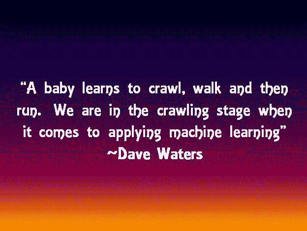

# 清楚地解释:机器学习与数据挖掘有何不同

> 原文：<https://towardsdatascience.com/clearly-explained-how-machine-learning-is-different-from-data-mining-4ee0e0c91bd4?source=collection_archive---------23----------------------->

## 让我们谈一谈大数据时代以及为什么 ML 变得如此受欢迎！

## 定义、混淆、区别——都有解释

Artem Sapegin 在 [Unsplash](https://unsplash.com?utm_source=medium&utm_medium=referral) 上拍摄的照片

该帖子的流程如下:

1.  **谈论大数据时代以及为什么 ML 现在变得如此流行？**
2.  **数据挖掘和机器学习领域的历史和混淆点**
3.  **数据挖掘和机器学习的定义**
4.  **数据挖掘和机器学习的区别**

人类从出生开始就开始分析数据。儿童接触到大量的信号(通过眼睛、耳朵、鼻子、舌头和神经),他的大脑很快学会/适应如何分析这些信号并做出反应。继口语之后，书面语的出现创造了巨大的数据仓库，可以分析至今。

很多人说，我们刚刚进入了大数据 的 ***时代，但数据总是在我们周围，只是*【记录】*数据的数量已经开始激增，这是由于 **4 个主要因素也导致了机器学习在今天变得如此流行** *(以下 4 点是由 AnalyticsVidhya 发布的信息指南提出的)*:***

1.  **仓储成本低**
2.  **低计算成本**
3.  **现在连接到互联网的设备数量非常多——到 2020 年大约有 500 亿台联网设备**
4.  **当然，云技术给数据世界带来了民主**

# 历史

现在，让我们多谈一点历史，以理解这篇文章所涉及的两个领域——**数据挖掘和机器学习**

数据挖掘产生于 20 世纪 30 年代，最初被称为数据库中的知识发现，机器学习是在 20 世纪 50 年代第一个 ML 程序 Samuel's Checker 程序发布时引入的。

# 数据挖掘和机器学习之间的混淆点

1.  两者都是分析过程，是数据科学行业不可或缺的一部分。
2.  两者都是从它们在模式识别用例中的最初使用中产生的。
3.  两者都构成了从大量数据中学习。

# 数据挖掘和机器学习的定义

## 数据挖掘

> 它包括在现有数据中系统地搜寻有价值的情报。

## 机器学习

> 对开发将数据转化为智能行为的计算机算法感兴趣的研究领域被称为机器学习。

现在，无聊的定义已经远离我们，让我们跳到最有趣的部分，差异！

# 数据挖掘和机器学习的区别

*数据挖掘*是商业分析的一个子集，它专注于教会计算机——如何识别大型数据集中以前未知的模式、关系或异常，然后人类可以使用它们来解决商业问题。**这是一个需要人工干预和决策的手动过程。人类可以通过引入智能特征来使该过程变得智能。**

> 例如:如果一家信用卡公司拥有大量关于客户行为的数据，并且他们希望了解客户流失的模式，那么他们将部署数据挖掘技术来找出不同客户特征之间的关联，这可以强烈地表明未来的客户流失。

**鉴于**

*机器学习*是人工智能的一个子集，它专注于教计算机——如何学习分析大型数据集，并“学习”其中的模式*(从训练数据集)*这些模式可以帮助对新数据进行预测。除了初始编程和微调，计算机完全不需要人工干预来学习数据并自行改进其预测。随着机器接收越来越多的数据，它将变得越来越智能。

> 例如:网飞是机器学习的一个完美例子。我今天在我的建议列表上看到了《金钱大劫案》,那么，网飞怎么知道我接下来想看什么呢？后端有一个强大的机器学习算法，它不断分析与我有类似简档的其他用户的观看偏好，因此它基于此提出建议。随着你看得越来越多，算法会了解你对该类型的偏好，你会得到基于此的建议！

# 结束语

实际上，所有的数据挖掘都涉及到机器学习的使用，但并不是所有的机器学习都涉及到数据挖掘。

> 例如:你可以应用机器学习来数据挖掘汽车交通数据，以获得与事故率相关的模式，但另一方面，如果我们谈论无人驾驶汽车，它们是基于纯粹的机器学习，不涉及任何数据挖掘。

作为延续，你可以阅读我下面的帖子来了解 4 种机器学习算法！一定要去看看！

 [## 解释清楚:4 种机器学习算法

### 定义、目的、流行的算法和用例——都有解释

towardsdatascience.com](/clearly-explained-4-types-of-machine-learning-algorithms-71304380c59a) 

请继续关注这个空间，了解更多关于机器学习、数据分析和统计的信息！