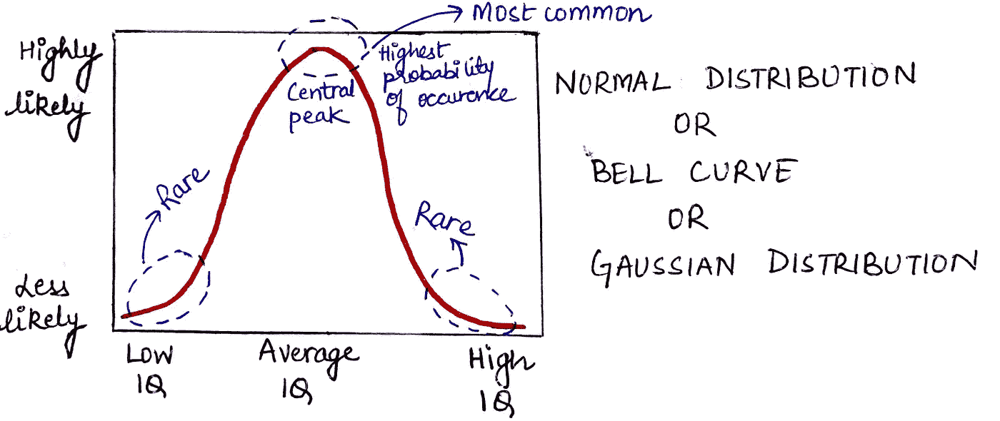
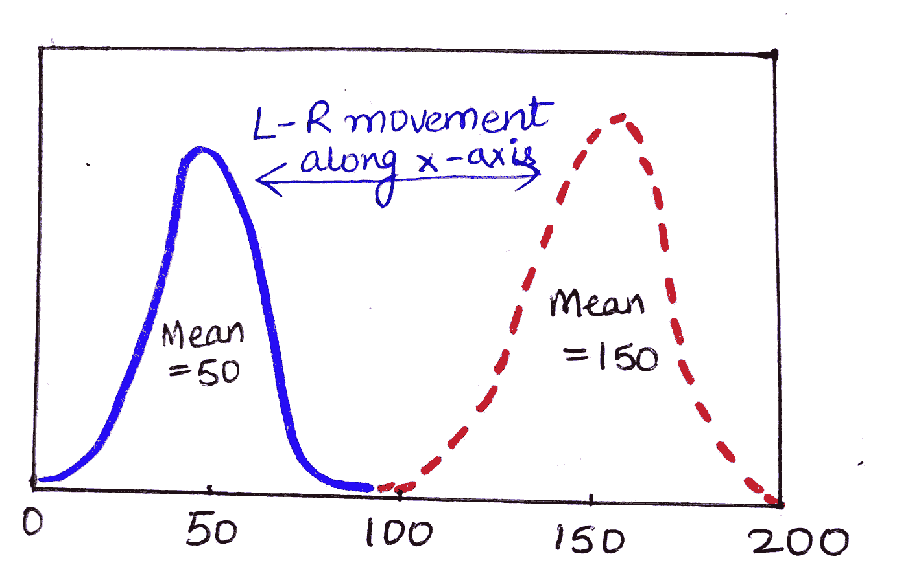
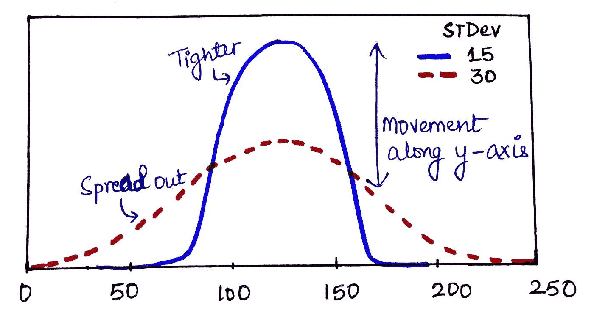
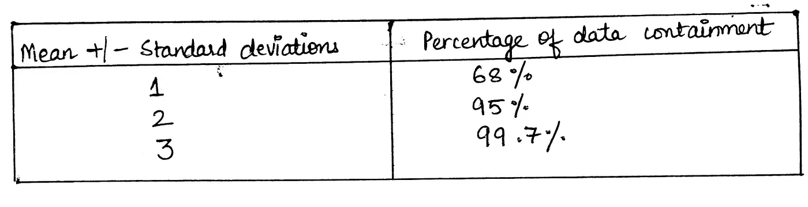
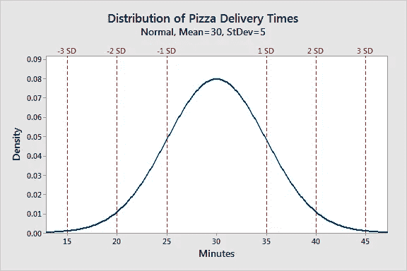

# 解释清楚:正态分布

> 原文：<https://towardsdatascience.com/clearly-explained-normal-distributions-and-the-central-limit-theorem-8d7cc5a6052f?source=collection_archive---------28----------------------->

## 为什么每个 ML 工程师或数据科学家都必须了解这一点

## 这些概念有什么正常或不正常的地方？

资料来源:Giphy

每个试图踏上数据科学的旅程的人都会遇到正态分布。在这篇文章中，我将以非常清晰的方式解释它到底是什么，我们如何解释它，以及为什么它作为一个每个数据科学家都必须意识到的概念具有巨大的重要性。

# **什么是正态分布？**

正态分布也被称为高斯分布或钟形曲线(因为它看起来像一个钟，哈哈！多么直观！)，这是统计学中最重要的概率分布，有点神奇，因为我们在大自然中经常看到它。比如身高、体重、血压、测量误差、智商分数等。都遵循正态分布。

> 有一个原因使得它对统计学非常有用，它被称为**中心极限定理**，但是让我们把它留到另一篇博文中。最后给出的链接是这篇文章的完美续篇。

现在，参考上图，理解一个正态变量的值是如何分布的。这是一个对称分布，其中大多数观察值聚集在出现概率最高的**中心峰值(平均值/平均值)**周围，随着我们在两个方向上远离中心峰值，我们看到曲线尾部值出现的概率变得越来越小。这幅图描绘了一个人群的智商水平，可以理解的是，智商水平很低或很高的人很少出现**，大多数人的智商都在平均水平范围内。**

**我们周围的很多很多变量都可以用这个正态/钟形分布来描述。想想你所有的同事到达办公室所花的时间，只有少数人住在 5 分钟或 2 个多小时的距离内。大多数人会在 20 分钟到 70 分钟的距离内(山顶附近的区域)。当你探索越来越多具有正态分布的变量时，我们会发现它就在我们周围，这就是为什么它如此正常，它的名字非常恰当！！**

# **正态分布的参数**

> **正态分布总是以平均值为中心，曲线的宽度由标准差(SD)决定。**

****

**这里有两个正态分布，x 轴是以英寸为单位的身高测量值，y 轴是与特定身高相对应的人数。**

1.  **婴儿的分布平均值=20 英寸，标准差=0.6 英寸**
2.  **成人的分布平均值为 70 英寸，标准差为 4 英寸**

**知道正态分布的标准差的重要性在于它遵循一个经验规则(在下一节中详细解释),即大约 95%的测量值落在平均值的+/- 2 标准差之间。**

> **推断:95%的人口落在平均值+/- 2*SD 之间**

1.  **95%的婴儿身高在 20 +/- 1.2 英寸之间**
2.  **95%的成人身高测量值在 70 +/- 8 英寸之间**

## **正态分布的第一个参数是平均值**

**平均值是正态分布的中心趋势，它决定了曲线峰值的**位置。平均值的变化导致曲线沿 x 轴水平移动。****

****

## **正态分布的第二个参数是 SD**

**标准差是正态分布可变性的度量，它决定了曲线的**宽度。SD 的变化会导致曲线变得更紧或更宽，并对曲线的高度产生反比影响。****

****曲线越紧(宽度越小)——>高度越高****

****曲线越展开(宽度越高)——>高度越短****

****

**现在，你了解了正态分布曲线的所有基础知识。让我们继续学习与之相关的其他重要信息。**

# **所有正态分布的共同特征**

1.  **都是**对称**(咩！我们现在已经知道了，不是吗？:p)**
2.  ****均值=中值=众数****

> **解码:平均值(Mean)是将总体/样本分成两半(中值)的值，是样本/总体中最常出现的值(众数)。放轻松，皮斯！**

**3.**经验规则**允许我们确定钟形曲线平均值的特定标准偏差范围内的数据百分比。(当然，您必须知道您的发行版的 SD，这样才能工作！)**

****

**这将通过一个例子变得更加清楚。请继续阅读！**

****

**让我们看一个披萨外卖的例子。假设一家披萨店的平均配送时间为 30 分钟，标准差为 5 分钟。使用经验法则，我们可以确定 68%的交付时间在 25–35 分钟之间(30 +/- 5)，95%在 20–40 分钟之间(30 +/- 2*5)，99.7%在 15–45 分钟之间(30 +/-3*5)。下面的图表用图形说明了这一特性。**

**看看当我们知道如何将统计学应用于现实生活问题时，事情变得多么直观？继续我的统计学家、数据科学家/工程师、人工智能爱好者或正在阅读这篇文章的好奇的伙伴们吧！这个世界需要更多的你来分析它的怪癖:)**

**在这篇文章的最后一部分，我们将了解正态分布的一种特殊情况**

# **标准正态分布:正态分布的特例**

**正如我们在上面看到的，正态分布根据参数值(平均值和标准差)有许多不同的形状。然而，标准正态分布是均值= 0 且标准差= 1 的正态分布的特例。这种分布也称为 Z 分布。**

**标准正态分布上的值称为标准分数或 Z 分数。标准分数代表特定观察值高于或低于平均值的 SD 数。**

**例如，标准分数 1.5 表示观察值高于平均值 1.5 个标准差。另一方面，负的分数代表低于平均值的值。平均值的 Z 值为 0。**

****

**万岁！！我们已经涵盖了构成正态分布基础的所有内容。我的下一篇博文是关于中心极限定理的。**

** [## 解释清楚:强大的中心极限定理

### 这实际上是最重要的统计定理之一，请继续阅读以获得简单的解释！

towardsdatascience.com](/clearly-explained-the-mighty-central-limit-theorem-b8152b94258) 

请留意这一空间中对统计概念的更简单的解释。

待在家里！注意安全！**