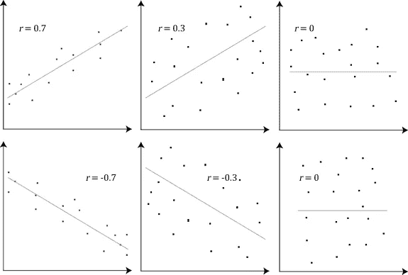
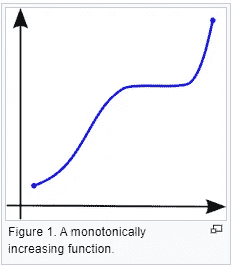
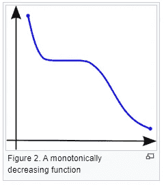
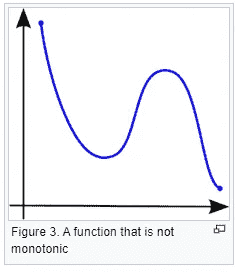
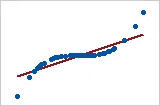
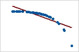

# 解释清楚:皮尔逊 V/S 斯皮尔曼相关系数

> 原文：<https://towardsdatascience.com/clearly-explained-pearson-v-s-spearman-correlation-coefficient-ada2f473b8?source=collection_archive---------0----------------------->

## 数据科学领域的每个人都应该知道的基础知识

## 在这篇文章中了解更多何时使用哪个系数

照片由[晨酿](https://unsplash.com/@morningbrew?utm_source=medium&utm_medium=referral)在 [Unsplash](https://unsplash.com?utm_source=medium&utm_medium=referral) 拍摄

我最近遇到一个场景，我自学了皮尔逊和斯皮尔曼相关系数之间的差异。我觉得这是媒体上数据科学领域的许多人可以利用的一条信息。我将彻底解释这两者之间的区别，以及每一种都适用的确切场景。请继续阅读！

这篇文章的内容:

1.  **相关性定义**
2.  **皮尔逊和斯皮尔曼相关系数的比较分析**

# 相关性的定义

相关性是两个变量线性相关的程度。这是双变量数据分析中的一个重要步骤。从最广泛的意义上来说，相关性实际上是二元数据中两个随机变量之间的任何统计关系，不管是不是因果关系。

> 要记住的一条重要规则是，相关性并不意味着因果关系

让我们通过两个例子来理解它实际上意味着什么。

1.  在夏季的几个月里，冰淇淋的消费量增加了。冰淇淋单位的销售有很强的相关性。在这个特殊的例子中，我们看到了因果关系，因为极端的夏天确实推动了冰淇淋的销售。
2.  冰淇淋销售也与鲨鱼袭击有很大的关联。现在我们可以很清楚地看到，鲨鱼袭击绝对不是由冰淇淋引起的。所以，这里没有因果关系。

因此，我们可以理解相关性并不总是意味着因果关系！

# 相关系数是多少？

相关系数是两个变量相对运动之间关系强度的统计度量。值的范围在-1.0 和 1.0 之间。相关性-1.0 表示完全负相关，而相关性 1.0 表示完全正相关。0.0 的相关性表明两个变量的移动之间没有线性关系。

# 2 个重要的相关系数——皮尔森和斯皮尔曼

# 1.皮尔逊相关系数

**维基百科定义:**在统计学中，皮尔逊相关系数(Pearson correlation coefficient)也称为皮尔逊的 *r* 或二元相关(bivariate correlation)，是衡量两个变量 *X* 和 *Y* 之间的**线性相关**的统计量。它的值介于+1 和-1 之间。值+1 表示完全正线性相关，0 表示没有线性相关，1 表示完全负线性相关。

> **要记住的重要推论:**皮尔逊相关只能评估两个连续变量之间的线性关系(只有当一个变量的变化与另一个变量的成比例变化相关联时，关系才是线性的)
> 
> **示例用例:**我们可以使用皮尔逊相关来评估年龄增长是否会导致血压升高。

以下是皮尔逊相关系数(r)如何随两个变量之间的关系**强度和方向**变化的示例。请注意，当无法建立线性关系时(参见第三列中的图表)，皮尔逊系数的值为零。

来源:[维基百科](https://en.wikipedia.org/wiki/Correlation_and_dependence)

# 2.斯皮尔曼相关系数

**维基百科定义:**在统计学中，以 Charles Spearman 命名的 Spearman 秩相关系数或 Spearman 的ρ，是秩相关(两个变量的秩之间的统计相关性)的一种**非参数度量。它评估使用**单调函数**描述两个变量之间的关系有多好。**

> **需要记住的重要推论:**Spearman 相关性可以评估两个变量之间的单调关系——连续变量或顺序变量，它基于每个变量的排序值，而不是原始数据。

**什么是单调关系？**

单调关系是执行下列操作之一的关系:

(1)随着一个变量的值增加，另一个变量的值也增加，或者，

(2)随着一个变量的值增加，另一个变量的值减少。

但是，不完全是恒定的速率，而在线性关系中，增加/减少的速率是恒定的。

来源:[维基百科](https://en.wikipedia.org/wiki/Monotonic_function)

> **示例用例:**员工完成测试练习的顺序是否与他们受雇的月数有关，或者一个人的智商与每周看电视的时间有关

# 皮尔逊系数和斯皮尔曼系数的比较

1.  两个相关系数之间的根本区别在于，皮尔逊系数适用于两个变量之间的线性关系，而斯皮尔曼系数也适用于单调关系。

2.另一个区别是，皮尔逊处理变量的原始数据值，而斯皮尔曼处理排序变量。

现在，如果我们觉得散点图直观地表明“可能是单调的，可能是线性的”关系，我们最好的选择是应用 Spearman 而不是 Pearson。即使数据是完全线性的，换成 Spearman 也没有坏处。但是，如果它不完全是线性的，我们使用皮尔逊系数，那么我们就会错过斯皮尔曼可以捕捉到的信息。

让我们来看看我在这个[网站](https://support.minitab.com/en-us/minitab-express/1/help-and-how-to/modeling-statistics/regression/supporting-topics/basics/a-comparison-of-the-pearson-and-spearman-correlation-methods/#:~:text=The%20Pearson%20correlation%20evaluates%20the%20linear%20relationship%20between%20two%20continuous%20variables.&text=The%20Spearman%20correlation%20coefficient%20is,evaluate%20relationships%20involving%20ordinal%20variables.)上发现的一些信息丰富的例子:

1.  皮尔逊= +1，斯皮尔曼= +1

2.Pearson = +0.851，Spearman = +1(这是一个单调递增的关系，因此 Spearman 正好是 1)

3.皮尔逊= 0.093，斯皮尔曼= 0.093

4.皮尔逊= 1，斯皮尔曼= 1

5.Pearson = 0.799，Spearman = 1(这是一个单调递减的关系，因此 Spearman 正好为 1)

**注:这两个系数都不能捕捉任何其他类型的非线性关系。因此，如果散点图表明不能用线性或单调函数表达的关系，那么这两个系数都不能用来确定变量之间关系的强度。**

为了进一步阅读，您可能想看看下面两篇解释等级排序和 PSI，CSI 用于模型验证和监控的文章。

 [## 为什么等级排序如此重要？

### 继续阅读，了解更多关于分类模型中等级排序的概念和用法

juhiramzai.medium.com](https://juhiramzai.medium.com/why-rank-ordering-is-so-important-bc1ff8a48764)  [## PSI 和 CSI:前 2 个模型监控指标

### 种群稳定性指数和特征稳定性指数

towardsdatascience.com](/psi-and-csi-top-2-model-monitoring-metrics-924a2540bed8) 

*关注本空间了解更多关于数据科学、机器学习和统计学的内容。*

*快乐学习:)*