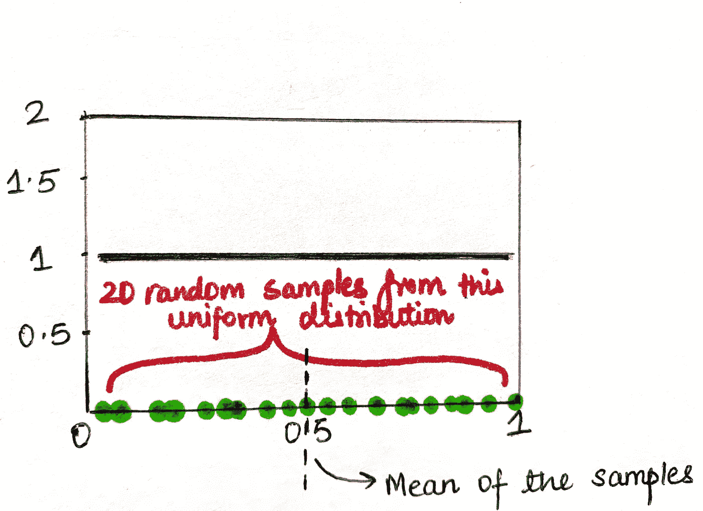
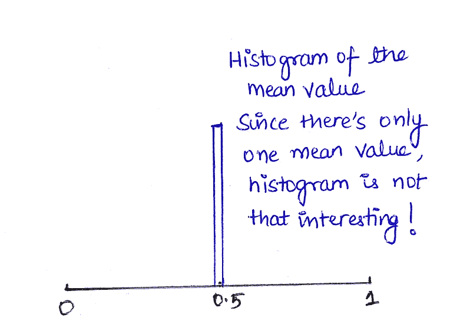
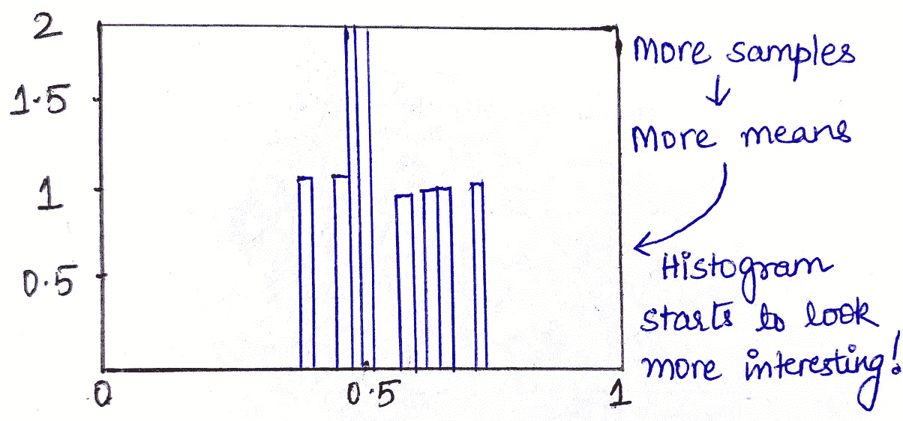
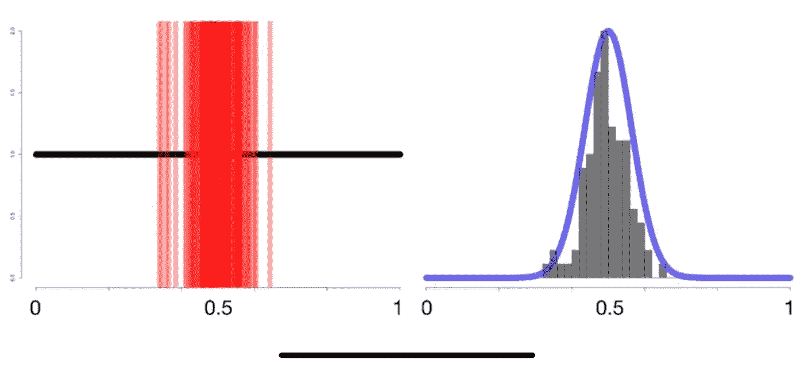
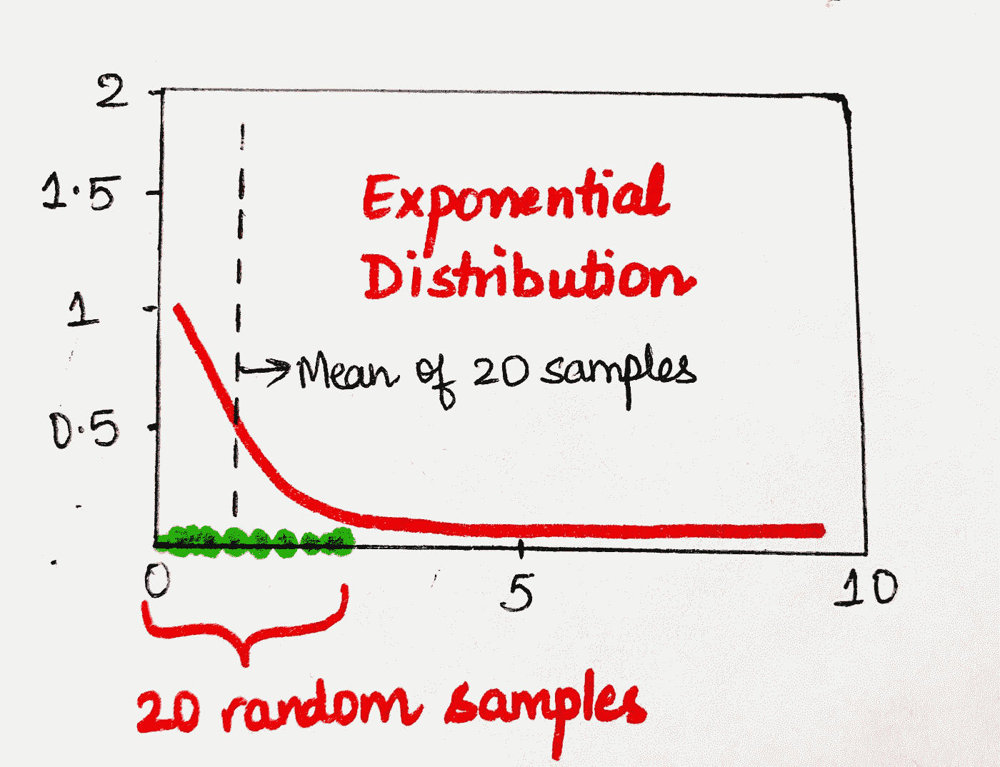
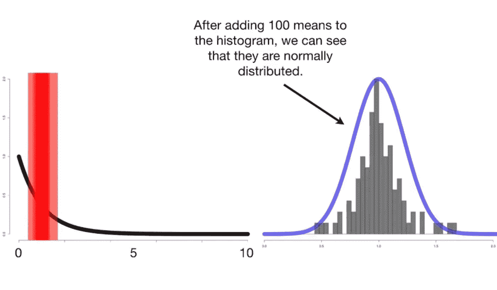
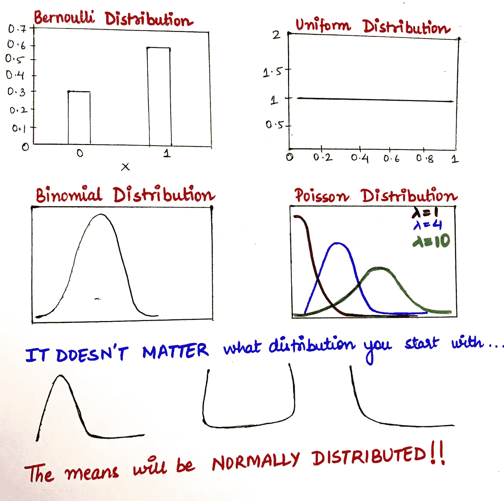

# 解释清楚:强大的中心极限定理

> 原文：<https://towardsdatascience.com/clearly-explained-the-mighty-central-limit-theorem-b8152b94258?source=collection_archive---------39----------------------->

## 为什么每个 ML 工程师/数据科学家都必须了解这一点

## 这实际上是最重要的统计定理之一，请继续阅读以获得简单的解释！

资料来源:Giphy

中心极限定理(CLT)是统计学中的基本定理之一，好消息是，这是一个非常简单的概念，当你进一步阅读时就会明白。在阅读任何进一步的正态分布之前，您必须理解一个先决概念，以及它们为什么如此重要！阅读我关于正态分布的文章，它是中心极限定理的完美前传。

 [## 解释清楚:正态分布和中心极限定理

### 这些概念有什么正常或不正常的地方？

towardsdatascience.com](/clearly-explained-normal-distributions-and-the-central-limit-theorem-8d7cc5a6052f) 

继续，标准定义:

> 中心极限定理(CLT)指出，给定足够大的样本量，无论变量在总体中的分布如何，变量均值的抽样分布都将接近正态分布。

# 解读冗长的^定义

让我们直接看一些例子，当我们从另一边出来时，CLT 对我们来说已经非常清楚了。

## 示例#1

让我们来看一个均匀分布*(它从 0 到 1，之所以称为均匀分布，是因为在 0 和 1 之间选择值的概率相等，因此它的概率密度函数(PDF)是直的水平黑线)。*现在，假设我们从该分布(绿点)中随机抽取 20 个样本，并计算这些样本的平均值，我们最终得到一个值，在本例中用黑色虚线表示为 0.5。让我们继续在直方图上绘制这个平均值。因为这个直方图到目前为止只有一个平均值，所以它并没有告诉我们什么(下图)。继续从相同的分布中提取更多的随机样本，计算各自的平均值，并再次在直方图上绘制这些平均值，我们开始得到一个有趣的输出(下图)

现在，随着我们继续从均匀分布中取出越来越多的随机样本，并继续在直方图上绘制样本均值，我们会得到以下结果，结果表明这是一个正态分布(见右曲线)。

> **推论:我们从均匀的数据分布开始，但是从中抽取的样本的平均值导致了正态分布。**

## 实施例 2

在第二个示例中，让我们遵循与示例#1 相同的步骤，唯一的不同是我们这次将从指数分布中抽取样本。

我们将再次随机抽取 20 个样本，计算样本的平均值，并绘制在直方图上。从这个指数数据分布快进到大约 100 个样本，直方图开始看起来像下面这样，它的模式现在对我们来说并不奇怪。是的，你猜对了，样本的平均值是正态分布！

> **推论:我们从指数数据分布开始，但是从中抽取的样本的平均值导致了正态分布。**

因此，在这一点上，CLT 的暗示变得非常直观。

> 中心极限定理意味着即使数据分布不是正态的，从中抽取的样本的均值分布也是正态的。

# 知道样本均值总是*正态分布的实际含义是什么？

在分析领域，我们每天都会遇到各种各样的数据，我们并不总是知道源数据的分布，但是，因为我们知道 CLT，所以我们甚至不需要关心这个事实，因为平均值总是正态分布的，我们完全没有必要担心源数据的分布。

*(注*——为了让 CLT 能够工作，我们必须能够计算出你的样本的平均值。有一种分布称为柯西分布，它没有样本均值，因此 CLT 不适用于它，但除了柯西，我没有遇到任何其他分布是 CLT 的例外，所以在任何其他分布的情况下，你可以肯定中心极限定理非常适用于它。)*

下面是知道均值正态分布的实际含义:

1.  我们可以使用均值的正态分布来分配**置信区间**。
2.  我们可以执行 **T 检验**(即，如果两个样本的平均值之间存在差异)
3.  我们可以执行 **ANOVA** 测试(即 3 个或更多样本的平均值之间是否存在差异)
4.  我们可以进行任何使用样本均值的统计检验。

这就把我们带到了这篇文章的结尾！这篇文章涵盖了我们在处理数据和样本时应该知道的中心极限定理的全部理论。

观看这个空间的更多关于分析、统计和机器学习的帖子！！

快乐学习！:)