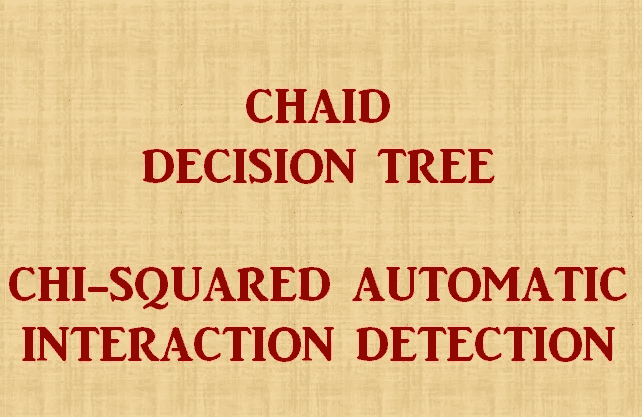
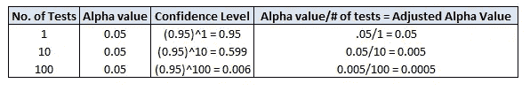
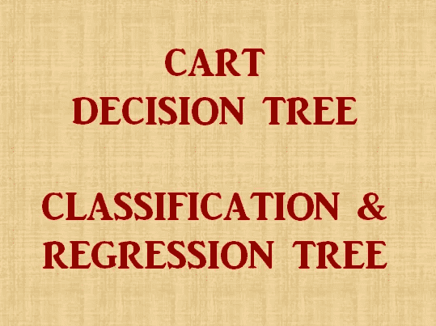

# 前两种决策树的简单指南:CHAID 和卡特

> 原文：<https://towardsdatascience.com/clearly-explained-top-2-types-of-decision-trees-chaid-cart-8695e441e73e?source=collection_archive---------7----------------------->

## 机器学习基础

## 理解这些算法的本质

亚当·博斯在 [Unsplash](https://unsplash.com?utm_source=medium&utm_medium=referral) 上的照片

基于树的学习算法被认为是最好的和最常用的监督学习方法之一，因为它们使预测模型具有高准确性、稳定性和易于解释。与线性模型不同，它们很好地映射了非线性关系。他们善于解决手边的任何类型的问题(分类或回归)。

CHAID 和卡特是两种最古老的决策树。它们也是当今行业中最常用的决策树类型，因为它们非常容易理解，但彼此又有很大不同。在本帖中，我们将了解理解这两种决策树所需的所有基本信息。

让我们先深入了解一下 CHAID 决策树算法。

# CHAID 卡方自动交互检测

这个算法最初是由 Kass 在 1980 年提出的。从这个算法的名字可以看出，它是基于卡方统计的。卡方检验产生一个介于 0 和 1 之间的概率值。卡方值越接近 0，表示正在比较的两个类别之间存在显著差异。类似地，更接近 1 的值表示这两个类别之间没有任何显著差异。

> **CHAID 算法中使用的变量类型:**
> 
> 待预测的变量，即因变量:连续变量还是分类变量
> 
> 独立变量:仅限分类变量(可以超过 2 个类别)

因此，如果有连续的预测变量，那么我们需要将它们转换成分类变量，然后才能提供给 CHAID 算法。

> **用于确定下一个最佳分割的统计测试:**
> 
> 连续因变量:f 检验(回归问题)
> 
> 分类因变量:卡方(分类问题)

让我们先了解 Bonferroni 调整/校正，然后再继续。

## Bonferroni 调整/校正

在统计学中， **Bonferroni 校正**是用来抵消多重比较问题的几种方法之一。

> 这种调整解决了这样一个事实，即您执行的测试越多，类型 1 错误(假阳性)的风险就越大，也就是说，看起来好像您偶然发现了一些重要的东西，但实际上您没有。

上图表明，如果我们取α值为 0.05 并进行 1 次测试，那么我们有 95%的置信度，表明我们有 95%的概率能够避免 1 型错误。现在，请注意，当我们开始将测试数量增加到 100 时，我们只剩下 0。^%概率能够避免第一类错误。为了抵消这种影响，我们计算了调整后的 alpha 值和测试次数。现在，只要我们可以使用这个新的调整后的α值，理论上我们就可以处于安全区。

> 在 100 次测试中观察调整后的 alpha 值，它变得如此之低，以至于树将停止生长，因为它将无法找到任何可以达到超显著水平的变量。

一般来说，所有开发决策树的软件都会给建模者一个关闭它的选项。Bonferroni 调节设置应保持开启。如果我们在树没有生长的情况下关闭它，并且我们想通过关闭 Bonferroni 来进行实验，那么考虑使 alpha 值低于通常的 0.05，以小心我们上面讨论的类型 1 错误的可能性。

另外，一旦建模阶段完成，一定要验证你的树。

## CHAID 算法的幕后过程

1.  逐一循环遍历所有预测器，以确定相对于因变量而言**差异最小的一对(预测器)类别。**将为分类问题计算卡方统计(因变量也是分类变量)，为回归问题计算 f 检验(因变量是连续变量)。
2.  如果给定预测器类别对的相应测试不具有由**α-合并值**定义的统计显著性，则它将合并相应的预测器类别并重复第一步(即，找到下一对类别，其现在可以包括先前合并的类别)。
3.  如果相应预测器类别对的统计显著性显著=小于相应的 alpha-to-merge 值，则在启用设置的情况下，它将为相应预测器的类别集计算 Bonferroni 调整后的 p 值。
4.  这一步是关于选择分裂变量。具有**最小调整 p 值**的预测变量，即产生最显著分裂的预测变量，将被考虑用于树中的下一次分裂。如果任何预测值的最小(Bonferroni)调整 p 值大于某个**α-to-split**值，则不会执行进一步的分裂，相应的节点将成为终端节点。
5.  这个过程将迭代地继续，直到不能执行进一步的拆分(给定α-合并和α-拆分值)。

## CHAID 如何处理不同类型的变量？

> **标称变量**:根据上述第 2 点自动分组数据
> 
> **序数变量**:根据上述第 2 点自动分组数据
> 
> **连续变量**:在执行#2 之前转换成段/十分位

CHAID 算法的本质是创建宽树。

我们现在可以开始理解 CART 决策树算法

# CART-分类和回归树

这个算法是由 Breiman 等人在 1984 年向世界介绍的。

这种算法基于“纯度”和“平衡”这两大支柱。如上所述，纯度由基尼系数表示，而平衡由决策树的左和右分区中的相同人口分布表示。一个最佳的车树不会在任何一根柱子上摇摆。

1.  在 CART 树上强制“平衡”会导致许多不纯的叶节点，这违背了使用决策树进行决策的目的。
2.  在一个 CART 树上强制“纯洁”会给我们一个片段中很少的人口分布，这又一次违背了健康决策树的目的。

> **CART 算法中使用的变量类型:**
> 
> 1.**回归树**
> 
> 待预测变量，即因变量:连续
> 
> 自变量:连续或分类(二元)
> 
> 2.**分类树**
> 
> 要预测的变量，即因变量:分类(二元)
> 
> 自变量:连续或分类(二元)

## 理解购物车算法的要点:

*   CART 本质上是计算昂贵且缓慢的。
*   CART 总是产生二进制拆分，不像 CHAID，如果需要，它可以产生两个以上的拆分。
*   **回归树基于使用最小平方偏差(LSD)对节点杂质的评估，这意味着节点内的方差。**
*   **分类树基于基尼平等指数。基尼系数为 0 表示完全平等，系数为 1 表示最大不平等。**
*   在连续变量的情况下，与 CHAID 相比，CART 能够测试更多的分界点，因为 CHAID 创建了连续变量的分段/十分位数，这些分段/十分位数通常在本质上是任意的，并且有时可以隐藏连续变量中的真实模式。
*   对于高达 5–15%的缺失数据，CART 比 CHAID 表现得更好，因为缺失值在 CART 中被视为一个单独的组，只有当两个类别之间实际上有很高的相似性时，它才会与任何其他类别组合，这与 CHAID 将缺失值与最近的组组合不同。
*   卡特形成了一棵比 CHAID 小得多的树
*   卡特有生产高而瘦的树的天性，不像 CHAID 有生产宽的树的天性。

## CART 算法的幕后过程

1.  选择基于变量值的规则以获得最佳分割，从而根据因变量区分观察值
2.  一旦选择了一个规则并将一个节点一分为二，相同的过程被应用于每个“子”节点(即，它是一个递归过程)
3.  当购物车检测到无法继续获利，或符合一些预设的停止规则时，分割停止。(或者，尽可能分割数据，然后在稍后修剪树)。

## CHAID 和卡特的停车规则

1.  **父/子样本量**
2.  **树的深度:** CHAID 一般应保持在 5-6 的深度，而根据树木的性质，应允许大车行走到 7-8。CHAID 可以在树深度 5 捕获信息，因为它将是一个宽树，而 CART 允许一些额外的树深度级别，因为它产生高而瘦的树，需要更多的深度来正确捕获问题的本质。
3.  **CHAID 的置信度:**分割/合并的默认 alpha 值设置为 0.05。为了防止过度拟合，我们可以将其降低到 0.01，以将置信区间从 95%增加到 99%，在这种情况下，树将增长得更少。类似地，如果我们感觉树没有生长，那么我们可以将阈值增加到 0.1，创建 90%的置信水平，因此，树将生长得更多。这就是你如何试验所有的停止规则，直到你对你的树满意为止。每次实验结束时都要进行验证，以了解你的树在看不见的数据上表现如何。
4.  【CART 的 Gini 指数:这有助于我们捕捉某个节点的杂质的某种程度的变化。假设基尼值的默认变化保持在 0.0001。如果我们给它加一个零，使它为 0.00001，那么就更容易得到一个更大的树，因为变化阈值已经降低了。另一方面，如果我们去掉一个零，使其为 0.001，那么树将不会生长得那么多，因为很难达到杂质变化的更高阈值。

我不会以这两棵树的比较来结束我的发言。有很多利弊列表可以用来比较卡特和 CHAID，但我相信每一个都适合不同的目的。你必须研究和处理你的数据，用各种各样的方法进行大量的实验，才能真正掌握什么对你试图解决的特定业务问题有好处。

我宁愿在这里列出决策树的常见优点和缺点作为结论部分:

# 决策树的利与弊

来源:[https://rpubs.com/chidungkt/451329](https://rpubs.com/chidungkt/451329)

**优点:**

1.  ***通俗易懂:*** 决策树输出即使对于非分析背景的人来说也是非常通俗易懂的。阅读和解释它们不需要任何统计知识。它的图形表示非常直观，用户可以很容易地联系他们的假设。
2.  ***在数据探索中有用:*** 决策树是识别最重要变量以及两个或更多变量之间关系的最快方法之一。在决策树的帮助下，我们可以创建新的变量/特征，这些变量/特征具有更好的预测目标变量的能力。也可以用在数据探索阶段。
3.  ***需要较少的数据清理:*** 与其他一些建模技术相比，需要较少的数据清理。它在一定程度上不受离群值和缺失值的影响。
4.  ***数据类型不是约束:*** 它可以处理数值和分类变量。
5.  ***非参数方法:*** 决策树被认为是非参数方法。这意味着决策树对空间分布和分类器结构没有任何假设。

**缺点:**

1.  ***过拟合:*** 过拟合是决策树模型最实际的困难之一。这个问题可以通过对模型参数设置约束和剪枝来解决。
2.  ***不适合连续变量:*** 在处理连续数值型变量时，决策树在对不同类别的变量进行分类时会丢失信息。

在我的下一篇文章中，我将把 QUEST 和 C5 算法作为本指南的一个扩展，来理解决策树算法中实际发生的事情。

请继续关注本空间，了解更多关于数据科学、机器学习和统计学的信息！

*快乐学习！！:)*