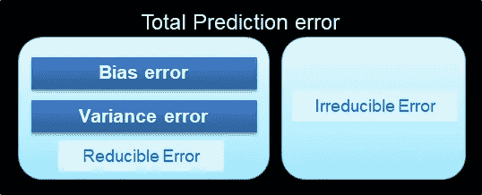
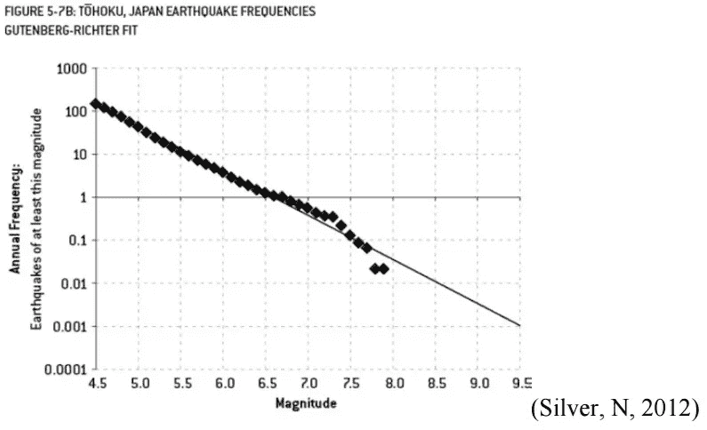
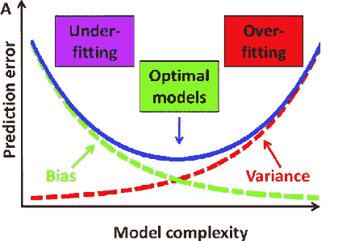
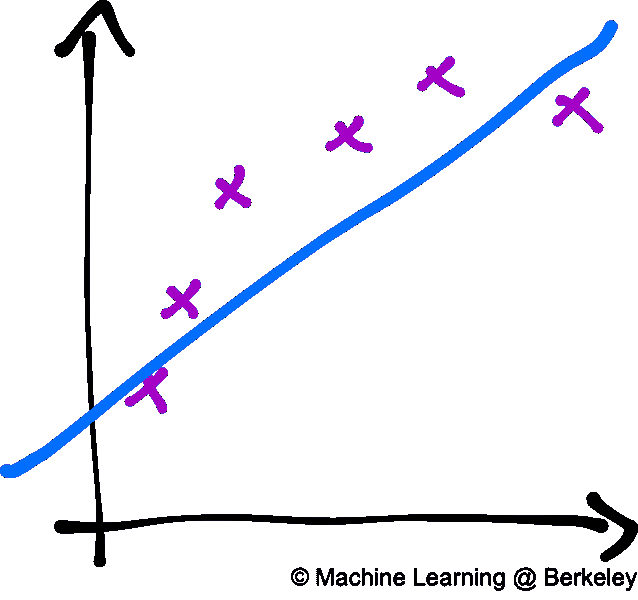
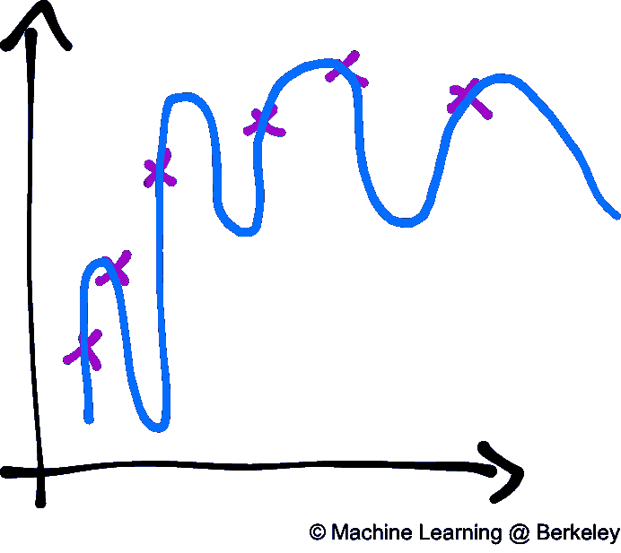

# 清楚地解释:什么是偏差-方差权衡，过度拟合和欠拟合

> 原文：<https://towardsdatascience.com/clearly-explained-what-is-bias-variance-tradeoff-overfitting-underfitting-7896884dcf2d?source=collection_archive---------41----------------------->

## 对于数据科学领域的任何人来说，这些概念都是非常重要的！

## 用例子解释，它将值得你花时间，继续读下去:)

约翰·莫塞斯·鲍恩在 [Unsplash](https://unsplash.com?utm_source=medium&utm_medium=referral) 上拍摄的照片

在这篇文章中，我们将以一种即使新手也能毫不费力地掌握的方式来理解这个建模和统计世界中由来已久的重要敲门砖。

> 每当我们建立一个预测模型时，即使在所有的调整和处理之后，我们的预测通常也是不完美的:在预测值和实际值之间会有一些非零的差异。这个差值被称为**预测误差**。我们可以把预测误差分解成两个分量:**可约和不可约误差。**

让我们用现实生活中的类比来理解它。火车司机是否能够成功地将火车引导到期望的目的地，这取决于两个因素，他自己(可减少的错误，如果他是警觉的和意识到的，他将不会犯任何无意的错误)和外部因素(不可减少的错误，如果一只迷路的动物冒险在铁轨上，如果另一个来自相反方向的火车司机失去控制，如果一个自杀的人扑到他的火车前面，等等)。)

看看下面的等式来总结这一切:

现在，我们将了解这个等式的两个组成部分(偏差误差和方差误差)，然后再讨论困扰每个模型的两者之间的权衡情况。

考虑一个人 X 先生，他是一名大一新生，是一名有抱负的数据科学家，目前正在与各公司面试，以获得他在这个行业的第一个突破。有一天，他去参加一个面试，回家后感到非常紧张和沮丧，因为面试并不顺利。他的母亲问了他所有的事情，他说面试官问了他太高级的问题，对他的每一点都进行了批判性的判断，没有任何削弱他信心的言辞。然后，他的母亲安慰他说:“今天不是你的好日子，明天会更好的”。

现在，从这个故事中我们可以看出，母亲并没有要求儿子比以前更积极地准备，以增加他成功的机会。原因是她对儿子总是有情感上的偏见，并且总是试图淡化他的失败。如果你试图预测她对一个来找她寻求安慰的人的反应，而不考虑这个人是不是她的儿子(直系亲属)，你的预测就会有偏差。现在，以下几点将帮助您理解偏差如何影响统计模型以及可以依赖的技术定义:

*   **偏差的真实例子** -我将在这里引用一个股票市场的例子，假设我建立了一个相当简单的模型，该模型仅基于 3-4 个预测因素来预测股票的股价。该模型预测，2019 年 2 月 3 日，每股股价将为 4 美元，但当天的实际价格为 3.4 美元。因此，总误差将是两个数字之间的差值，即 0.6 美元，偏差分量在这里起主要作用，因为我们只取了几个预测值。

> 偏差误差是预测数据点和实际数据点之间的差异，这是由于我们的模型过于简化造成的。

*   具有高偏差的模型过于简单，并且具有低数量的预测器。它缺少一些其他重要的预测因素，因此无法捕捉数据的潜在模式。它忽略了训练数据集中的特征与预期输出之间的关系。它很少关注训练数据，并且过于简化模型。这导致训练和测试数据中的高误差。

现在，让我们再一次回到这个故事。我们看到面试官问了一个大一新生的高难度问题，也就是说，他让看似简单的情况变得复杂，因为不必要的复杂问题让 x 先生目瞪口呆。让我们再来看两个事实-

*   X 先生只准备了初级问题，因此他不能回答高级问题。
*   面试官只面试过需要 5-6 年工作经验的职位，因此，他从来没有面试过一个新人。

在这种情况下，面试官在自己的舒适区之外会感到不舒服。X 先生对他来说是一个看不见的输入，他不知道如何处理，所以他问了太复杂的问题。这是理解**方差**的最佳案例。当暴露在他的舒适区(训练数据)的情况下，面试官表现出色，但一个新的经验(测试数据)让他偏离了轨道。现在，您已经准备好理解方差的技术定义及其对模型的影响，如下所述:

*   任何具有大量预测值的模型最终都将是一个非常复杂的模型，它将为已经看到的训练数据提供非常准确的预测，但是这种复杂性使得将该模型推广到看不见的数据非常困难，即高方差模型。因此，这个模型在测试数据上表现很差。

> 模型的高方差误差意味着它对小波动高度敏感。这个模型在它的舒适区之外挣扎(训练数据)。方差也有助于我们理解数据的分布。

现在我们必须了解与偏差和方差相关的两个更重要的术语- ***过拟合和欠拟合*** 。我将再次使用现实生活中的类比。对于这个例子，我已经参考了机器学习@Berkeley 的博客。

***当机器学习算法试图预测事物时，有一个非常微妙的平衡动作。***

***一方面，我们希望我们的算法能够非常紧密地模拟训练数据，否则，我们会错过相关的特征和有趣的趋势。***

***然而，另一方面，我们不希望我们的模型过于接近，并冒着过度解读每个异常值和不规则性的风险。***

# 福岛核电站灾难

福岛核电站灾难是过度适应的一个毁灭性例子。设计发电厂时，工程师们必须确定地震发生的频率。他们使用了一个众所周知的古腾堡-里克特定律，该定律给出了一种从非常弱的地震发生的频率预测非常强的地震的概率的方法。这很有用，因为弱地震——弱到你甚至感觉不到的地震——几乎随时都在发生，并由地质学家记录下来，所以工程师们有相当大的数据集要处理。也许这条定律最重要的结果是，地震的震级和发生概率的对数之间的关系是线性的 T21。

核电站的工程师使用过去 400 年的地震数据来训练回归模型。他们的预测大概是这样的:

来源:[布莱恩·斯泰西，福岛:预测模型的失败](https://mpra.ub.uni-muenchen.de/69383/1/MPRA_paper_69383.pdf)

菱形代表实际数据，而细线代表工程师的回归。注意他们的模型是如何非常紧密地拥抱数据点的。事实上，他们的模型在 7.3 级附近出现了一个拐点——显然不是线性的。

**在机器学习的行话中，我们把这种*过拟合*** 。顾名思义，过度拟合是指我们训练的预测模型过于紧密地“拥抱”训练数据。*在这种情况下，工程师们知道这种关系应该是一条直线，但他们使用了一个比他们需要的更复杂的模型。*

如果工程师使用了正确的线性模型，他们的结果应该是这样的:

来源:[布莱恩·斯泰西，福岛:预测模型的失败](https://mpra.ub.uni-muenchen.de/69383/1/MPRA_paper_69383.pdf)

注意这次没有扭结，所以右边的线没有那么陡。

***这两款的区别？过度拟合的模型预测大约每 13，000 年发生一次至少 9 级的地震，而正确的模型预测大约每 300 年发生一次至少 9 级的地震。正因为如此，福岛核电站的建造只能抵御 8.6 级的地震。2011 年摧毁该工厂的地震震级为 9 级(约为 8.6 级地震的 2.5 倍)。***

来源:[布莱恩·斯泰西，福岛:预测模型的失败](https://mpra.ub.uni-muenchen.de/69383/1/MPRA_paper_69383.pdf)

**过拟合实际上有一个双重问题，叫做欠拟合**。在我们减少过度拟合的尝试中，我们实际上可能开始走向另一个极端，我们的模型可能开始*忽略数据集的*重要特征。*当我们选择一个不够复杂的模型来捕捉这些重要特征时，就会发生这种情况，例如在需要二次模型时使用线性模型*。

现在，从这个例子中，我们必须记住的重要信息如下:

*   **不合身**

1.  当一个模型由于参数数量少而不能恰当地捕捉训练数据的本质时，这种现象称为欠拟合。
2.  高偏置误差、低方差误差
3.  当我们只有很少的数据来建立一个精确的模型时，这种情况也会发生。
4.  如果我们试图用非线性数据建立线性模型，也会出现这种情况。
5.  示例-线性回归和逻辑回归模型可能会面临这种情况

*   **过拟合**

1.  当使用如此多的预测器来构建模型时，它会捕捉噪声以及潜在的模式，然后它会试图将模型拟合得过于接近训练数据，从而留下非常小的概化范围。这种现象被称为过度拟合。
2.  低偏置误差、高方差误差
3.  这是一个简单现实的复杂表现
4.  示例-决策树容易过度拟合

# 偏差-方差权衡

我们必须避免过度拟合，因为它给了我们训练数据中的噪声元素太多的预测能力。但是，在我们试图减少过度拟合时，我们也可能开始拟合不足，忽略训练数据中的重要特征。那么我们如何平衡这两者呢？

在机器学习领域，这个极其重要的问题被称为**偏差-方差困境**。拥有最先进的算法、最快的计算机和最新的 GPU 是完全可能的，但如果你的模型对训练数据过度拟合或拟合不足，无论你投入多少资金或技术，它的预测能力都将是可怕的。

偏差-方差困境这个名称来自统计学中的两个术语:**偏差**，对应于欠拟合，以及**方差**，对应于过拟合，如果你一直关注到这里，你一定已经完全理解了:)

# 解释困境

那么，为什么在偏差和方差之间会有一个权衡呢？为什么我们不能两全其美，拥有一个既有低偏差又有低方差的模型？事实证明，偏差和方差实际上是一个因素的副作用:我们模型的复杂性。

***举例-*** *对于高偏置的情况，我们有一个非常简单的模型*。在我们下面的例子中，使用了一个线性模型，这可能是最简单的模型。*对于高方差的情况，我们使用的模型非常复杂*(想想弯弯曲曲)。

来源:[链接](https://ml.berkeley.edu/blog/2017/07/13/tutorial-4/):高偏置-欠匹配模型

来源:[链接](https://ml.berkeley.edu/blog/2017/07/13/tutorial-4/):高方差-过拟合模型

这种权衡有点像原子中的电子和质子平衡，两者同等重要，它们的和谐对整个宇宙都很重要。类似地，偏差和方差是在模型建立期间要最小化的两种误差。但是，要同时最小化这两者是一个挑战，因为如下图所示:

*   任何低复杂度的模型——由于高偏差和低方差，容易出现欠拟合
*   任何高度复杂的模型(决策树)-由于低偏差和高方差，将易于过度拟合

我们能做的最好的事情就是试着在光谱中间的某个地方，紫色指针的位置。

来源:[链接](https://ml.berkeley.edu/blog/2017/07/13/tutorial-4/)

最后，看看下面的图表，你会发现它在偏差-方差权衡的上下文中到处都在使用，我们已经详细介绍了所有概念，现在你可以轻松理解了。

来源:[链接](https://ml.berkeley.edu/blog/2017/07/13/tutorial-4/)

感谢您的阅读:)我很乐意听到您的反馈/建议！

【参考:】[*【https://ml.berkeley.edu/blog/2017/07/13/tutorial-4/】*](https://ml.berkeley.edu/blog/2017/07/13/tutorial-4/)

你可以看看我下面的其他帖子:

 [## 解释清楚:4 种机器学习算法

### 定义、目的、流行的算法和用例——都有解释

towardsdatascience.com](/clearly-explained-4-types-of-machine-learning-algorithms-71304380c59a)  [## 清楚地解释:机器学习如何不同于统计建模

### 它们彼此非常不同，所有的数据科学家都必须理解为什么和如何！

towardsdatascience.com](/clearly-explained-how-machine-learning-differs-from-statistical-modeling-967f2c5a9cfd)  [## 清楚地解释:机器学习与数据挖掘有何不同

### 定义、混淆、区别——都有解释

towardsdatascience.com](/clearly-explained-how-machine-learning-is-different-from-data-mining-4ee0e0c91bd4) 

请关注这个空间，了解更多关于数据科学、机器学习和统计学的内容！

快乐学习:)