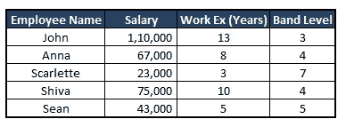
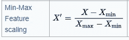
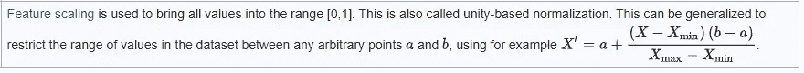
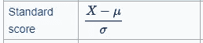
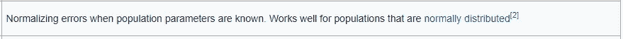
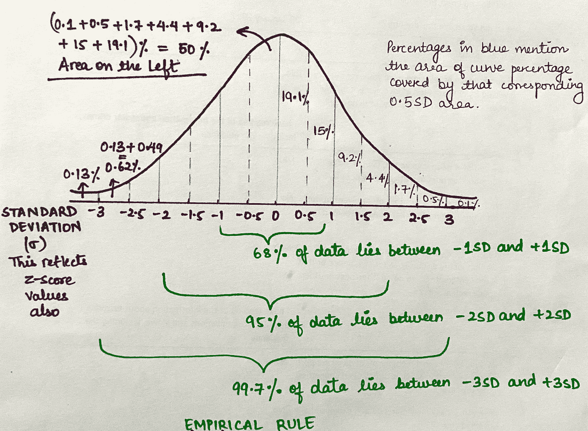
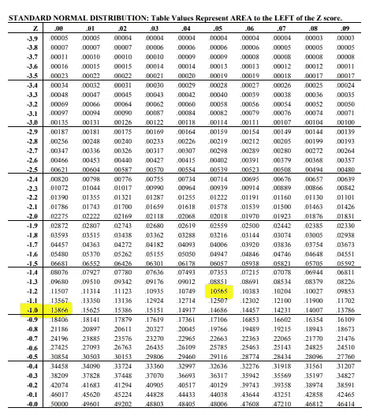
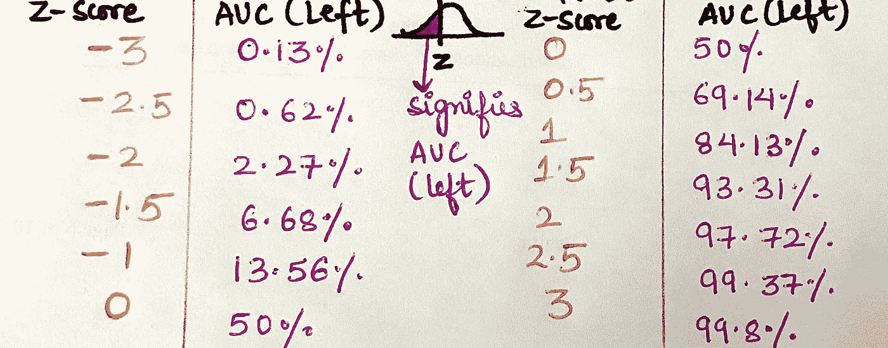

# 清楚地解释:什么，为什么和如何特征缩放-规范化和标准化

> 原文：<https://towardsdatascience.com/clearly-explained-what-why-and-how-of-feature-scaling-normalization-standardization-e9207042d971?source=collection_archive---------14----------------------->

## 特征缩放的重要性以及如何应用它。我的机器学习模型会从规范化中受益吗？

[杰克·卡特](https://unsplash.com/@carterjack?utm_source=medium&utm_medium=referral)在 [Unsplash](https://unsplash.com?utm_source=medium&utm_medium=referral) 上拍照

# 为什么要正常化？

你可能会对这篇文章封面图片的选择感到惊讶，但这就是我们理解正常化的方式！当我们的数据具有各种不同测量尺度的特征时，这个强大的概念会帮助我们，因此当我们试图从这些数据中获得洞察力或试图根据这些数据拟合模型时，我们会陷入困境。

就像我们不能在一个共同的尺度上比较上图所示的不同水果一样，我们也不能有效地处理太多尺度的数据。

> 例如:见下图，观察工资、工作经验和级别。由于属性 Salary 的比例范围较大，因此在定型模型时，它可以优先于其他两个属性，而不管它在预测因变量时实际上是否具有更大的权重。

因此，在数据挖掘和模型开发(统计或机器学习)的数据预处理阶段，对所有变量进行标准化是一个很好的做法，如果它们处于不同的范围，那么将它们降低到一个相似的尺度**。**

> 并非每个数据集都需要归一化，您必须筛选它，并确保您的数据需要它，然后才继续将这一步骤纳入您的程序。此外，如果您不确定数据分布实际上是否是[高斯/正态/钟形曲线](/clearly-explained-normal-distributions-and-the-central-limit-theorem-8d7cc5a6052f)，您应该应用归一化。归一化将有助于减少非高斯属性对模型的影响。

# 什么是正常化？

我们将在这里讨论两种情况:

## 1.您的数据不符合正态/高斯分布*(在有疑问的情况下也喜欢这个)*

在这种情况下，数据规范化是将一个或多个属性的范围重新调整为 0 到 1 的过程。这意味着每个属性的最大值是 1，最小值是 0。

> 这也称为最小-最大缩放。

最小-最大缩放公式—来源:[维基百科](https://en.wikipedia.org/wiki/Normalization_(statistics))

来源:[维基百科](https://en.wikipedia.org/wiki/Normalization_(statistics))

## 2.您的数据遵循高斯分布

在这种情况下，可以通过下面描述的公式进行归一化，其中μ是平均值，σ是样本/总体的标准偏差。

> 当我们使用下面给出的标准分数进行标准化时，它通常也被称为标准化或 Z 分数。

标准化公式/Z 分数—来源:[维基百科](https://en.wikipedia.org/wiki/Normalization_(statistics))

来源:[维基百科](https://en.wikipedia.org/wiki/Normalization_(statistics))

# 关于 Z-Score 的更多信息

z 分数告诉我们你的分数离平均值有多少标准差。

比如说—

*   z 得分为 1.5，则意味着它比平均值高 1.5 个标准差*。*
*   *z 分数为-0.8 表示我们的值比平均值低 0.8 个标准偏差*。**

> *如上所述，z 分数告诉我们分数在[正态分布](/clearly-explained-normal-distributions-and-the-central-limit-theorem-8d7cc5a6052f)曲线上的位置。z 值为**零**表示该值**正好是平均值/平均值**，而+3 表示该值远高于平均值(可能是异常值)*

*如果你参考我关于[正态分布](/clearly-explained-normal-distributions-and-the-central-limit-theorem-8d7cc5a6052f)的文章，你会很快明白 Z-score 是把我们的分布转换成均值为 0、标准差为 1 的标准正态分布。*

# *Z 分数的解释*

*让我们快速了解如何根据 AUC(曲线下面积)来解释 Z 得分的值。*

**

*根据经验法则，在上面链接的关于正态分布的文章中有详细的讨论，在这篇文章的结尾也有陈述，陈述如下:*

*   *68%的数据位于+1SD 和-1SD 之间*
*   *99.5%的数据位于+2SD 和-2SD 之间*
*   *99.7%的数据位于+3SD 和-3SD 之间*

*现在，如果我们想查看一个定制的范围，并计算该细分涵盖了多少数据，那么 Z 分数就可以帮我们解决问题。让我们看看怎么做。*

*例如，我们想知道左侧负极端和-1SD 之间覆盖了多少百分比的数据(数据点出现的概率)，我们必须参考下面链接的 Z 得分表:*

> *[Z 分数表](https://www.math.arizona.edu/~rsims/ma464/standardnormaltable.pdf)*

*现在，我们必须寻找值-1.00，我们可以从下面的快照中看到，状态 15.8%是我们问题的答案。*

*类似地，如果我们一直在寻找-1.25，我们将得到值 10.56%*(Z 列中的-1.2 和跨列匹配 0.05 得到-1.25)**

**

*来源:[链接](https://www.math.arizona.edu/~rsims/ma464/standardnormaltable.pdf)*

*常见的 Z 得分值及其来自 Z 得分表的结果，表明在负极端和 Z 得分点之间覆盖了多少，即 Z 得分点左侧的区域:*

**

*我们也可以使用这些值来计算自定义范围之间的值，例如:如果我们希望 AUC 在-3 和-2.5 Z 值之间，它将是(0.62–1.13)% = 0.49% ~ 0.5%。因此，当涉及到没有直接的 Z 得分值要解释的问题时，这非常方便。*

## *现实生活解释示例*

*假设我们有一个样本的智商得分数据，我们已经使用 Z 得分进行了标准化。现在来看一些事情，如果一个人的智商 Z 值是 2，我们看到+2 对应于 Z 值表上的 97.72%，这意味着他/她的智商比 97.72%的人高，或者他/她的智商只比 2.28%的人低，这意味着你挑选的人真的很聪明！！*

*这可以适用于几乎每一个用例(体重，身高，工资，免疫水平，等等！)*

# *如果规范化和标准化之间出现混淆*

*如果您有一个用例，在这个用例中，您不容易决定哪一个适合您的模型，那么您应该运行两次迭代，一次使用归一化(最小-最大缩放)，另一次使用标准化(Z 分数),然后绘制曲线，或者使用箱线图可视化来比较哪种技术对您来说性能更好，或者更好，使您的模型适合这两个版本，并使用模型验证指标进行判断。*

# *我们应该在使用机器学习算法的同时应用归一化吗？*

*与普遍认为 ML 算法不需要规范化相反，您应该首先仔细看看您的算法使用的技术，以做出有利于您正在开发的模型的合理决策。*

> *如果您正在使用决策树，或者任何基于树的算法，那么您可以不进行归一化，因为树的基本概念是围绕着每次基于单个特征在节点上做出决策，因此不同特征的尺度差异不会影响基于树的算法。*
> 
> *然而，如果您使用线性回归、逻辑回归、神经网络、SVM、K-NN、K-Means 或任何其他基于距离的算法或基于梯度下降的算法，那么所有这些算法都对您的要素的比例范围敏感，应用归一化将提高这些 ML 算法的准确性。*

*这就是关于功能扩展的全部内容:)*

*快乐学习，快乐成长:)*

*我在这篇文章中提到的关于正态分布的文章:*

* [## 解释清楚:正态分布和中心极限定理

### 这些概念有什么正常或不正常的地方？

towardsdatascience.com](/clearly-explained-normal-distributions-and-the-central-limit-theorem-8d7cc5a6052f) 

请关注这个空间，了解更多关于机器学习、数据分析和统计的信息！*