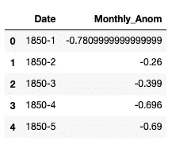
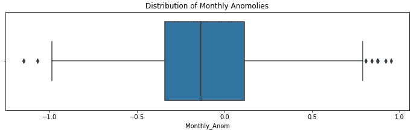
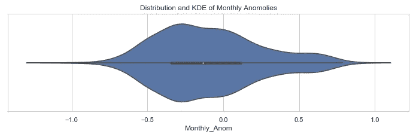
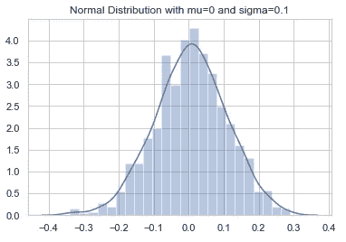
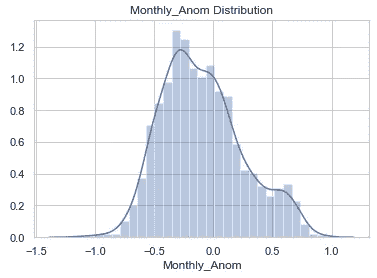
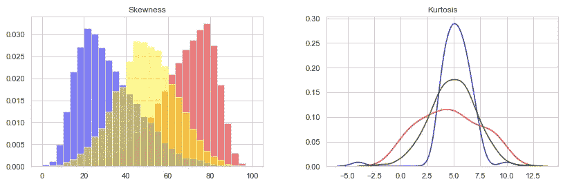

# 气候变化统计分析的基础

> 原文：<https://towardsdatascience.com/climate-change-analysis-series-volume-1-48708a938fcc?source=collection_archive---------26----------------------->

## 量化全球变暖的环境和经济影响的基础

[林丽安](https://unsplash.com/@li_anlim?utm_source=unsplash&utm_medium=referral&utm_content=creditCopyText)在 [Unsplash](https://unsplash.com/s/photos/climate?utm_source=unsplash&utm_medium=referral&utm_content=creditCopyText) 上的照片

问问题:当讨论气候变化时，你从哪里开始呢？当海水上升时，你如何量化密西西比三角洲的土壤侵蚀？由于全球变暖和滥伐森林的综合影响，亚马逊雨林的生物多样性丧失怎么办？

答:从最底层开始，一步步往上爬。收集和探索气候数据。揭示趋势。预测未来的变化。地球上的居民越有见识，我们就越有可能采取相应的行动来拯救这个星球，一次拯救一度。

统计学家和数据科学家都使用基本的分析概念从他们的数据中做出可信的推断。本文将使用来自[国家气候数据中心](https://www.ncdc.noaa.gov/)的 [Berkely Earth 全球陆地和海洋温度数据](http://berkeleyearth.lbl.gov/auto/Global/Land_and_Ocean_complete.txt)，以及 Python 编程语言来探索将在未来文章中构建的基础元素。

在我们开始之前，在查看全球气候数据时，有一个重要的概念需要理解。通常情况下，全球温度是通过异常而不是绝对温度来确定的。由于一些地区的气象站可能很少，而另一些地区的气象站可能海拔不同，因此将温度与从更小的、更局部化的尺度上的参考值发展的基线进行比较，并且可以计算异常。这种异常将会解释气候的变化。要了解更多关于为什么使用异常的信息，请阅读这里。

船尾鉴于国家海洋和大气管理局船舶雷尼尔与调查发射旁边。 [**鸣谢:**美国国家海洋与大气管理局雷尼尔船的人员。](https://photolib.noaa.gov/Collections/Sailing-For-Science/Other/emodule/574/eitem/16823)

为了快速方便地浏览数据，我将它缩减为两列:日期(年和月)和以摄氏度为单位的月异常。数据点范围从 1850 年 1 月到 2014 年 12 月，包含 Berkely 的地表气温异常(相对于 1951-1980 年的平均值)和 HadSST 数据集中的海洋温度数据。

首先，我们来看看四个变量:均值、标准差、分位数和方差。

*   **平均值** —样本的平均值，通过将所有数据的总和除以数据点的总数来计算。
*   **方差** —离差的度量，描述数据如何围绕其平均值聚集。方差的计算方法是将每个数据点与平均值的距离平方。
*   **标准差**——另一种离散度的度量，作为方差的平方根。68%的值落在均值的右侧或左侧一个标准差，95%落在均值的两个标准差，99.7%落在均值的三个标准差。
*   **分位数**—有序分布中的点，受最小值和最大值限制。数据按从小到大排序，样本的中间值为中值。中间的每个点都可以描述为一个百分位数，从 1 到 100。

与我们的最小和最大异常相比，方差表明数据非常紧密地聚集在平均值周围。我们可以预计 68%的异常会落在平均值左右 0.345 摄氏度之内。然而，平均值并不总是提供我们数据的最佳描述，因为它受到异常值的严重影响。例如，当输入数据时，气候科学家可能放错了小数点。她没有打 1.3，而是打了 13。如果大部分数据都聚集在-0.2 附近，那么 13 将使平均值更加向右倾斜。

Python 的 Seaborn 库提供了一些图表，使得研究分位数变得非常容易。

盒图(或盒须图)是一个五位数的插图。蓝框从左到右分别表示第 25 个百分点、中间值(第 50 个百分点)和第 75 个百分点。这可以用[经验法则](https://www.statisticshowto.datasciencecentral.com/empirical-rule-2/)来描述，如上面标准偏差的定义中所述。每一端显示最小值和最大值，菱形表示异常值，或距离中值超过三个四分位数的点。

Seaborn 图书馆的另一个伟大的情节是小提琴情节。与箱线图类似，小提琴图显示数据点的分布，但作为潜在分布的核密度估计。

简单来说，核密度估计(KDE)可视化了数据集中变量的分布。在以后的文章中，我们将更深入地研究这个和其他概率函数。

当我们解释这两个图时，我们现在可以开始进一步考虑数据集的分布。正态或高斯分布以数据集的平均值为中心。

这是一个随机正态分布的例子。根据 Investopedia 的说法，“正态分布是一种关于平均值对称的概率分布，表明接近平均值的数据比远离平均值的数据出现得更频繁。”

直觉上，随机值在任一极端的概率远小于随机值接近平均值的概率。

Seaborn 的 distplot()函数通过绘制直方图、数据集中值在区间或条柱中出现的频率以及核密度估计来可视化数据的分布。

分布图和 kde 也有助于可视化偏度和峰度。

*   **偏斜度** —偏斜度衡量值的对称性或对称性缺失。正偏斜度表示向右偏斜，或者较大值的集中度较高。负偏斜度表示向左偏斜，或者较小值更集中。完全对称的分布的偏斜度为零。
*   **峰度** —峰度衡量分布的“峰值”程度。较高的峰值导致峰度值> 3，较低的峰值导致峰度值< 3，并且正态分布具有等于 3 的峰度。

对于上面的偏度图，蓝色表示负偏度，黄色表示正常，红色表示正偏度。

峰度有三种类型:

*   **中层大气**——遵循正态分布，用绿色表示
*   **Platykurtic** —分布较短，异常值较少，用红色表示
*   **Leptokurtic** —分布很长，有许多异常值，用蓝色表示

至于我们的气候数据:

当偏斜度为 0.461 时，我们可以有把握地假设存在具有更高值的更高浓度的异常。这表明气温更有可能高于以前的全球平均水平，导致地球变暖。

峰度为-0.191 时，我们可以假设异常值比正态分布少。更少的异常值意味着更少的极端值。

这些基本概念是理解数据的基础，可以应用于许多行业，而不仅仅是气候学。在本系列的其余部分，我们将使用这些数据和更多的数据来揭示我们数据的真相，以保持可信度，并告知我们自己和他人这个星球所面临的问题。