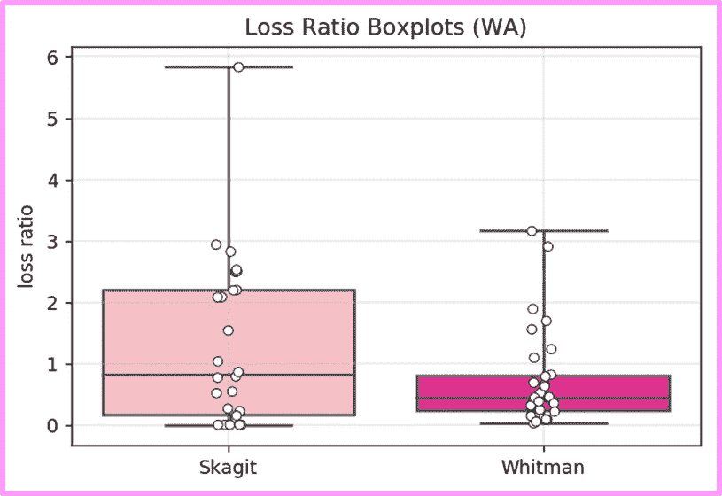
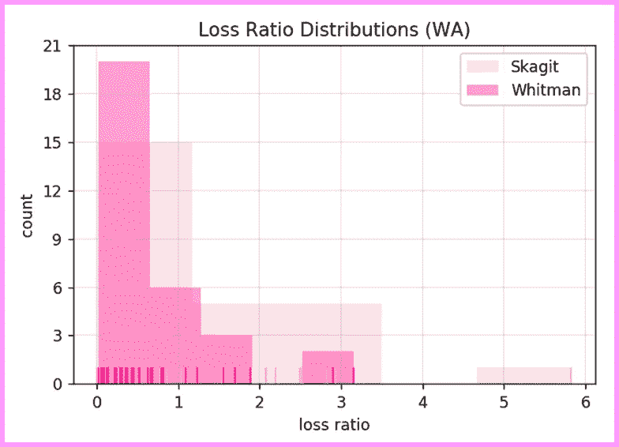
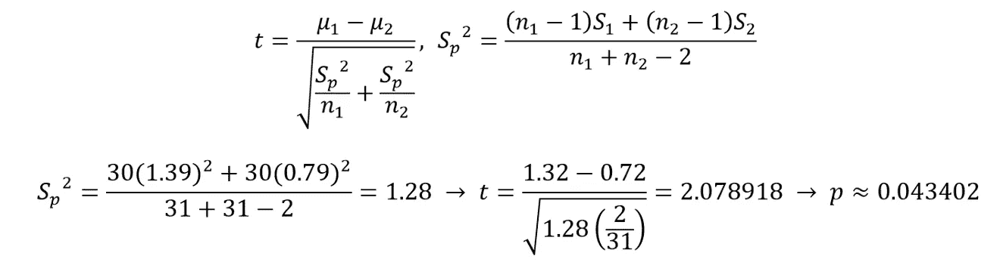
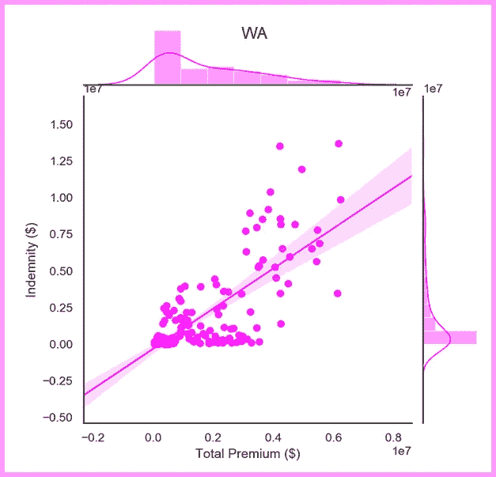
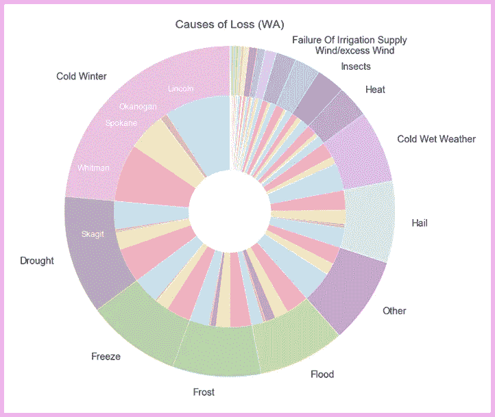
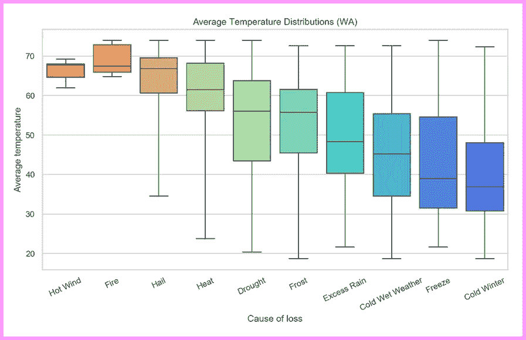
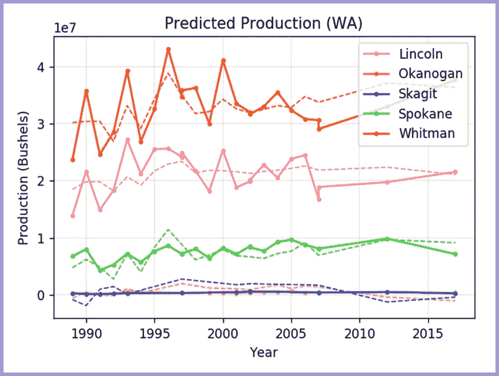

# 气候变化和世界上种植最广泛的主要作物

> 原文：<https://towardsdatascience.com/climate-change-and-the-most-widely-grown-staple-crop-in-the-world-9c5319159468?source=collection_archive---------40----------------------->

## ***一种预测农业生产和调查农业保险损失率的精算方法***

图片由[卡斯滕](https://unsplash.com/@karsten_wuerth)在[的 Unsplash](https://unsplash.com/photos/0w-uTa0Xz7w) 上拍摄

小麦是世界上种植最广泛的主要作物，占全球消耗热量的五分之一，而且需求还在继续增长。它存在于我们每天消费的许多食物中——从面包和谷类到酱油和罐装汤。

因为小麦是我们饮食中不可或缺的一部分，所以了解它的产量在不久的将来会受到怎样的影响是很重要的。所展示的实验提供了与小麦种植区相关的农业保险公司所遭受的损失和收益的差异，我们分析了损失原因*、*气候变化和小麦产量之间的关系，以便为农民、保险公司和消费者提供更多信息。

# 我们在调查什么？

在保险行业， ***损失率*** 代表亏损与赚取的保费(收益)的比率。农作物保险政策倾向于在地区和州的水平上解决生产问题，也许是基于相似地理位置的农场产出相似数量的产量的假设。我们建议，在县一级的详细分析可以为农民和保险公司提供更好的收益和更具体的信息。为了评估在保险单开发中鼓励更大的粒度是否有益，我们问:

> 地理位置相近的县的损失率分布会有显著差异吗？

华盛顿州是美国小麦的主要产地。在这里，我们评估华盛顿各县是否表现出不同的损失率分布。为此，我们随机选择了地理位置相近的两个县——斯卡吉特和惠特曼。在这些县，我们将使用来自美国农业部[农业报告生成器](https://prodwebnlb.rma.usda.gov/apps/SummaryofBusiness/ReportGenerator)和[快速统计门户](https://quickstats.nass.usda.gov/)的作物和财务数据。

它们的损失率分布非常不同！

结果相当令人惊讶。从上面的方框图中可以看出，惠特曼和斯卡吉特的分布差别很大。总的来说，斯卡吉特比惠特曼分布更广，方差更大。这些县有明显不同的四分位值、中位数和平均数；他们没有遵循类似的趋势。

为了分析上面的观察和假设是否有效，我们可以进行显著性检验，确定 Skagit 和 Whitman 数据集的显著差异。虽然数据不是正态分布的，但所使用的数据集包含足够的条目来有效地进行 t 检验。

在设置置信区间 *α* 等于 0.05 后，我们对各县进行双样本、双尾 t 检验。

寻找 t 统计量的过程，然后是 *p* 值

遵循传统的双样本 t 检验零假设(𝜇₁ = 𝜇₂)和替代假设(𝜇₁ ≠ 𝜇₂)，我们看到斯卡吉特和惠特曼之间的 t 检验产生了 0.0434 的 *p-* 值，这意味着我们拒绝零假设，并确定他们的损失率值在统计上是不同的。

# 那么，这告诉我们什么呢？

结果和统计测试(在本例中为 t-测试)旨在检查各对相同州县的赔付率是否不同，这表明它们几乎没有一致性，并且它们证实了在县一级制定更精细的保险政策的必要性，因为更广泛的级别(例如，区域或全州)可能是不够的。

# 气候变化是如何发挥作用的？

气候以多种方式影响作物生长和产量。任何天气变化都可能威胁到农作物并给农民带来损失，因此探索这些问题中的哪一种影响最大，以及它们如何改变农民和保险公司基于货币的衡量标准非常重要。

在下面的联合图中，显示了 ***赔偿*** (指定事件的作物损失总额)和 ***总保费*** (农民向保险公司支付的承保作物的总额)之间的关系，很明显，这两个变量分布都是右偏的，这意味着在低端有大量聚集，在高端有较长的尾部。我们还看到，对于几个总保费值，赔偿看起来变化很小或没有变化，表明它们的比率(损失率)波动，有时剧烈，有时不剧烈。该图表明，从历史上看，总保费比赔款更有可能发生变化。

绘制关系赔偿和总保费

# 我们可以按县来分析损失的原因。

该嵌套饼图揭示了县级损失原因的相对构成。即使对华盛顿的更多县进行分析，我们也会发现它们对每一种损失原因的影响程度并不相同，这或许表明，在地区层面上对气候如何影响小麦产量所做的预测与在县一级所做的预测并不相似。

饼状图部门是不均衡的，表明不同县之间很少或没有可预测性

在下面的箱线图中，我们探索了与气候相关的损失原因是如何依赖于平均温度(F)的。中位数较高的损失原因表明与较高的平均温度有关。扩散越大，这种原因对温度的依赖性就越小。例如，热风和火灾表现出相对较小的传播范围，因此它们与温度高度相关，但干旱和过多的雨水传播范围较大，与温度的关系不大，这意味着可能有其他因素与它们相关。

显示温度和损耗原因之间的关系

# 现在，我们进行时间分析。

我们可以观察惠特曼的平均气温是如何随时间变化的。每年一次的温度分析有助于降低更精细层次的噪声。数据集中有一个明显的上升趋势，表明由于全球变暖和气候变化，温度可能正在上升。这条线正以每年 0.019 华氏度的速度增长。鉴于此，在下面的预测实验中，我们将温度作为影响小麦产量的一个关键因素，它直接影响保险公司设定的保险费率。

平均温度随着时间逐渐升高

在下面的多元回归中，生产图预测趋势是虚线，而地面真实数据是实线。平均温度是模型中六个系数之一；其他五个是县、年份、补贴金额、获得保险费的单位数量(进行保险索赔的单个地块)和获得赔偿的单位数量。该图显示了华盛顿各县在预测产量方面的差异，这进一步强调了州一级制定的政策不足以让保险公司获得最佳收益。

华盛顿各县小麦产量的预测趋势与实际趋势

# 结论

很明显，华盛顿县，以及其他州的县，通常需要不同的保险计划、建议和保险单。通过创建一种基于位置指定赔付率的方法，保险公司可以更好地根据不同的位置定制保单，并调整决策、保费定价率等。同样，农民可以利用这种预测来预测他们的作物产量，做出改进，并相应地提前计划。

*以上实验的数据和代码在* [*这里*](https://github.com/asmikumar/wheat-forecasting) *提供。*

# 参考

A.库马尔，[了解农业保险赔付率特征](https://drive.google.com/file/d/1cbY0x8bGd0lzYi6kF8ZHsMkYBTe5Yd82/view) (2020)，精算基础